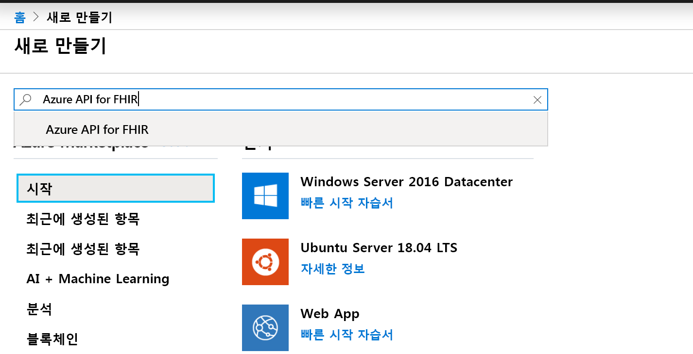
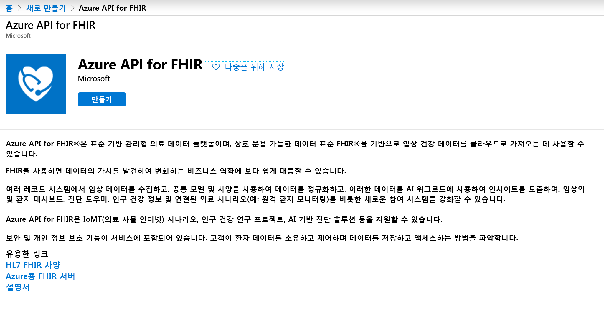
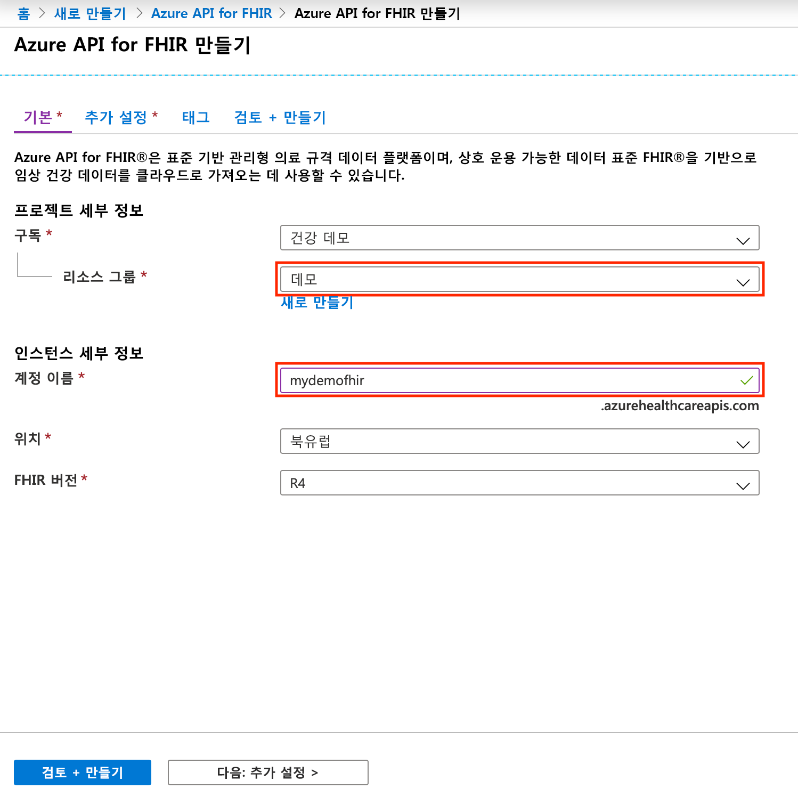

# 빠른 시작: Azure Portal을 사용하여 Azure API for FHIR 배포

이 빠른 시작에서는 Azure Portal을 사용하여 Azure API for FHIR을 배포하는 방법을 알아봅니다.

Azure 구독이 아직 없는 경우 시작하기 전에 [체험 계정](https://azure.microsoft.com/free/?WT.mc_id=A261C142F)을 만듭니다.

## 새 리소스 만들기

[Azure Portal](https://portal.azure.com)을 열고 **리소스 만들기**를 클릭합니다.

## Azure API for FHIR 검색

검색 상자에 "FHIR"을 입력하여 Azure API for FHIR을 찾을 수 있습니다.

## Azure API for FHIR 계정 만들기

**만들기**를 선택하여 새 Azure API for FHIR 계정을 만듭니다.

## 계정 세부 정보 입력

기존 리소스 그룹을 선택하거나 새 리소스 그룹을 만들고, 계정에 대한 이름을 선택하고, 마지막으로 **검토 + 만들기**를 클릭합니다.

만들기를 확인하고 FHIR API 배포를 기다립니다.

## 추가 설정

**다음: 추가 설정**을 클릭하여 이 Azure API for FHIR에 대한 액세스를 허용해야 하는 권한, 대상, ID 개체 ID를 구성하고, 필요에 따라 SMART on FHIR을 사용하도록 설정하고, 데이터베이스 처리량을 구성합니다.

- **권한:** 서비스의 인증 기관으로 로그인한 Azure AD 테넌트에서 다른 Azure AD 테넌트를 지정할 수 있습니다.
- **사용자:** 모범 사례 및 기본 설정은 대상 그룹이 FHIR 서버의 URL로 설정되어 있음을 나타내는 것입니다. 여기에서 변경할 수 있습니다. 대상은 토큰이 의도된 수신자를 식별합니다. 이 컨텍스트에서는 FHIR API 자체를 나타내는 항목으로 설정되어야 합니다.
- **허용되는 개체 ID:** 이 Azure API for FHIR에 대한 액세스를 허용해야 하는 ID 개체 ID를 지정할 수 있습니다. [ID 개체 ID 찾기](find-identity-object-ids.md) 방법 가이드에서 사용자 및 서비스 사용자의 개체 ID 찾기에 대해 자세히 알아볼 수 있습니다.  
- **Smart On FHIR 프록시:** SMART on FHIR 프록시를 사용하도록 설정할 수 있습니다. SMART on FHIR 프록시를 구성하는 방법에 대한 자세한 내용은 자습서 [Azure API for FHIR SMART on FHIR 프록시](https://docs.microsoft.com/azure/healthcare-apis/use-smart-on-fhir-proxy)를 참조하세요.  
- **프로비저닝된 처리량(RU/s):** 여기서는 Azure API for FHIR에 대한 기본 데이터베이스에 대해 처리량 설정을 지정할 수 있습니다. 이 설정은 나중에 데이터베이스 블레이드에서 변경할 수 있습니다. 자세한 내용은 [데이터베이스 설정 구성](configure-database.md) 페이지를 참조하세요.

## Fetch FHIR API 기능 문

새 FHIR API 계정이 프로비저닝되었는지 확인하려면 브라우저를 `https://<ACCOUNT-NAME>.azurehealthcareapis.com/metadata`로 가리켜 기능 문을 인출합니다.

## 리소스 정리

더 이상 필요 없는 경우 리소스 그룹, Azure API for FHIR 및 모든 관련 리소스를 삭제할 수 있습니다. 이렇게 하려면 Azure API for FHIR 계정이 포함된 리소스 그룹을 선택하고, **리소스 그룹 삭제**를 선택한 다음, 삭제할 리소스 그룹의 이름을 확인합니다.

## 다음 단계

이 빠른 시작 가이드에서는 Azure API for FHIR을 구독에 배포했습니다. Azure API for FHIR에서 추가 설정을 설정하려면 추가 설정 방법 가이드로 이동합니다.

>[!div class="nextstepaction"]
>[Azure API for FHIR의 추가 설정](azure-api-for-fhir-additional-settings.md)
