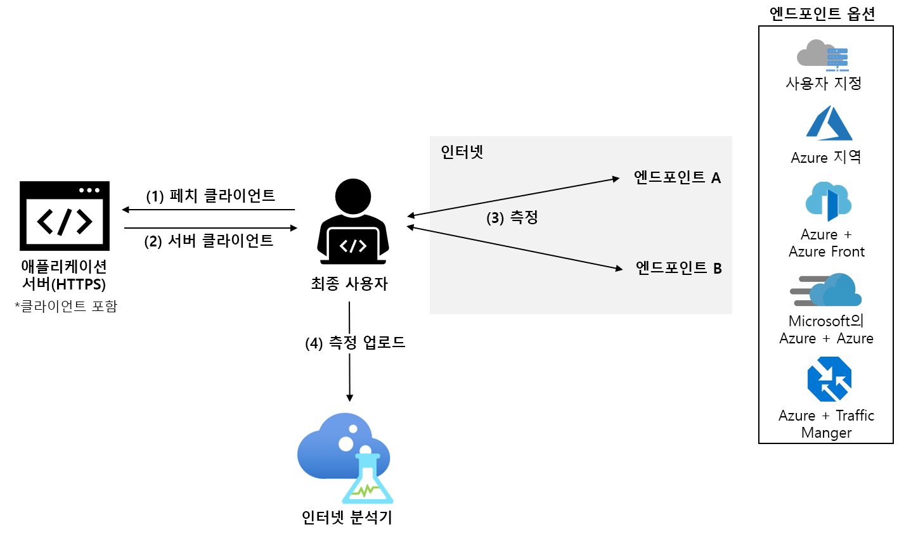

# 인터넷 분석기란? (미리 보기)

Internet Analyzer는 네트워킹 인프라 변경으로 인해 고객의 성능에 미치는 영향을 테스트하기 위한 클라이언트 쪽 측정 플랫폼입니다. 온-프레미스에서 Azure로 마이그레이션하든 새 Azure 서비스를 평가하든 Internet Analyzer를 사용하면 마이그레이션하기 전에 Azure에서 사용자의 데이터 및 Microsoft의 다양한 분석을 통해 네트워크 아키텍처를 더 잘 이해하고 최적화할 수 있습니다.

인터넷 분석기는 웹 애플리케이션에 포함된 소형 JavaScript 클라이언트를 사용하여 최종 사용자가 _엔드포인트_라고 하는 선택한 네트워크 대상 세트로 도달하기까지의 대기 시간을 측정합니다. 인터넷 분석기를 사용하면 여러 병렬 테스트를 설정할 수 있으므로 인프라와 고객의 요구가 진화하는 가운데, 다양한 시나리오를 평가할 수 있습니다. 인터넷 분석기는 사용자 지정 및 미리 구성된 엔드포인트를 제공하여 최종 사용자가 편리하면서 유연하게 신뢰할 수 있는 성능 결정을 내릴 수 있도록 지원합니다. 

> [!IMPORTANT]
> 이 공개 미리 보기는 Service Level Agreement(서비스 수준 약정)없이 제공되므로 프로덕션 워크로드에 사용하지 말아야 합니다. 특정 기능은 지원되지 않을 수 있거나, 기능이 제한될 수 있거나 모든 Azure 위치에서 사용하지는 못할 수 있습니다. 자세한 내용은 [Microsoft Azure 미리 보기에 대한 보충 사용 약관](https://azure.microsoft.com/support/legal/preview-supplemental-terms/)을 참조하세요.
>

## 빠른 사용자 지정 가능 테스트

인터넷 분석기는 클라우드 마이그레이션, 새 또는 추가 Azure 지역으로의 배포, Azure의 새 애플리케이션 및 콘텐츠 배달 플랫폼(예: [Azure Front Door](https://azure.microsoft.com/services/frontdoor/) 및 [Microsoft Azure CDN](https://azure.microsoft.com/services/cdn/)) 테스트에 대한 성능 관련 질문을 해결해 줍니다. 

인터넷 분석기에서 만드는 각 테스트는 엔드포인트 A와 엔드포인트 B의 두 엔드포인트로 구성됩니다. 엔드포인트 B의 성능은 엔드포인트 A를 기준으로 분석됩니다. 

고유한 사용자 지정 엔드포인트를 구성하거나 미리 구성된 다양한 Azure 엔드포인트 중에서 선택할 수 있습니다. 사용자 지정 엔드포인트는 온-프레미스 워크로드, 다른 클라우드 공급자의 인스턴스 또는 사용자 지정 Azure 구성을 평가하는 데 사용해야 합니다. 테스트는 두 개의 사용자 지정 엔드포인트로 구성될 수 있지만 하나 이상의 사용자 지정 엔드포인트를 Azure에서 호스트해야 합니다. 미리 구성된 Azure 엔드포인트는 Azure Front Door, Azure Traffic Manager 및 Azure CDN과 같은 자주 사용되는 Azure 네트워킹 플랫폼의 성능을 신속하고 쉽게 평가할 수 있는 방법입니다. 

미리 보기 중에는 다음과 같은 미리 구성된 엔드포인트를 사용할 수 있습니다. 

* **Azure 지역**
    * 브라질 남부
    * 인도 중부
    * 미국 중부
    * 동아시아
    * 미국 동부
    * 일본 서부
    * 북유럽
    * 남아프리카 북부
    * 동남아시아 
    * 아랍에미리트 북부
    * 영국 서부  
    * 서유럽
    * 미국 서부 
    * 미국 서부 2
* **여러 Azure 지역 조합** 
    * 미국 동부, 브라질 남부 
    * 미국 동부, 동아시아 
    * 서유럽, 브라질 남부
    * 서유럽, 동남 아시아
    * 서유럽, 아랍에미리트 북부
    * 미국 서부, 미국 동부 
    * 미국 서부, 서유럽
    * 미국 서부, 아랍에미리트 북부
    * 서유럽, 아랍에미리트 북부, 동남 아시아
    * 미국 서부, 서유럽, 동아시아
    * 미국 서부, 북유럽, 동남 아시아, 아랍에미리트 북부, 남아프리카 북부 
* **Azure + Azure Front Door** - 위에 나열된 단일 또는 여러 Azure 지역 조합에 배포됩니다.
* **Azure + Microsoft의 Azure CDN** - 위에 나열된 단일 Azure 지역 조합에 배포됩니다.
* **Azure + Azure Traffic Manager** - 위에 나열된 여러 Azure 지역 조합에 배포됩니다.

## 제안된 테스트 시나리오 

고객에 대한 최상의 성능을 결정하는 데 도움이 되도록 인터넷 분석기를 사용하여 특정 최종 사용자 모집단에 대해 두 개의 엔드포인트를 평가할 수 있습니다. 

인터넷 분석기는 여러 가지 질문에 대답할 수 있지만 가장 일반적인 질문은 다음과 같습니다. 
* 클라우드로 마이그레이션할 때 성능에 어떤 영향을 미치나요? 
    * *제안된 테스트: 사용자 지정(현재 온-프레미스 인프라) 및 Azure(미리 구성된 아무 엔드포인트)*
* 데이터를 에지에 배치하는 것과 데이터 센터에 배치하는 것은 어떤 가치가 있나요? 
    *  *제안된 테스트: Azure 및 Azure Front Door, Azure 및 Microsoft의 Azure CDN*
* Azure Front Door의 성능 혜택은 무엇인가요?
    *  *제안된 테스트: 사용자 지정/ Azure/ CDN 및 Azure Front Door*
* Microsoft의 Azure CDN이 주는 성능 혜택은 무엇인가요? 
    *  *제안된 테스트: 사용자 지정/ Azure/ AFD 및 Microsoft의 Azure CDN*
* Microsoft의 Azure CDN은 어떤 측면에서 유사한 성능 혜택을 제공하나요? 
    *  *제안된 테스트: 사용자 지정(기타 CDN 엔드포인트) 및 Microsoft의 Azure CDN*
* 각 지역의 최종 사용자 모집단에 가장 적합한 클라우드는 무엇인가요? 
    *  *제안된 테스트: 사용자 지정(기타 클라우드 서비스) 및 Azure(미리 구성된 아무 엔드포인트)*

## 작동 방법

인터넷 분석기를 사용하려면 Microsoft Azure Portal에서 인터넷 분석기 리소스를 설정하고 애플리케이션에 소형 JavaScript 클라이언트를 설치합니다. 클라이언트는 HTTPS를 통해 1픽셀 이미지를 다운로드하여 최종 사용자가 선택된 엔드포인트에 도달하기까지의 대기 시간을 측정합니다. 클라이언트는 대기 시간 측정값을 수집한 후 측정 데이터를 인터넷 분석기로 보냅니다.

사용자가 웹 애플리케이션을 방문하면 JavaScript 클라이언트는 구성된 모든 테스트에서 측정할 두 개의 엔드포인트를 선택합니다. 클라이언트는 각 엔드포인트에 대해 _콜드_ 및 _웜_ 측정을 수행합니다. _콜드_ 측정은 사용자와 엔드포인트 간의 순수한 네트워크 대기 시간 외의 추가 대기 시간(예: DNS 확인, TCP 연결 핸드셰이크 및 SSL/TLS 협상)을 초래합니다. _웜_ 측정은 _콜드_ 측정이 완료된 직후에 수행되며, 최신 브라우저의 영구 TCP 연결 관리를 활용하여 종단 간 대기 시간을 정확하게 측정합니다. 사용자의 브라우저에서 지원되는 경우 W3C 리소스 타이밍 API를 사용하여 정확한 측정 타이밍을 맞춥니다. 현재는 웜 대기 시간 측정만 분석에 사용됩니다.

## 성과 기록표 

테스트가 시작되면 성과 기록표 탭의 인터넷 분석기 리소스에서 원격 분석 데이터를 볼 수 있습니다. 이 데이터는 항상 집계됩니다. 다음 필터를 사용하여 표시되는 데이터 보기를 변경합니다. 

* **테스트:** 결과를 보려는 테스트를 선택합니다. 분석을 완료하기에 충분한 데이터가 있는 경우 주로 24시간 이내에 테스트 데이터가 나타납니다. 
* **기간 및 종료 날짜:** 인터넷 분석기는 매일 3개의 성과 기록표를 생성합니다. 각 성과 기록표는 각각 24시간 이전(일), 7일 전(주) 및 30일 전(월)의 집계 기간을 반영합니다. "종료 날짜" 필터를 사용하여 보려는 기간을 선택합니다. 
* **국가:** 이 필터를 사용하여 한 국가에 있는 최종 사용자와 관련된 데이터를 볼 수 있습니다. 전역 필터는 모든 지역의 데이터를 표시합니다.  

성과 기록표에 대한 자세한 내용은 [성과 기록표 해석](internet-analyzer-scorecard.md) 페이지를 참조하세요. 

## 다음 단계

* [첫 번째 인터넷 분석기 리소스를 만드는](internet-analyzer-create-test-portal.md) 방법을 알아봅니다.
* [인터넷 분석기 FAQ](internet-analyzer-faq.md)를 읽어보세요. 
