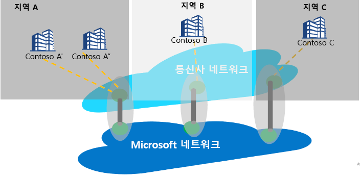

# 인터넷 피어링과 Peering Service

인터넷 피어링은 Microsoft의 글로벌 네트워크(AS8075)와 이동 통신 사업자 또는 서비스 공급자 네트워크 간의 상호 관계를 나타냅니다. 서비스 공급자는 아래에서 설명하는 Peering Service 파트너 관계 요구 사항을 구현하여 Peering Service 파트너가 될 수 있으며, 고객부터 Microsoft 네트워크로의 최적의 라우팅을 통해 안정적이고 성능이 뛰어난 공용 연결을 제공합니다.

## Peering Service 정보
Peering Service는 엔터프라이즈 사용자에게 최고의 공용 인터넷 연결을 제공하는 핵심 서비스 공급자와의 파트너 관계 프로그램입니다. 프로그램의 일부인 파트너는 직접, 높은 가용성, 지역 중복 연결 및 Microsoft로의 최적화된 라우팅을 제공합니다. Peering Service는 Microsoft 연결 포트폴리오에 추가된 서비스입니다.
*   IaaS 또는 PaaS 리소스에 대한 프라이빗 연결을 위한 ExpressRoute(사설 IP 공간 지원)
    *   파트너 기반 연결
    *   Microsoft에 대한 직접 100G 연결
*   클라우드에 대한 VPN 연결을 위한 인터넷 상의 IPSEC
*   가상 WAN을 통해 Azure에 대한 SD-WAN 연결

Peering Service의 대상 세그먼트는 SaaS 연결, 분기에서 인터넷을 분리하려는 SD WAN 고객 및 듀얼 전략 MPLS 및 엔터프라이즈급 인터넷을 보유하고 있는 모든 고객입니다.

Microsoft Cloud에 연결할 때의 기본 목표는 사용자 사이트에서 Microsoft 글로벌 네트워크로의 RTT(왕복 시간)를 줄임으로써 대기 시간을 최소화하는 것입니다. 이는 Microsoft의 모든 데이터 센터와 여러 클라우드 애플리케이션 진입점을 상호 연결하는 Microsoft의 공용 네트워크 백본입니다. [Office 365에서 최상의 연결 및 성능을 얻는 방법](https://techcommunity.microsoft.com/t5/Office-365-Blog/Getting-the-best-connectivity-and-performance-in-Office-365/ba-p/124694)을 참조하세요.

> [!div class="mx-imgBorder"]
> 

위의 그림에서 글로벌 기업의 각 지점은 파트너 네트워크를 통해 가능한 가장 가까운 Microsoft Edge 위치에 연결합니다.

**Peering Service 고객 혜택:**
* 최적의 성능 및 안정성을 위해 인터넷을 통해 Microsoft Cloud Services에 가장 적합한 공용 라우팅입니다.
* Microsoft Cloud에 연결할 기본 설정 SP를 선택할 수 있습니다.
* 대기 시간 보고 및 접두사 모니터링과 같은 트래픽 인사이트.
* Microsoft Cloud에서 최적의 네트워크 홉(AS 홉)입니다.
* 경로 분석 및 통계 - [BGP](https://en.wikipedia.org/wiki/Border_Gateway_Protocol)(Border Gateway Protocol)에 대한 이벤트는 변칙(누수/가로채기 검색) 및 최적이 아닌 라우팅을 라우팅합니다.

## Peering Service 파트너 관계 요구 사항
* 고객과 가장 가까운 위치에 있는 Microsoft Cloud에 대한 연결. 파트너 서비스 공급자는 사용자 트래픽을 사용자에게 가장 가까운 Microsoft Edge로 라우팅합니다. 마찬가지로 사용자에 대한 트래픽에서 Microsoft는 사용자에게 가장 가까운 에지에 트래픽을 라우팅하며(BGP 태그 사용), SP는 사용자에게 트래픽을 전달합니다.
* 파트너는 Microsoft 글로벌 네트워크를 통해 고가용성, 높은 처리량 및 지역 중복 연결을 유지합니다.
* 파트너는 요구 사항을 충족하는 경우 기존 피어링을 활용하여 Peering Service를 지원할 수 있습니다.

## FAQ
질문과 대답은 [Peering Service - FAQ](service-faqs.md)를 참조하세요.

## 다음 단계

* [Peering Service](https://docs.microsoft.com/azure/peering-service/)를 통한 고객 혜택에 대해 자세히 알아보세요.
* [Peering Service 파트너 연습](walkthrough-peering-service-all.md)에서 Peering Service를 위한 직접 피어링을 사용하도록 설정하는 단계에 대해 알아봅니다.
