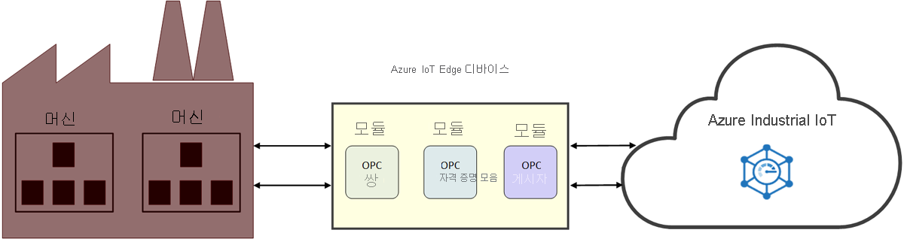

# 산업용 IoT(IIoT)란?

IIoT는 산업용 사물 인터넷입니다. IIoT는 제조 산업에서 IoT 애플리케이션을 통해 산업 효율성을 향상시킵니다. 

## 산업 효율성 개선

연결된 팩터리 솔루션 가속기를 사용하여 운영 생산성과 수익성을 향상시키세요. 이미 작업 현장에서 작동 중인 머신을 비롯한 산업 장비와 디바이스를 클라우드에서 연결하고 모니터링할 수 있습니다. IoT 데이터를 분석하여 전체 작업 현장의 성과 증대에 도움이 되는 인사이트를 얻을 수 있습니다.

Azure IoT OPC UA 디바이스 관리(OPC 쌍)를 통해 작업 현장 머신에 액세스하는 데 걸리는 시간을 줄이고 IIoT 솔루션 구축에 집중하세요. Azure IoT OPC UA 인증서 관리(OPC 자격 증명 모음)로 인증서 관리 및 산업 자산 통합을 간소화하세요. 안전한 자산 연결성을 보장해드립니다. 이러한 마이크로서비스는 [Azure 산업용 IoT 구성 요소](https://github.com/Azure/azure-iiot-opc-ua) 외에도 REST와 유사한 API를 제공합니다. 서비스 API를 통해 에지 모듈 기능을 제어할 수 있습니다. 

> [!NOTE]
> Azure 산업용 IoT 서비스에 대한 자세한 내용은 GitHub [리포지토리](https://github.com/Azure/azure-iiot-services)를 참조하세요.
Azure IoT Edge 모듈의 작동 방식에 대해 잘 모르는 경우 다음 문서를 시작하세요.
- [Azure IoT Edge 정보](../iot-edge/about-iot-edge.md)
- [Azure IoT Edge 모듈](../iot-edge/iot-edge-modules.md)

## 연결된 공장

[연결된 팩터리](../iot-accelerators/iot-accelerators-connected-factory-features.md)는 구체적인 비즈니스 요구 사항을 충족하도록 사용자 지정할 수 있는 Microsoft의 Azure 산업용 IoT 참조 아키텍처 구현입니다. 전체 솔루션 코드는 오픈 소스이며 연결된 팩터리 솔루션 가속기 GitHub 리포지토리에서 사용할 수 있습니다. 이 코드를 상용 제품 구현을 위한 시작점으로 사용하여 이미 빌드된 솔루션을 몇 분 안에 Azure 구독에 배포할 수 있습니다. 

## 작업 현장 연결성

Azure IoT OPC UA 디바이스 관리(OPC 쌍이라고도 함)는 디바이스 검색 및 등록을 자동화하고 REST API를 통해 산업 디바이스의 원격 제어를 제공하는 IIoT 구성 요소입니다. OPC 쌍은 클라우드와 팩터리 네트워크에 연결하기 위해 Azure IoT Edge 및 IoT Hub를 사용합니다. IIoT 개발자는 OPC 쌍을 통해 온-프레미스 머신에 안전하게 액세스하는 방법을 고민할 필요 없이 IIoT 애플리케이션 빌드에 집중할 수 있습니다.

## 보안

Azure IoT OPC UA 인증서 관리 또는 OPC 자격 증명 모음은 클라우드에서 OPC UA 서버 및 클라이언트 애플리케이션에 대한 인증서 수명 주기를 구성, 등록 및 관리할 수 있는 OPC UA GDS(Global Discovery Server)의 구현입니다. OPC 자격 증명 모음은 산업 공간에서 안전한 자산 연결을 구현하고 유지 관리하는 과정을 간소화합니다. 인증서 관리가 자동화되면 OPC 자격 증명 모음을 통해 팩터리 운영자가 연결성 및 인증서 관리와 관련된 수동적이고 복잡한 프로세스를 수행할 필요가 없습니다.

## 다음 단계

산업용 IoT와 해당 구성 요소에 대한 소개를 알아보았으므로 권장되는 다음 단계는 다음과 같습니다.

> [!div class="nextstepaction"]
> [OPC 쌍이란?](overview-opc-twin.md)
