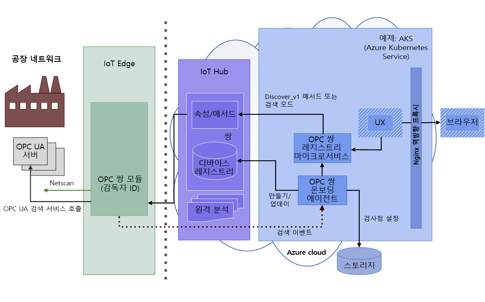
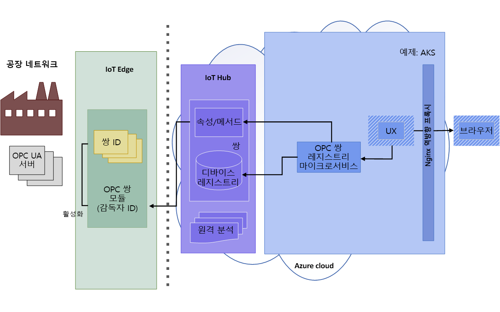
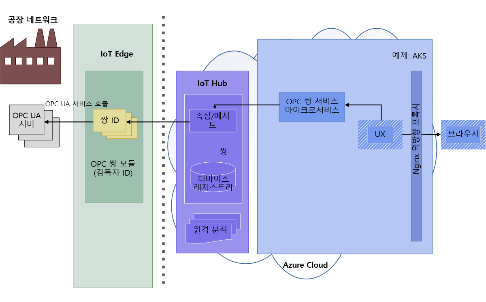
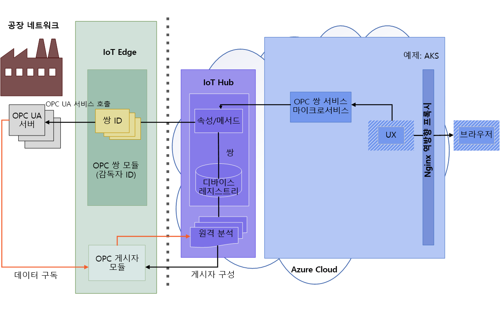

# OPC 쌍 아키텍처

다음 다이어그램에서는 OPC 쌍 아키텍처를 보여줍니다.

## 검색 및 활성화

1. 운영자는 모듈에서 네트워크 검색을 활성화하거나 검색 URL을 사용하여 일회성 검색을 수행합니다. 검색된 엔드포인트 및 애플리케이션 정보는 처리를 위해 원격 분석을 통해 온보딩 에이전트로 전송됩니다.  OPC UA 디바이스 온보딩 에이전트는 검색 또는 스캔 모드에서 OPC 쌍 IoT Edge 모듈이 보낸 OPC 쌍 UA 서버 검색 이벤트를 처리합니다. 검색 이벤트는 OPC UA 디바이스 레지스트리에 애플리케이션 등록 및 업데이트로 이어집니다.

   

1. 운영자는 검색된 엔드포인트의 인증서를 검사하고 액세스를 위해 등록된 엔드포인트 쌍을 활성화합니다. 

   

## 찾아보기 및 모니터링

1. 활성화되고 나면 운영자는 쌍 서비스 REST API를 사용하여 서버 정보 모델, 개체 변수 읽기/쓰기 및 호출 메서드를 찾아보거나 검사할 수 있습니다.  사용자는 HTTP 및 JSON에서 완벽하게 표현되는 간소화된 OPC UA API를 사용합니다.

   

1. 또한 쌍 서비스 REST 인터페이스는 OPC 게시자의 모니터링된 항목 및 구독을 만드는 데도 사용할 수 있습니다. OPC 게시자는 OPC UA 서버 시스템에서 IoT Hub로 원격 분석을 보낼 수 있습니다. OPC 게시자에 대한 자세한 내용은 GitHub에서 [OPC 게시자](https://github.com/Azure/iot-edge-opc-publisher) 리포지토리를 참조하세요.

   