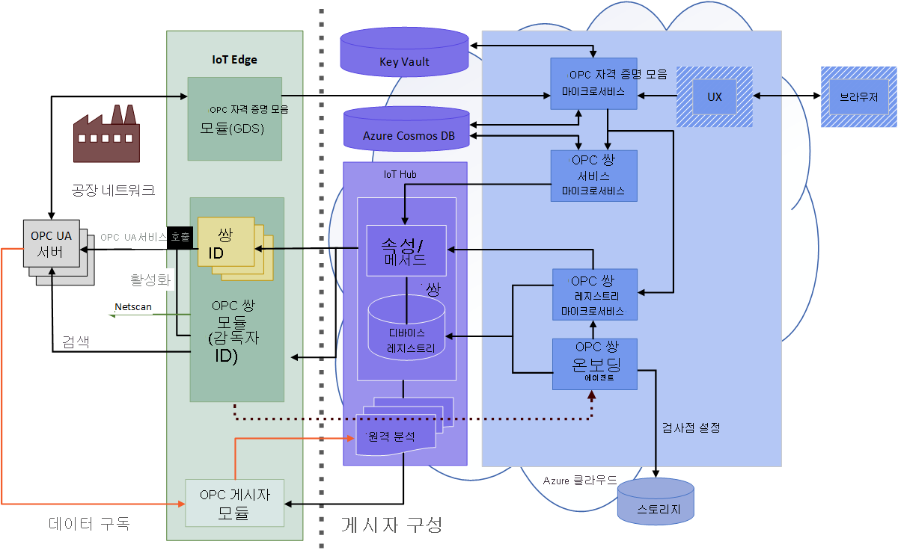

# OPC 자격 증명 모음이란?

OPC 자격 증명 모음은 클라우드 내 OPC UA 서버 및 클라이언트 애플리케이션에 대한 인증서 수명 주기를 구성, 등록 및 관리할 수 있는 마이크로서비스입니다. 이 문서에서는 OPC 자격 증명 모음의 간단한 사용 사례를 설명합니다.

## 인증서 관리

예를 들어 제조 회사에서 새로 빌드한 클라이언트 애플리케이션에 자신의 OPC UA 서버 머신을 연결해야 합니다. 제조 업체가 처음 서버 머신에 액세스할 때, OPC UA 서버 애플리케이션에 클라이언트 애플리케이션이 안전하지 않음을 알리는 오류 메시지가 즉시 표시됩니다. 이 메커니즘은 권한이 없는 애플리케이션 액세스를 방지하기 위해 OPC UA 서버 머신에 내장되어 있으며, 이는 작업 현장의 악성 해킹을 방지합니다.

## 애플리케이션 보안 관리
OPC 자격 증명 모음에는 인증서 레지스트리, 스토리지 및 수명 주기 관리를 위한 모든 기능이 있으므로 보안 전문가는 OPC 자격 증명 모음 마이크로서비스를 사용하여 OPC UA 서버가 모든 클라이언트 애플리케이션과 쉽게 통신할 수 있도록 합니다. 이제 OPC UA 서버가 안전하게 연결되어 새로 빌드된 클라이언트 애플리케이션과 통신할 수 있습니다.

## 전체 OPC 자격 증명 모음 아키텍처
다음 다이어그램은 전체 OPC 자격 증명 모음 아키텍처를 보여줍니다.

