# 빠른 시작: 클라우드 기반 솔루션으로 산업용 IoT 장치 관리해 보기

이 빠른 시작에서는 Azure IoT 연결된 팩터리 솔루션 가속기를 배포하여 산업용 IoT 장치에 대한 클라우드 기반 모니터링 및 관리 시뮬레이션을 실행하는 방법을 보여줍니다. 연결된 팩터리 솔루션 가속기를 배포할 때 일반적인 산업용 IoT 시나리오를 단계별로 실행할 수 있는 시뮬레이션된 리소스가 미리 채워집니다. 몇 가지 시뮬레이션된 팩터리가 솔루션에 연결되어 있으면서 OEE(설비종합효율)와 KPI(핵심 성과 지표)를 계산하는 데 필요한 데이터 값을 보고합니다. 이 빠른 시작에서는 솔루션 대시보드를 사용하여 다음 작업을 수행하는 방법을 보여줍니다.

* 팩터리, 생산 라인, 스테이션 OEE 및 KPI 값 모니터링
* 장치에서 생성된 원격 분석 데이터 분석
* 알람에 응답

이 빠른 시작을 완료하려면 활성 Azure 구독이 필요합니다.

Azure 구독이 아직 없는 경우 시작하기 전에 [무료 계정](https://azure.microsoft.com/free/?WT.mc_id=A261C142F)을 만듭니다.

## 솔루션 배포

Azure 구독에 솔루션 가속기를 배포할 때 일부 구성 옵션을 설정해야 합니다.

Azure 계정 자격 증명을 사용하여 [azureiotsolutions.com](https://www.azureiotsolutions.com/Accelerators)에 로그인합니다.

**연결된 팩터리** 타일에서 **지금 사용해 보기**를 클릭합니다.

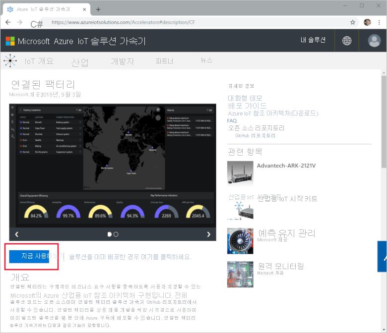

**Create Connected Factory solution**(연결된 팩터리 솔루션 만들기) 페이지에서 연결된 펙터리 솔루션 가속기에 대한 고유 **솔루션 이름**을 입력합니다. 이 이름은 솔루션 가속기 리소스를 모두 포함하는 Azure 리소스 그룹의 이름입니다. 이 빠른 시작에서는 **MyDemoConnectedFactory**를 호출합니다.

솔루션 가속기를 배포하는 데 사용하려는 **구독** 및 **지역**을 선택합니다. 일반적으로, 자신에게 가장 가까운 지역을 선택합니다. 이 빠른 시작에서는 **Visual Studio Enterprise** 및 **미국 동부**를 사용합니다. 구독 내에서 [전역 관리자 또는 사용자](iot-accelerators-permissions.md)여야 합니다.

**솔루션 만들기**를 클릭하여 배포를 시작합니다. 이 프로세스는 실행하는 데 5분 이상이 걸립니다.

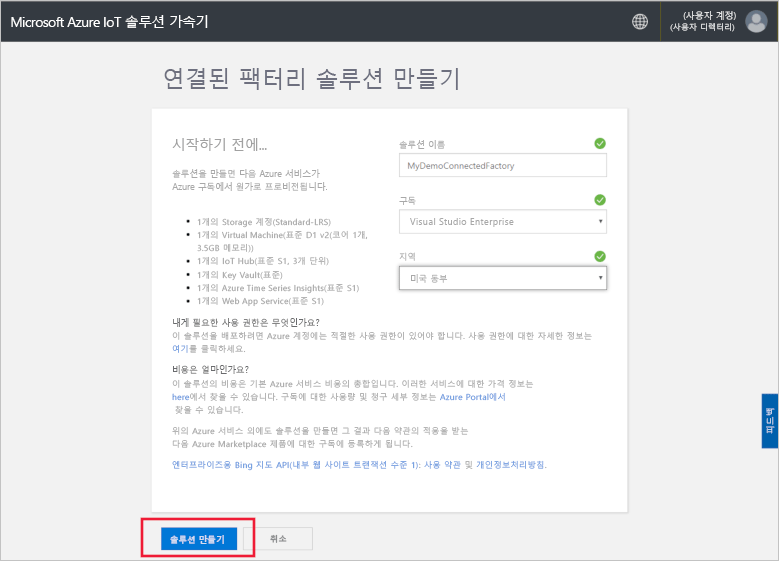

## 솔루션에 로그인

Azure 구독에 배포가 완료되면 솔루션 타일에 녹색 확인 표시 및 **준비**가 표시됩니다. 이제 연결된 팩터리 솔루션 가속기 대시보드에 로그인할 수 있습니다.

**프로비전된 솔루션** 페이지에서 새 연결된 팩터리 솔루션 가속기를 클릭합니다.

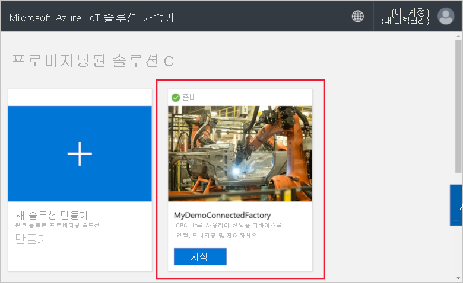

표시되는 패널에서 연결된 팩터리 솔루션 가속기에 대한 정보를 볼 수 있습니다. **솔루션 대시보드**를 선택하여 연결된 팩터리 솔루션 가속기를 봅니다.

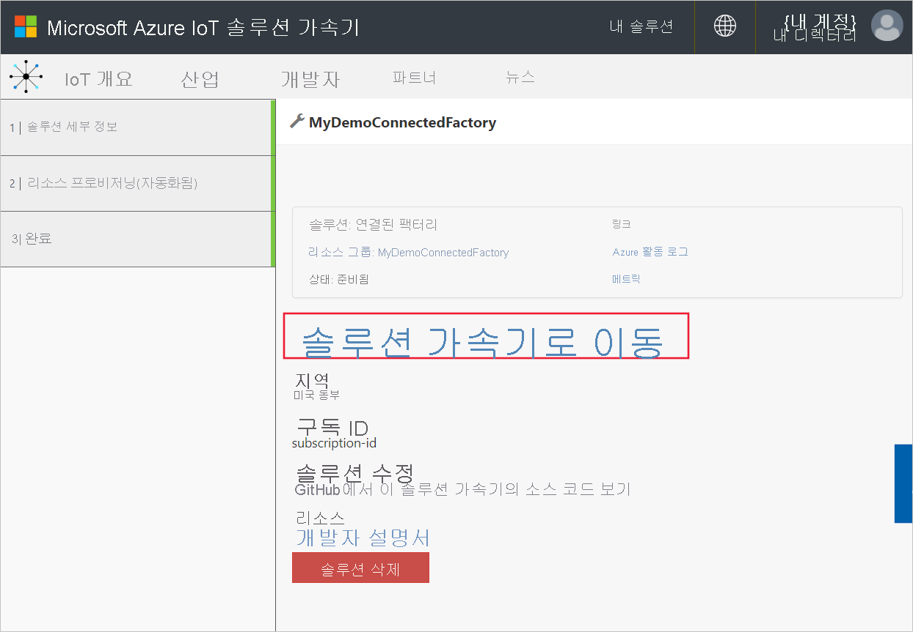

**수락**을 클릭하여 권한 요청을 수락하면 연결된 팩터리 솔루션 대시보드가 브라우저에 표시됩니다. 시뮬레이션된 팩터리, 생산 라인 및 스테이션 집합이 표시됩니다.

## 대시보드 보기

기본 보기는 *대시보드*입니다. 포털의 다른 영역으로 이동하려면 페이지 왼쪽의 메뉴를 사용합니다.

[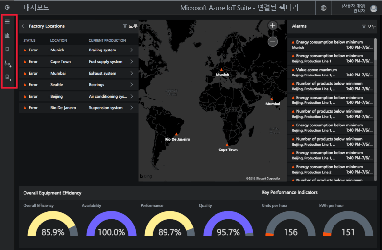](./media/quickstart-connected-factory-deploy/dashboard-expanded.png#lightbox)

대시보드를 사용하여 산업용 IoT 장치를 관리합니다. 연결된 팩터리는 계층 구조를 사용하여 전역 팩터리 구성을 표시합니다. 계층 구조의 최상위 수준에는 하나 이상의 팩터리를 포함하는 엔터프라이즈가 있으며 각 팩터리마다 생산 라인이 포함되어 있고 생산 라인은 스테이션으로 구성됩니다. 각 수준마다 OEE와 KPI를 볼 수 있고, 원격 분석을 위한 새 노드를 게시할 수 있고, 알람에 응답할 수 있습니다.

대시보드에서는 다음을 확인할 수 있습니다.

## 설비종합효율(OEE)

**설비종합효율(OEE)** 패널에는 기업 전체 또는 현재 보고 있는 팩터리/생산 라인/스테이션의 OEE 값이 표시됩니다. 이 값은 스테이션 보기에서 엔터프라이즈 수준까지 집계됩니다. OEE 수치 및 구성 요소를 구체적으로 분석할 수 있습니다.

[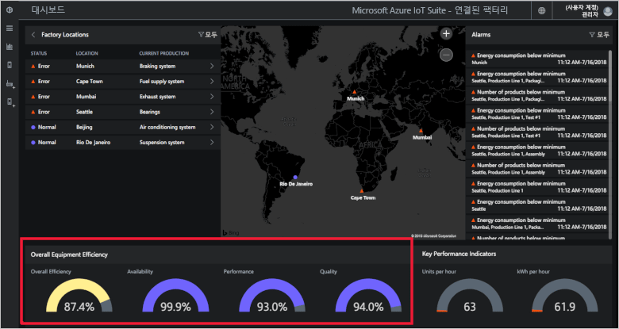](./media/quickstart-connected-factory-deploy/oee-expanded.png#lightbox)

OEE는 생산 관련 운영 매개 변수를 사용하여 제조 프로세스의 효율성을 평가합니다. OEE는 가용성 등급, 성능 등급, 품질 비율을 곱하여(OEE = 가용성 x 성능 x 품질) 계산되는 산업 표준 측정값입니다.

계층 구조 데이터의 모든 수준에서 OEE를 더 자세히 분석할 수 있습니다. OEE, 가용성, 성능 또는 품질 비율 다이얼을 클릭합니다. 컨텍스트 패널이 나타나면서 다양한 시간별 데이터를 포함된 시각화가 표시됩니다.

[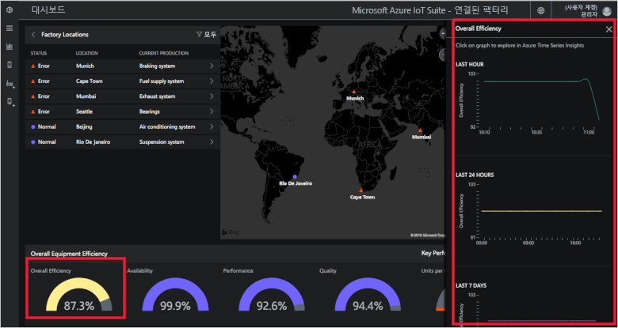](./media/quickstart-connected-factory-deploy/oeedetail-expanded.png#lightbox)

차트를 클릭하면 데이터를 더 자세히 분석할 수 있습니다.

### 핵심 성과 지표

**핵심 성과 지표** 패널에는 기업 전체 또는 표시되어 있는 팩터리/생산 라인/스테이션에서 사용된 에너지(kWh)와 시간당 생산된 단위의 수가 표시됩니다. 이러한 값은 스테이션 보기에서 엔터프라이즈 수준까지 집계됩니다.

[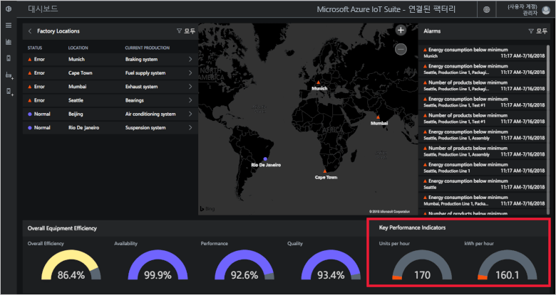](./media/quickstart-connected-factory-deploy/kpis-expanded.png#lightbox)

계층 구조 데이터의 모든 수준에서 KPI를 더 자세히 분석할 수 있습니다. OEE, 가용성, 성능 또는 품질 비율 다이얼을 클릭합니다. 컨텍스트 패널이 나타나면서 다양한 시간별 데이터를 포함된 시각화가 표시됩니다.

[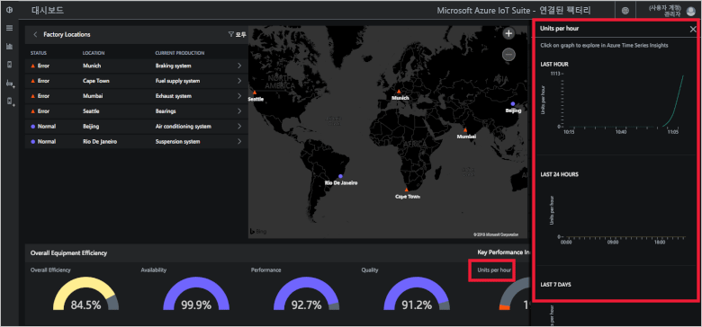](./media/quickstart-connected-factory-deploy/kpidetail-expanded.png#lightbox)

차트를 클릭하면 데이터를 더 자세히 분석할 수 있습니다.

### 팩터리 위치

솔루션의 상태, 위치 및 현재 프로덕션 구성을 보여주는 **팩터리 위치** 패널입니다. 솔루션 가속기를 처음 실행하면 대시보드에 시뮬레이션된 팩터리 집합이 표시됩니다. 각 생산 라인 시뮬레이션은 시뮬레이션된 작업을 실행하고 데이터를 공유하는 실제 OPC UA 서버 세 개로 구성됩니다. OPC UA에 대한 자세한 내용은 [연결된 팩터리 FAQ](iot-accelerators-faq-cf.md)를 참조하세요.

[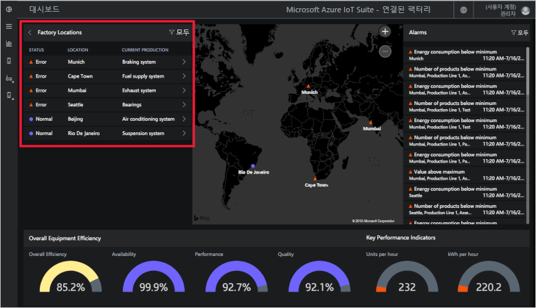](./media/quickstart-connected-factory-deploy/factorylocations-expanded.png#lightbox)

솔루션 계층 구조를 탐색하면서 각 수준의 OEE 값 및 KPI를 볼 수 있습니다.

1. **팩터리 위치**에서 **뭄바이**를 클릭합니다. 이 위치의 생산 라인이 표시됩니다.

1. **생산 라인 1**을 클릭합니다. 이 생산 라인의 스테이션이 표시됩니다.

1. **패키징**를 클릭합니다. 이 스테이션에 의해 게시된 OPC UA 노드가 표시됩니다.

1. **EnergyConsumption**을 클릭합니다. 다양한 시간대별 값이 그려진 차트가 표시됩니다. 차트를 클릭하면 데이터를 더 자세히 분석할 수 있습니다.

[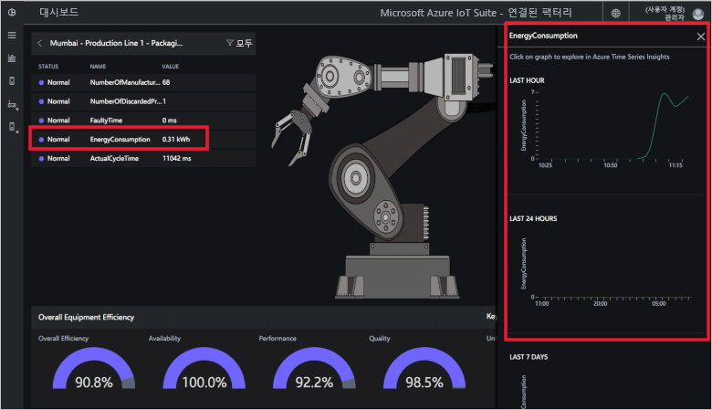](./media/quickstart-connected-factory-deploy/explorelocations-expanded.png#lightbox)

### Map

사용자 구독으로 [Bing Maps API](iot-accelerators-faq-cf.md)에 액세스할 수 있는 경우 *팩터리* 맵에 솔루션에 있는 모든 공장의 지리적 위치 및 상태가 표시됩니다. 위치 세부 정보를 보려면 맵에 표시된 위치를 클릭합니다.

[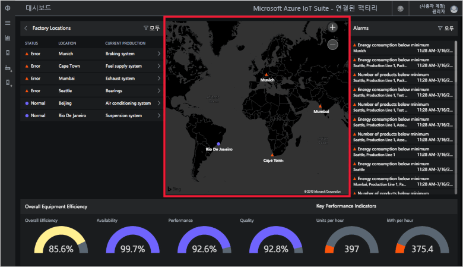](./media/quickstart-connected-factory-deploy/map-expanded.png#lightbox)

### 알람

**알람** 패널에는 보고된 값 또는 계산된 OEE/KPI 값이 구성된 임계값을 초과하는 경우 생성되는 알람이 표시됩니다. 이 패널에는 스테이션 수준에서 엔터프라이즈까지 계층 구조의 각 수준에 알람이 표시됩니다. 알람마다 설명, 날짜, 시간, 위치 및 발생 회수가 포함됩니다.

[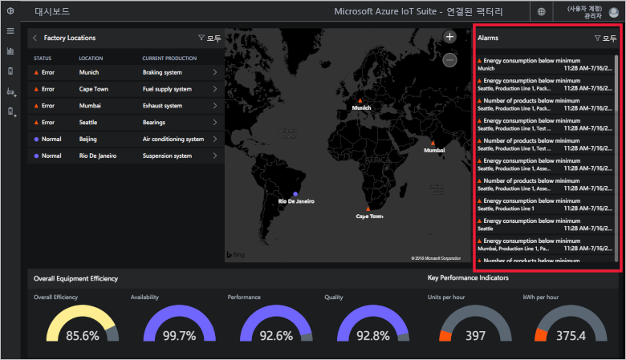](./media/quickstart-connected-factory-deploy/alarms-expanded.png#lightbox)

대시보드에서 알람을 유발한 데이터를 분석할 수 있습니다. 관리자는 알람에 대해 다음과 같은 기본 작업을 수행할 수 있습니다.

* 알람 닫기
* 알람 승인

알람 중 하나를 클릭하고 **작업 선택** 드롭다운 메뉴에서 **알람 수신 확인**을 클릭한 다음, **적용**을 클릭합니다.

[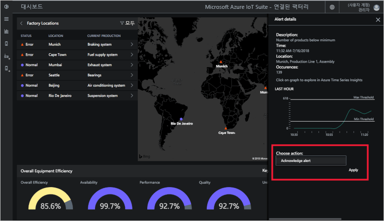](./media/quickstart-connected-factory-deploy/acknowledge-expanded.png#lightbox)

알람 데이터를 상세히 분석하려면 알람 패널에서 그래프를 클릭합니다.

이러한 알람은 솔루션 가속기의 구성 파일에 지정된 규칙에 의해 생성됩니다. OEE 또는 KPI 수치나 OPC UA 노드 값이 구성된 임계값을 초과하면 이러한 규칙이 알람을 생성할 수 있습니다.

## 리소스 정리

더 탐색하려면 연결된 팩터리 솔루션 가속기를 배포된 대로 둡니다.

솔루션 가속기가 더 이상 필요하지 않은 경우 선택한 다음, **솔루션 삭제**를 클릭하여 [프로비전된 솔루션](https://www.azureiotsolutions.com/Accelerators#dashboard) 페이지에서 삭제합니다.

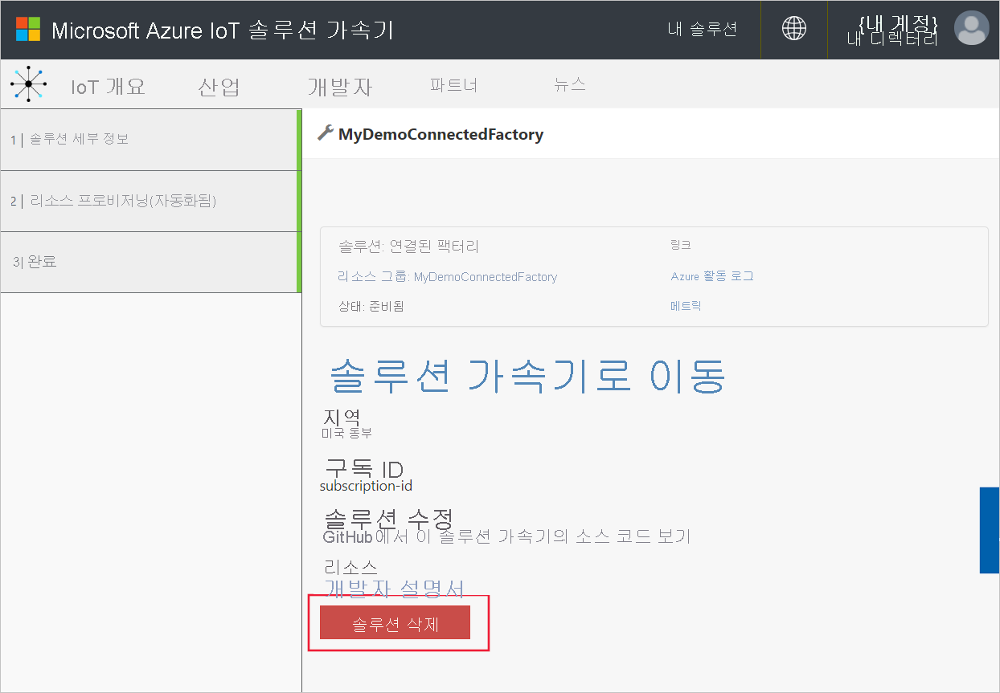

## 다음 단계

이 빠른 시작에서는 연결된 팩터리 솔루션 가속기를 배포했고 팩터리, 생산 라인 및 스테이션을 탐색하는 방법을 알아보았습니다. 계층 구조의 모든 수준에서 OEE 및 KPI 값을 보는 방법과 알람에 응답하는 방법도 알아보았습니다.

대시보드의 다른 기능을 사용하여 산업용 IoT 장치를 관리하는 방법을 알아보려면 다음 방법 가이드를 계속 진행합니다.

> [!div class="nextstepaction"]
> [연결된 팩터리 대시보드 사용](iot-accelerators-connected-factory-dashboard.md)