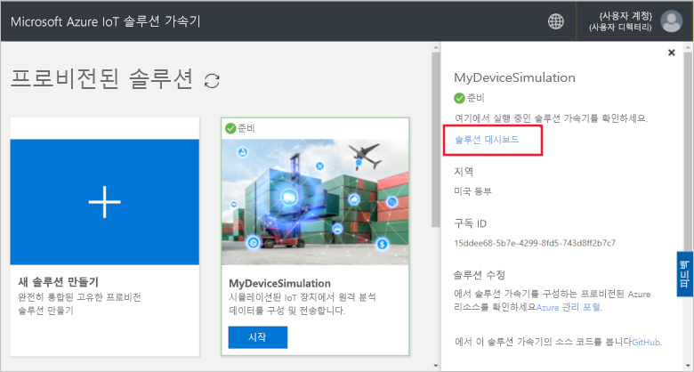
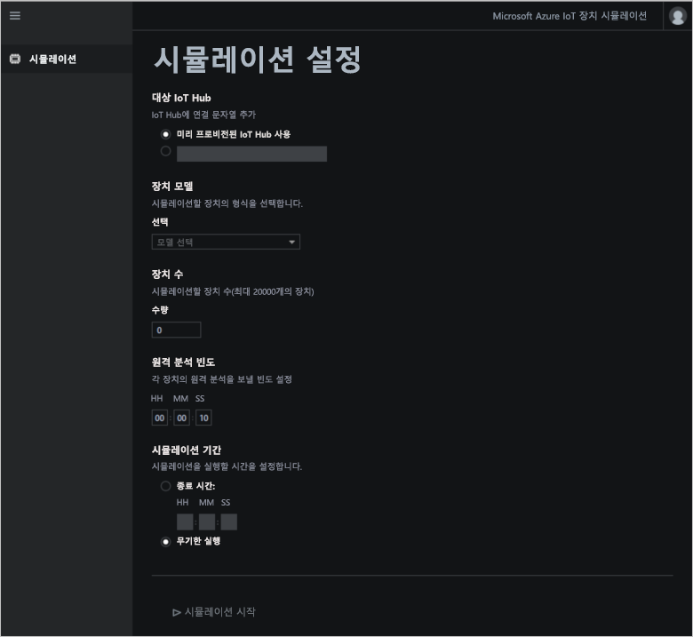
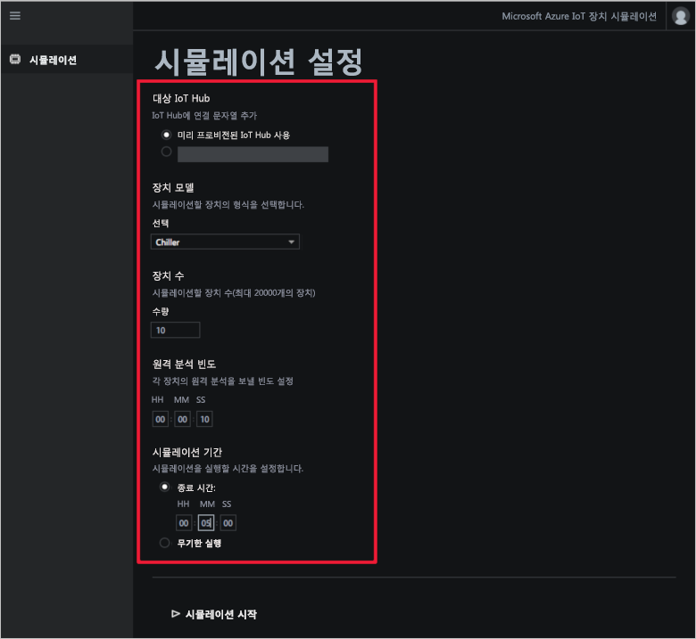
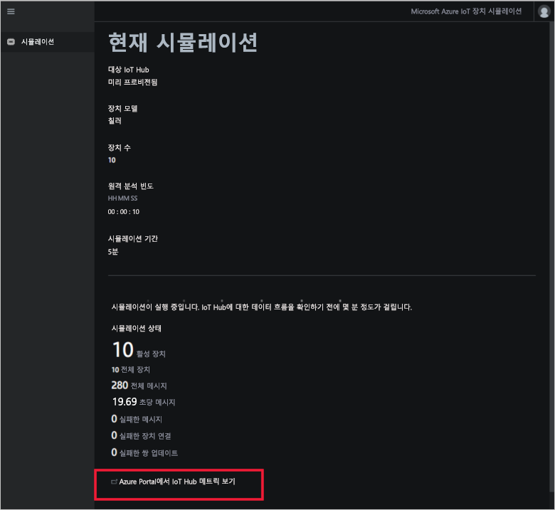

# 빠른 시작: 클라우드 기반 장치 시뮬레이션 솔루션 배포 및 실행

이 빠른 시작에서는 IoT 솔루션을 테스트하는 데 사용하기 위해 Azure IoT 장치 시뮬레이션 솔루션 가속기를 배포하는 방법을 보여줍니다. 솔루션 가속기를 배포한 후 **시뮬레이션** 페이지를 사용하여 시뮬레이션을 만들고 실행합니다.

## 필수 조건

이 빠른 시작을 완료하려면 활성 Azure 구독이 필요합니다.

Azure 구독이 아직 없는 경우 시작하기 전에 [무료 계정](https://azure.microsoft.com/free/?WT.mc_id=A261C142F)을 만듭니다.

## 솔루션 배포

Azure 구독에 솔루션 가속기를 배포할 때 일부 구성 옵션을 설정해야 합니다.

Azure 계정 자격 증명을 사용하여 [azureiotsolutions.com](https://www.azureiotsolutions.com/Accelerators)에 로그인합니다.

**장치 시뮬레이션** 타일에서 **지금 사용해보기**를 클릭합니다.

**장치 시뮬레이션 솔루션 만들기** 페이지에서 고유한 **솔루션 이름**을 입력합니다. 모든 솔루션의 리소스를 포함하는 Azure 리소스 그룹의 이름이므로 솔루션 이름을 기록해 두십시오.

솔루션 가속기를 배포하는 데 사용하려는 **구독** 및 **지역**을 선택합니다. 일반적으로, 자신에게 가장 가까운 지역을 선택합니다. 구독 내에서 [전역 관리자 또는 사용자](iot-accelerators-permissions.md)여야 합니다.

장치 시뮬레이션 솔루션과 함께 사용하려면 상자를 확인하여 IoT 허브를 배포합니다. 나중에 시뮬레이션이 사용하는 IoT 허브를 언제든 변경할 수 있습니다.

**솔루션 만들기** 를 클릭하여 솔루션의 프로비전을 시작합니다. 이 프로세스는 실행하는 데 5분 이상이 걸립니다.

## 솔루션에 로그인

프로비전 프로세스가 완료되면 장치 시뮬레이션 솔루션 가속기 대시보드에 로그인할 수 있습니다.

**프로비전된 솔루션** 페이지에서 새 장치 시뮬레이션 솔루션 가속기를 클릭합니다.

표시되는 패널에서 장치 시뮬레이션 솔루션 가속기에 대한 정보를 볼 수 있습니다. **솔루션 대시보드**를 선택하여 장치 시뮬레이션 솔루션 가속기를 봅니다.

**수락**을 클릭하여 권한 요청을 수락하면 장치 시뮬레이션 솔루션 대시보드가 브라우저에 표시됩니다.

## 시뮬레이션 구성

대시보드에서 시뮬레이션을 구성하고 실행합니다. 다음 표의 값을 사용하여 시뮬레이션을 구성합니다.

| 설정             | 값                       |
| ------------------- | --------------------------- |
| 대상 IoT Hub      | 미리 프로비전된 IoT Hub 사용 |
| 장치 모델        | 냉각기                     |
| 장치 수   | 10                          |
| 원격 분석 빈도 | 10초                  |
| 시뮬레이션 기간 | 5분                   |

## 시뮬레이션 실행

**시뮬레이션 시작**을 클릭합니다. 선택한 기간 동안 시뮬레이션이 실행됩니다. 언제든 **시뮬레이션 중지**를 클릭하여 시뮬레이션을 중지할 수 있습니다. 시뮬레이션은 현재 실행에 대한 통계를 보여줍니다. **Azure Portal에서 IoT Hub 메트릭 보기**를 클릭하여 IoT 허브에서 보고된 메트릭을 확인합니다.

솔루션 가속기의 프로비전된 인스턴스에서 한 번에 하나의 시뮬레이션만 실행할 수 있습니다.

## 리소스 정리

추가 탐색하려는 경우 장치 시뮬레이션 솔루션 가속기를 배포된 대로 둡니다.

솔루션 가속기가 더 이상 필요하지 않은 경우 [프로비전된 솔루션](https://www.azureiotsolutions.com/Accelerators#dashboard) 페이지에서 삭제합니다.

## 다음 단계

이 빠른 시작에서는 장치 시뮬레이션 솔루션 가속기를 배포하고 IoT 장치 시뮬레이션을 실행했습니다.

시뮬레이션에서 기존 IoT Hub를 사용하는 방법을 알아보려면 방법 가이드를 참조하세요.

> [!div class="nextstepaction"]
> [장치 시뮬레이션 솔루션 가속기와 함께 기존 IoT 허브 사용](iot-accelerators-device-simulation-choose-hub.md)