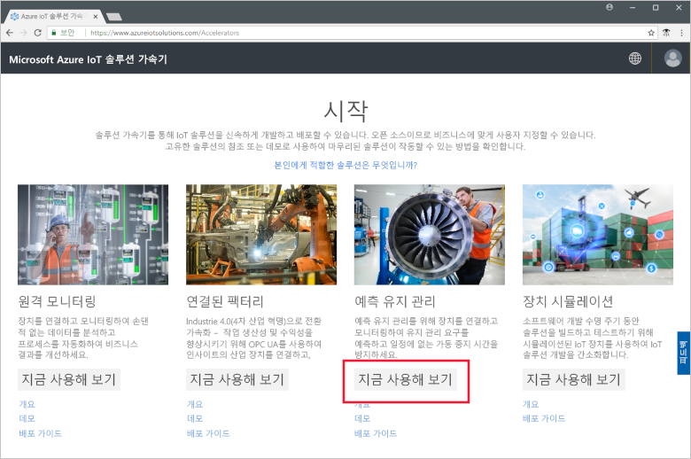
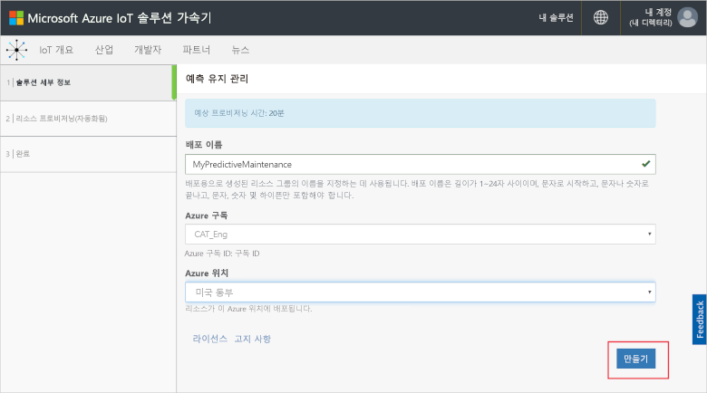
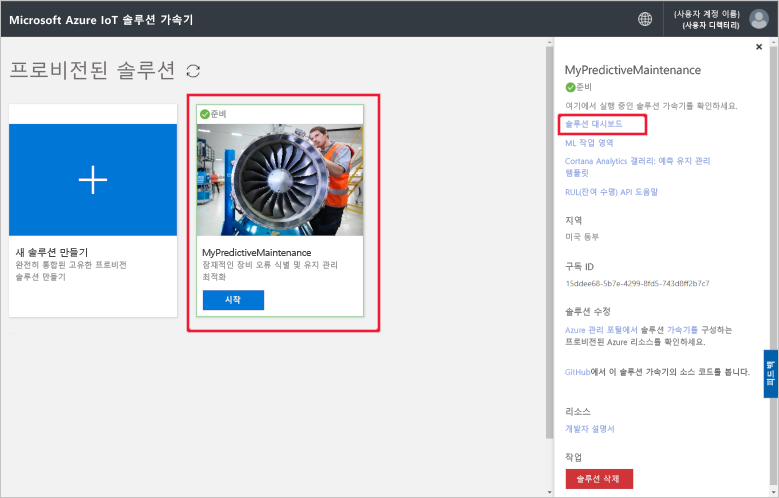
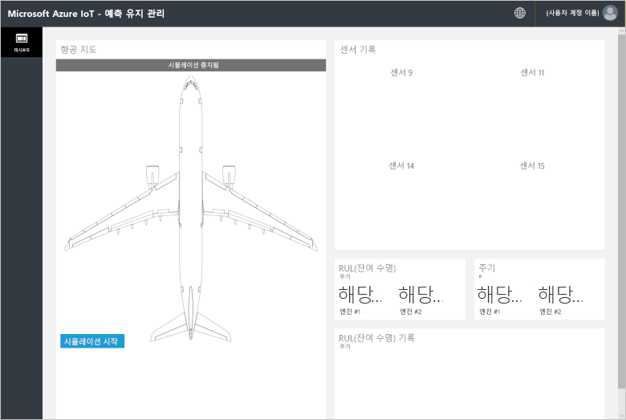
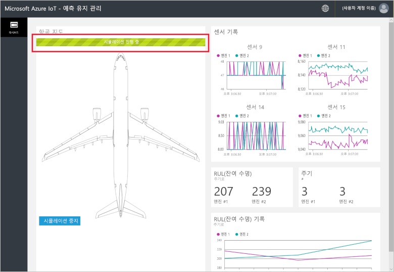
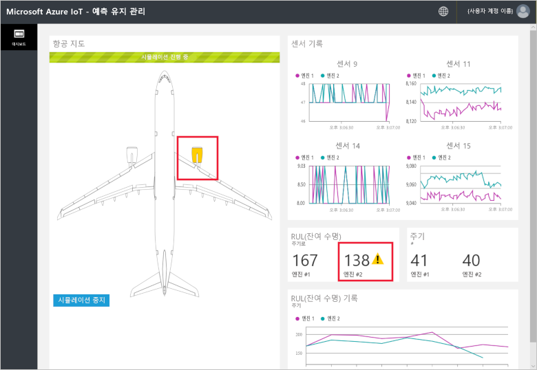
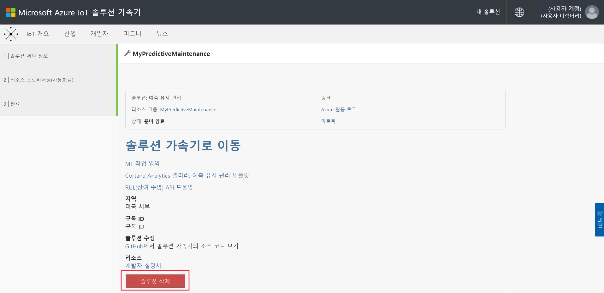

# 빠른 시작: 연결된 장치에서 예측 유지 관리 분석을 실행하는 클라우드 기반 솔루션 시도

이 빠른 시작에서는 Azure IoT 예측 유지 관리 솔루션 가속기를 배포하여 클라우드 기반 예측 유지 관리 시뮬레이션을 실행하는 방법을 보여줍니다. 솔루션 가속기를 배포한 후 시뮬레이션된 항공기 엔진 데이터에서 예측 유지 관리 분석을 실행하기 위해 솔루션 **대시보드** 페이지를 사용합니다. 학습 도구로 또는 고유한 구현을 위한 시작점으로 이 솔루션 가속기를 사용할 수 있습니다.

시뮬레이션에서 Fabrikam은 경쟁력 있는 가격으로 우수한 고객 경험을 제공하는 데 중점을 두고 있는 지역 항공사입니다. 항공기 지연의 이유 중 하나는 정비 문제이며 항공 엔진 정비는 특히 어려운 부분입니다. Fabrikam은 비행 중 엔진 고장은 어떻게 해서든 막아야 하기 때문에 엔진을 정기적으로 조사하고 계획에 따라 유지 관리 일정을 예약합니다. 하지만 항공기 엔진이 항상 동일하게 마모되는 것은 아닙니다. 엔진에 대해 필요 이상의 정비를 수행하는 경우도 있습니다. 무엇보다, 정비가 수행될 때까지 항공기를 이륙할 수 없는 문제가 발생합니다. 적당한 기술자나 예비 부품이 없는 곳에 항공기가 있는 경우에는 특히 비용이 많이 드는 문제가 생길 수 있습니다.

Fabrikam 항공기의 엔진에는 비행 중에 엔진 상태를 모니터링하는 센서가 달려 있습니다. Fabrikam은 이러한 센서에서 수집한 수 년간의 엔진 작동 및 고장 데이터를 보유하고 있습니다. Fabrikam의 데이터 과학자는 이러한 데이터를 사용하여 항공기 엔진의 RUL(잔여 수명)을 예측하는 모델을 개발했습니다. 이 모델은 4개 엔진 센서의 데이터와 우발적인 고장으로 이어지는 엔진 마모 사이의 상관 관계를 사용합니다. Fabrikam은 정기적인 안전 검사를 계속하는 한편, 이 모델을 통해 비행이 끝날 때마다 각 엔진에 대한 RUL을 계산할 수 있게 되었습니다. Fabrikam은 이제 향후 고장 시점을 예측하고 항공기 지상 체류 시간을 최소화하기 위한 유지 관리를 계획할 수 있습니다. 이 프로세스는 운영 비용을 줄이는 한편, 승객 및 승무원의 안전을 보장합니다.

이 빠른 시작을 완료하려면 활성 Azure 구독이 필요합니다.

Azure 구독이 아직 없는 경우 시작하기 전에 [체험 계정](https://azure.microsoft.com/free/?WT.mc_id=A261C142F)을 만듭니다.

## 솔루션 배포

Azure 구독에 솔루션 가속기를 배포할 때 일부 구성 옵션을 설정해야 합니다.

[Microsoft Azure IoT 솔루션 가속기](https://www.azureiotsolutions.com)로 이동하고 Azure 계정 자격 증명을 사용하여 로그인합니다.

**예측 유지 관리** 타일을 선택합니다. **예측 유지 관리** 페이지에서 **지금 사용해 보기**를 클릭합니다.

**예측 유지 관리 솔루션 만들기** 페이지에서 예측 유지 관리 솔루션 가속기에 대한 고유한 **솔루션 이름**을 입력합니다. 이 빠른 시작에서는 **MyPredictiveMaintenance**를 사용하고 있습니다.

솔루션 가속기를 배포하는 데 사용하려는 **구독** 및 **지역**을 선택합니다. 일반적으로, 자신에게 가장 가까운 지역을 선택합니다. 이 빠른 시작에서는 **Visual Studio Enterprise** 및 **미국 동부**를 사용합니다. 구독 내에서 [전역 관리자 또는 사용자](iot-accelerators-permissions.md)여야 합니다.

**솔루션 만들기**를 배포를 시작합니다. 이 프로세스는 실행하는 데 5분 이상이 걸립니다.

## 솔루션에 로그인

Azure 구독에 배포가 완료되면 솔루션 타일에 녹색 확인 표시 및 **준비**가 표시됩니다. 이제 예측 유지 관리 솔루션 가속기 대시보드에 로그인할 수 있습니다.

**프로비전된 솔루션** 페이지에서 새 예측 유지 관리 솔루션 가속기를 선택합니다. 표시되는 패널에서 예측 유지 관리 솔루션 가속기에 대한 정보를 볼 수 있습니다. **솔루션 대시보드**를 선택하여 예측 유지 관리 솔루션 가속기를 봅니다.

**수락**을 클릭하여 권한 요청을 수락하면 예측 유지 관리 솔루션 대시보드가 브라우저에 표시됩니다.

**시뮬레이션 시작**을 클릭하여 시뮬레이션을 시작합니다. 센서 기록, RUL, 주기 및 RUL 기록으로 대시보드가 채워집니다.

RUL이 160(데모 목적으로 선택한 임의의 임계값) 미만인 경우, 솔루션 포털은 RUL 표시 옆에 경고 기호를 표시합니다. 또한 솔루션 포털은 항공기 엔진을 노란색으로 강조 표시합니다. RUL 값이 전반적으로 일반 하향 추세를 갖지만 아래 위로 요동치는 경향이 있습니다. 이 동작은 다양한 주기 길이 및 모델 정확도로 인해 발생합니다.

전체 시뮬레이션이 148 주기를 완료하려면 약 35분이 걸립니다. 160 RUL 임계값은 처음 약 5분이 지나서 도달하고 두 엔진은 약 8분이 지나서 임계값에 도달합니다.

시뮬레이션은 148주기 동안 전체 데이터 세트를 실행하고 최종 RUL 및 주기 값에 도달합니다.

언제든 시뮬레이션을 중지할 수 있지만 **시뮬레이션 시작** 을 클릭하면 데이터 세트의 처음부터 시뮬레이션을 재생합니다.

## 리소스 정리

추가 탐색하려는 경우 예측 유지 관리 솔루션 가속기를 배포된 대로 둡니다.

솔루션 가속기가 더 이상 필요하지 않은 경우 이를 선택한 다음, **솔루션 삭제**를 클릭하여 [프로비전된 솔루션](https://www.azureiotsolutions.com/Accelerators#dashboard) 페이지에서 삭제합니다.

## 다음 단계

이 빠른 시작에서는 예측 유지 관리 솔루션 가속기를 배포하고 시뮬레이션을 실행했습니다.

솔루션 가속기 및 시뮬레이션된 항공기 엔진에 대해 자세히 알려면 다음 문서를 계속 진행하세요.

> [!div class="nextstepaction"]
> [예측 유지 관리 솔루션 가속기 개요](iot-accelerators-predictive-walkthrough.md)
