# 빠른 시작: 클라우드 기반 원격 모니터링 솔루션 시도

이 빠른 시작에서는 Azure IoT 원격 모니터링 솔루션 가속기를 배포하여 클라우드 기반 원격 모니터링 시뮬레이션을 실행하는 방법을 보여줍니다. 솔루션 가속기를 배포한 후 솔루션 **대시보드** 페이지를 사용하여 시뮬레이션된 장치를 맵에서 시각화하면 **유지 관리** 페이지가 시뮬레이션된 냉각기 장치의 압력 경고에 응답합니다. 학습 도구로 또는 고유한 구현을 위한 시작점으로 이 솔루션 가속기를 사용할 수 있습니다.

초기 배포에서는 Contoso라는 회사의 원격 모니터링 솔루션 가속기를 구성합니다. Contoso는 다양한 물리적 환경에 배포된 냉각기와 같이 선별된 다양한 장치 유형을 관리합니다. 냉각기는 원격 모니터링 솔루션 가속기에 온도, 습도 및 압력 원격 분석 데이터를 보냅니다.

이 빠른 시작을 완료하려면 활성 Azure 구독이 필요합니다.

Azure 구독이 아직 없는 경우 시작하기 전에 [무료 계정](https://azure.microsoft.com/free/?WT.mc_id=A261C142F)을 만듭니다.

## 솔루션 배포

Azure 구독에 솔루션 가속기를 배포할 때 일부 구성 옵션을 설정해야 합니다.

Azure 계정 자격 증명을 사용하여 [azureiotsolutions.com](https://www.azureiotsolutions.com/Accelerators)에 로그인합니다.

**원격 모니터링** 타일에서 **지금 시도**를 클릭합니다.

**원격 모니터링 솔루션 만들기** 페이지에서 **기본** 배포를 선택합니다. 작동 방법을 알아보거나 데모 실행을 위해 솔루션 가속기를 배포하는 경우 **기본** 옵션을 선택하여 비용을 최소화합니다.

**.NET**을 언어로 선택합니다. Java 및 .NET 구현에는 동일한 기능이 있습니다.

원격 모니터링 솔루션 가속기에 **솔루션 이름** 을 입력합니다. 이 빠른 시작에서는 **contoso-rm2**를 호출합니다.

솔루션 가속기를 배포하는 데 사용하려는 **구독** 및 **지역**을 선택합니다. 일반적으로, 자신에게 가장 가까운 지역을 선택합니다. 이 빠른 시작에서는 **Visual Studio Enterprise** 및 **서유럽**을 사용하고 있습니다. 구독 내에서 [전역 관리자 또는 사용자](iot-accelerators-permissions.md)여야 합니다.

**솔루션 만들기**를 배포를 시작합니다. 이 프로세스는 실행하는 데 5분 이상이 걸립니다.

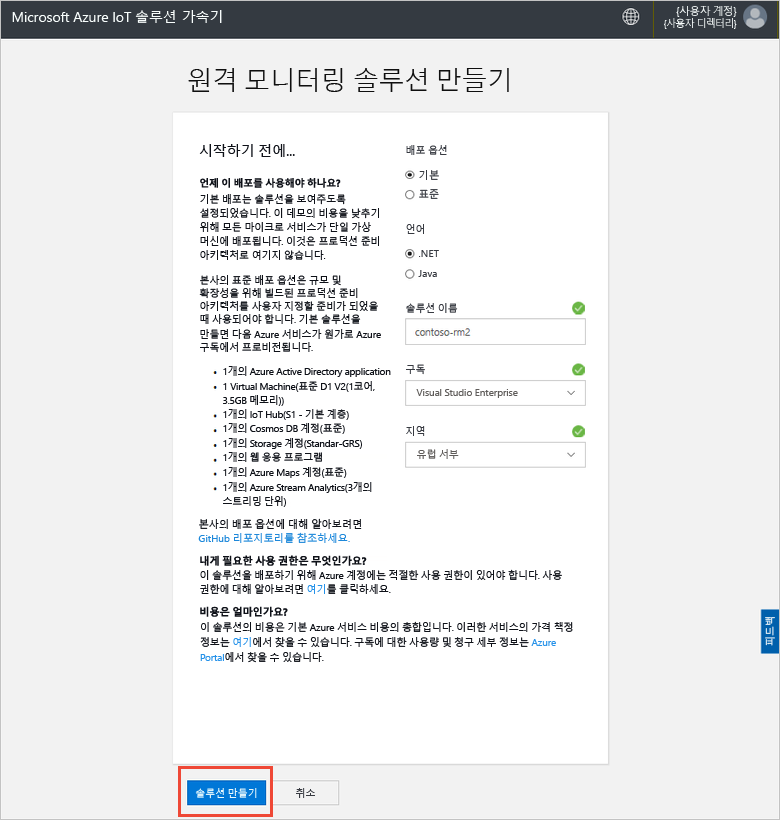

## 솔루션에 로그인

Azure 구독에 배포가 완료되면 솔루션 타일에 녹색 확인 표시 및 **준비**가 표시됩니다. 이제 원격 모니터링 솔루션 가속기 대시보드에 로그인할 수 있습니다.

**프로비전된 솔루션** 페이지에서 새 원격 모니터링 솔루션 가속기를 선택합니다.

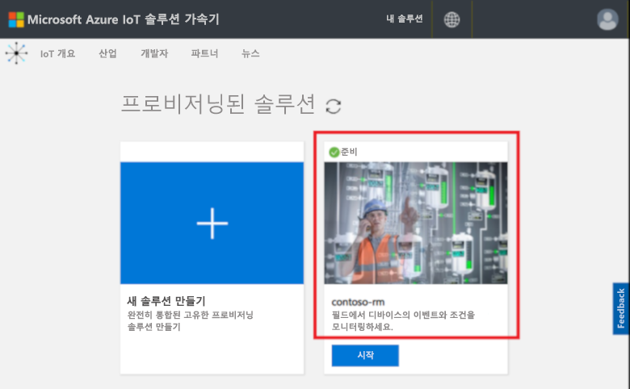

표시되는 패널에서 원격 모니터링 솔루션 가속기에 대한 정보를 볼 수 있습니다. **솔루션 대시보드**를 선택하여 원격 모니터링 솔루션 가속기를 봅니다.

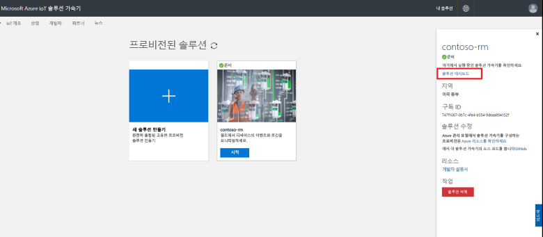

**수락**을 클릭하여 권한 요청을 수락하면 원격 모니터링 솔루션 대시보드가 브라우저에 표시됩니다.

[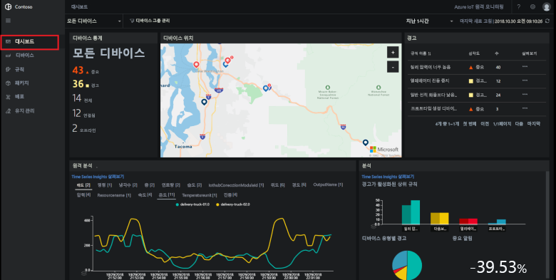](./media/quickstart-remote-monitoring-deploy/solutiondashboard-expanded.png#lightbox)

## 장치 보기

솔루션 대시보드에 Contoso의 시뮬레이션된 장치에 대한 다음 정보가 표시됩니다.

* **장치 통계**에는 경고에 대한 요약 및 총 장치 수가 표시됩니다. 기본 배포에서 Contoso에는 서로 다른 유형의 시뮬레이션된 장치가 10개 있습니다.

* **장치 위치**에는 장치가 물리적으로 있는 위치가 표시됩니다. 장치에서 경고가 발생하면 핀에 색상이 나타납니다.

* **경고**에는 장치에서 발생한 경고에 대한 세부 정보가 표시됩니다.

* **원격 분석**에는 장치의 원격 분석 데이터가 표시됩니다. 맨 위에 있는 원격 측정 유형을 클릭하면 다른 원격 측정 스트림을 볼 수 있습니다.

* **분석**에는 장치에서 발생한 경고를 결합한 정보가 표시됩니다.

## 경고에 응답

Contoso 운영자는 솔루션 대시보드에서 장치를 모니터링 할 수 있습니다. **장치 통계** 패널에는 여러 가지 중요한 경고가 발생한 것이 표시되며 **경고** 패널에는 이들 대부분이 냉각 장치에서 발생한 것으로 표시됩니다. Contoso의 냉각 장치에서 내부 압력이 250 PSI를 초과하면 장치가 올바르게 작동하지 않는 것을 나타냅니다.

### 문제 식별

**대시보드** 페이지의 **경고** 패널에서 **냉각기 압력 너무 높음** 경고를 볼 수 있습니다. 맵에서 냉각기에 빨간 핀이 나타납니다. (맵을 이동하거나 확대해야 할 수 있습니다.)

[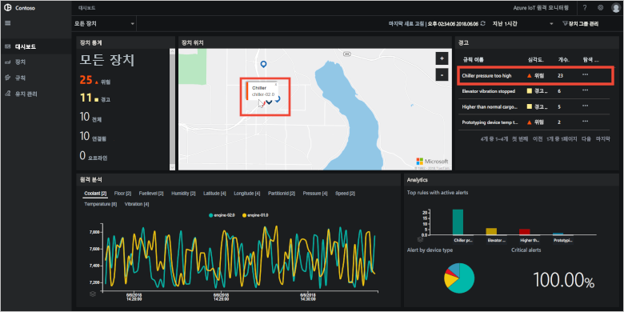](./media/quickstart-remote-monitoring-deploy/dashboardalarm-expanded.png#lightbox)

**Alerts** 패널에서 **Chiller pressure too high**(냉각기 압력이 너무 높음) 규칙 옆에 있는 **탐색** 열에서 **...** 를 클릭합니다. **유지 관리** 페이지가 열리면 경고를 트리거한 규칙의 세부 정보를 볼 수 있습니다.

**Chiller pressure too high**(냉각기 압력이 너무 높음) 유지 관리 페이지에 경고를 트리거한 규칙의 세부 정보가 표시됩니다. 페이지에는 경고가 발생한 시기와 경고를 트리거한 장치도 나열됩니다.

[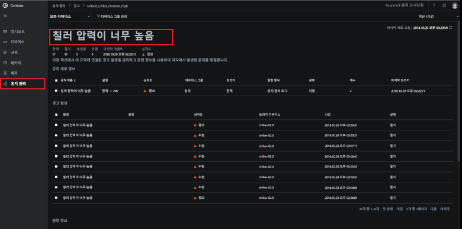](./media/quickstart-remote-monitoring-deploy/maintenancealarmlist-expanded.png#lightbox)

이제 경고를 트리거한 문제 및 관련된 장치를 식별했습니다. 운영자의 다음 단계는 경고를 승인하고 문제를 해결하는 것입니다.

### 문제 해결

다른 운영자에게 현재 경고 관련 작업 중임을 나타내려면 **경고 상태**를 **확인됨**으로 변경합니다.

[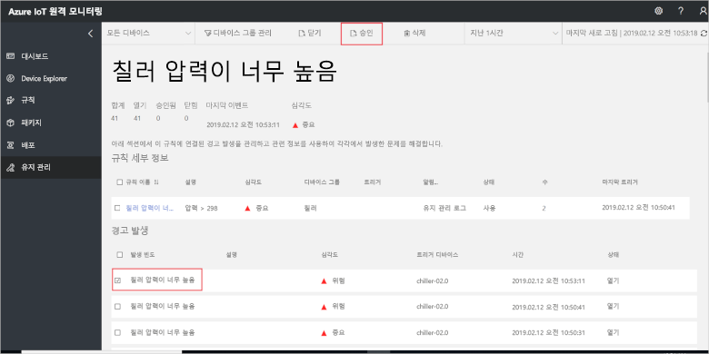](./media/quickstart-remote-monitoring-deploy/maintenanceacknowledge-expanded.png#lightbox)

상태 열의 값이 **확인됨**으로 변경됩니다.

냉각기에 조치를 취하려면 **관련 정보**까지 아래로 스크롤하고 **Alerted devices**(경고를 받은 장치) 목록에서 냉각기 장치를 선택한 다음, **작업**을 선택합니다.

[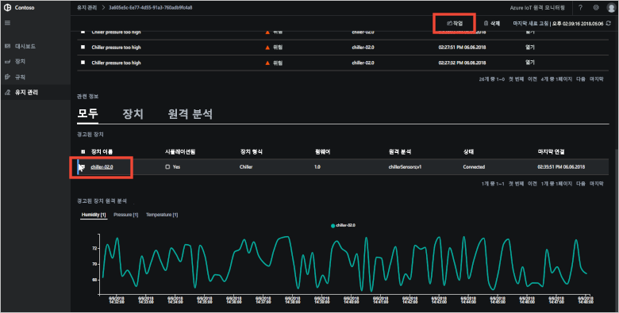](./media/quickstart-remote-monitoring-deploy/maintenanceschedule-expanded.png#lightbox)

**작업** 패널에서 **메서드 실행**, **EmergencyValveRelease** 메서드를 차례로 합니다. 작업 이름**ChillerPressureRelease**을 추가하고 **적용**을 클릭합니다. 이 설정은 즉시 실행하는 작업을 만듭니다.

작업 상태를 확인하려면 **유지 관리** 페이지로 돌아가서 **작업** 보기에서 작업 목록을 봅니다. 몇 초 정도 기다리면 냉각기에 대한 밸브 압력을 해제하기 위해 작업이 실행된 것을 확인할 수 있습니다.

[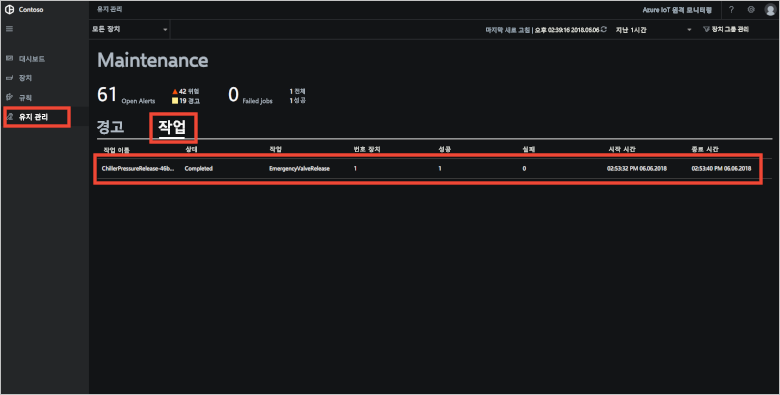](./media/quickstart-remote-monitoring-deploy/maintenancerunningjob-expanded.png#lightbox)

### 압력이 정상으로 돌아왔는지 확인합니다.

냉각기의 압력 원격 분석 데이터를 보려면 **대시보드** 페이지로 이동하여 원격 분석 패널에서 **압력**을 선택하고 **chiller-02.0**의 압력이 정상으로 돌아왔는지 확인합니다.

[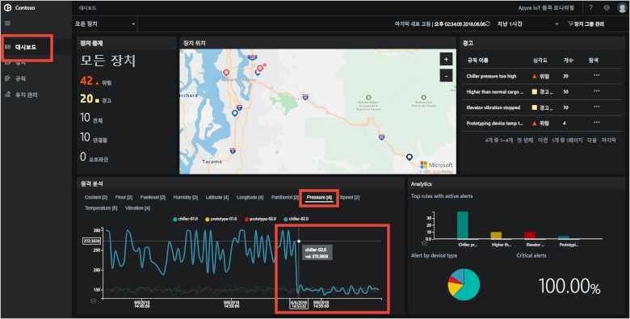](./media/quickstart-remote-monitoring-deploy/pressurenormal-expanded.png#lightbox)

인시던트를 종결하려면 **유지 관리** 페이지로 이동하고, 경고를 선택하고, 상태를 **닫힘**으로 설정합니다.

[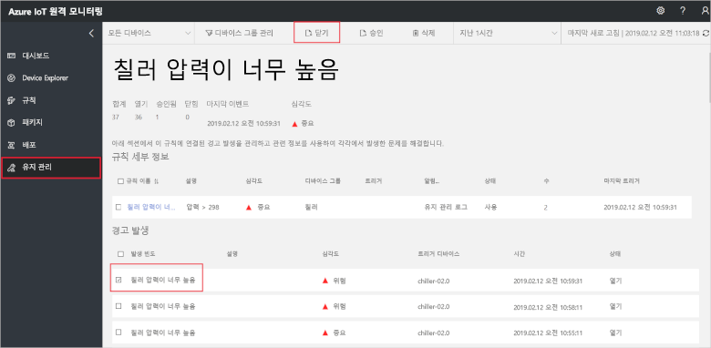](./media/quickstart-remote-monitoring-deploy/maintenanceclose-expanded.png#lightbox)

상태 열의 값이 **닫힘**으로 변경됩니다.

## 리소스 정리

자습서를 계속 진행하려는 경우 배포된 원격 모니터링 솔루션 가속기를 그대로 둡니다.

솔루션 가속기가 더 이상 필요하지 않은 경우 이를 선택한 다음, **솔루션 삭제**를 클릭하여 [프로비전된 솔루션](https://www.azureiotsolutions.com/Accelerators#dashboard) 페이지에서 삭제합니다.

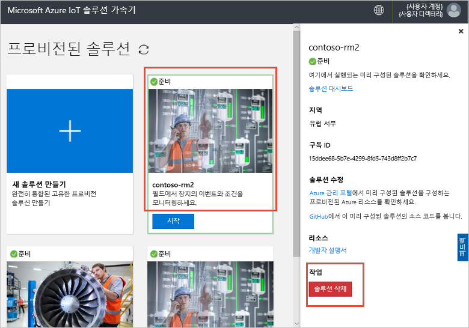

## 다음 단계

이 빠른 시작에서는 원격 모니터링 솔루션 가속기를 배포했고 기본 Contoso 배포에서 시뮬레이션된 장치를 사용하여 모니터링 작업을 완료했습니다.

시뮬레이션된 장치를 사용하는 솔루션 가속기에 대해 자세히 알려면 다음 자습서를 계속 진행하세요.

> [!div class="nextstepaction"]
> [자습서: IoT 장치 모니터링](iot-accelerators-remote-monitoring-monitor.md)