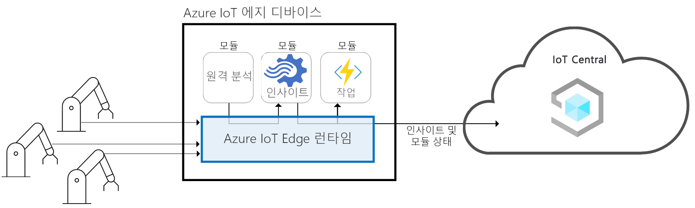
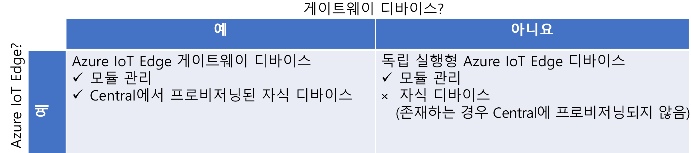
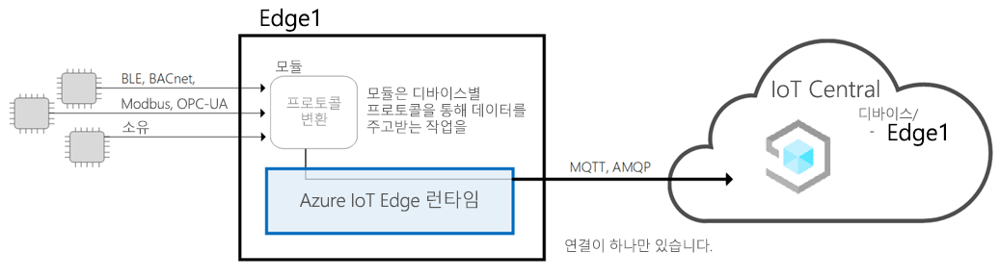
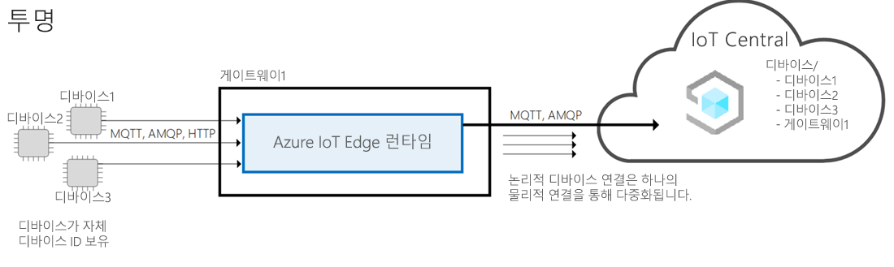
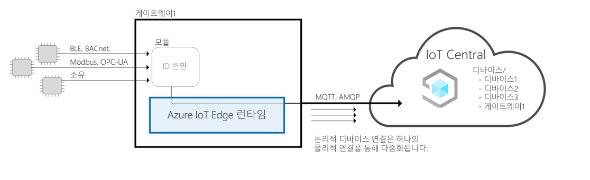
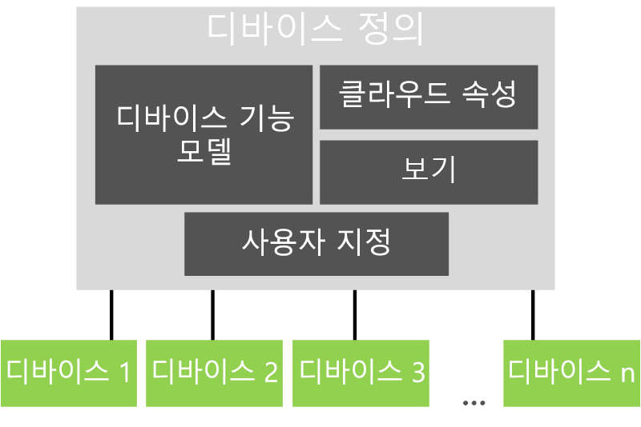

# Azure IoT Central 아키텍처

이 문서에서는 Microsoft Azure IoT Central 아키텍처의 개요를 제공합니다.

## 디바이스

디바이스는 Azure IoT Central 애플리케이션과 데이터를 교환합니다. 디바이스는 다음을 수행할 수 있습니다.

- 원격 분석 데이터 같은 측정값을 보냅니다.
- 애플리케이션과 설정을 동기화합니다.

Azure IoT Central에서, 디바이스가 애플리케이션과 교환할 수 있는 데이터는 디바이스 템플릿에 지정됩니다. 디바이스 템플릿에 대한 자세한 내용은 [메타데이터 관리](#metadata-management)를 참조하세요.

디바이스가 Azure IoT Central 애플리케이션에 연결하는 방법에 대한 자세한 내용은 [디바이스 연결](concepts-get-connected.md)을 참조하세요.

## Azure IoT Edge 디바이스

[Azure IoT SDK](https://github.com/Azure/azure-iot-sdks)를 사용하여 만든 디바이스 뿐만 아니라 [Azure IoT Edge 디바이스](../../iot-edge/about-iot-edge.md)도 IoT Central 애플리케이션에 연결할 수 있습니다. IoT Edge를 사용하면 IoT Central에서 관리하는 IoT 장치에서 클라우드 인텔리전스 및 사용자 지정 논리를 직접 실행할 수 있습니다. IoT Edge 런타임을 사용하면 다음을 수행할 수 있습니다.

- 디바이스에 워크로드를 설치하고 업데이트합니다.
- 장치에서 IoT Edge 보안 표준을 유지 관리합니다.
- IoT Edge 모듈이 항상 실행되도록 합니다.
- 원격 모니터링을 위해 모듈 상태를 클라우드에 보고합니다.
- 다운스트림 리프 디바이스와 IoT Edge 디바이스 간, IoT Edge 디바이스의 모듈 간, IoT Edge 디바이스와 클라우드 간의 통신을 관리합니다.

IoT Central을 사용하면 IoT Edge 장치에 다음과 같은 기능을 사용할 수 있습니다.

- IoT Edge 장치의 기능을 설명하는 장치 템플릿( 예:
  - 장치 플릿에 대한 매니페스트를 관리하는 데 도움이 되는 배포 매니페스트 업로드 기능입니다.
  - IoT Edge 장치에서 실행되는 모듈입니다.
  - 각 모듈이 보내는 원격 분석입니다.
  - 각 모듈이 보고하는 속성입니다.
  - 각 모듈이 응답하는 명령입니다.
  - IoT Edge 게이트웨이 장치 기능 모델과 다운스트림 장치 기능 모델 간의 관계입니다.
  - IoT Edge 장치에 저장되지 않는 클라우드 속성입니다.
  - IoT Central 애플리케이션의 일부인 사용자 지정, 대시보드 및 양식

  자세한 내용은 Azure [IoT Edge 장치를 Azure IoT 중앙 응용 프로그램](./concepts-iot-edge.md) 문서에 연결참조하세요.

- Azure IoT 장치 프로비전 서비스를 사용하여 대규모로 IoT Edge 디바이스프로비저닝 기능
- 규칙 및 작업.
- 사용자 지정 대시보드 및 분석.
- IoT Edge 장치에서 원격 분석을 지속적으로 데이터 로 내보냅니다.

### IoT 에지 장치 유형

IoT Central은 다음과 같이 IoT Edge 장치 유형을 분류합니다.

- 리프 장치. IoT Edge 장치에는 다운스트림 리프 장치가 있을 수 있지만 이러한 장치는 IoT Central에서 프로비전되지 않습니다.
- 다운스트림 장치가 있는 게이트웨이 장치입니다. 게이트웨이 디바이스와 다운스트림 디바이스 둘 다 IoT Central에 프로비저닝됩니다.

### IoT 에지 패턴

IoT Central은 다음과 같은 IoT 에지 장치 패턴을 지원합니다.

#### 리프 장치로서의 IoT 에지

IoT Edge 장치는 IoT Central에 프로비전되며 모든 다운스트림 장치와 원격 분석이 IoT Edge 장치에서 오는 것으로 표시됩니다. IoT Edge 장치에 연결된 다운스트림 장치는 IoT Central에서 프로비전되지 않습니다.

#### ID가 있는 다운스트림 장치에 연결된 IoT Edge 게이트웨이 장치

IoT Edge 장치는 IoT Edge 장치에 연결된 다운스트림 장치와 함께 IoT Central에 프로비전됩니다. 게이트웨이를 통해 다운스트림 장치를 프로비전하기 위한 런타임 지원은 현재 지원되지 않습니다.

#### IoT Edge 게이트웨이에서 제공하는 ID로 다운스트림 장치에 연결된 IoT Edge 게이트웨이 장치

IoT Edge 장치는 IoT Edge 장치에 연결된 다운스트림 장치와 함께 IoT Central에 프로비전됩니다. 다운스트림 장치에 ID를 제공하고 다운스트림 장치의 프로비저닝을 제공하는 게이트웨이의 런타임 지원은 현재 지원되지 않습니다. 고유한 ID 번역 모듈을 가져오는 경우 IoT Central은 이 패턴을 지원할 수 있습니다.

## 클라우드 게이트웨이

Azure IoT Central은 디바이스 연결을 가능하게 하는 클라우드 게이트웨이로 Azure IoT Hub를 사용합니다. IoT Hub의 기능은 다음과 같습니다.

- 클라우드에서 대규모 데이터 수집.
- 디바이스 관리.
- 디바이스 연결 보안.

IoT Hub에 대한 자세한 내용은 [Azure IoT Hub](https://docs.microsoft.com/azure/iot-hub/)를 참조하세요.

Azure IoT Central의 디바이스 연결에 대한 자세한 내용은 [디바이스 연결](concepts-get-connected.md)을 참조하세요.

## 데이터 저장소

Azure IoT Central은 애플리케이션 데이터를 클라우드에 저장합니다. 다음과 같은 애플리케이션 데이터가 저장됩니다.

- 디바이스 템플릿.
- 디바이스 ID.
- 디바이스 메타데이터.
- 사용자 및 역할 데이터.

Azure IoT Central은 디바이스에서 보낸 측정값 데이터에 시계열 저장소를 사용합니다. 분석 서비스에서 사용하는 디바이스의 시계열 데이터.

## 분석

분석 서비스는 애플리케이션에서 표시하는 사용자 지정 보고 데이터를 생성합니다. 운영자는 애플리케이션에 표시되는 [분석을 사용자 지정](howto-create-analytics.md)할 수 있습니다. 분석 서비스는 [Azure Time Series Insights](https://azure.microsoft.com/services/time-series-insights/) 위에 빌드되며, 디바이스에서 보낸 측정값 데이터를 처리합니다.

## 규칙 및 동작

[규칙 및 동작](tutorial-create-telemetry-rules.md)은 서로 긴밀하게 작동하여 애플리케이션 내의 작업을 자동화합니다. 작성자는 정의된 임계값을 초과하는 온도 같은 디바이스 원격 분석 데이터를 기반으로 규칙을 정의할 수 있습니다. Azure IoT Central은 스트림 프로세서를 사용하여 규칙 조건 충족 여부를 확인합니다. 규칙 조건이 충족되면 작성자가 정의한 작업을 트리거합니다. 예를 들어 디바이스 온도가 너무 높다고 엔지니어에게 알리는 이메일을 작업에서 보낼 수 있습니다.

## 메타데이터 관리

Azure IoT Central 애플리케이션에서 디바이스 템플릿은 디바이스 유형의 동작 및 기능을 정의합니다. 예를 들어 냉장고 디바이스 템플릿은 냉장고가 애플리케이션에 보내는 원격 분석 데이터를 지정합니다.

IoT 중앙 응용 프로그램 장치 템플릿에는 다음이 포함됩니다.

- **장치 기능 모델은** 전송하는 원격 분석, 장치 상태를 정의하는 속성 및 장치가 응답하는 명령과 같은 장치의 기능을 지정합니다. 장치 기능은 하나 이상의 인터페이스로 구성됩니다. 장치 기능 모델에 대한 자세한 내용은 [IoT 플러그 앤 플레이(미리 보기) 설명서를](../../iot-pnp/overview-iot-plug-and-play.md) 참조하십시오.
- **클라우드 속성은** 장치에 대해 IoT Central이 저장하는 속성을 지정합니다. 이러한 속성은 IoT Central에만 저장되며 장치로 전송되지 않습니다.
- **뷰는** 운영자가 장치를 모니터링하고 관리할 수 있도록 빌더가 만드는 대시보드 및 양식을 지정합니다.
- **사용자 지정을** 통해 빌더는 장치 기능 모델의 일부 정의를 재정의하여 IoT Central 응용 프로그램과 보다 관련성이 높아집니다.

각 디바이스 템플릿에 따라 한 애플리케이션에서 시뮬레이션된 디바이스 및 실제 디바이스를 하나 이상 사용할 수 있습니다.

## 데이터 내보내기

Azure IoT Central 응용 프로그램에서 데이터를 사용자 고유의 Azure 이벤트 허브 및 Azure 서비스 버스 인스턴스로 [지속적으로 내보낼](howto-export-data.md) 수 있습니다. Azure Blob 저장소 계정으로 데이터를 주기적으로 내보낼 수도 있습니다. IoT Central은 측정, 장치 및 장치 템플릿을 내보낼 수 있습니다.

## 배치 장치 업데이트

Azure IoT Central 응용 프로그램에서 연결된 장치를 관리하는 [작업을 만들고 실행할](howto-run-a-job.md) 수 있습니다. 이러한 작업을 사용하면 장치 속성 또는 설정에 대한 대량 업데이트를 수행하거나 명령을 실행할 수 있습니다. 예를 들어, 여러 냉장 자동 판매기의 팬 속도를 높이기 위해 작업을 만들 수 있습니다.

## RBAC(역할 기반 액세스 제어)

관리자는 미리 정의된 역할 중 하나를 사용하거나 사용자 지정 역할을 만들어 Azure IoT Central 응용 프로그램에 대한 [액세스 규칙을 정의할 수](howto-manage-users-roles.md) 있습니다. 역할은 사용자가 액세스할 수 있는 응용 프로그램의 영역과 수행할 수 있는 작업을 결정합니다.

## 보안

Azure IoT Central에는 다음과 같은 보안 기능이 있습니다.

- 전송 및 저장 시 데이터가 암호화됩니다.
- Azure Active Directory 또는 Microsoft 계정을 통해 인증이 제공됩니다. 2단계 인증이 지원됩니다.
- 테넌트가 완전히 격리됩니다.
- 디바이스 수준 보안을 제공합니다.

## UI 셸

UI 셸은 응답성이 우수한 최신 HTML5 브라우저 기반 애플리케이션입니다.
관리자는 사용자 지정 테마를 적용하고 사용자 지정 도움말 리소스를 가리키도록 도움말 링크를 수정하여 응용 프로그램의 UI를 사용자 지정할 수 있습니다. UI 사용자 지정에 대한 자세한 내용은 [Azure IoT 중앙 UI 사용자 지정](howto-customize-ui.md) 문서를 참조하세요.

운영자는 개인화된 응용 프로그램 대시보드를 만들 수 있습니다. 서로 다른 데이터를 표시하고 서로 전환하는 여러 대시보드를 가질 수 있습니다.

## 다음 단계

Azure IoT Central의 아키텍처에 대해 배웠으니 다음 단계는 Azure IoT Central의 [장치 연결에](concepts-get-connected.md) 대해 알아보는 것입니다.
