# Azure IoT Central UI 둘러보기

이 문서에서는 Microsoft Azure IoT Central UI를 소개합니다. UI를 사용하여 Azure IoT Central 솔루션과 연결된 디바이스를 생성, 관리 및 사용할 수 있습니다.

_솔루션 개발자_는 Azure IoT Central UI를 사용하여 Azure IoT Central 솔루션을 정의할 수 있습니다. UI를 사용하여 다음을 수행할 수 있습니다.

* 솔루션에 연결하는 디바이스의 유형을 정의합니다.
* 디바이스에 대한 규칙 및 작업을 구성합니다. 
* 솔루션을 사용하는 _운영자_에 맞게 UI를 사용자 지정합니다.

_운영자_는 Azure IoT Central UI를 사용하여 Azure IoT Central 솔루션을 관리합니다. UI를 사용하여 다음을 수행할 수 있습니다.

* 디바이스를 모니터링합니다.
* 디바이스를 구성합니다.
* 디바이스 문제를 해결하고 수정합니다.
* 새 디바이스를 프로비전합니다.

## IoT Central 홈페이지

[IoT Central 홈페이지](https://aka.ms/iotcentral-get-started) 페이지에서는 IoT Central에서 사용할 수 있는 최신 뉴스 및 기능에 대해 자세히 알아보고, 새 애플리케이션을 만들고, 기존 애플리케이션을 살펴보고 시작할 수 있습니다.

> [!div class="mx-imgBorder"]
> 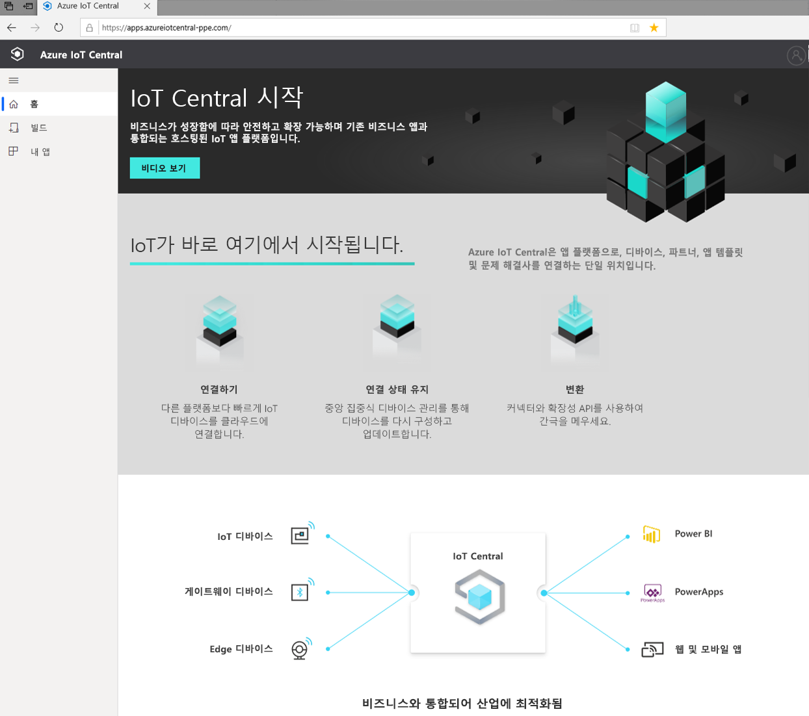

### 애플리케이션 만들기

빌드 섹션에서는 빠르게 시작하는 데 도움이 되는 업계 관련 IoT Central 템플릿 목록을 찾아보거나, 사용자 지정 앱 템플릿을 사용하여 처음부터 시작할 수 있습니다.  
> [!div class="mx-imgBorder"]
> 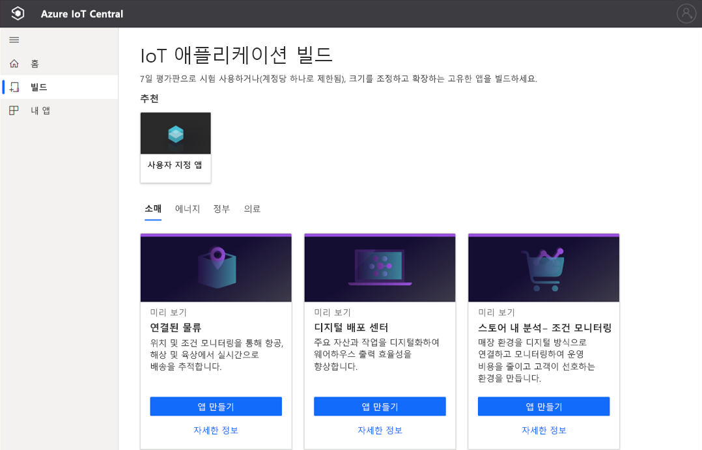

자세한 내용은 [Azure IoT Central 애플리케이션 만들기](quick-deploy-iot-central.md) 빠른 시작을 참조하세요.

### 애플리케이션 시작

앱을 만드는 동안 사용자 또는 솔루션 개발자가 선택하는 URL로 이동하여 IoT Central 애플리케이션을 시작할 수 있습니다. [IoT Central 앱 관리자](https://aka.ms/iotcentral-apps)에서 액세스 권한이 있는 모든 애플리케이션 목록을 볼 수도 있습니다.

> [!div class="mx-imgBorder"]
> 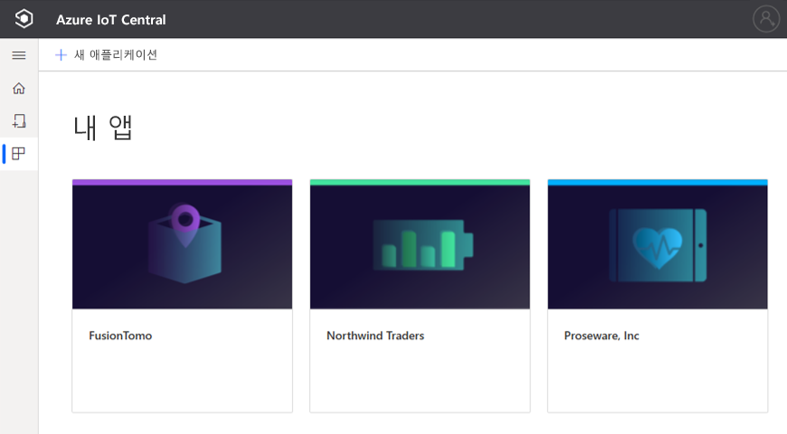

## 애플리케이션 탐색

IoT 애플리케이션 내부로 이동한 후에는 왼쪽 창을 사용하여 다른 영역에 액세스합니다. 창 위에 있는 세 개의 선 아이콘을 선택하여 왼쪽 창을 확장하거나 축소할 수 있습니다.

> [!NOTE]
> 왼쪽 창에 표시되는 항목은 사용자 역할에 따라 다릅니다. [사용자 및 역할 관리](howto-manage-users-roles.md)에 대해 자세히 알아보세요. 

:::row:::
  :::column span="":::
      > [!div class="mx-imgBorder"]
      > 
  :::column-end:::
  :::column span="2":::
     **대시보드**에는 애플리케이션 대시보드가 표시됩니다. *솔루션 개발자*는 운영자에게 맞게 글로벌 대시보드를 사용자 지정할 수 있습니다. 운영자는 자신의 사용자 역할에 따라 개인 대시보드를 만들 수도 있습니다.
     
     **디바이스**에서는 연결된 디바이스(실제 및 시뮬레이트된)를 관리할 수 있습니다.

     **디바이스 그룹**에서는 쿼리에 지정된 논리적 디바이스 컬렉션을 살펴보고 만들 수 있습니다. 이 쿼리를 저장하고 애플리케이션을 통해 디바이스 그룹을 사용하여 대량 작업을 수행할 수 있습니다.

     **규칙**에서는 디바이스를 모니터링하는 규칙을 만들고 편집할 수 있습니다. 규칙은 디바이스 원격 분석을 기준으로 평가되며, 사용자 지정 가능한 작업을 트리거합니다.

     **분석**에서는 디바이스 데이터를 기반으로 사용자 지정 보기를 만들어 애플리케이션에서 인사이트를 끌어낼 수 있습니다.

     **작업**에서는 대량 작업을 실행하여 디바이스를 대규모로 관리할 수 있습니다.

     **디바이스 템플릿**에서는 애플리케이션에 연결하는 디바이스의 특성을 만들고 관리합니다.

     **데이터 내보내기**에서는 스토리지, 큐 등의 외부 서비스로 연속 내보내기를 구성할 수 있습니다.

     **관리**에서는 애플리케이션의 설정, 사용자 지정, 청구, 사용자 및 역할을 관리할 수 있습니다.

     *관리자*는 **IoT Central**을 통해 IoT Central의 앱 관리자로 돌아갈 수 있습니다.
     
   :::column-end:::
:::row-end:::

### 검색, 도움말, 테마 및 지원

모든 페이지에 상단 메뉴가 나타납니다.

> [!div class="mx-imgBorder"]
> 

* 디바이스 템플릿 및 디바이스를 검색하려면 **검색** 값을 입력합니다.
* UI 언어 또는 테마를 변경하려면 **설정** 아이콘을 선택합니다. [애플리케이션 기본 설정 관리](howto-manage-preferences.md)에 대한 자세한 정보
* 애플리케이션에서 로그아웃하려면 **계정** 아이콘을 선택합니다.
* 도움말을 보거나 지원을 받으려면 리소스 목록에 대한 **도움말** 드롭다운을 선택합니다. **앱 정보** 링크에서 [애플리케이션에 대한 정보를 가져올](./howto-get-app-info.md) 수 있습니다. 무료 가격 책정 요금제에 대한 애플리케이션에서 지원 리소스에는 [라이브 채팅](howto-show-hide-chat.md)에 대한 액세스가 포함됩니다.

UI의 밝은 테마 또는 어두운 테마 중에서 선택할 수 있습니다.

> [!NOTE]
> 관리자가 애플리케이션에 대해 사용자 지정 테마를 구성하면 밝은 테마와 어두운 테마 중에서 선택할 수 있는 옵션을 사용할 수 없습니다.

> [!div class="mx-imgBorder"]
> 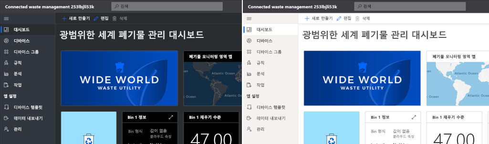

### 대시보드
> [!div class="mx-imgBorder"]
> 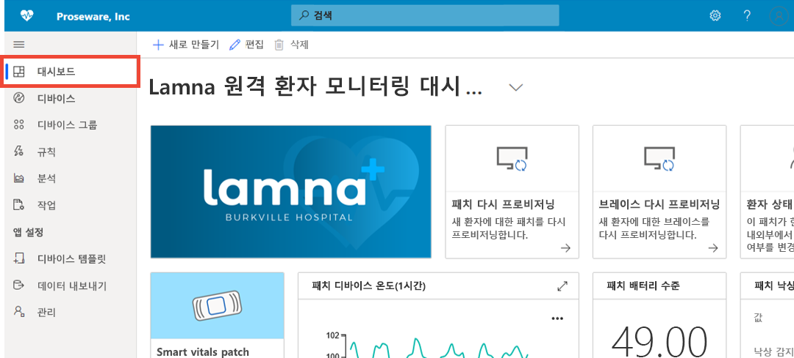

* 대시보드는 Azure IoT Central 애플리케이션에 로그인할 때 표시되는 첫 번째 페이지입니다. *솔루션 개발자*는 다른 사용자를 위해 여러 글로벌 애플리케이션 대시보드를 만들고 사용자 지정할 수 있습니다. [대시보드에 타일 추가](howto-add-tiles-to-your-dashboard.md)에 대한 자세한 정보

* *운영자*는 자신의 사용자 역할에서 허용하는 경우 개인 대시보드를 만들어 관심 있는 항목을 모니터링할 수 있습니다. 자세한 내용은 [Azure IoT Central 개인 대시보드 만들기](howto-create-personal-dashboards.md) 방법 문서를 참조하세요.

### 디바이스

> [!div class="mx-imgBorder"]
> 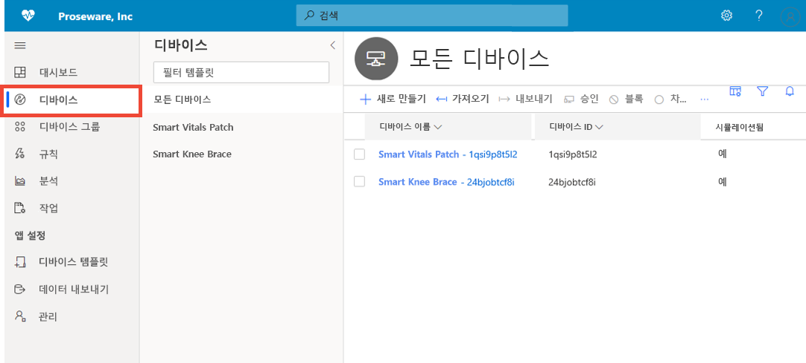

Explorer 페이지는 Azure IoT Central 애플리케이션의 _디바이스_를 _디바이스 템플릿_별로 보여줍니다. 

* 디바이스 템플릿은 애플리케이션에 연결할 수 있는 디바이스의 유형을 정의합니다.
* 디바이스는 애플리케이션의 실제 또는 시뮬레이션된 디바이스를 나타냅니다.

자세한 내용은 [디바이스 모니터링](./quick-monitor-devices.md) 빠른 시작을 참조하세요. 

### 디바이스 그룹

> [!div class="mx-imgBorder"]
> 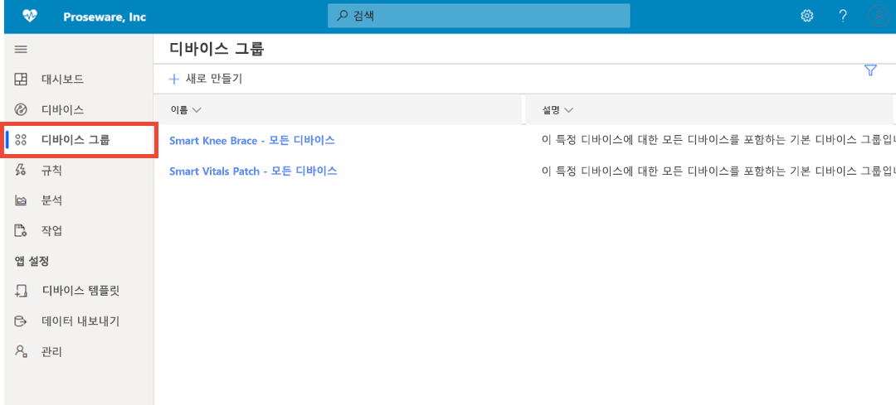

디바이스 그룹은 관련 디바이스의 컬렉션입니다. *솔루션 개발자*는 디바이스 그룹에 포함된 디바이스를 식별하는 쿼리를 정의합니다. 디바이스 그룹을 사용하여 애플리케이션에서 대량 작업을 수행합니다. 자세한 내용은 [Azure IoT Central 애플리케이션에서 디바이스 그룹 사용](tutorial-use-device-groups.md) 문서를 참조하세요.

### 규칙
> [!div class="mx-imgBorder"]
> 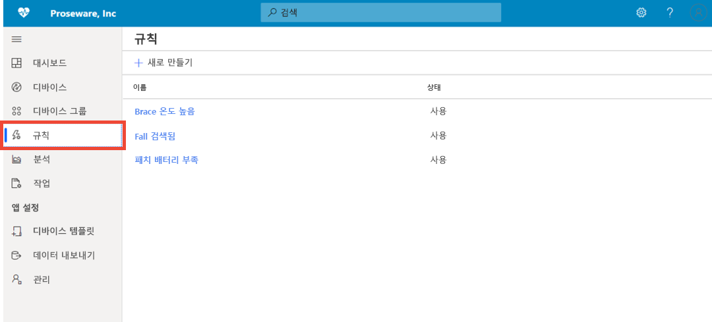

규칙 페이지에서는 디바이스의 원격 분석, 상태 또는 이벤트를 기반으로 규칙을 정의할 수 있습니다. 규칙이 실행되면 규칙은 이메일 보내기, webhook 경고를 통해 외부 시스템에 알리기 등의 작업을 하나 이상 트리거할 수 있습니다. 자세한 내용은 [규칙 구성](tutorial-create-telemetry-rules.md) 자습서를 참조하세요. 

### 분석

> [!div class="mx-imgBorder"]
> 

분석 페이지에서는 디바이스 데이터를 기반으로 사용자 지정 보기를 만들어 애플리케이션에서 인사이트를 끌어낼 수 있습니다. 자세한 내용은 [Azure IoT Central 애플리케이션을 위한 분석 만들기](howto-create-analytics.md) 문서를 참조하세요.

### 작업

> [!div class="mx-imgBorder"]
> 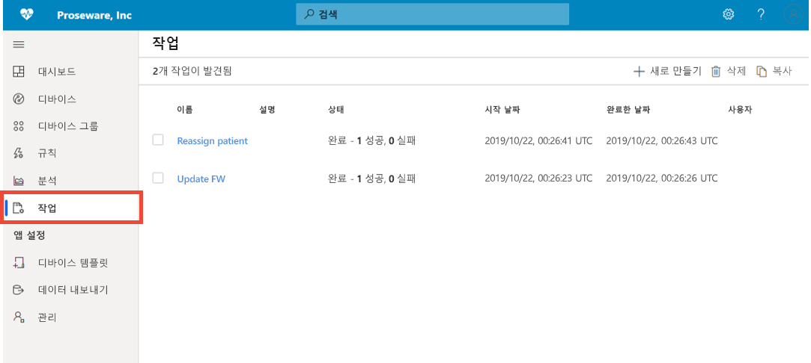

작업 페이지에서는 디바이스에 대한 대량 디바이스 관리 작업을 실행할 수 있습니다. 디바이스 속성 및 설정을 업데이트하고 디바이스 그룹에 대해 명령을 실행할 수 있습니다. 자세한 내용은 [작업 실행](howto-run-a-job.md) 문서를 참조하세요.

### 디바이스 템플릿

> [!div class="mx-imgBorder"]
> 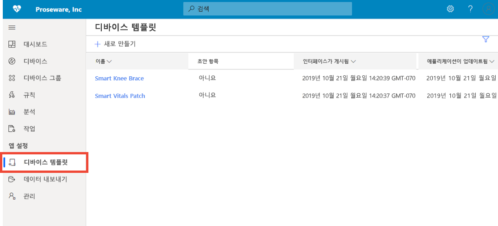

디바이스 템플릿 페이지는 작성자가 애플리케이션에서 디바이스 템플릿을 만들고 관리하는 페이지입니다. 디바이스 템플릿은 다음과 같은 디바이스 특성을 지정합니다.

* 원격 분석, 상태 및 이벤트 측정값
* 속성
* 명령
* 보기

*솔루션 개발자*는 운영자가 디바이스 관리에 사용할 수 있는 양식과 대시보드도 만들 수 있습니다.

자세한 내용은 [Azure IoT Central 애플리케이션에서 새 디바이스 유형 정의](howto-set-up-template.md) 자습서를 참조하세요. 

### 데이터 내보내기
> [!div class="mx-imgBorder"]
> 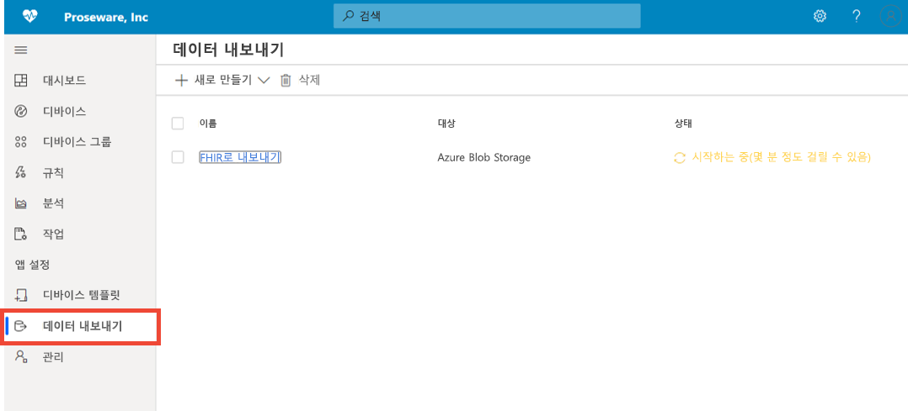

데이터 내보내기 페이지에서는 애플리케이션에서 외부 시스템으로의 데이터 스트림(예: 원격 분석)을 설정할 수 있습니다. 자세한 내용은 [Azure IoT Central에서 데이터 내보내기](./howto-export-data.md) 문서를 참조하세요.

### 관리
> [!div class="mx-imgBorder"]
> 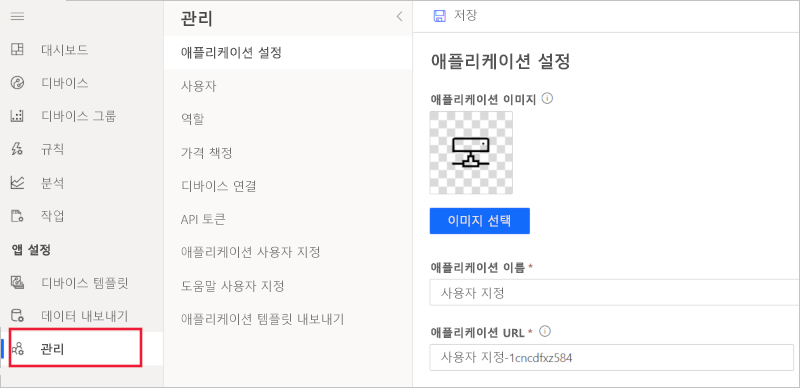

관리 페이지에서는 IoT Central 애플리케이션을 구성하고 사용자 지정할 수 있습니다. 여기서 애플리케이션 이름, URL, 테마를 변경하고, 사용자 및 역할을 관리하고, API 토큰을 만들고, 애플리케이션을 내보낼 수 있습니다. 자세한 내용은 [Azure IoT Central 애플리케이션 관리](howto-administer.md) 문서를 참조하세요.

## 다음 단계

이제 Azure IoT Central의 개요를 알고 UI 레이아웃에 익숙해졌으므로, 권장되는 다음 단계는 [Azure IoT Central 애플리케이션 만들기](quick-deploy-iot-central.md) 빠른 시작을 완료하는 것입니다.
