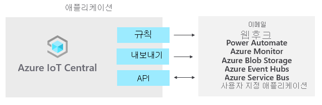

# Azure IoT Central이란?

IoT Central은 엔터프라이즈급 IoT 솔루션의 개발, 관리 및 유지 관리 부담과 비용을 줄이는 IoT 애플리케이션 플랫폼입니다. IoT Central을 사용하여 빌드하기로 선택하면 복잡하고 지속적으로 진화하는 IoT 인프라를 단순히 유지 관리하는 데서 그치지 않고 IoT 데이터를 활용하여 비즈니스를 전환하는 데 시간, 비용 및 에너지를 집중할 수 있습니다.

웹 UI를 통해 디바이스 상태를 모니터링하고, 규칙을 만들고, 전체 수명 주기 동안 수백만 대의 디바이스와 해당 데이터를 관리할 수 있습니다. 뿐만 아니라 IoT 인텔리전스를 LOB(기간 업무) 애플리케이션으로 확장하여 디바이스 인사이트를 기반으로 조치를 취할 수 있습니다.

이 문서에서는 IoT Central에 대해 개략적으로 설명합니다.

- 프로젝트와 관련된 일반적인 가상 사용자.
- 애플리케이션을 만드는 방법.
- 디바이스를 애플리케이션에 연결하는 방법
- 애플리케이션을 관리하는 방법.
- IoT Central의 Azure IoT Edge 기능.
- Azure IoT Edge 런타임 기반 디바이스를 애플리케이션에 연결하는 방법을 설명합니다.

## 알려진 문제

- 연속 데이터 내보내기는 Avro 형식을 지원하지 않습니다(비호환).
- GeoJSON은 현재 지원되지 않습니다.
- 지도 타일은 현재 지원되지 않습니다.
- 작업은 복합 형식을 지원하지 않습니다.
- 배열 스키마 형식은 지원되지 않습니다.
- C 디바이스 SDK와 Node.js 디바이스 및 서비스 SDK만 지원됩니다.
- IoT Central은 현재 미국, 유럽, 아시아 태평양, 오스트레일리아, 영국 및 일본 위치에서 사용할 수 있습니다.
- 영국 및 일본 위치에서는 **사용자 지정 애플리케이션(레거시)** 애플리케이션 템플릿을 사용할 수 없습니다.
- 디바이스 기능 모델의 모든 인터페이스가 동일한 파일에 인라인으로 정의되어 있어야 합니다.
- [IoT 플러그 앤 플레이](../../iot-pnp/overview-iot-plug-and-play.md)에 대한 지원은 미리 보기에 있으며 선택한 지역에서만 지원됩니다.

## 가상 사용자

IoT Central 설명서는 IoT Central 애플리케이션과 상호 작용하는 다음 4명의 일반적인 가상 사용자와 관련이 있습니다.

- _솔루션 개발자_는 애플리케이션에 연결하는 디바이스 유형을 정의하고 운영자에 맞게 애플리케이션을 사용자 지정하는 역할을 담당합니다.
- _운영자_는 애플리케이션에 연결된 디바이스를 관리합니다.
- _관리자_는 애플리케이션 내 [사용자 및 권한](howto-administer.md) 관리와 같은 관리 작업을 담당합니다.
- _디바이스 개발자_는 애플리케이션에 연결된 디바이스 또는 IoT Edge 모듈에서 실행되는 코드를 만듭니다.

## IoT Central 애플리케이션 만들기

솔루션 개발자는 IoT Central을 사용하여 조직을 위한 사용자 지정 클라우드 호스팅 IoT 솔루션을 만들 수 있습니다. 사용자 지정 IoT 솔루션은 일반적으로 다음과 같이 구성됩니다.

- 디바이스에서 원격 분석을 수신하고 해당 디바이스를 관리할 수 있게 해주는 클라우드 기반 애플리케이션.
- 클라우드 기반 애플리케이션에 연결된 사용자 지정 코드를 실행하는 여러 디바이스.

새로운 IoT Central 애플리케이션을 빠르게 배포한 다음, 브라우저에서 특정 요구 사항에 맞게 사용자 지정할 수 있습니다. 일반 _애플리케이션 템플릿_, 또는 산업에 초점을 둔 [소매](../retail/overview-iot-central-retail.md), [에너지](../energy/overview-iot-central-energy.md), [정부](../government/overview-iot-central-government.md) 또는 [의료](../healthcare/overview-iot-central-healthcare.md)용 애플리케이션 템플릿 중 하나를 시작할 수 있습니다.

솔루션 개발자는 웹 기반 도구를 사용하여 애플리케이션에 연결하는 디바이스를 위한 _디바이스 템플릿_을 만들 수 있습니다. 디바이스 템플릿은 다음과 같은 디바이스 유형의 특성과 동작을 정의하는 청사진입니다.

- 전송하는 원격 분석.
- 운영자가 수정할 수 있는 비즈니스 속성.
- 디바이스에서 설정하고 애플리케이션에서 읽기 전용인 디바이스 속성.
- 운영자가 설정하는 속성으로, 디바이스의 동작을 결정합니다.

이 디바이스 템플릿에는 다음 항목이 포함되어 있습니다.

- 디바이스에서 보내는 원격 분석 데이터 및 디바이스에서 보고하는 속성처럼 디바이스에서 구현해야 하는 기능을 설명하는 _디바이스 기능 모델_
- 디바이스에 저장되지 않는 클라우드 속성
- IoT Central 애플리케이션의 일부인 사용자 지정, 대시보드 및 양식

### 가격 책정

7일 무료 평가판을 사용하여 IoT Central 애플리케이션을 만들어도 되고, 표준 가격 책정 플랜을 사용해도 됩니다.

- *무료* 플랜을 사용하여 만든 애플리케이션은 7일 동안 무료로 제공되며 최대 5대의 디바이스를 지원합니다. 만료되기 전에 언제든지 표준 가격 책정 플랜을 사용하도록 변환할 수 있습니다.
- *표준* 플랜을 사용하여 만든 애플리케이션은 디바이스별로 청구되며, 처음 두 디바이스가 무료로 사용 가능한 상태에서 **표준 1** 또는 **표준 2** 가격 책정 플랜을 선택할 수 있습니다. [Azure IoT Central 가격 책정 페이지](https://azure.microsoft.com/pricing/details/iot-central/)에서 무료 및 표준 가격 책정 플랜에 대해 자세히 알아보세요.

### 디바이스 템플릿 만들기

[IoT 플러그 앤 플레이(미리 보기)](../../iot-pnp/overview-iot-plug-and-play.md)를 사용하면 포함된 디바이스 코드를 작성하지 않고도 IoT Central에서 디바이스를 통합할 수 있습니다. IoT 플러그 앤 플레이(미리 보기)의 핵심은 디바이스 기능을 설명하는 디바이스 기능 모델 스키마입니다. IoT Central 애플리케이션에서 디바이스 템플릿은 이러한 IoT 플러그 앤 플레이(미리 보기) 디바이스 기능 모델을 사용합니다.

솔루션 개발자는 다음과 같은 여러 가지 옵션을 통해 디바이스 템플릿을 만들 수 있습니다.

- [IoT용 Azure Certified 디바이스 카탈로그](https://aka.ms/iotdevcat)에서 디바이스 기능 모델을 가져온 다음, IoT Central 애플리케이션에 필요한 클라우드 속성, 사용자 지정 및 대시보드를 추가합니다.
- IoT Central에서 디바이스 템플릿을 디자인한 다음, 디바이스 코드에서 디바이스 기능 모델을 구현합니다.
- Visual Studio Code를 사용하여 디바이스 기능 모델을 만들고 모델을 리포지토리에 게시합니다. 모델에서 디바이스 코드를 구현하고, 디바이스를 IoT Central 애플리케이션에 연결합니다. IoT Central은 자동으로 리포지토리에서 디바이스 기능 모델을 찾아서 간단한 디바이스 템플릿을 만듭니다.
- Visual Studio Code를 사용하여 디바이스 기능 모델을 만듭니다. 모델에서 디바이스 코드를 구현합니다. 수동으로 디바이스 기능 모델을 IoT Central 애플리케이션으로 가져온 다음, IoT Central 애플리케이션에 필요한 클라우드 속성, 사용자 지정 및 대시보드를 추가합니다.

솔루션 개발자는 IoT Central을 사용하여 디바이스 템플릿의 유효성을 검사하는 테스트 디바이스용 코드를 생성할 수 있습니다.

### UI 사용자 지정

또한 솔루션 개발자는 애플리케이션의 일상적인 사용을 담당하는 운영자를 위해 IoT Central 애플리케이션 UI를 사용자 지정할 수 있습니다. 솔루션 개발자가 수행할 수 있는 사용자 지정은 다음과 같습니다.

- 디바이스 템플릿의 속성 및 설정 레이아웃 정의.
- 운영자가 인사이트를 발견하고 문제를 더 빨리 해결할 수 있도록 사용자 지정 대시보드 구성.
- 연결된 디바이스에서 시계열 데이터를 탐색하는 사용자 지정 분석 구성.

## 가격 책정

7일 무료 평가판을 사용하여 IoT Central 애플리케이션을 만들어도 되고, 표준 가격 책정 플랜을 사용해도 됩니다.

- *무료* 플랜을 사용하여 만든 애플리케이션은 7일 동안 무료로 제공되며 최대 5대의 디바이스를 지원합니다. 만료되기 전에 언제든지 표준 가격 책정 플랜을 사용하도록 변환할 수 있습니다.
- *표준* 플랜을 사용하여 만든 애플리케이션은 디바이스별로 청구되며, 처음 두 디바이스가 무료로 사용 가능한 상태에서 **표준 1** 또는 **표준 2** 가격 책정 플랜을 선택할 수 있습니다. [IoT Central 가격 책정](https://aka.ms/iotcentral-pricing)에 대해 자세히 알아보세요.

## 사용자 디바이스 연결

Azure IoT Central은 모든 디바이스 등록 및 연결에 [Azure IoT Hub DPS(Device Provisioning Service)](../../iot-dps/about-iot-dps.md)를 사용합니다.

DPS를 사용하면 다음과 같은 장점이 있습니다.

- IoT Central이 디바이스를 대규모로 온보딩하고 연결하는 것을 지원합니다.
- IoT Central UI를 통해 디바이스를 등록할 필요 없이 오프라인으로 디바이스 자격 증명을 생성하고 디바이스를 구성할 수 있습니다.
- 디바이스에서 공유 액세스 서명을 사용하여 연결할 수 있습니다.
- 디바이스에서 업계 표준 X.509 인증서를 사용하여 연결할 수 있습니다.
- 사용자의 고유한 디바이스 ID를 사용하여 IoT Central에서 디바이스를 등록할 수 있습니다. 사용자의 고유한 디바이스 ID를 사용하면 기존 백 오피스 시스템과 간편하게 통합할 수 있습니다.
- 디바이스를 IoT Central에 연결하는 한 가지 일관적인 방법이 있습니다.

자세한 내용은 [Azure IoT Central에 연결](./concepts-get-connected.md)을 참조하세요.

### Azure IoT Edge 디바이스

[Azure IoT SDK](https://github.com/Azure/azure-iot-sdks)를 사용하여 만든 디바이스 뿐만 아니라 [Azure IoT Edge 디바이스](../../iot-edge/about-iot-edge.md)도 IoT Central 애플리케이션에 연결할 수 있습니다. Azure IoT Edge에서는 IoT Central에서 관리하는 IoT 디바이스에서 직접 클라우드 인텔리전스 및 사용자 지정 논리를 실행할 수 있습니다. IoT Edge 런타임을 사용하면 다음을 수행할 수 있습니다.

- 디바이스에 워크로드를 설치하고 업데이트합니다.
- 디바이스에서 Azure IoT Edge 보안 표준을 유지합니다.
- IoT Edge 모듈이 항상 실행되도록 합니다.
- 원격 모니터링을 위해 모듈 상태를 클라우드에 보고합니다.
- 다운스트림 리프 디바이스와 IoT Edge 디바이스 간, IoT Edge 디바이스의 모듈 간, IoT Edge 디바이스와 클라우드 간의 통신을 관리합니다.

자세한 내용은 [Azure IoT Edge 디바이스 및 IoT Central](concepts-architecture.md#azure-iot-edge-devices)을 참조하세요.

## 연결 유지

IoT Central 애플리케이션은 Microsoft에서 완벽하게 호스트하므로 애플리케이션 관리 부담이 줄어듭니다.

운영자는 IoT Central 애플리케이션을 사용하여 IoT Central 솔루션의 디바이스를 관리합니다. 운영자는 다음과 같은 작업을 수행합니다.

- 애플리케이션에 연결된 디바이스 모니터링.
- 디바이스 관련 문제 해결 및 수정.
- 새 디바이스 프로비저닝.

솔루션 개발자는 연결된 디바이스의 스트리밍 데이터에 적용되는 사용자 지정 규칙 및 작업을 정의할 수 있습니다. 운영자는 디바이스 수준에서 이러한 규칙을 사용하거나 사용하지 않도록 설정하여 애플리케이션 내에서 작업을 제어하고 자동화할 수 있습니다.

관리자는 [사용자 역할 및 권한](howto-administer.md)을 사용하여 애플리케이션에 대한 액세스를 관리할 수 있습니다.

대규모로 작동하도록 설계된 IoT 솔루션을 사용하는 경우 디바이스 관리에 대한 체계적인 접근 방식이 중요합니다. 디바이스를 클라우드에 연결하는 것만으로는 충분 하지 않고, 디바이스를 계속 연결된 정상 상태로 유지해야 합니다. 운영자는 다음과 같은 IoT Central 기능을 사용하여 애플리케이션의 전체 수명 주기 동안 디바이스를 관리할 수 있습니다.

### 대시보드 

기본 제공 [대시보드](./howto-set-up-template.md#generate-default-views)는 디바이스 상태 및 원격 분석을 모니터링하는 사용자 지정 가능한 UI를 제공합니다. [애플리케이션 템플릿](howto-use-app-templates.md)의 미리 작성된 대시보드로 시작하거나, 운영자의 요구 사항에 맞는 맞춤형 대시보드를 만들어 보세요. 애플리케이션의 모든 사용자와 대시보드를 공유할 수도 있고, 대시보드를 비공개로 유지할 수도 있습니다.

### 규칙 및 동작 

디바이스 상태 및 원격 분석을 기반으로 [사용자 지정 규칙](tutorial-create-telemetry-rules.md)을 만들어 주의가 필요한 디바이스를 식별합니다. 적절한 사람에게 사실을 알리고 적시에 수정 조치를 수행하도록 작업을 구성합니다.

### 작업 

[작업](howto-run-a-job.md)을 사용하면 속성을 설정하거나 명령을 호출하여 디바이스에 단일 또는 대량 업데이트를 적용할 수 있습니다. 

### 사용자 역할 및 권한

관리자는 [역할 및 권한](howto-manage-users-roles.md)을 사용하여 각 사용자의 경험을 조정할 수 있습니다. 관리자는 웹 UI를 사용하여 역할을 만들고 권한을 할당합니다.

## IoT 데이터 변환

애플리케이션 플랫폼인 IoT Central에서는 IoT 데이터를, 실행 가능한 결과를 도출하는 비즈니스 인사이트로 변환할 수 있습니다. [규칙](./tutorial-create-telemetry-rules.md), [데이터 내보내기](./howto-export-data.md) 및 [공용 REST API](https://docs.microsoft.com/learn/modules/manage-iot-central-apps-with-rest-api/)는 IoT Central을 LOB(기간 업무) 애플리케이션과 통합하는 방법을 보여주는 예입니다.

### 규칙을 사용하여 디바이스 상태 및 작업 모니터링

디바이스가 연결되어 데이터를 보낼 때 규칙을 통해 문제가 있는 디바이스 또는 오류 메시지를 보내는 디바이스를 식별하여 해결하면 가동 중지 시간을 최소화할 수 있습니다. 디바이스의 원격 분석을 모니터링하다가 메트릭이 임계값을 초과하거나 디바이스에서 특정 메시지를 보내면 그 사실을 운영자에게 알리도록 IoT Central 애플리케이션에서 규칙을 작성할 수 있습니다. 규칙에 대한 이메일 작업 및 webhook는 적절한 사람과 적절한 다운스트림 시스템에 알립니다.

### 내보낸 데이터에 대한 사용자 지정 분석 및 처리 실행

디바이스의 원격 분석을 처리하고 그 결과를 저장하는 사용자 지정 분석 파이프라인을 빌드하여 제조 현장의 머신 효율성 추세를 확인하거나 향후 에너지 사용량을 예측하는 등의 비즈니스 인사이트를 생성할 수 있습니다. IoT Central 애플리케이션에서 원격 분석을 내보내는 데이터 내보내기, 디바이스 속성 변경, 원하는 도구를 사용하여 데이터를 분석, 저장 및 시각화할 수 있는 다른 서비스로의 디바이스 템플릿 변경을 구성할 수 있습니다.

### REST API를 사용하여 사용자 지정 IoT 솔루션 빌드 및 통합

다음과 같은 IoT 솔루션을 빌드합니다.

- 디바이스를 원격으로 설정하고 제어할 수 있는 모바일 도우미 앱
- 기존 LOB(기간 업무) 애플리케이션이 IoT 디바이스 및 데이터와 상호 작용할 수 있는 사용자 지정 통합
- 디바이스 모델링, 온보딩, 관리 및 데이터 액세스를 위한 디바이스 관리 애플리케이션

## 할당량

각 Azure 구독에는 IoT 솔루션의 범위에 영향을 줄 수 있는 기본 할당량이 있습니다. 현재 IoT Central은 구독 시 배포할 수 있는 애플리케이션 수를 10개로 제한합니다. 이 제한을 늘려야 하는 경우 [Microsoft 지원](https://azure.microsoft.com/support/options/)에 문의하세요.

## 다음 단계

이제 IoT Central에 대한 개요를 살펴보았으므로 다음 몇가지 제안된 단계는 다음과 같습니다.

- 사용 가능한 [IoT 솔루션을 만들기 위한 Azure 기술 및 서비스](../../iot-fundamentals/iot-services-and-technologies.md)를 이해합니다.
- [Azure IoT Central UI](overview-iot-central-tour.md)를 숙지합니다.
- [Azure IoT Central 애플리케이션을 생성](quick-deploy-iot-central.md)하여 시작합니다.
- [IoT 플러그 앤 플레이(미리 보기)](../../iot-pnp/overview-iot-plug-and-play.md)에 대해 자세히 알아봅니다.
- [Azure IoT Edge 디바이스 연결](./tutorial-add-edge-as-leaf-device.md) 방법에 대해 자세히 알아봅니다.
- [Azure IoT 기술 및 서비스](../../iot-fundamentals/iot-services-and-technologies.md)에 대해 자세히 알아봅니다.

디바이스 개발자이고 몇 가지 코드에 대해 자세히 알아보려면 다음 단계를 [클라이언트 애플리케이션을 만들고 Azure IoT Central 애플리케이션에 연결](./tutorial-connect-device-nodejs.md)하는 것이 좋습니다.
