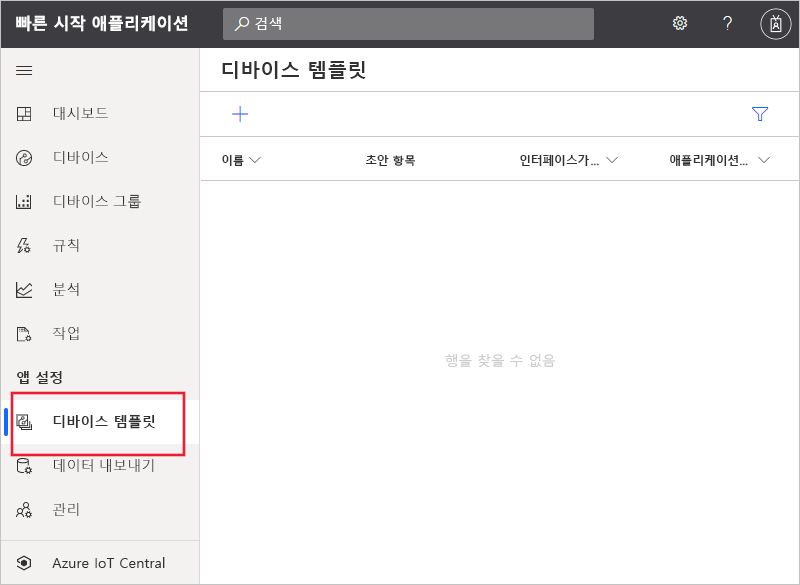
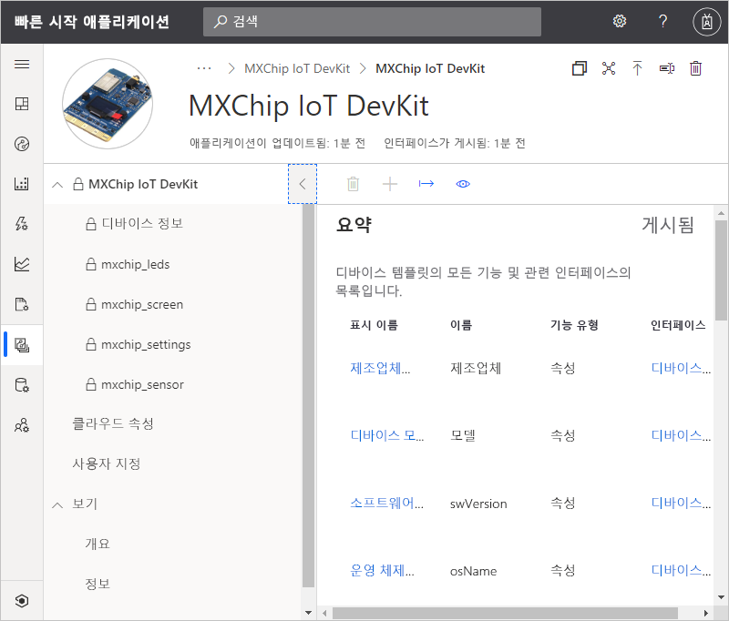
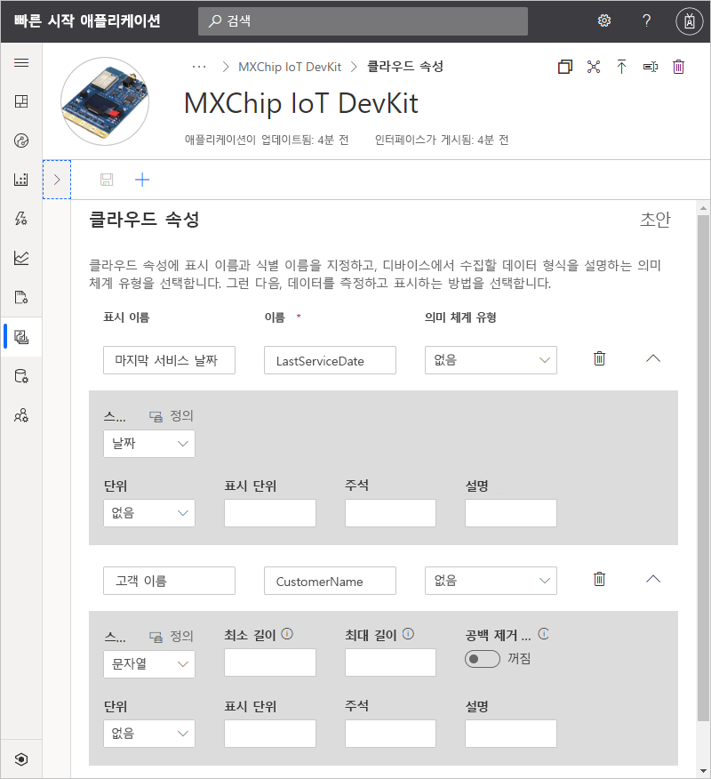
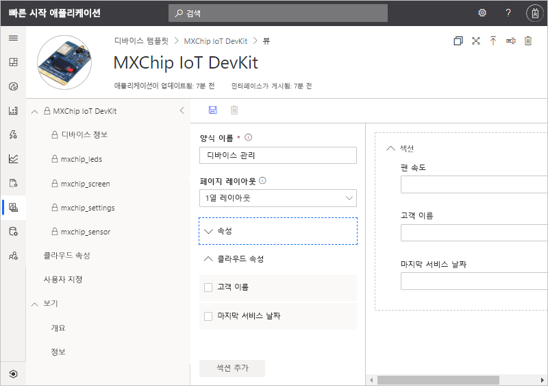
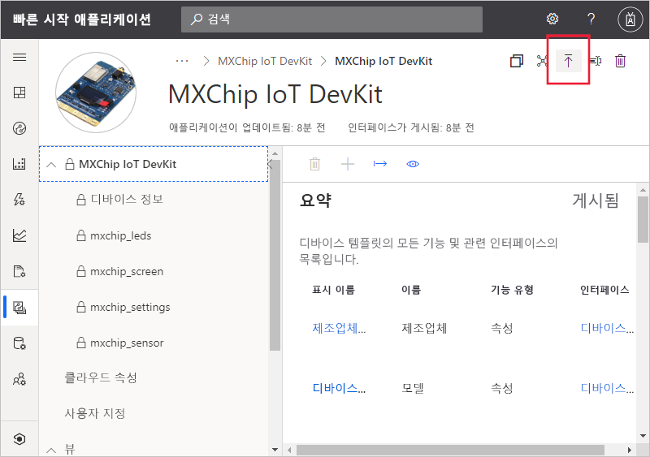
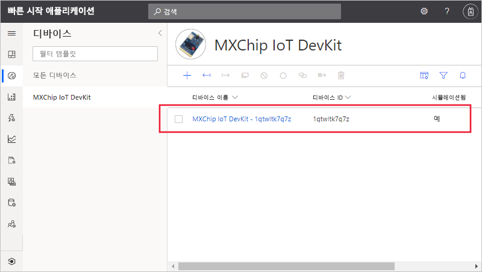
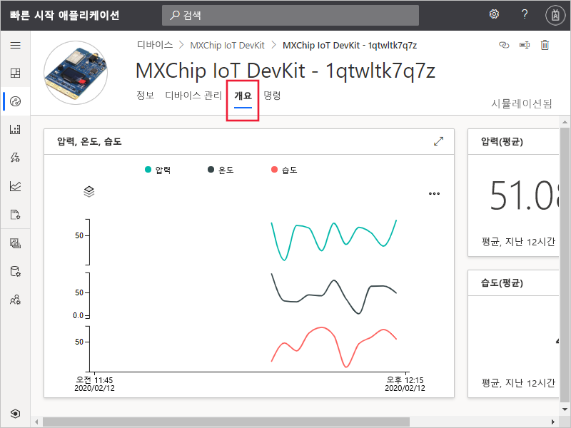
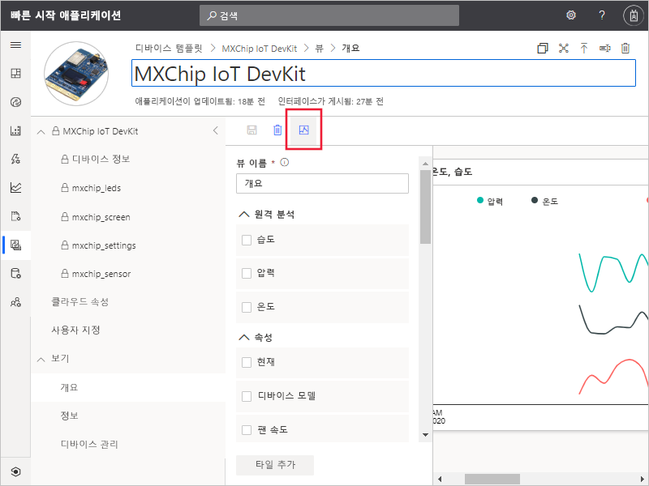

# 빠른 시작: IoT Central 애플리케이션에 시뮬레이션된 디바이스 추가

*이 문서는 운영자, 빌더 및 관리자에게 적용됩니다.*

디바이스 템플릿은 IoT Central 애플리케이션에 연결하는 디바이스의 기능을 정의합니다. 기능에는 디바이스에서 보내는 원격 분석, 디바이스 속성 및 디바이스에서 응답하는 명령이 포함됩니다. 디바이스 템플릿에서 빌더 또는 운영자는 애플리케이션에 실제 및 시뮬레이션된 디바이스를 모두 추가할 수 있습니다. 시뮬레이션된 디바이스는 실제 디바이스를 연결하기 전에 IoT Central 애플리케이션의 동작을 테스트하는 데 유용합니다.

이 빠른 시작에서는 *MXChip IoT DevKit*(DevKit) 보드의 디바이스 템플릿을 추가하고 시뮬레이션된 디바이스를 만듭니다. 실제 디바이스가 없어도 이 빠른 시작을 완료할 수 있습니다. 디바이스 시뮬레이션을 사용할 것입니다. DevKit 디바이스:

* 원격 분석(예: 온도)을 보냅니다.
* 디바이스별 속성(예: 밝기 수준)을 보고합니다.
* 명령(예: 설정 및 해제)에 응답합니다.
* 일반 디바이스 속성(예: 펌웨어 버전 및 일련 번호)을 보고합니다.

## 사전 요구 사항

[Azure IoT Central 애플리케이션 만들기](./quick-deploy-iot-central.md) 빠른 시작을 완료하여 **사용자 지정 앱 > 사용자 지정 애플리케이션** 템플릿으로 IoT Central 애플리케이션을 만듭니다.

## 템플릿 만들기

개발자는 IoT Central 애플리케이션에서 디바이스 템플릿을 만들고 편집할 수 있습니다. 디바이스 템플릿을 게시한 후에는 시뮬레이션된 디바이스를 생성하거나 디바이스 템플릿에서 실제 디바이스를 연결할 수 있습니다. 시뮬레이션된 디바이스를 사용하면 실제 디바이스를 연결하기 전에 애플리케이션의 동작을 테스트할 수 있습니다.

새 디바이스 템플릿을 애플리케이션에 추가하려면 왼쪽 창에서 **디바이스 템플릿** 탭을 선택합니다.

디바이스 템플릿에는 디바이스에서 보내는 원격 분석을 정의하는 디바이스 기능 모델, 디바이스 속성 및 디바이스가 응답하는 명령이 포함되어 있습니다.

### 디바이스 기능 모델 추가

IoT Central 애플리케이션에 디바이스 기능 모델을 추가하는 여러 옵션이 있습니다. 모델을 처음부터 새로 만들어도 되고, 파일에서 모델을 가져와도 되고, 디바이스 카탈로그에서 디바이스를 선택할 수도 있습니다. 또한 IoT Central은 디바이스가 처음 연결될 때 리포지토리에서 모델을 자동으로 가져오는 *디바이스 우선* 방식을 지원합니다. 이 빠른 시작에서는 디바이스 기능 모델을 가져올 디바이스를 디바이스 카탈로그에서 선택합니다.

다음은 디바이스 카탈로그를 사용하여 **MXChip IoT DevKit** 디바이스의 기능 모델을 가져오는 단계입니다. 이러한 디바이스는 온도와 같은 원격 분석을 애플리케이션에 보냅니다.

1. 새 디바이스 템플릿을 추가하려면 **디바이스 템플릿** 페이지에서 **+** 를 선택합니다.

1. **템플릿 유형 선택** 페이지에서 **MXChip IoT DevKit** 타일을 찾을 때까지 아래로 스크롤합니다.

1. **MXChip IoT DevKit** 타일을 선택하고, **다음: 사용자 지정**을 선택합니다.

1. **검토** 페이지에서 **만들기**를 선택합니다.

1. 몇 초 후 새 디바이스 템플릿을 볼 수 있습니다.

    

    MXChip IoT DevKit 기능 모델에는 **mxchip_sensor**, **mxchip_settings**, **디바이스 정보** 등의 인터페이스가 포함되어 있습니다. 인터페이스는 MXChip IoT DevKit 디바이스의 기능을 정의합니다. 기능에는 디바이스에서 보내는 원격 분석, 디바이스에서 보고하는 속성 및 디바이스에서 응답하는 명령이 포함됩니다.

### 클라우드 속성 추가

디바이스 템플릿에는 클라우드 속성이 포함될 수 있습니다. 클라우드 속성은 IoT Central 애플리케이션에만 있으며 디바이스에서 보내거나 받지 않습니다.

1. **클라우드 속성**, **+ 클라우드 속성 추가**를 차례로 선택합니다. 다음 표의 정보를 사용하여 디바이스 템플릿에 두 가지 클라우드 속성을 추가합니다.

    | 표시 이름      | 의미 체계 유형 | 스키마 |
    | ----------------- | ------------- | ------ |
    | 마지막 서비스 날짜 | None          | Date   |
    | 고객 이름     | None          | String |

1. **저장**을 선택하여 변경 내용을 저장합니다.

    

## 뷰

개발자는 디바이스와 관련된 정보를 운영자에게 표시하도록 애플리케이션을 사용자 지정할 수 있습니다. 사용자 지정을 통해 운영자가 애플리케이션에 연결된 디바이스를 관리할 수 있도록 만들 수 있습니다. 운영자가 디바이스와 상호 작용하는 데 사용할 다음 두 가지 유형의 보기를 만들 수 있습니다.

* 디바이스 및 클라우드 속성을 보고 편집하는 양식
* 디바이스에서 보내는 원격 분석을 포함하여 디바이스를 시각화하는 대시보드

### 기본 보기

기본 보기는 중요한 디바이스 정보를 빠르게 시각화할 수 있는 방법입니다. 디바이스 템플릿에 대해 최대 세 개의 기본 보기를 생성할 수 있습니다.

* **명령** 보기를 사용하면 운영자가 명령을 디바이스에 보낼 수 있습니다.
* **개요** 보기는 차트와 메트릭을 사용하여 디바이스 원격 분석을 표시합니다.
* **정보** 보기는 디바이스 속성을 표시합니다.

디바이스 템플릿에서 **보기** 노드를 선택합니다. 템플릿을 추가할 때 IoT Central에서 **개요** 및 **정보** 보기를 자동으로 생성한 것을 볼 수 있습니다.

운영자가 디바이스 관리에 사용할 수 있는 새 **디바이스 관리** 양식을 추가하는 방법은 다음과 같습니다.

1. **보기** 노드를 선택하고 **디바이스 및 클라우드 데이터 편집** 타일을 선택하여 새 보기를 추가합니다.

1. 양식 이름을 **디바이스 관리**로 변경합니다.

1. **고객 이름** 및 **마지막 서비스 날짜** 클라우드 속성과 **팬 속도** 속성을 선택합니다. 그런 다음, **섹션 추가**를 선택합니다.

    

1. **저장**을 선택하여 새 양식을 저장합니다.

## 디바이스 템플릿 게시

시뮬레이션된 디바이스를 만들거나 실제 디바이스를 연결하려면 디바이스 템플릿을 게시해야 합니다. 템플릿을 처음 만들 때 IoT Central에서 템플릿을 게시했지만, 업데이트된 버전을 게시해야 합니다.

디바이스 템플릿을 게시하려면 다음을 수행합니다.

1. **디바이스 템플릿** 페이지에서 디바이스 템플릿으로 이동합니다.

1. **게시**를 선택합니다.

    

1. **이 디바이스 템플릿을 애플리케이션에 게시** 대화 상자에서 **게시**를 선택합니다. 

디바이스 템플릿을 게시하면 **디바이스** 페이지에 표시됩니다. 게시된 디바이스 템플릿에서 새 버전을 만들어야 디바이스 기능 모델을 편집할 수 있습니다. 그러나 클라우드 속성, 사용자 지정 및 보기는 버전 관리를 수행하지 않고도 게시된 디바이스 템플릿에서 업데이트할 수 있습니다. 변경되면 **게시**를 선택하여 해당 변경 내용을 운영자에게 푸시합니다.

## 시뮬레이트된 디바이스 추가

애플리케이션에 시뮬레이션된 디바이스를 추가하려면 앞에서 만든 **MXChip IoT DevKit** 디바이스 템플릿을 사용합니다.

1. 운영자로서 새 디바이스를 추가하려면 왼쪽 창에서 **디바이스**를 선택합니다. **디바이스** 탭에는 **모든 디바이스** 및 **MXChip IoT DevKit** 디바이스 템플릿이 표시됩니다. **MXChip IoT DevKit**를 선택합니다.

1. 시뮬레이션된 DevKit 디바이스를 추가하려면 **+** 기호를 선택합니다. 제안된 **디바이스 ID**를 사용하거나 원하는 **디바이스 ID**를 소문자로 입력합니다. 새 디바이스의 이름을 입력할 수도 있습니다. **시뮬레이션됨** 토글을 **켜기**로 전환한 다음, **만들기**를 선택합니다.

    

이제 시뮬레이션된 데이터를 사용하여 개발자가 디바이스 템플릿을 위해 만든 보기와 상호 작용할 수 있습니다.

1. **디바이스** 페이지에서 시뮬레이션된 디바이스를 선택합니다.

1. **개요** 보기에는 시뮬레이션된 원격 분석 플롯이 표시됩니다.

    

1. **정보** 보기에는 보기에 추가된 클라우드 속성을 비롯한 속성 값이 표시됩니다.

1. **명령** 보기를 사용하면 디바이스에서 **blink** 같은 명령을 실행할 수 있습니다.

1. **디바이스 관리** 보기는 운영자가 디바이스를 관리할 수 있도록 만든 양식입니다.

## 시뮬레이션된 디바이스를 사용하여 보기 개선

시뮬레이션된 디바이스를 새로 만든 후에는 개발자가 이 디바이스를 사용하여 디바이스 템플릿의 보기를 지속적으로 개선하고 향상할 수 있습니다.

1. 왼쪽 창에서 **디바이스 템플릿**을 선택하고, **MXChip IoT DevKit** 템플릿을 선택합니다.

1. 편집하려는 보기를 선택하거나 새 보기를 만듭니다. **미리 보기 디바이스 구성**을 선택한 다음, **실행 중인 디바이스에서 선택**을 선택합니다. 여기서는 미리 보기 디바이스를 사용하지 않거나, 테스트용으로 구성된 실제 디바이스를 사용하거나, IoT Central에 추가한 기존 디바이스를 사용하는 세 가지 방법 중에 선택할 수 있습니다.

1. 목록에서 시뮬레이션된 디바이스를 선택합니다. 그런 다음, **적용**을 선택합니다. 이제 디바이스 템플릿 보기 빌드 환경에 동일한 시뮬레이션된 디바이스가 표시됩니다. 이 보기는 차트 및 기타 시각화에 유용합니다.

    

## 다음 단계

이 빠른 시작에서는 **MXChip IoT DevKit** 디바이스 템플릿을 만들고 시뮬레이션된 디바이스를 애플리케이션에 추가하는 방법을 알아보았습니다.

애플리케이션에 연결된 디바이스를 모니터링하는 방법에 대해 자세히 알아보려면 빠른 시작을 계속 진행합니다.

> [!div class="nextstepaction"]
> [규칙 및 작업 구성](./quick-configure-rules.md)
