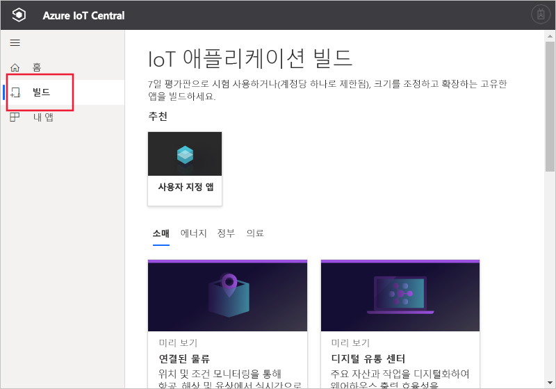

# Azure IoT Central 애플리케이션 만들기

[!INCLUDE [iot-central-original-pnp](../../../includes/iot-central-original-pnp-note.md)]

_작성기_로 Azure IoT Central UI를 사용하여 Microsoft Azure IoT Central 애플리케이션을 정의합니다. 이 빠른 시작에서는 샘플 _디바이스 템플릿_을 포함하는 Azure IoT Central 애플리케이션을 만드는 방법을 보여줍니다. 만든 애플리케이션은 미리 보기 기능을 사용하지 않습니다.

## 애플리케이션 만들기

[Azure IoT Central 빌드](https://aka.ms/iotcentral) 웹 사이트로 이동합니다. 그런 다음, Microsoft 개인, 회사 또는 학교 계정으로 로그인합니다.

미리 보기 기능을 사용하도록 설정되지 않은 Azure IoT Central 애플리케이션 만들기를 시작하려면 **빌드**를 선택합니다. 이 링크를 클릭하면 **IoT 애플리케이션 빌드** 페이지로 이동합니다.

그런 다음, **사용자 지정 앱**을 선택합니다.

새로운 Azure IoT Central 애플리케이션을 만들려면:

1. Azure IoT Central은 선택한 애플리케이션 템플릿을 기반으로 애플리케이션 이름을 자동으로 제안합니다. 이 이름을 그대로 적용하거나 **Contoso IoT**와 같은 친숙한 애플리케이션 이름을 입력할 수 있습니다. 또한 Azure IoT Central은 애플리케이션 이름에 따라 고유한 URL을 생성합니다. 원하는 경우 이 URL 접두사를 더욱 기억하기 쉬운 것으로 자유롭게 변경할 수 있습니다.

1. 미리 보기 기능을 사용하지 않는 **레거시 애플리케이션** 템플릿을 선택합니다.

    | 애플리케이션 템플릿 | Description |
    | -------------------- | ----------- |
    | 레거시 애플리케이션   | 사용자 고유의 디바이스 템플릿 및 디바이스로 채울 빈 애플리케이션을 만듭니다. |

1. 결제 계획을 선택합니다.
   - **7일 평가판** 애플리케이션은 만료되기 전 7일 동안 무료입니다. 만료되기 전에 언제든지 **종량제**로 변환할 수 있습니다. **평가판** 애플리케이션을 만드는 경우 연락처 정보를 입력하고 Microsoft에서 정보 및 팁을 받을 것인지 여부를 선택합니다.
   - **종량제** 애플리케이션은 처음 5개의 디바이스는 무료로 사용하며, 디바이스별로 요금이 청구됩니다. **종량제** 애플리케이션을 만드는 경우 *디렉터리*, *Azure 구독* 및 *위치*를 선택해야 합니다.
        - *디렉터리*는 애플리케이션을 만드는 Azure AD(Active Directory)입니다. 사용자 ID, 자격 증명 및 기타 조직 정보가 포함됩니다. Azure AD가 없는 경우 Azure 구독을 만들면 자동으로 하나가 생성됩니다.
        - *Azure 구독*을 사용하여 Azure 서비스 인스턴스를 만들 수 있습니다. IoT Central은 구독에서 리소스를 프로비저닝합니다. Azure 구독이 아직 없는 경우 [Azure 등록 페이지](https://aka.ms/createazuresubscription)에서 만들 수 있습니다. Azure 구독을 만든 후 다시 **애플리케이션 만들기** 페이지로 돌아갑니다. **Azure 구독** 드롭다운에 새 구독이 표시됩니다.
        - *위치*는 애플리케이션을 만들려는 [지리](https://azure.microsoft.com/global-infrastructure/geographies/)입니다. 일반적으로 최적의 성능을 얻으려면 디바이스와 물리적으로 가장 가까운 위치를 선택해야 합니다. Azure IoT Central 공개 미리 보기는 현재 **미국**, **오스트레일리아**, **아시아 태평양** 또는 **유럽**에서 사용할 수 있습니다.  위치를 선택하면 나중에 다른 위치로 애플리케이션을 이동할 수 없습니다.

        [Azure IoT Central 가격 책정 페이지](https://azure.microsoft.com/pricing/details/iot-central/)에서 가격 책정에 대해 자세히 알아보세요.

1. 이전에 선택한 결제 계획에 필요한 추가 정보를 1단계에서 입력합니다.

1. 페이지의 맨 아래에서 **만들기**를 선택합니다.

## 다음 단계

이 빠른 시작에서는 IoT Central 애플리케이션을 만들었습니다. 권장되는 단계는 다음과 같습니다.

> [!div class="nextstepaction"]
> [Azure IoT Central 애플리케이션에서 새 디바이스 유형 정의](./tutorial-define-device-type.md)
