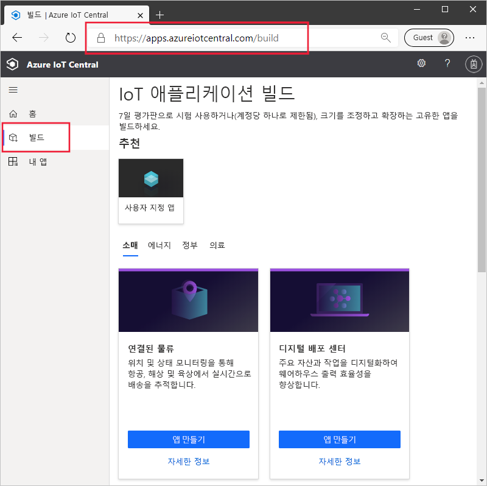
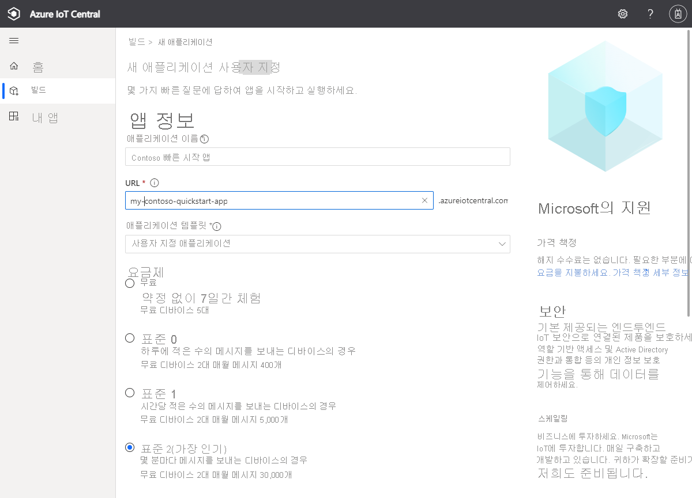
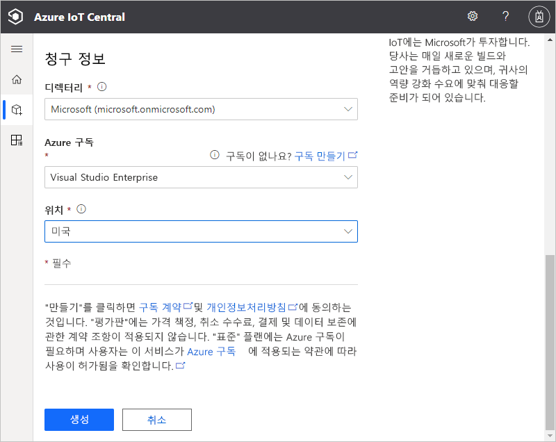
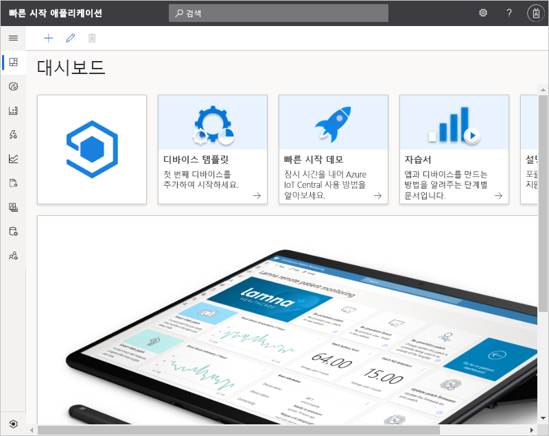

# Azure IoT Central 애플리케이션 만들기

이 빠른 시작에서는 Azure IoT Central 애플리케이션을 만드는 방법을 보여줍니다.

## 애플리케이션 만들기

[Azure IoT Central 빌드](https://aka.ms/iotcentral) 사이트로 이동합니다. 그런 다음, Microsoft 개인, 회사 또는 학교 계정으로 로그인합니다.

업계 관련 IoT Central 템플릿 목록에서 새 애플리케이션을 만들어 빠르게 시작하거나 **사용자 지정 앱** 템플릿을 사용하여 처음부터 시작할 수 있습니다. 이 빠른 시작에서는 **사용자 지정 애플리케이션** 템플릿을 사용합니다.

**사용자 지정 애플리케이션** 템플릿에서 새 Azure IoT Central 애플리케이션을 만들려면 다음을 수행합니다.

1. **빌드** 페이지로 이동합니다.

    

1. **사용자 지정 앱**을 선택하고 **사용자 지정 애플리케이션** 템플릿이 선택되어 있는지 확인합니다.

1. Azure IoT Central은 선택한 애플리케이션 템플릿을 기반으로 **애플리케이션 이름**을 자동으로 제안합니다. 이 이름을 그대로 사용하거나 친숙한 애플리케이션 이름을 입력할 수 있습니다.

1. 또한 Azure IoT Central은 애플리케이션 이름에 따라 고유한 **애플리케이션 URL** 접두사를 생성합니다. 이 URL을 사용하여 애플리케이션에 액세스합니다. 원하는 경우 이 URL 접두사를 더욱 기억하기 쉬운 것으로 자유롭게 변경할 수 있습니다.

    

    

    > [!NOTE]
    > 이전 페이지에서 **사용자 지정 앱**을 선택한 경우 **애플리케이션 템플릿** 드롭다운이 표시됩니다. 여기에서 사용자 지정 및 레거시 템플릿 사이를 전환할 수 있습니다. 조직에서 사용할 수 있게 된 다른 템플릿도 표시될 수 있습니다.

1. 7일 무료 평가판 가격 책정 플랜 또는 표준 가격 책정 플랜을 사용하여 이 애플리케이션을 만들도록 선택합니다.

    - *무료* 플랜을 사용하여 만든 애플리케이션은 7일 동안 무료로 제공되며 최대 5개의 디바이스를 지원합니다. 만료되기 전에 언제든지 표준 가격 책정 플랜을 사용하도록 변환할 수 있습니다.
    - *표준* 플랜을 사용하여 만든 애플리케이션은 디바이스별로 청구되며, 처음 두 디바이스가 무료로 사용 가능한 상태에서 **표준 1** 또는 **표준 2** 가격 책정 플랜을 선택할 수 있습니다. [Azure IoT Central 가격 책정 페이지](https://azure.microsoft.com/pricing/details/iot-central/)에서 무료 및 표준 가격 책정 플랜에 대해 자세히 알아보세요. 표준 요금제를 사용하여 애플리케이션을 만드는 경우 *디렉터리*, *Azure 구독* 및 *위치*를 선택해야 합니다.
        - *디렉터리*는 애플리케이션을 만드는 Azure Active Directory입니다. Azure Active Directory에는 사용자 ID, 자격 증명 및 기타 조직 정보가 포함됩니다. Azure Active Directory가 없는 경우 Azure 구독을 만들면 자동으로 하나가 생성됩니다.
        - *Azure 구독*을 사용하여 Azure 서비스 인스턴스를 만들 수 있습니다. IoT Central은 구독에서 리소스를 프로비저닝합니다. Azure 구독이 아직 없는 경우 [Azure 가입 페이지](https://aka.ms/createazuresubscription)에서 무료로 만들 수 있습니다. Azure 구독을 만든 후 다시 **새 애플리케이션** 페이지로 돌아갑니다. 이제 **Azure 구독** 드롭다운에 새 구독이 표시됩니다.
        - *위치*는 애플리케이션을 만들려는 [지리](https://azure.microsoft.com/global-infrastructure/geographies/)입니다. 일반적으로 최적의 성능을 얻으려면 디바이스와 물리적으로 가장 가까운 위치를 선택해야 합니다. 위치를 선택하면 나중에 다른 위치로 애플리케이션을 이동할 수 없습니다.

1. 사용 약관을 검토하고, 페이지 맨 아래에서 **만들기**를 선택합니다. 몇 분 후에 IoT Central 애플리케이션을 사용할 준비가 됩니다.

    

## 다음 단계

이 빠른 시작에서는 IoT Central 애플리케이션을 만들었습니다. 권장되는 단계는 다음과 같습니다.

> [!div class="nextstepaction"]
> [IoT Central 애플리케이션에 시뮬레이트된 디바이스 추가](./quick-create-pnp-device.md)
