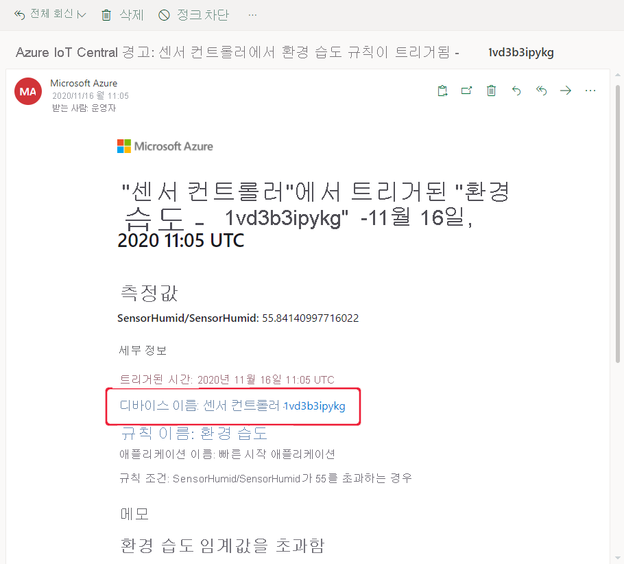
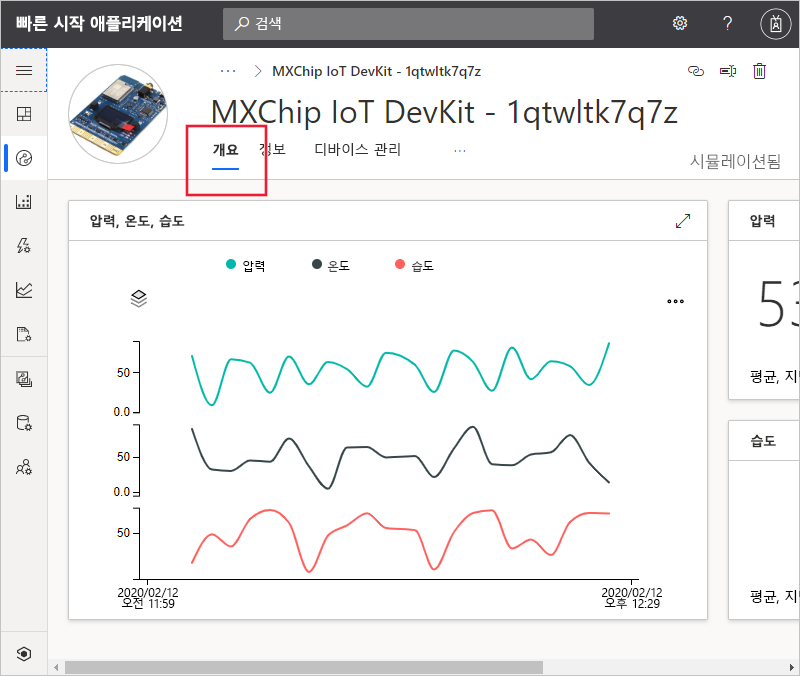
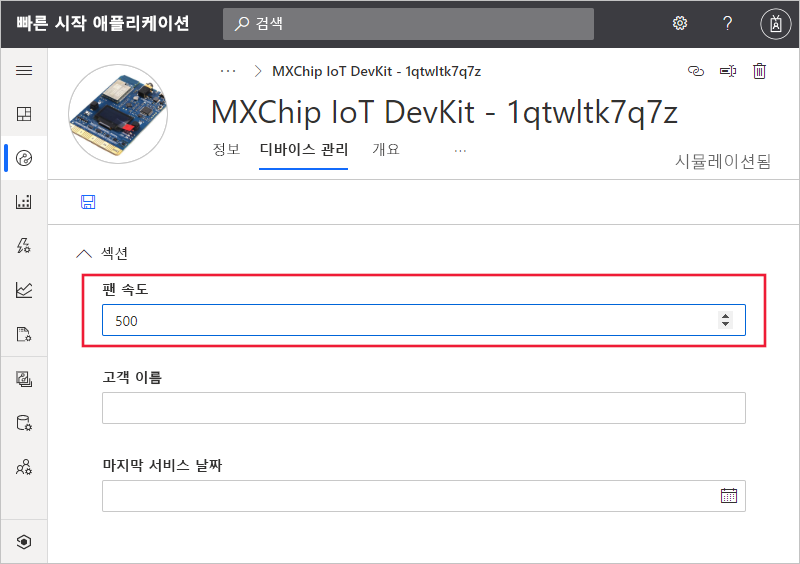

# 빠른 시작: Azure IoT Central을 사용하여 디바이스 모니터링

*이 문서는 운영자, 빌더 및 관리자에게 적용됩니다.*

이 빠른 시작에서는 운영자로서 Microsoft Azure IoT Central 애플리케이션을 사용하여 디바이스를 모니터링하고 설정을 변경하는 방법을 알려줍니다.

## 사전 요구 사항

시작하기 전에 세 가지 이전 빠른 시작인 [Azure IoT Central 애플리케이션 만들기](./quick-deploy-iot-central.md), [IoT Central 애플리케이션에 시뮬레이션된 디바이스 추가](./quick-create-pnp-device.md) 및 [디바이스의 규칙 및 작업 구성](quick-configure-rules.md)을 완료해야 합니다.

## 알림 수신

Azure IoT Central은 디바이스에 대한 알림을 이메일 메시지로 보냅니다. 빌더는 연결된 디바이스 센서의 온도가 임계값을 초과하는 경우 알림을 보내기 위해 규칙을 추가했습니다. 작성기가 알림을 수신하도록 선택한 계정에 전송되는 이메일을 확인합니다.

[디바이스에 대한 규칙 및 작업 구성](quick-configure-rules.md) 빠른 시작의 끝에 수신한 이메일 메시지를 엽니다. 이메일에서 디바이스에 대한 링크를 선택합니다.

이전 빠른 시작에서 만든 시뮬레이션된 디바이스에 대한 **개요** 보기가 브라우저에서 열립니다.

## 문제 조사

운영자로서 **개요**, **정보** 및 **명령** 보기에서 디바이스에 대한 정보를 볼 수 있습니다. 빌더는 디바이스 정보를 편집하고 디바이스 속성을 설정할 수 있는 **디바이스** 보기를 만들었습니다.

대시보드의 차트에는 디바이스 온도 플롯이 표시됩니다. 디바이스 온도가 너무 높다고 판단합니다.

## 문제 해결

디바이스를 변경하려면 **디바이스 관리** 페이지를 사용합니다.

**팬 속도**를 500으로 변경하여 디바이스를 냉각합니다. **저장**을 선택하여 디바이스를 업데이트합니다. 디바이스가 설정 변경을 확인하면 속성의 상태가 **동기화됨**으로 변경됩니다.

## 다음 단계

이 빠른 시작에서는 다음을 수행하는 방법을 알아보았습니다.

* 알림 수신
* 문제 조사
* 문제 해결

이제 디바이스를 모니터링했으므로 제안하는 다음 단계는 다음과 같습니다.

> [!div class="nextstepaction"]
> [디바이스 템플릿을 빌드 및 관리](howto-set-up-template.md)합니다.
