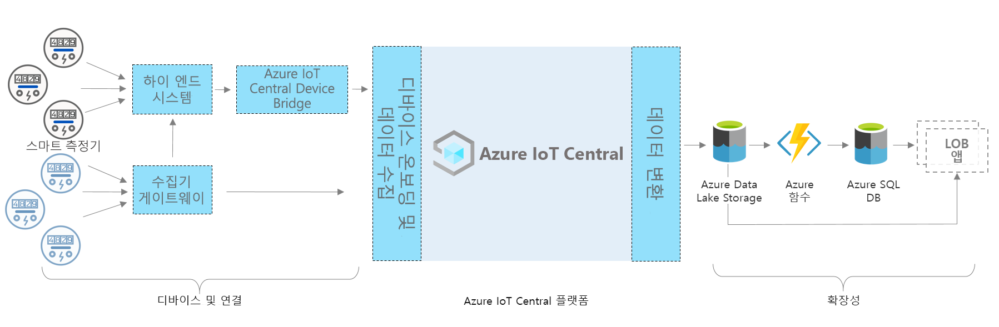

# Azure IoT Central - 스마트 미터 앱 아키텍처

이 문서에서는 스마트 미터 모니터링 앱 템플릿 아키텍처의 개요를 제공합니다. 아래 다이어그램은 IoT Central 플랫폼을 사용하여 Azure에서 일반적으로 사용되는 스마트 미터 앱 아키텍처를 보여 줍니다.

> [!div class="mx-imgBorder"]
> 

이 아키텍처는 다음과 같은 구성 요소로 구성됩니다. 일부 솔루션에는 여기에 나열된 모든 구성 요소가 필요하지 않을 수 있습니다.

## 스마트 미터 및 연결 

스마트 미터는 모든 에너지 자산에서 가장 중요한 디바이스 중 하나입니다. 에너지 소비 데이터를 기록하고 모니터링 및 기타 사용 사례(예: 청구 및 수요 대응)를 위해 유틸리티로 전달합니다. 미터 유형에 따라 게이트웨이나 다른 중간 디바이스 또는 시스템(예: 에지 디바이스 및 헤드엔드 시스템)을 사용하여 IoT Central에 연결할 수 있습니다. 직접 연결할 수 없는 디바이스를 연결하기 위해 IoT Central 디바이스 브리지를 빌드합니다. IoT Central 디바이스 브리지는 오픈 소스 솔루션이며 [여기](https://docs.microsoft.com/azure/iot-central/core/howto-build-iotc-device-bridge)에서 전체 세부 정보를 확인할 수 있습니다. 

## IoT Central 플랫폼

Azure IoT Central은 IoT 솔루션의 빌드를 간소화하고 IoT 관리, 운영 및 개발 부담과 비용을 줄여주는 플랫폼입니다. IoT Central을 사용하면 대규모로 손쉽게 IoT(사물 인터넷) 자산을 연결, 모니터링 및 관리할 수 있습니다. 스마트 미터를 IoT Central에 연결하면 앱 템플릿에서 디바이스 모델, 명령, 대시보드 등의 기본 제공 기능을 사용합니다. 또한 앱 템플릿은 근 실시간 측정기 데이터 모니터링, 분석, 규칙 및 시각화와 같은 웜 경로 시나리오에 IoT Central 스토리지를 사용합니다. 

## IoT Central을 사용하여 빌드하는 확장성 옵션
IoT Central 플랫폼은 두 가지 확장성 옵션인 CDE(연속 데이터 내보내기) 및 API를 제공합니다. 고객 및 파트너는 특정 요구 사항에 맞게 솔루션을 사용자 지정하기 위해 이러한 옵션 중에서 선택할 수 있습니다. 예를 들어 파트너 중 하나가 ADLS(Azure Data Lake Storage)를 사용하여 CDE를 구성했습니다. 장기 데이터 보존 및 기타 콜드 경로 스토리지 시나리오(일괄 처리, 감사 및 보고 목적)에 ADLS를 사용하고 있습니다. 

## 다음 단계

* 지금까지 이 아키텍처에 대해 알아보았으므로 [무료로 스마트 미터를 만들어 봅니다](https://apps.azureiotcentral.com/build/new/smart-meter-monitoring).
* [Azure IoT Central 개요](https://docs.microsoft.com/azure/iot-central/)를 참조하여 Azure IoT Central에 대해 자세히 알아보기
