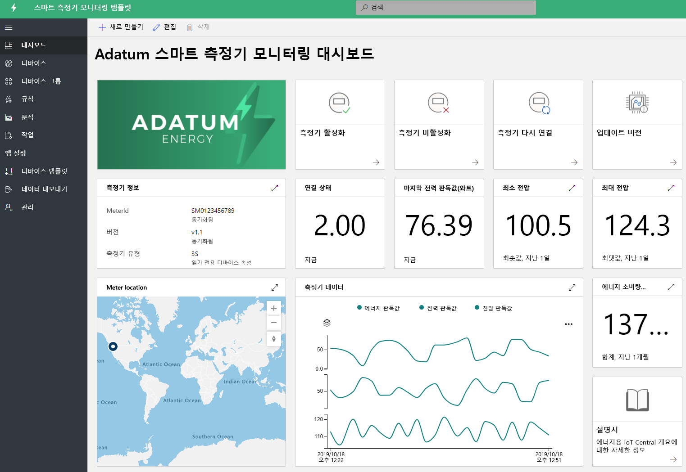
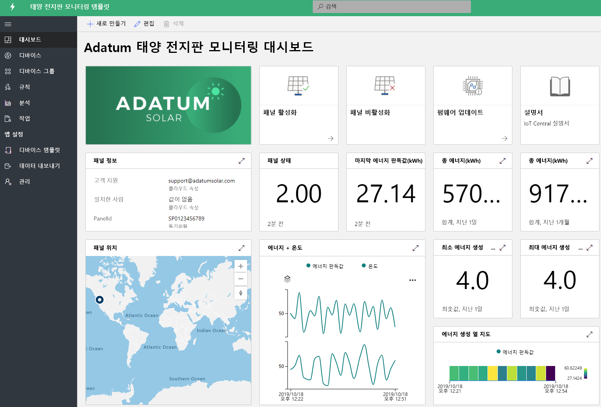

# IoT Central을 사용하여 에너지 산업 솔루션 빌드 

스마트 미터 및 태양 전지판은 에너지 산업 혁신에 있어서 중요한 역할을 합니다. 스마트 미터는 에너지 사용량에 대한 보다 강력한 제어 및 실시간 인사이트를 제공하며, 태양 전지판은 재생 에너지 생성의 돌파구가 되고 있습니다. 스마트 미터 및 태양 전지판 모니터링 앱은 다양한 기능을 보여 주는 샘플 템플릿입니다. 파트너는 이러한 템플릿을 활용하여 IoT Central에서 특정 요구에 맞는 에너지 솔루션을 빌드할 수 있습니다. 이러한 애플리케이션을 배포하고 사용하는 데는 새로운 코딩 및 추가 비용이 필요하지 않습니다. 에너지 애플리케이션 템플릿 및 해당 기능에 대해 자세히 알아보세요.

## 스마트 미터 모니터링 애플리케이션이란?
 스마트 미터는 자동 청구 뿐만 아니라 실시간 판독 및 양방향 통신과 같은 고급 측정 사용 사례를 지원합니다. 스마트 미터 앱 템플릿을 사용하여 유틸리티 및 파트너는 스마트 미터 상태와 데이터를 모니터링하고 경보 및 알림을 정의할 수 있습니다. 또한 미터 연결 끊기 및 소프트웨어 업데이트와 같은 샘플 명령을 제공합니다. 미터 데이터를 다른 비즈니스 애플리케이션으로 송신하고 사용자 지정 솔루션을 개발하도록 설정할 수 있습니다. 

앱의 주요 기능은 다음과 같습니다. 

* 미터 샘플 디바이스 모델 
* 미터 정보 및 라이브 상태 
* 미터 판독(예: 에너지, 전력 및 전압)
* 미터 명령 샘플 
* 기본 제공 시각화 및 대시보드
* 사용자 지정 솔루션 개발을 위한 확장성

Azure 구독 및 약정 없이 [무료로 스마트 미터 모니터링 앱](https://apps.azureiotcentral.com/build/new/smart-meter-monitoring)을 사용해 볼 수 있습니다.

앱을 배포한 후 아래 그림에 표시된 것처럼 대시보드에서 시뮬레이트된 미터 데이터를 볼 수 있습니다. 이 템플릿은 특정 사용 사례에 맞게 쉽게 확장하고 사용자 지정할 수 있는 샘플 앱입니다.

> [!div class="mx-imgBorder"]
> 

## 태양 전지판 모니터링 애플리케이션이란?
태양 전지판 모니터링 앱을 사용하여 유틸리티 및 파트너는 거의 실시간으로 태양 전지판에 대해 에너지 생성 및 연결 상태와 같은 사항을 모니터링할 수 있습니다. 정의된 임계값 조건에 따라 알림을 보낼 수 있습니다. 펌웨어 업데이트 및 기타 속성과 같은 샘플 명령을 제공합니다. 태양 전지판 데이터를 다른 비즈니스 애플리케이션으로 송신하고 사용자 지정 솔루션을 개발하도록 설정할 수 있습니다. 

앱의 주요 기능은 다음과 같습니다. 

* 태양 전지판 샘플 디바이스 모델 
* 태양 전지판 정보 및 라이브 상태
* 태양 에너지 생성 및 기타 판독값
* 명령 및 컨트롤 샘플
* 기본 제공 시각화 및 대시보드
* 사용자 지정 솔루션 개발을 위한 확장성

Azure 구독 및 약정 없이 [무료로 태양 전지판 모니터링 앱](https://apps.azureiotcentral.com/build/new/solar-panel-monitoring)을 사용해 볼 수 있습니다.

앱을 배포한 후 아래 대시보드에서 볼 수 있듯이 시뮬레이트된 태양 전지판 데이터가 1-2분 내에 표시됩니다. 이 템플릿은 특정 사용 사례에 맞게 쉽게 확장하고 사용자 지정할 수 있는 샘플 앱입니다. 

> [!div class="mx-imgBorder"]
> 

## 다음 단계
에너지 솔루션 빌드를 시작하려면 다음을 수행하세요.
* 무료로 애플리케이션 템플릿 만들기: [스마트 미터 앱](https://apps.azureiotcentral.com/build/new/smart-meter-monitoring), [태양 전지판 앱](https://apps.azureiotcentral.com/build/new/solar-panel-monitoring)
* [스마트 미터 모니터링 앱 개념](./concept-iot-central-smart-meter-app.md)에 대해 알아보기
* [태양 전지판 모니터링 앱 개념](./concept-iot-central-solar-panel-app.md)에 대해 알아보기
* [IoT Central 플랫폼](../index.yml)에 대해 알아보기