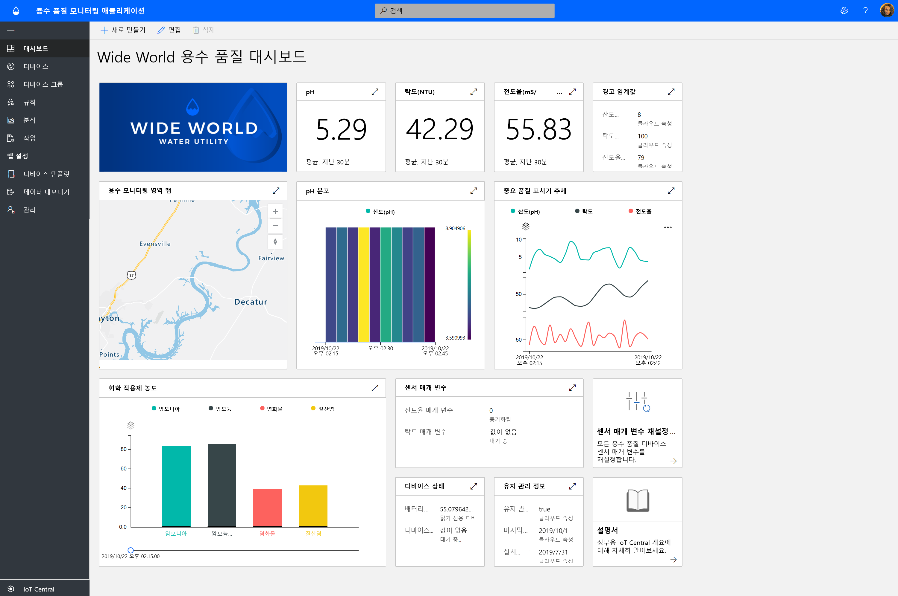
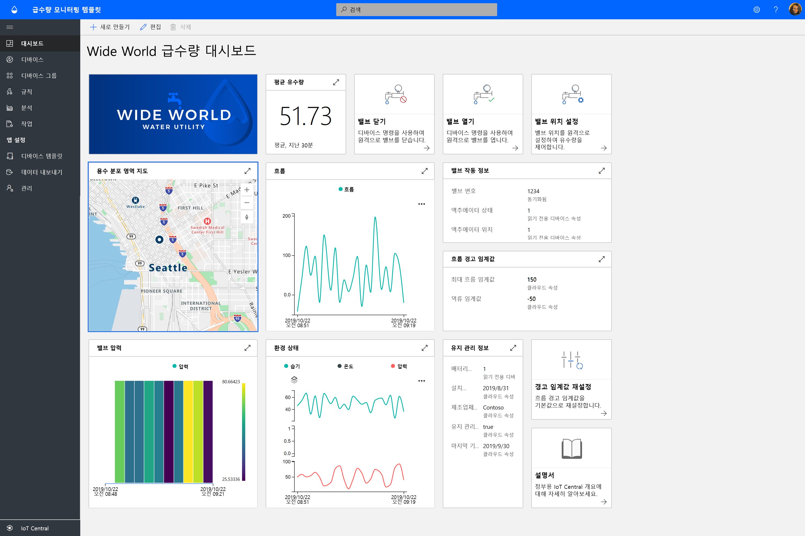
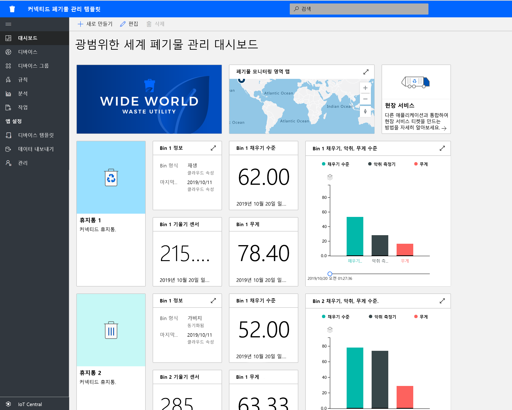

# Azure IoT Central을 사용하여 정부 기관 솔루션 빌드

Azure IoT Central 애플리케이션 템플릿을 사용하여 스마트 시티 솔루션 빌드를 시작합니다. **용수 품질 모니터링**, **용수 사용량 모니터링**, **커넥티드 폐기물 관리**부터 시작할 수 있습니다.

## 용수 품질 모니터링 애플리케이션 템플릿이란?   

기존의 용수 품질 모니터링은 수동 샘플링 기술과 현장 실험실 분석에 의존하기 때문에 시간이 많이 소모되고 비용도 많이 듭니다. 실시간으로 용수 품질을 원격 모니터링하면 시민들에게 나쁜 영향을 미치기 전에 용수 품질 문제를 해결할 수 있습니다. 또한 고급 분석을 통해 상수도 시설과 환경 단체는 잠재적인 용수 품질 문제에 대한 조기 경고에 신속히 대응하고 수처리 계획을 미리 수립할 수 있습니다.  

용수 품질 모니터링 앱은 IoT 솔루션 개발을 시작하고 상수도 시설이 스마트 시티의 용수 품질을 디지털 방식으로 모니터링하도록 도와주는 IoT Central 앱 템플릿입니다. 

앱 템플릿은 다음으로 구성됩니다.
* 샘플 작업자 대시보드
* 샘플 용수 품질 모니터링 디바이스 템플릿
* 시뮬레이션된 용수 품질 모니터링 디바이스
* 미리 구성된 규칙 및 작업
* 흰색 레이블을 사용하는 브랜딩 

[용수 품질 모니터링 애플리케이션 자습서](./tutorial-water-quality-monitoring.md)를 시작하세요.

## 용수 사용량 모니터링 애플리케이션 템플릿이란? 

기존의 용수 사용량 추적은 상수도 작업자가 측정기가 있는 지점에서 용수 사용량 측정기를 수동으로 판독하는 방식으로 진행되었습니다. 점점 더 많은 도시가 기존의 측정기를 고급 스마트 측정기로 교체하여 용수 사용량을 원격 모니터링하고 밸브를 원격으로 제어하여 물 흐름을 조절합니다. 용수 사용량 모니터링을 진행하는 동시에 시민들에게 디지털 피드백 메시지를 제공하면 용수 사용량에 대한 인지도를 높이고 용수 사용량을 줄일 수 있습니다. 

용수 사용량 모니터링 앱은 IoT 솔루션 개발을 시작하고 상수도 시설과 도시가 물 흐름을 원격으로 모니터링하여 용수 사용량을 줄이도록 도와주는 IoT Central 앱 템플릿입니다. 

  

용수 사용량 모니터링 앱 템플릿은 미리 구성된 다음의 요소로 구성되어 있습니다.
* 샘플 작업자 대시보드
* 샘플 용수 품질 모니터링 디바이스 템플릿
* 시뮬레이션된 용수 품질 모니터링 디바이스
* 미리 구성된 규칙 및 작업
* 흰색 레이블을 사용하는 브랜딩 

 [용수 사용량 모니터링 애플리케이션 자습서](./tutorial-water-consumption-monitoring.md)를 시작하세요.

## 커넥티드 폐기물 관리 애플리케이션 템플릿이란? 

커넥티드 폐기물 관리 앱은 IoT 솔루션 개발을 시작하고 스마트 시티가 원격 모니터링을 통해 폐기물 수집 효율을 극대화하도록 도와주는 IoT Central 앱 템플릿입니다. 

 

커넥티드 폐기물 관리 앱 템플릿은 미리 구성된 다음의 요소로 구성되어 있습니다.
* 샘플 작업자 대시보드
* 샘플 커넥티드 폐기물 수집통 디바이스 템플릿
* 시뮬레이션된 커넥티드 폐기물 수집통 디바이스
* 미리 구성된 규칙 및 작업
* 흰색 레이블을 사용하는 브랜딩 

[커넥티드 폐기물 관리 애플리케이션 자습서](./tutorial-connected-waste-management.md)를 시작하세요.

## 다음 단계

* IoT Central의 정부 기관 애플리케이션 템플릿을 사용하여 무료로 [앱 만들기](https://apps.azureiotcentral.com/build/government)
* [용수 품질 모니터링 개념](./concepts-waterqualitymonitoring-architecture.md)에 대해 자세히 알아보기
* [용수 사용량 모니터링 개념](./concepts-waterconsumptionmonitoring-architecture.md)에 대해 자세히 알아보기
* [커넥티드 폐기물 관리 개념](./concepts-connectedwastemanagement-architecture.md)에 대해 자세히 알아보기  
* [IoT Central 개요](https://docs.microsoft.com/azure/iot-central/core/overview-iot-central)를 참조하여 IoT Central에 대해 자세히 알아보기
 