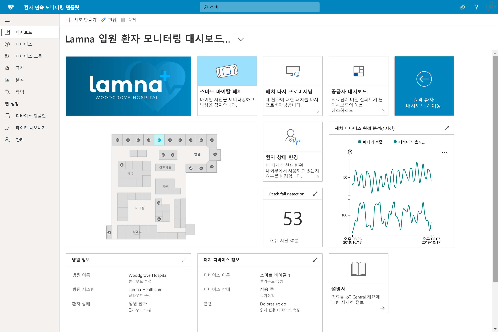

# Azure IoT Central을 사용하여 의료 산업 솔루션 빌드 

애플리케이션 템플릿을 사용하여 Azure IoT Central로 의료 산업 솔루션을 빌드하는 방법을 알아봅니다.

## 지속적인 환자 모니터링 템플릿은 무엇인가요?

의료 산업 IoT 공간에서 지속적인 환자 모니터링은 재입원의 위험을 줄이고, 만성 질환을 보다 효과적으로 관리하고, 환자 결과를 개선하는 핵심 요소 중 하나입니다. 지속적인 환자 모니터링은 다음과 같은 두 가지 주요 범주로 나눌 수 있습니다.

1. **입원 환자 모니터링**: 의료 팀은 병원에서 의료 착용식 장치 및 기타 디바이스를 사용하여 환자를 하루에 여러 번 확인하도록 간호사를 보내지 않고도 환자 생명 징후 및 의료 상태를 모니터링할 수 있습니다. 의료 팀은 알림을 통해 환자에게 중요한 주의가 필요하고 시간을 효과적으로 우선 순위를 지정하는 순간을 이해할 수 있습니다.
1. **원격 환자 모니터링**: 의료 착용식 장치 및 환자 보고된 결과(PRO)를 사용하여 병원 밖의 환자를 모니터링함으로써 재입원의 위험을 낮출 수 있습니다. 만성 질환 환자 및 재입원 환자의 데이터를 수집하여 환자가 의료 계획을 준수할 수 있도록 할 수 있으며 환자의 악화 징후의 경고를 더 위험해지기 전에 의료 팀에게 전달할 수 있습니다.

이 애플리케이션 템플릿은 지속적인 환자 모니터링의 두 범주에 대한 솔루션을 빌드하는 데 사용할 수 있습니다. 이점은 다음과 같습니다.

* 다양한 종류의 의료 착용식 장치를 IoT Central 인스턴스에 원활하게 연결합니다.
* 디바이스를 모니터링하고 관리하여 정상 상태를 유지하도록 합니다.
* 적절한 경고를 트리거하도록 디바이스 데이터에 대한 사용자 지정 규칙을 만듭니다.
* 환자 상태 데이터를 규격 데이터 저장소인 Azure API for FHIR로 내보냅니다.
* 집계된 인사이트를 기존 또는 새 비즈니스 애플리케이션으로 내보냅니다.

>[!div class="mx-imgBorder"] 
>

## 다음 단계

지속적인 환자 모니터링 솔루션 빌드를 시작하려면 다음을 수행합니다.

* [애플리케이션 템플릿 배포](tutorial-continuous-patient-monitoring.md)
* [예제 아키텍처 참조](concept-continuous-patient-monitoring-architecture.md)