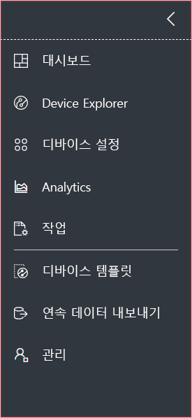
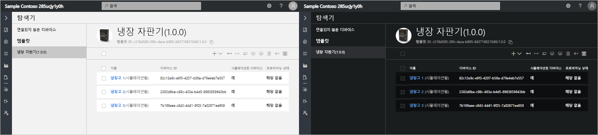
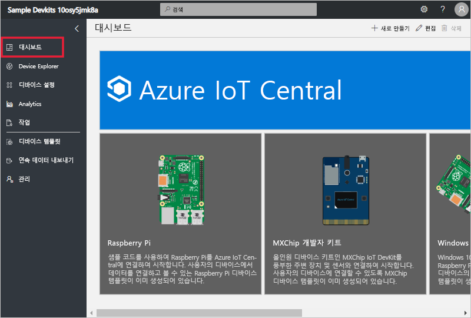
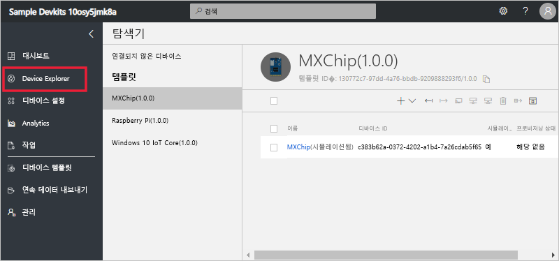
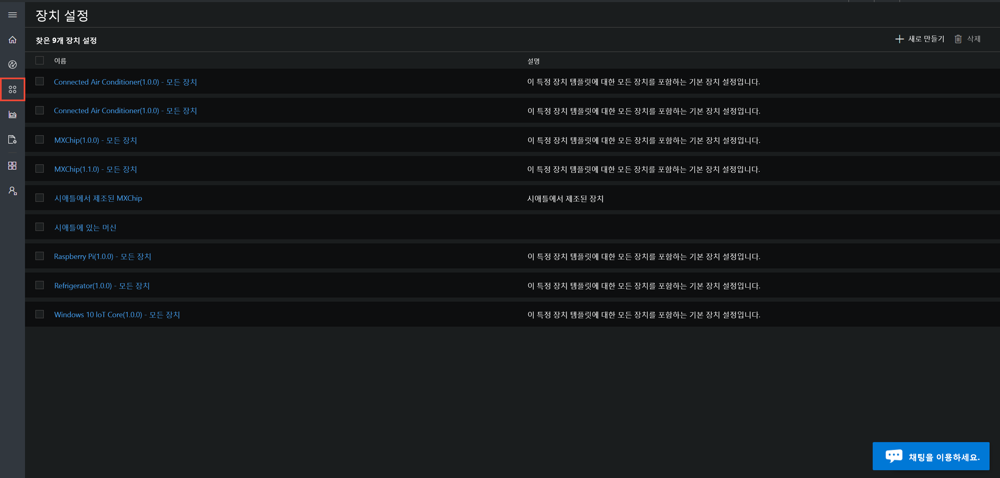
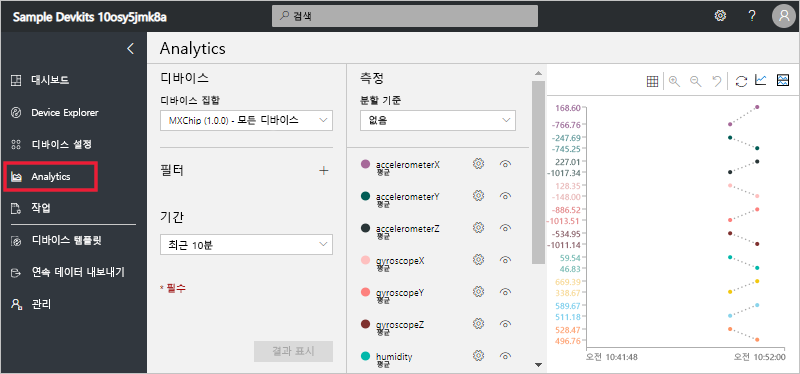
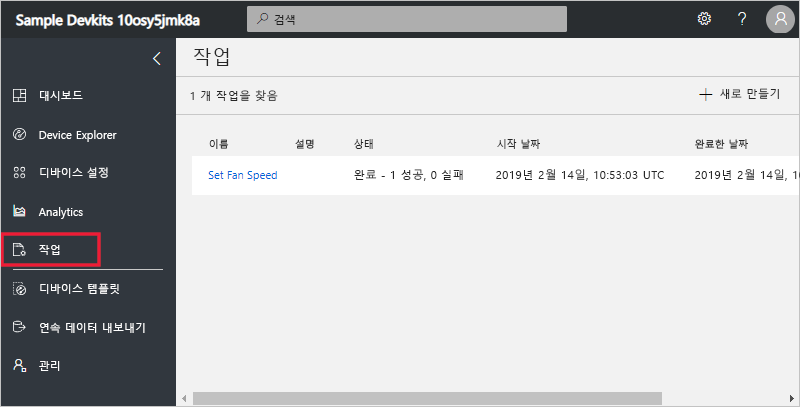
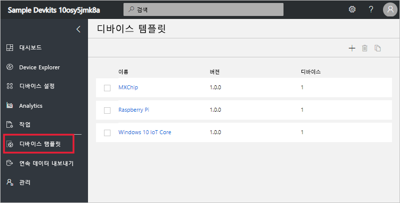
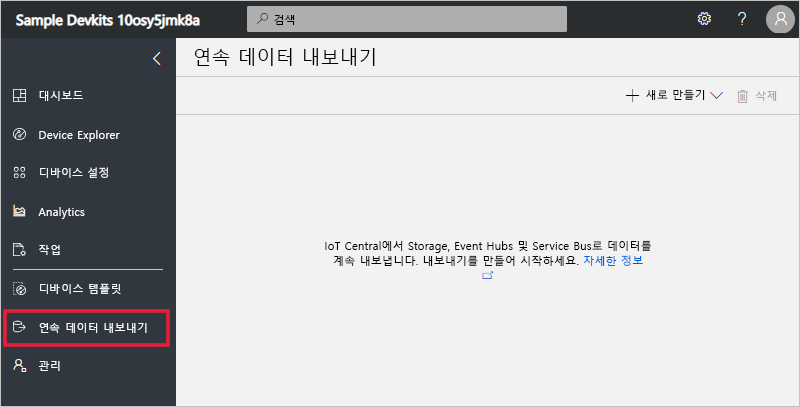
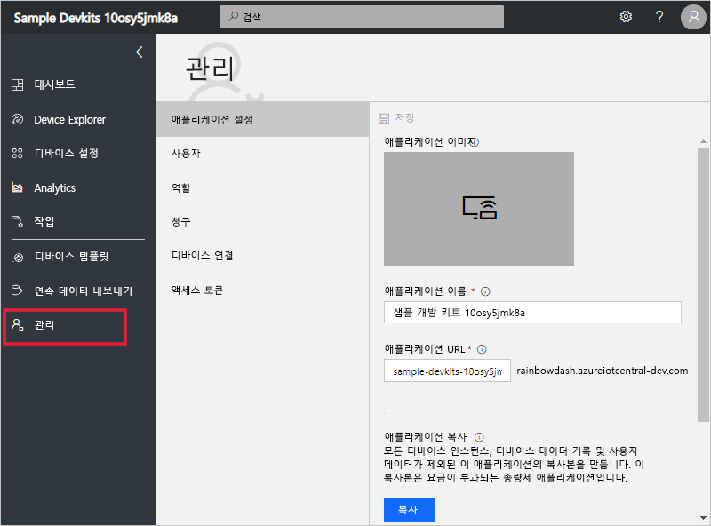

# Azure IoT Central UI 둘러보기

이 문서에서는 Microsoft Azure IoT Central UI를 소개합니다. UI를 사용하여 Azure IoT Central 솔루션과 연결된 디바이스를 생성, 관리 및 사용할 수 있습니다.

_개발자_는 Azure IoT Central UI를 사용하여 Azure IoT Central 솔루션을 정의할 수 있습니다. UI를 사용하여 다음을 수행할 수 있습니다.

- 솔루션에 연결하는 디바이스의 유형을 정의합니다.
- 디바이스에 대한 규칙 및 작업을 구성합니다.
- 솔루션을 사용하는 _운영자_에 맞게 UI를 사용자 지정합니다.

_운영자_는 Azure IoT Central UI를 사용하여 Azure IoT Central 솔루션을 관리합니다. UI를 사용하여 다음을 수행할 수 있습니다.

- 디바이스를 모니터링합니다.
- 디바이스를 구성합니다.
- 디바이스 문제를 해결하고 수정합니다.
- 새 디바이스를 프로비전합니다.

## 왼쪽 탐색 메뉴 사용

왼쪽 탐색 메뉴를 사용하여 애플리케이션의 다른 영역에 액세스합니다. **<** 또는 **>** 을 선택하여 탐색 모음을 확장하거나 축소할 수 있습니다.

| 메뉴 | 설명 |
| ---- | ----------- |
|  | <ul><li>**대시보드** 단추를 클릭하면 애플리케이션 대시보드가 표시됩니다. 개발자는 운영자에 맞게 대시보드를 사용자 지정할 수 있습니다. 또한 사용자는 자신의 대시보드를 만들 수도 있습니다.</li><li>**Device Explorer** 단추는 애플리케이션의 각 디바이스 템플릿에 연결된 시뮬레이션 디바이스와 실제 디바이스를 모두 나열합니다. 운영자는 **Device Explorer**를 사용하여 연결된 디바이스를 관리합니다.</li><li>**디바이스 집합** 단추를 사용하여 디바이스 집합을 보고 만들 수 있습니다. 운영자는 디바이스 집합을 쿼리에 지정된 논리 컬렉션으로 만들 수 있습니다.</li><li>**Analytics** 단추는 디바이스 및 디바이스 집합에 대한 디바이스 원격 분석에서 파생된 분석을 보여줍니다. 운영자는 장치 데이터 위에 사용자 지정 보기를 만들어 애플리케이션에서 인사이트를 끌어낼 수 있습니다.</li><li>**작업** 단추를 사용하면 대규모 업데이트를 수행하는 작업을 생성하고 실행하여 대량 디바이스 관리를 수행할 수 있습니다.</li><li>**디바이스 템플릿** 단추는 작성자가 디바이스 템플릿을 만들고 관리할 때 사용하는 도구를 보여줍니다.</li><li>**연속 데이터 내보내기** 단추는 관리자가 스토리지 및 큐 같은 다른 Azure 서비스로 연속 내보내기를 구성할 때 사용됩니다.</li><li>**관리** 단추는 관리자가 애플리케이션 설정, 사용자 및 역할을 관리할 수 있는 애플리케이션 관리 페이지를 표시합니다.</li></ul> |

## 검색, 도움말 및 지원

모든 페이지에 상단 메뉴가 나타납니다.

- 디바이스 템플릿 및 디바이스를 검색하려면 **검색** 값을 입력합니다.
- UI 언어 또는 테마를 변경하려면 **설정** 아이콘을 선택합니다.
- 애플리케이션에서 로그아웃하려면 **계정** 아이콘을 선택합니다.
- 도움말을 보거나 지원을 받으려면 리소스 목록에 대한 **도움말** 드롭다운을 선택합니다.

UI의 밝은 테마 또는 어두운 테마 중에서 선택할 수 있습니다.

## 대시보드

대시보드는 Azure IoT Central 애플리케이션에 로그인할 때 표시되는 첫 번째 페이지입니다. 개발자는 타일을 추가하여 다른 사용자를 위해 애플리케이션 대시보드를 사용자 지정할 수 있습니다. 자세한 내용은 [Azure IoT Central 운영자 보기 사용자 지정](tutorial-customize-operator.md) 자습서를 참조하세요. 또한 사용자는 [자신의 개인 대시보드를 만들](howto-personalize-dashboard.md) 수도 있습니다.

## 디바이스 탐색기

Explorer 페이지는 Azure IoT Central 애플리케이션의 _디바이스_를 _디바이스 템플릿_별로 보여줍니다.

* 장치 템플릿은 애플리케이션에 연결할 수 있는 장치의 유형을 정의합니다. 자세한 내용은 [Azure IoT Central 애플리케이션에 새 장치 유형 정의](tutorial-define-device-type.md)를 참조하세요.
* 장치는 애플리케이션의 실제 또는 시뮬레이션된 장치를 나타냅니다. 자세한 내용은 [Azure IoT Central 애플리케이션에 새 장치 추가](tutorial-add-device.md)를 참조하세요.

## 디바이스 집합

_디바이스 집합_ 페이지는 개발자가 만든 디바이스 집합을 표시합니다. 디바이스 집합은 관련 디바이스의 컬렉션입니다. 개발자는 디바이스 집합에 포함된 디바이스를 식별하는 쿼리를 정의합니다. 애플리케이션에서 분석을 사용자 지정할 때 장치 집합을 사용합니다. 자세한 내용은 [Azure IoT Central 애플리케이션에서 장치 집합 사용](howto-use-device-sets.md) 문서를 참조하세요.

## 분석

분석 페이지에는 애플리케이션에 연결된 장치의 작동 방식을 이해하는 데 도움이 되는 차트가 표시됩니다. 운영자는 이 페이지를 사용하여 연결된 디바이스의 문제를 모니터링하고 조사합니다. 개발자는 이 페이지에 표시되는 차트를 정의할 수 있습니다. 자세한 내용은 [Azure IoT Central 애플리케이션을 위한 사용자 지정 분석 만들기](howto-use-device-sets.md) 문서를 참조하세요.

## 교육

작업 페이지에서는 디바이스에 대한 대량 디바이스 관리 작업을 수행할 수 있습니다. 이 빌더에서는 이 페이지를 사용하여 디바이스 속성, 설정 및 명령을 업데이트합니다. 자세한 내용은 [작업 실행](howto-run-a-job.md) 문서를 참조하세요.

## 디바이스 템플릿

디바이스 템플릿 페이지는 작성자가 애플리케이션에서 디바이스 템플릿을 만들고 관리하는 페이지입니다. 자세한 내용은 [Azure IoT Central 애플리케이션에서 새 장치 유형 정의](tutorial-define-device-type.md) 자습서를 참조하세요.

## 연속 데이터 내보내기

연속 데이터 내보내기 페이지는 관리자가 애플리케이션에서 원격 분석 등의 데이터를 내보내는 방법을 정의하는 페이지입니다. 다른 서비스는 내보낸 데이터를 저장하거나 분석에 사용할 수 있습니다. 자세한 내용은 [Azure IoT Central에서 데이터 내보내기](howto-export-data.md) 문서를 참조하세요.

## 관리

관리 페이지에는 애플리케이션에서 관리자가 사용하는 도구에 대한 링크가 있습니다(예: 사용자 및 역할 정의). 자세한 내용은 [Azure IoT Central 애플리케이션 관리](howto-administer.md) 문서를 참조하세요.

## 다음 단계

이제 Azure IoT Central의 개요를 알고 UI 레이아웃에 익숙해졌으므로, 권장되는 다음 단계는 [Azure IoT Central 애플리케이션 만들기](quick-deploy-iot-central.md) 빠른 시작을 완료하는 것입니다.