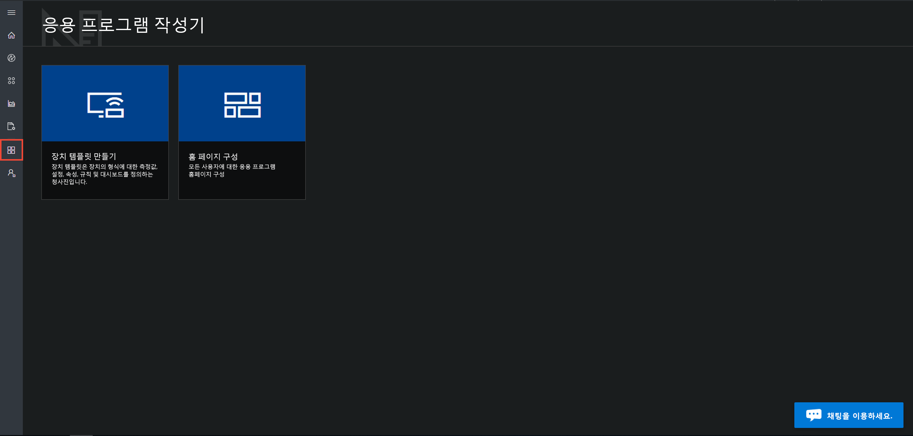

# Azure IoT Central UI 둘러보기

이 문서에서는 Microsoft Azure IoT Central UI를 소개합니다. UI를 사용하여 Azure IoT Central 솔루션과 연결된 장치를 생성, 관리 및 사용할 수 있습니다.

_개발자_는 Azure IoT Central UI를 사용하여 Azure IoT Central 솔루션을 정의할 수 있습니다. UI를 사용하여 다음을 수행할 수 있습니다.

- 솔루션에 연결하는 장치의 유형을 정의합니다.
- 장치에 대한 규칙 및 작업을 구성합니다.
- 솔루션을 사용하는 _운영자_에 맞게 UI를 사용자 지정합니다.

_운영자_는 Azure IoT Central UI를 사용하여 Azure IoT Central 솔루션을 관리합니다. UI를 사용하여 다음을 수행할 수 있습니다.

- 장치를 모니터링합니다.
- 장치를 구성합니다.
- 장치 문제를 해결하고 수정합니다.
- 새 디바이스를 프로비전합니다.

## 왼쪽 탐색 메뉴 사용

왼쪽 탐색 메뉴를 사용하여 응용 프로그램의 다른 영역에 액세스합니다.

| 메뉴 | 설명 |
| ---- | ----------- |
|  | <ul><li>**홈** 단추는 응용 프로그램의 홈 페이지를 표시합니다. 개발자는 운영자에 맞게 이 홈 페이지를 사용자 지정할 수 있습니다.</li><li>**Device Explorer** 단추는 응용 프로그램에 정의된 장치 템플릿과 각 장치 템플릿에 연결된 시뮬레이션 및 실제 장치를 모두 나열합니다. 운영자는 **Device Explorer**를 사용하여 연결된 장치를 관리합니다.</li><li>**장치 집합** 단추를 사용하여 장치 집합을 보고 만들 수 있습니다. 운영자는 장치 집합을 쿼리에 지정된 논리 컬렉션으로 만들 수 있습니다.</li><li>**Analytics** 단추는 장치 및 장치 집합에 대한 장치 원격 분석에서 파생된 분석을 보여 줍니다. 운영자는 장치 데이터 위에 사용자 지정 보기를 만들어 응용 프로그램에서 인사이트를 끌어낼 수 있습니다.</li><li>**작업** 단추를 사용하면 대규모 업데이트를 수행하는 작업을 생성하고 실행하여 대량 장치 관리를 수행할 수 있습니다.</li><li>**응용 프로그램 개발자** 단추는 **장치 템플릿 만들기** 도구와 같이 개발자가 사용하는 도구를 표시합니다.</li><li>**관리** 단추는 관리자가 응용 프로그램 설정, 사용자 및 역할을 관리할 수 있는 응용 프로그램 관리 페이지를 표시합니다.</li></ul> |

## 검색, 도움말 및 지원

모든 페이지에 상단 메뉴가 나타납니다.

- 장치 템플릿 및 장치를 검색하려면 **검색** 아이콘을 선택합니다.
- 도움말을 보거나 지원을 받으려면 리소스 목록에 대한 **도움말** 드롭다운을 선택합니다.
- 이 자습서를 제어하거나 UI 테마를 변경하거나 응용 프로그램에서 로그아웃하려면 **계정** 아이콘을 선택합니다.

UI의 밝은 테마 또는 어두운 테마 중에서 선택할 수 있습니다.

## 홈 페이지

홈 페이지는 Azure IoT Central 응용 프로그램에 로그인할 때 표시되는 첫 번째 페이지입니다. 개발자는 타일을 추가하여 응용 프로그램의 다른 사용자를 위해 홈 페이지를 사용자 지정할 수 있습니다. 자세한 내용은 [Azure IoT Central 운영자 보기 사용자 지정](tutorial-customize-operator.md) 자습서를 참조하세요.

## 디바이스 탐색기

Explorer 페이지는 Azure IoT Central 응용 프로그램의 _장치 템플릿_ 및 _장치_를 보여 줍니다.

* 장치 템플릿은 응용 프로그램에 연결할 수 있는 장치의 유형을 정의합니다. 자세한 내용은 [Azure IoT Central 응용 프로그램에 새 장치 유형 정의](tutorial-define-device-type.md)를 참조하세요.
* 장치는 응용 프로그램의 실제 또는 시뮬레이션된 장치를 나타냅니다. 자세한 내용은 [Azure IoT Central 응용 프로그램에 새 장치 추가](tutorial-add-device.md)를 참조하세요.

## 장치 집합

_장치 집합_ 페이지는 개발자가 만든 장치 집합을 표시합니다. 장치 집합은 관련 장치의 컬렉션입니다. 개발자는 장치 집합에 포함된 장치를 식별하는 쿼리를 정의합니다. 응용 프로그램에서 분석을 사용자 지정할 때 장치 집합을 사용합니다. 자세한 내용은 [Azure IoT Central 응용 프로그램에서 장치 집합 사용](howto-use-device-sets.md) 문서를 참조하세요.

## 분석

분석 페이지에는 응용 프로그램에 연결된 장치의 작동 방식을 이해하는 데 도움이 되는 차트가 표시됩니다. 운영자는 이 페이지를 사용하여 연결된 장치의 문제를 모니터링하고 조사합니다. 개발자는 이 페이지에 표시되는 차트를 정의할 수 있습니다. 자세한 내용은 [Azure IoT Central 응용 프로그램을 위한 사용자 지정 분석 만들기](howto-create-analytics.md) 문서를 참조하세요.

## 교육

작업 페이지에서는 디바이스에 대한 대량 디바이스 관리 작업을 수행할 수 있습니다. 이 빌더에서는 이 페이지를 사용하여 디바이스 속성, 설정 및 명령을 업데이트합니다. 자세한 내용은 [작업 실행](howto-run-a-job.md) 문서를 참조하세요.

## 응용 프로그램 작성자

응용 프로그램 개발자 페이지에는 개발자가 Azure IoT Central 응용 프로그램을 만드는 데 사용하는 도구에 대한 링크가 있습니다(예: 장치 템플릿 생성 및 홈 페이지 구성). 자세한 내용은 [Azure IoT Central 응용 프로그램에서 새 장치 유형 정의](tutorial-define-device-type.md) 자습서를 참조하세요.

## 관리

관리 페이지에는 응용 프로그램에서 관리자가 사용하는 도구에 대한 링크가 있습니다(예: 사용자 및 역할 정의). 자세한 내용은 [Azure IoT Central 응용 프로그램 관리](howto-administer.md) 문서를 참조하세요.

## 다음 단계

이제 Azure IoT Central의 개요를 알고 UI 레이아웃에 익숙해졌으므로, 권장되는 다음 단계는 [Azure IoT Central 응용 프로그램 만들기](quick-deploy-iot-central.md) 빠른 시작을 완료하는 것입니다.