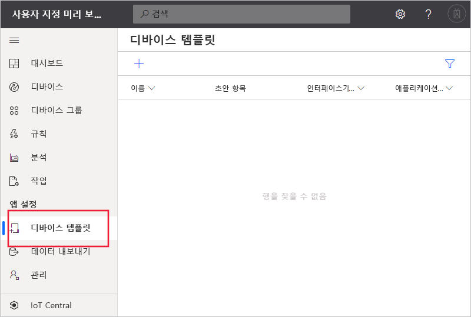
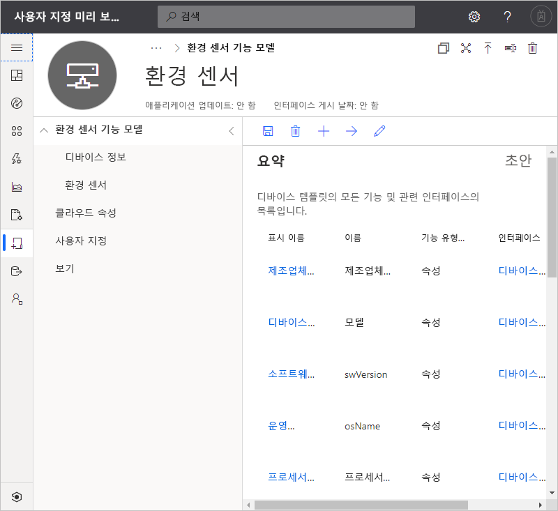
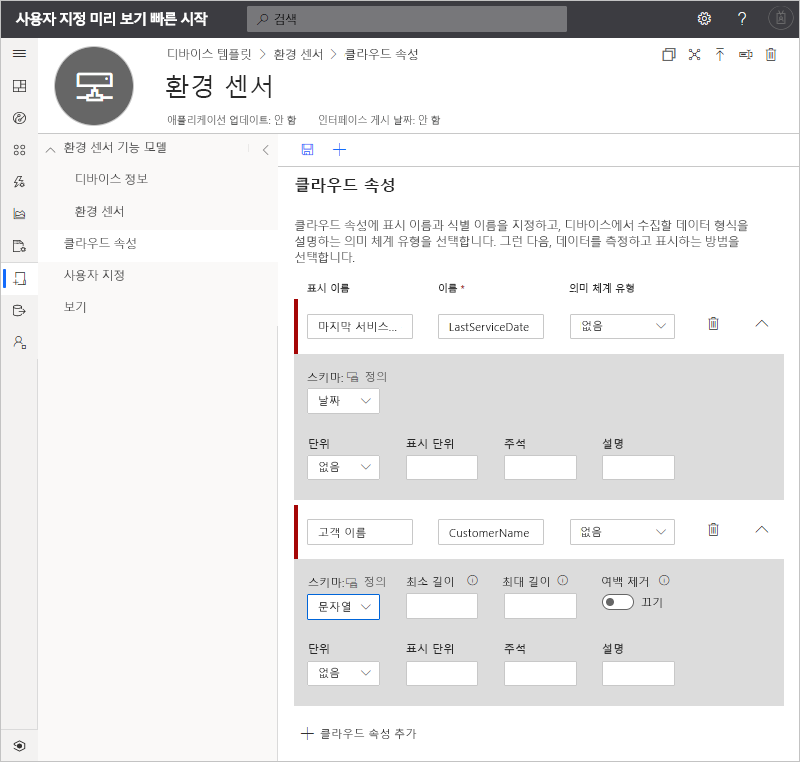
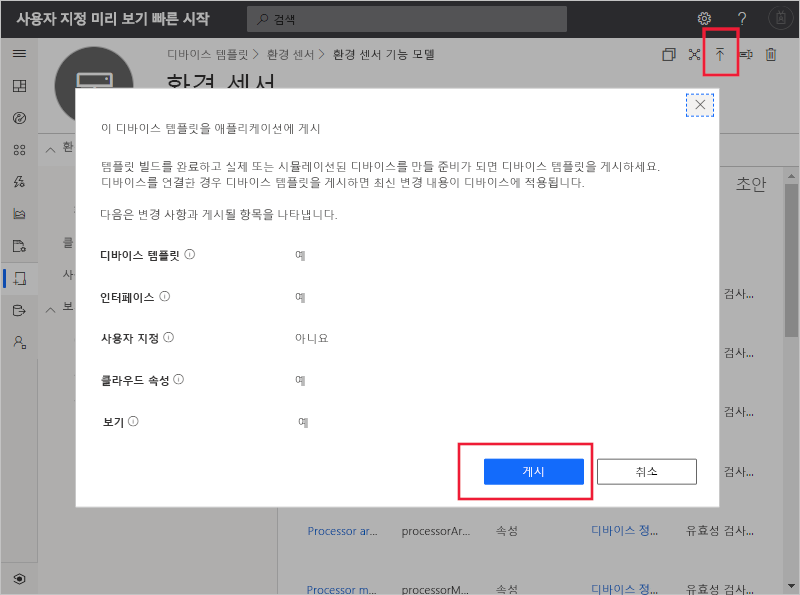
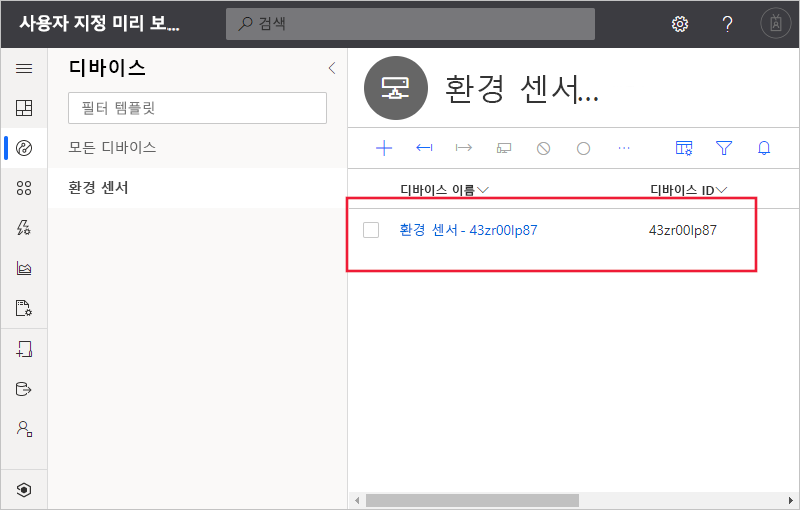
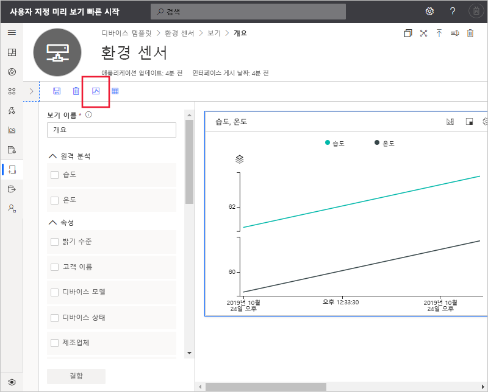

# 빠른 시작: IoT Central 애플리케이션에 시뮬레이션된 디바이스 추가(미리 보기 기능)

*이 문서는 운영자, 빌더 및 관리자에게 적용됩니다.*

[!INCLUDE [iot-central-pnp-original](../../../includes/iot-central-pnp-original-note.md)]

디바이스 템플릿은 IoT Central 애플리케이션에 연결하는 디바이스의 기능을 정의합니다. 기능에는 디바이스에서 보내는 원격 분석, 디바이스 속성 및 디바이스에서 응답하는 명령이 포함됩니다. 디바이스 템플릿에서 빌더 또는 운영자는 애플리케이션에 실제 및 시뮬레이션된 디바이스를 모두 추가할 수 있습니다. 시뮬레이션된 디바이스는 실제 디바이스를 연결하기 전에 IoT Central 애플리케이션의 동작을 테스트하는 데 유용합니다.

이 빠른 시작에서는 **환경 센서** 디바이스 템플릿을 만들고 시뮬레이션된 디바이스를 추가합니다. 환경 센서 디바이스는 다음과 같습니다.

* 원격 분석(예: 온도)을 보냅니다.
* 디바이스별 속성(예: 밝기 수준)을 보고합니다.
* 명령(예: 설정 및 해제)에 응답합니다.
* 일반 디바이스 속성(예: 펌웨어 버전 및 일련 번호)을 보고합니다.

## 사전 요구 사항

[Azure IoT Central 애플리케이션 만들기(미리 보기 기능)](./quick-deploy-iot-central.md) 빠른 시작을 완료하고 **사용자 지정 앱 > 미리 보기 애플리케이션** 템플릿을 사용하여 IoT Central 애플리케이션을 만듭니다.

또한 [IoT 플러그 앤 플레이](../../iot-pnp/overview-iot-plug-and-play.md) 디바이스 기능 모델이 포함된 **EnvironmentalSensorInline.capabilitymodel.json** 파일의 로컬 복사본이 필요합니다. [여기](https://raw.githubusercontent.com/Azure/IoTPlugandPlay/master/samples/EnvironmentalSensorInline.capabilitymodel.json)에서 다운로드할 수 있습니다. 마우스 오른쪽 단추로 페이지를 클릭하고, **다른 이름으로 저장**을 선택합니다.

파일이 다운로드되면 텍스트 편집기에서 파일을 열고 `<YOUR_COMPANY_NAME_HERE>`의 두 인스턴스를 사용자의 이름으로 바꿉니다. a-z, A-Z, 0-9 및 밑줄 문자만 사용합니다.

## 템플릿 만들기

작성기처럼 애플리케이션에서 디바이스 템플릿을 만들고 편집할 수 있습니다. 디바이스 템플릿이 게시되면 시뮬레이션된 디바이스를 생성하거나 디바이스 템플릿을 구현하는 실제 디바이스를 연결할 수 있습니다. 시뮬레이션된 디바이스를 사용하면 실제 디바이스를 연결하기 전에 애플리케이션의 동작을 테스트할 수 있습니다.

새 디바이스 템플릿을 애플리케이션에 추가하려면 **디바이스 템플릿** 페이지로 이동합니다. 이렇게 하려면 왼쪽 창에서 **디바이스 템플릿** 탭을 선택합니다.

### 디바이스 기능 모델 추가

IoT Central에는 디바이스 기능 모델을 작성하기 위한 몇 가지 옵션이 있습니다. 사용자 지정 모델을 처음부터 만들거나, 파일에서 가져오거나, 디바이스 카탈로그에서 선택하거나, 디바이스 기능 모델이 퍼블릭 리포지토리에 게시된 디바이스 우선 연결을 통해 IoT 플러그 앤 플레이 디바이스를 연결하도록 선택할 수 있습니다. 이 자습서에서는 디바이스 기능 모델을 파일에서 가져옵니다.

다음 단계에서는 **환경 센서** 디바이스의 기능 모델을 가져오는 방법을 보여 줍니다. 이러한 디바이스는 온도와 같은 원격 분석을 애플리케이션에 보냅니다.

1. 새 디바이스 템플릿을 추가하려면 **디바이스 템플릿** 페이지에서 **+** 를 선택합니다.

1. 사용자 지정 디바이스 템플릿 목록에서 **IoT 디바이스**를 선택하고, **다음: 사용자 지정**을 선택한 다음, **다음: 검토**를 선택한 다음, **만들기**를 선택합니다.

1. 디바이스 템플릿 이름으로 **환경 센서**를 입력합니다.

1. **기능 모델 가져오기**를 선택하여 JSON 파일에서 새 디바이스 기능 모델을 만듭니다. **EnvironmentalSensorInline.capabilitymodel.json** 파일을 로컬 머신에 저장한 폴더로 이동합니다. **EnvironmentalSensorInline.capabilitymodel.json** 파일을 선택한 다음, **열기**를 선택합니다. 환경 센서 기능 모델에 **환경 센서** 및 **디바이스 정보** 인터페이스가 포함됩니다.

    

    이러한 인터페이스는 **환경 센서** 디바이스의 기능을 정의합니다. 기능에는 디바이스에서 보내는 원격 분석, 디바이스에서 보고하는 속성 및 디바이스에서 응답하는 명령이 포함됩니다.

### 클라우드 속성 추가

디바이스 템플릿에는 클라우드 속성이 포함될 수 있습니다. 클라우드 속성은 IoT Central 애플리케이션에만 있으며 디바이스에서 보내거나 받지 않습니다.

1. **클라우드 속성**, **+ 클라우드 속성 추가**를 차례로 선택합니다. 다음 표의 정보를 사용하여 클라우드 속성을 디바이스 템플릿에 추가합니다.

    | 표시 이름      | 의미 체계 유형 | 스키마 |
    | ----------------- | ------------- | ------ |
    | 마지막 서비스 날짜 | None          | Date   |
    | 고객 이름     | None          | String |

1. **저장**을 선택하여 변경 내용을 저장합니다.

    

## 뷰 만들기

작성기처럼 환경 센서 디바이스와 관련된 정보를 운영자에게 표시하도록 애플리케이션을 사용자 지정할 수 있습니다. 사용자 지정을 사용하면 운영자가 애플리케이션에 연결된 환경 센서 디바이스를 관리할 수 있습니다. 운영자가 디바이스와 상호 작용하는 데 사용할 다음 두 가지 유형의 보기를 만들 수 있습니다.

* 디바이스 및 클라우드 속성을 보고 편집하는 양식
* 디바이스를 시각화하는 대시보드

### 기본 보기 생성

기본 보기를 생성하면 중요한 디바이스 정보를 빠르게 시각화할 수 있습니다. 디바이스 템플릿에 대해 최대 세 개의 기본 보기를 생성할 수 있습니다.

* **명령** 보기를 사용하면 운영자가 명령을 디바이스에 보낼 수 있습니다.
* **개요** 보기는 차트와 메트릭을 사용하여 디바이스 원격 분석을 표시합니다.
* **정보** 보기는 디바이스 속성을 표시합니다.

**보기**를 선택한 다음, **기본 보기 생성**을 선택합니다.

### 디바이스를 시각화하도록 보기 구성

디바이스 대시보드를 사용하면 운영자가 차트와 메트릭을 사용하여 디바이스를 시각화할 수 있습니다. 작성기로서 디바이스 대시보드에 표시되는 정보를 정의할 수 있습니다. 디바이스에 대해 여러 개의 대시보드를 정의할 수 있습니다. 환경 센서 원격 분석을 시각화하는 대시보드를 만들려면 **보기**, **디바이스를 시각화하는 중**을 차례로 선택합니다.

1. 모든 디바이스 속성, 클라우드 속성, 원격 분석 및 정적 옵션이 **속성**에 나열됩니다. 이러한 항목 중 하나를 보기로 끌어서 놓을 수 있습니다. **밝기 수준** 속성을 보기로 끌어옵니다. 기어 아이콘을 사용하여 타일을 구성할 수 있습니다.

1. 원격 분석을 그리는 차트를 추가하려면 **습도** 및 **온도**, **결합**을 차례로 선택합니다. 이 차트를 다른 형식(예: 원형 차트 또는 막대형 차트)으로 보려면 타일 위쪽의 **시각화 변경** 단추를 선택합니다.

1. **저장**을 선택하여 보기를 저장합니다.

다른 속성 또는 원격 분석 값을 표시하는 타일을 추가할 수 있습니다. 정적 텍스트, 링크 및 이미지도 추가할 수 있습니다. 대시보드에서 타일을 이동하거나 크기를 조정하려면 마우스 포인터를 타일 위로 이동하여 해당 타일을 새 위치로 끌거나 크기를 조정합니다.

### 디바이스 양식 추가

디바이스 양식을 사용하면 운영자가 쓰기 가능한 디바이스 속성 및 클라우드 속성을 편집할 수 있습니다. 작성기처럼 여러 양식을 정의하고, 각 양식에 표시할 디바이스 및 클라우드 속성을 선택할 수 있습니다. 또한 읽기 전용 디바이스 속성을 양식에 표시할 수 있습니다.

환경 센서 속성을 보고 편집할 양식을 만들려면 다음을 수행합니다.

1. **환경 센서** 템플릿에서 **보기**로 이동합니다. **디바이스 및 클라우드 데이터 편집** 타일을 선택하여 새 보기를 추가합니다.

1. **환경 센서 속성**이라는 양식 이름을 입력합니다.

1. **고객 이름** 및 **마지막 서비스 날짜** 클라우드 속성을 양식의 기존 섹션으로 끕니다.

1. **밝기 수준** 및 **디바이스 상태** 디바이스 속성을 선택합니다. 그런 다음, **섹션 추가**를 선택합니다. 섹션의 제목을 **센서 속성**으로 편집합니다. **적용**을 선택합니다.

1. **디바이스 모델**, **소프트웨어 버전**, **제조업체** 및 **프로세서 제조업체** 디바이스 속성을 선택합니다. 그런 다음, **섹션 추가**를 선택합니다. 섹션의 제목을 **디바이스 속성**으로 편집합니다. **적용**을 선택합니다.

1. **저장**을 선택하여 보기를 저장합니다.

## 디바이스 템플릿 게시

시뮬레이션된 환경 센서를 만들거나 실제 환경 센서를 연결하려면 먼저 디바이스 템플릿을 게시해야 합니다.

디바이스 템플릿을 게시하려면 다음을 수행합니다.

1. **디바이스 템플릿** 페이지에서 디바이스 템플릿으로 이동합니다.

1. **게시**를 선택합니다.

1. **디바이스 템플릿 게시** 대화 상자에서 **게시**를 선택합니다.

    

디바이스 템플릿이 게시되면 해당 템플릿이 **디바이스** 페이지 및 운영자에게 표시됩니다. 게시된 디바이스 템플릿에서 새 버전을 만들어야 디바이스 기능 모델을 편집할 수 있습니다. 그러나 클라우드 속성, 사용자 지정 및 보기는 버전 관리를 수행하지 않고도 게시된 디바이스 템플릿에서 업데이트할 수 있습니다. 변경되면 **게시**를 선택하여 해당 변경 내용을 운영자에게 푸시합니다.

## 시뮬레이트된 디바이스 추가

애플리케이션에 시뮬레이션된 디바이스를 추가하려면 사용자가 만든 **환경 센서** 디바이스 템플릿을 사용합니다.

1. 운영자로서 새 디바이스를 추가하려면 왼쪽 창에서 **디바이스**를 선택합니다. **디바이스** 탭에는 **모든 디바이스** 및 **환경 센서** 디바이스 템플릿이 표시됩니다. **환경 센서**를 선택합니다.

1. 시뮬레이션된 센서 디바이스를 추가하려면 **+ 새로 만들기**를 선택합니다. 제안된 **디바이스 ID**를 사용하거나 원하는 **디바이스 ID**를 소문자로 입력합니다. 새 디바이스의 이름을 입력할 수도 있습니다. **시뮬레이션됨** 토글을 **켜기**로 전환한 다음, **만들기**를 선택합니다.

    

이제 시뮬레이션된 데이터를 사용하여 개발자가 만든 보기와 상호 작용할 수 있습니다.

## 시뮬레이션된 디바이스를 사용하여 보기 개선

시뮬레이션된 디바이스를 새로 만든 후에는 개발자가 이 디바이스를 사용하여 디바이스 템플릿의 보기를 지속적으로 개선하고 향상할 수 있습니다.

1. 왼쪽 창에서 **디바이스 템플릿**을 선택하고 **환경 센서** 템플릿을 선택합니다.

1. 편집하려는 보기를 선택하거나 새 보기를 만듭니다. **미리 보기 디바이스 구성**을 클릭한 다음, **실행 중인 디바이스에서 선택**을 클릭합니다. 여기서는 미리 보기 디바이스를 사용하지 않거나, 테스트용으로 구성할 수 있는 실제 디바이스를 사용하거나, IoT Central에 추가한 기존 디바이스를 사용하는 세 가지 방법 중에 선택할 수 있습니다.

1. 목록에서 시뮬레이션된 디바이스를 선택합니다. 그런 다음, **적용**을 선택합니다. 이제 디바이스 템플릿 보기 빌드 환경에 동일한 시뮬레이션된 디바이스가 표시됩니다. 이 보기는 차트 및 기타 시각화에 유용합니다.

    

## 다음 단계

이 빠른 시작에서는 **환경 센서** 디바이스 템플릿을 만들고 시뮬레이트된 디바이스를 애플리케이션에 추가하는 방법을 알아보았습니다.

애플리케이션에 연결된 디바이스를 모니터링하는 방법에 대해 자세히 알아보려면 빠른 시작을 계속 진행합니다.

> [!div class="nextstepaction"]
> [규칙 및 작업 구성](./quick-configure-rules.md)
