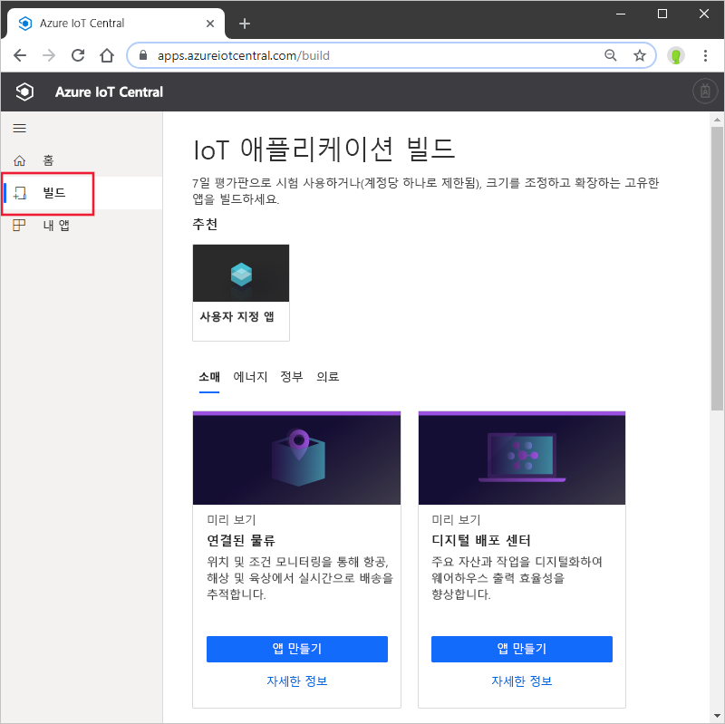
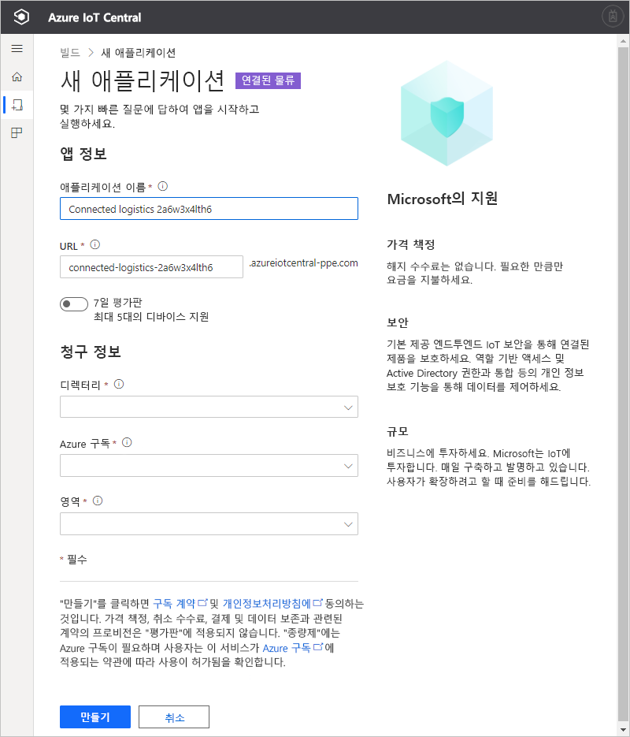

# Azure IoT Central 애플리케이션 만들기(미리 보기 기능)

[!INCLUDE [iot-central-pnp-original](../../../includes/iot-central-pnp-original-note.md)]

이 빠른 시작에서는 IoT 플러그 앤 플레이와 같은 미리 보기 기능을 포함하는 Azure IoT Central 애플리케이션을 만드는 방법을 보여 줍니다.

> [!WARNING]
> Azure IoT Central의 IoT 플러그 앤 플레이 기능은 현재 공개 미리 보기로 제공됩니다. IoT 플러그 앤 플레이 지원 IoT Central 애플리케이션을 프로덕션 워크로드에 사용하지 마세요. 프로덕션 환경에서는 일반적으로 사용 가능한 최신 애플리케이션 템플릿에서 만든 IoT Central 애플리케이션을 사용합니다.

## 애플리케이션 만들기

[Azure IoT Central 빌드](https://aka.ms/iotcentral) 사이트로 이동합니다. 그런 다음, Microsoft 개인, 회사 또는 학교 계정으로 로그인합니다.

업계 관련 IoT Central 템플릿 목록에서 새 애플리케이션을 만들어 빠르게 시작하거나 **사용자 지정 앱** 템플릿을 사용하여 처음부터 시작할 수 있습니다.

새로운 Azure IoT Central 애플리케이션을 만들려면:

1. *산업 템플릿*에서 새 Azure IoT Central 애플리케이션을 만들려면 업계 중 하나의 사용 가능한 템플릿 목록에서 애플리케이션 템플릿을 선택합니다. *사용자 지정 앱*을 선택하여 처음부터 시작할 수도 있습니다.
1. Azure IoT Central은 선택한 애플리케이션 템플릿을 기반으로 **애플리케이션 이름**을 자동으로 제안합니다. 이 이름을 그대로 사용하거나 친숙한 애플리케이션 이름을 입력할 수 있습니다.
1. 또한 Azure IoT Central은 애플리케이션 이름에 따라 고유한 **애플리케이션 URL** 접두사를 생성합니다. 이 URL을 사용하여 애플리케이션에 액세스합니다. 원하는 경우 이 URL 접두사를 더욱 기억하기 쉬운 것으로 자유롭게 변경할 수 있습니다.

    

    > [!NOTE]
    > 사용자 지정 앱 템플릿을 사용하는 경우 **애플리케이션 템플릿** 드롭다운 필드가 표시됩니다. 여기에서 미리 보기 및 일반적으로 사용 가능한 템플릿 간을 전환할 수 있습니다. 조직에서 사용할 수 있게 된 다른 템플릿도 표시될 수 있습니다.

1. 7일 평가판을 사용하여 이 애플리케이션을 만들지, 아니면 종량제 구독을 사용할지 선택합니다.
    - **평가판** 애플리케이션은 7일 동안 무료로 제공되며 최대 5개의 디바이스를 지원합니다. 만료되기 전에 언제든지 종량제로 변환할 수 있습니다. 평가판 애플리케이션을 만드는 경우 연락처 정보를 입력하고 Microsoft에서 정보 및 팁을 받을 것인지 여부를 선택합니다.
    - **종량제** 애플리케이션은 처음 2개의 디바이스는 무료로 사용하며, 디바이스별로 요금이 청구됩니다. [IoT Central 가격 책정](https://aka.ms/iotcentral-pricing)에 대해 자세히 알아보세요. 종량제 애플리케이션을 만드는 경우 *디렉터리*, *Azure 구독* 및 *위치*를 선택해야 합니다.
        - *디렉터리*는 애플리케이션을 만드는 AAD(Azure Active Directory)입니다. Azure AD에는 사용자 ID, 자격 증명 및 기타 조직 정보가 포함됩니다. Azure AD가 없는 경우 Azure 구독을 만들면 자동으로 하나가 생성됩니다.
        - *Azure 구독*을 사용하여 Azure 서비스 인스턴스를 만들 수 있습니다. IoT Central은 구독에서 리소스를 프로비저닝합니다. Azure 구독이 아직 없는 경우 [Azure 등록 페이지](https://aka.ms/createazuresubscription)에서 만들 수 있습니다. Azure 구독을 만든 후 다시 **애플리케이션 만들기** 페이지로 돌아갑니다. **Azure 구독** 드롭다운에 새 구독이 표시됩니다.
        - *위치*는 애플리케이션을 만들려는 [지리](https://azure.microsoft.com/global-infrastructure/geographies/)입니다. 일반적으로 최적의 성능을 얻으려면 디바이스와 물리적으로 가장 가까운 위치를 선택해야 합니다. Azure IoT Central 공개 미리 보기는 현재 **미국** 또는 **유럽**에서 사용할 수 있습니다. 위치를 선택하면 나중에 다른 위치로 애플리케이션을 이동할 수 없습니다.

        > [!NOTE]
        > 공개 미리 보기 기간 동안 **미리 보기 애플리케이션**에 사용할 수 있는 유일한 위치는 **유럽** 및**미국**입니다.

1. 사용 약관을 검토하고, 페이지 맨 아래에서 **만들기**를 선택합니다.

## 다음 단계

이 빠른 시작에서는 IoT Central 애플리케이션을 만들었습니다. 권장되는 단계는 다음과 같습니다.

> [!div class="nextstepaction"]
> [IoT Central 애플리케이션에 시뮬레이트된 디바이스 추가](./quick-create-pnp-device.md)
