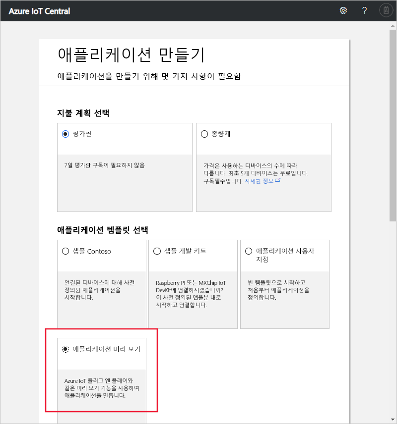

# Azure IoT Central 애플리케이션 만들기(미리 보기 기능)

[!INCLUDE [iot-central-pnp-original](../../includes/iot-central-pnp-original-note.md)]

이 빠른 시작에서는 IoT 플러그 앤 플레이와 같은 미리 보기 기능을 사용하는 Azure IoT Central 애플리케이션을 만드는 방법을 보여줍니다.

> [!WARNING]
> Azure IoT Central의 IoT 플러그 앤 플레이 기능은 현재 공개 미리 보기로 제공됩니다. 프로덕션 워크로드에 대해 IoT 플러그 앤 플레이 사용 IoT Central 애플리케이션을 사용하지 마세요. 프로덕션 환경에서는 일반적으로 사용 가능한 최신 애플리케이션 템플릿에서 만든 IoT Central 애플리케이션을 사용합니다.

## 애플리케이션 만들기

[Azure IoT Central 애플리케이션 관리자](https://aka.ms/iotcentral) 웹 사이트로 이동합니다. 그런 다음, Microsoft 개인, 회사 또는 학교 계정을 사용하여 로그인합니다.

새로운 Azure IoT Central 애플리케이션 만들기를 시작하려면 **새 애플리케이션**을 선택합니다. 그러면 **애플리케이션 만들기** 페이지로 이동합니다.

IoT 플러그 앤 플레이와 같은 미리 보기 기능을 포함하는 새 Azure IoT Central 애플리케이션을 만들려면 다음을 수행합니다.

1. 결제 계획을 선택합니다.
   - **평가판** 애플리케이션은 7일 동안 무료이며 이후에는 만료됩니다. 만료되기 전에 언제든지 종량제로 변환할 수 있습니다. **평가판** 애플리케이션을 만드는 경우 연락처 정보를 입력하고 Microsoft에서 정보 및 팁을 받을 것인지 여부를 선택합니다.
   - **종량제** 애플리케이션은 처음 5개의 디바이스는 무료로 사용하며, 디바이스별로 요금이 청구됩니다. **종량제** 애플리케이션을 만드는 경우 *디렉터리*, *Azure 구독* 및 *지역*을 선택해야 합니다.
      - *디렉터리*는 애플리케이션을 만드는 Azure AD(Active Directory)입니다. 사용자 ID, 자격 증명 및 기타 조직 정보가 포함됩니다. Azure AD가 없는 경우 Azure 구독을 만들면 자동으로 하나가 생성됩니다.
      - *Azure 구독*을 사용하여 Azure 서비스 인스턴스를 만들 수 있습니다. IoT Central은 구독에서 리소스를 프로비전합니다. Azure 구독이 아직 없는 경우 [Azure 등록 페이지](https://aka.ms/createazuresubscription)에서 만들 수 있습니다. Azure 구독을 만든 후 다시 **애플리케이션 만들기** 페이지로 돌아갑니다. **Azure 구독** 드롭다운에 새 구독이 표시됩니다.
      - *지역*은 애플리케이션을 만들려는 실제 위치입니다. 일반적으로 최적의 성능을 얻으려면 디바이스와 물리적으로 가장 가까운 지역을 선택해야 합니다. Azure IoT Central을 사용할 수 있는 지역은 [지역별 사용 가능한 제품](https://azure.microsoft.com/regions/services/) 페이지에서 확인할 수 있습니다. 일단 지역을 선택하면 애플리케이션을 다른 지역으로 이동할 수 없습니다.

      [Azure IoT Central 가격 책정 페이지](https://azure.microsoft.com/pricing/details/iot-central/)에서 가격 책정에 대해 자세히 알아보세요.

1. **Contoso IoT** 같은 친숙한 애플리케이션 이름을 선택합니다. Azure IoT Central은 사용자를 위해 고유한 URL 접두사를 생성합니다. 이 URL 접두사를 더욱 기억하기 쉬운 것으로 변경할 수 있습니다.

1. **미리 보기 애플리케이션** 템플릿을 선택합니다. 애플리케이션 템플릿에는 시작하는 데 도움이 되는 디바이스 템플릿이나 대시보드 같은 미리 정의된 항목이 포함될 수 있습니다.

1. 페이지의 맨 아래에서 **만들기**를 선택합니다.

## 다음 단계

이 빠른 시작에서는 미리 보기 기능을 사용하는 IoT Central 애플리케이션을 만들었습니다. 권장되는 다음 단계는 다음과 같습니다.

> [!div class="nextstepaction"]
> [Azure IoT Central 애플리케이션에서 새 디바이스 유형 정의](./tutorial-define-device-type-pnp.md?toc=/azure/iot-central-pnp/toc.json&bc=/azure/iot-central-pnp/breadcrumb/toc.json)
