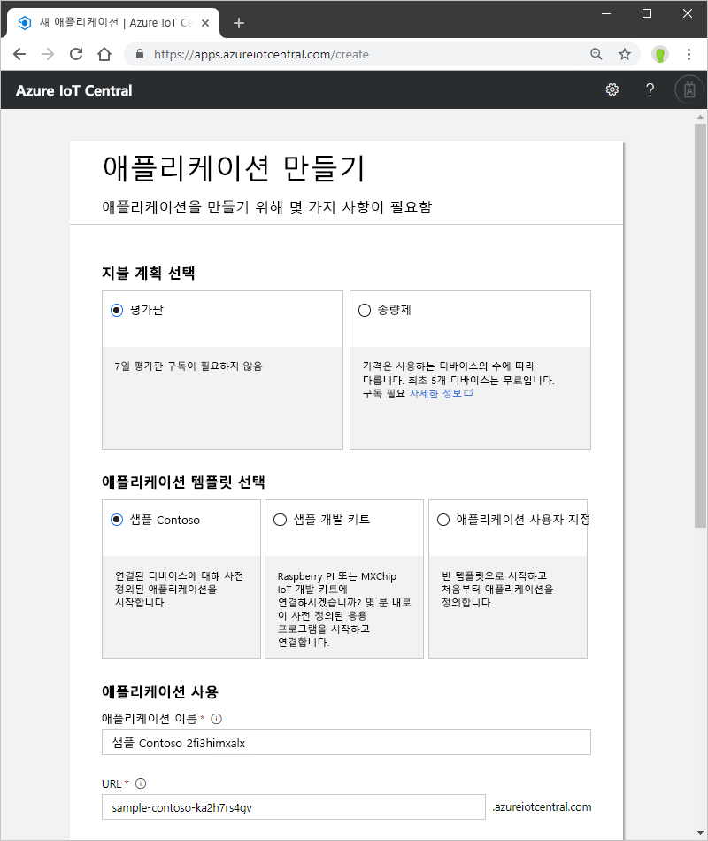

# Azure IoT Central 애플리케이션 만들기

_작성기_로 Azure IoT Central UI를 사용하여 Microsoft Azure IoT Central 애플리케이션을 정의합니다. 이 빠른 시작에서는 샘플 _장치 템플릿_ 및 시뮬레이션된 _장치_를 포함하는 Azure IoT Central 애플리케이션을 만드는 방법을 보여 줍니다.

## 애플리케이션 만들기

Azure IoT Central [애플리케이션 관리자](https://aka.ms/iotcentral) 페이지로 이동합니다. Microsoft 개인 또는 회사 또는 학교 계정을 사용하여 로그인해야 합니다.

새로운 Azure IoT Central 애플리케이션 만들기를 시작하려면 **새 애플리케이션**을 선택합니다. **애플리케이션 만들기** 페이지로 이동합니다.

새로운 Azure IoT Central 애플리케이션을 만들려면:

1. 결제 계획을 선택합니다.
   - **평가판** 애플리케이션은 7일 동안 무료이며 이후에는 만료됩니다. 만료되기 전에 언제든지 종량제로 변환할 수 있습니다. **평가판** 애플리케이션을 만드는 경우 연락처 정보를 입력하고 Microsoft에서 정보 및 팁을 받을 것인지 여부를 선택합니다.
   - **종량제** 애플리케이션은 처음 5개의 디바이스는 무료로 사용하며, 디바이스별로 요금이 청구됩니다. **종량제** 애플리케이션을 만드는 경우 *디렉터리*, *Azure 구독* 및 *지역*을 선택해야 합니다.
      - *디렉터리*는 애플리케이션을 만드는 Azure AD(Active Directory)입니다. 사용자 ID, 자격 증명 및 기타 조직 정보가 포함됩니다. Azure AD가 없는 경우 Azure 구독을 만들면 자동으로 하나가 생성됩니다.
      - *Azure 구독*을 사용하여 Azure 서비스 인스턴스를 만들 수 있습니다. IoT Central은 구독에서 리소스를 프로비전합니다. Azure 구독이 아직 없는 경우 [Azure 등록 페이지](https://aka.ms/createazuresubscription)에서 만들 수 있습니다. Azure 구독을 만든 후 다시 **애플리케이션 만들기** 페이지로 돌아갑니다. **Azure 구독** 드롭다운에 새 구독이 표시됩니다.
      - *지역*은 애플리케이션을 만들려는 실제 위치입니다. 일반적으로 최적의 성능을 얻기 위해 디바이스에 물리적으로 가장 가까운 지역을 선택해야 합니다. [지역별 사용 가능한 제품](https://azure.microsoft.com/regions/services/) 페이지에서 Azure IoT Central을 사용할 수 있는 지역을 확인할 수 있습니다. 일단 지역을 선택하면 애플리케이션을 다른 지역으로 이동할 수 없습니다.

      [Azure IoT Central 가격 책정 페이지](https://azure.microsoft.com/pricing/details/iot-central/)에서 가격 책정에 대해 자세히 알아보세요.

1. **Contoso IoT** 같은 친숙한 애플리케이션 이름을 선택합니다. Azure IoT Central은 사용자를 위해 고유한 URL 접두사를 생성합니다. 이 URL 접두사를 더욱 기억하기 쉬운 것으로 변경할 수 있습니다.

1. 애플리케이션 템플릿을 선택합니다. 애플리케이션 템플릿에는 시작하는 데 도움이 되는 장치 템플릿이나 대시보드 같은 미리 정의된 항목이 포함될 수 있습니다.

    | 애플리케이션 템플릿 | 설명 |
    | -------------------- | ----------- |
    | 샘플 Contoso       | Refrigerated Vending Machine에 대해 이미 만든 장치 템플릿을 포함하는 애플리케이션을 만듭니다. 이 템플릿을 사용하여 Azure IoT Central 탐색을 시작하세요. |
    | 샘플 Devkits       | MXChip 또는 Raspberry Pi 장치를 연결할 수 있는 장치 템플릿을 사용하여 애플리케이션을 만듭니다. 다음 디바이스 중 하나를 실험하는 디바이스 개발자인 경우 이 템플릿을 사용합니다. |
    | 사용자 지정 애플리케이션   | 사용자 고유의 장치 템플릿 및 장치로 채울 빈 애플리케이션을 만듭니다. |

1. **만들기**를 선택합니다.

## 다음 단계

이 빠른 시작에서는 IoT Central 애플리케이션을 만들었습니다. 권장되는 단계는 다음과 같습니다.

> [!div class="nextstepaction"]
> [IoT Central 둘러보기](overview-iot-central-tour.md)
