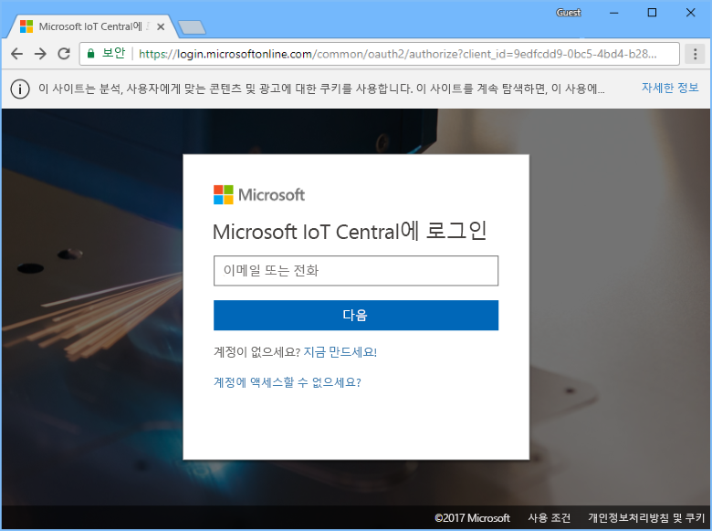
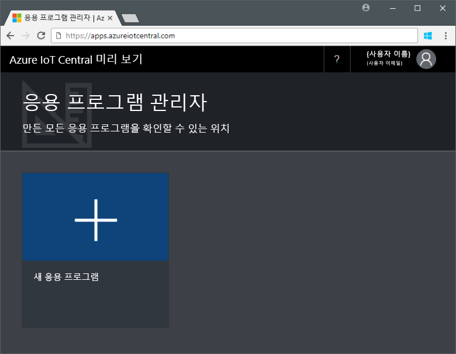

# Azure IoT Central 응용 프로그램 만들기

_작성기_로 Azure IoT Central UI를 사용하여 Microsoft Azure IoT Central 응용 프로그램을 정의합니다. 이 빠른 시작에서는 샘플 _장치 템플릿_ 및 시뮬레이션된 _장치_를 포함하는 Azure IoT Central 응용 프로그램을 만드는 방법을 보여 줍니다.

## 응용 프로그램 만들기

이 빠른 시작을 완료하려면 **샘플 Contoso** 응용 프로그램 템플릿에서 Azure IoT Central 응용 프로그램을 만들어야 합니다.

Azure IoT Central [응용 프로그램 관리자](https://aka.ms/iotcentral) 페이지로 이동합니다. 그런 다음, Azure 구독에 액세스 하는 데 사용하는 이메일 주소와 암호를 입력합니다.

새로운 Azure IoT Central 응용 프로그램 만들기를 시작하려면 **새 응용 프로그램**을 선택합니다.

새로운 Azure IoT Central 응용 프로그램을 만들려면:

1. **체험 평가판 응용 프로그램** 결제 계획을 선택합니다.
1. **Contoso IoT** 같은 친숙한 응용 프로그램 이름을 선택합니다. Azure IoT Central은 사용자를 위해 고유한 URL 접두사를 생성합니다. 이 URL 접두사를 더욱 기억하기 쉬운 것으로 변경할 수 있습니다.
1. **샘플 Contoso** 응용 프로그램 템플릿을 선택합니다.
1. 그런 다음 **만들기**를 선택합니다.

## 다음 단계

이 빠른 시작에서는 **냉장 자동 판매기** 장치 템플릿 및 시뮬레이션된 장치를 포함하는 미리 채워진 Azure IoT Central 응용 프로그램을 만들었습니다. 작성기로 자체 장치 템플릿을 정의하는 방법에 대한 자세한 내용은 [응용 프로그램에서 새 장치 템플릿 정의](tutorial-define-device-type.md)를 참조합니다.
