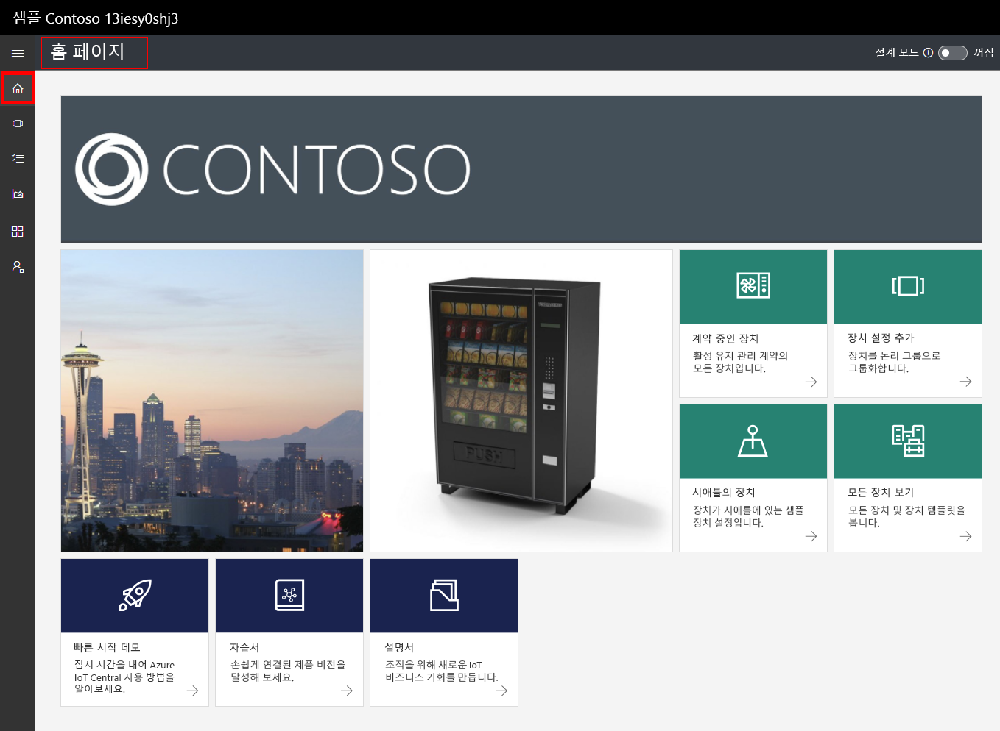
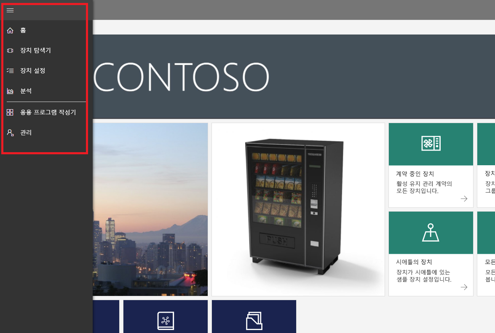
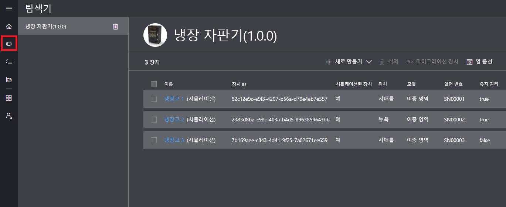
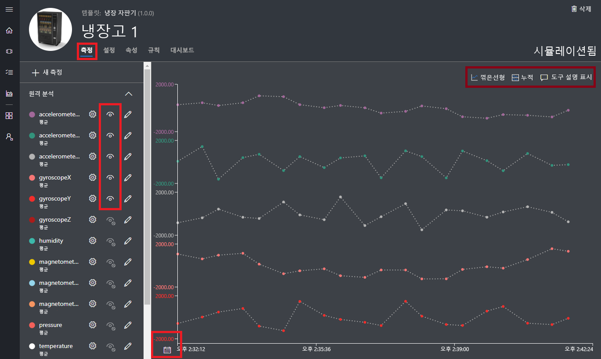
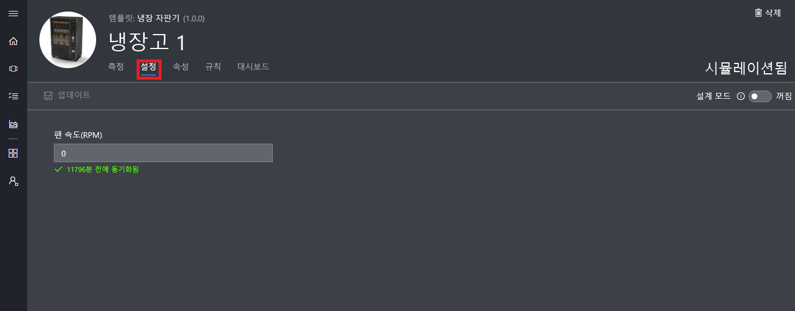
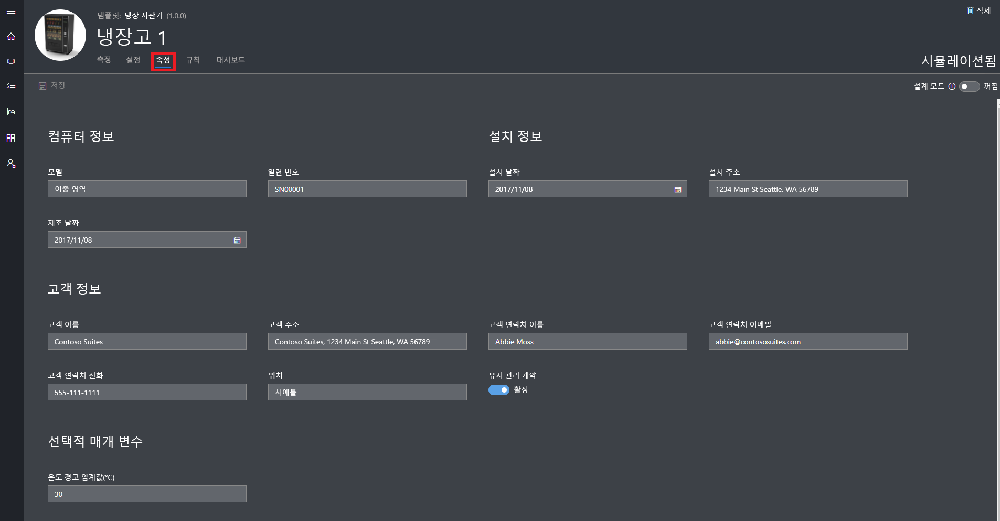
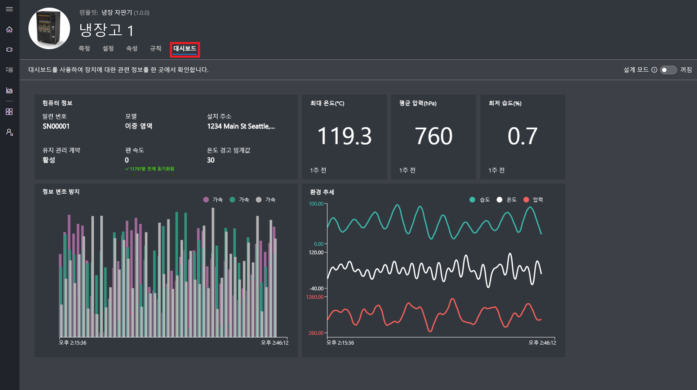
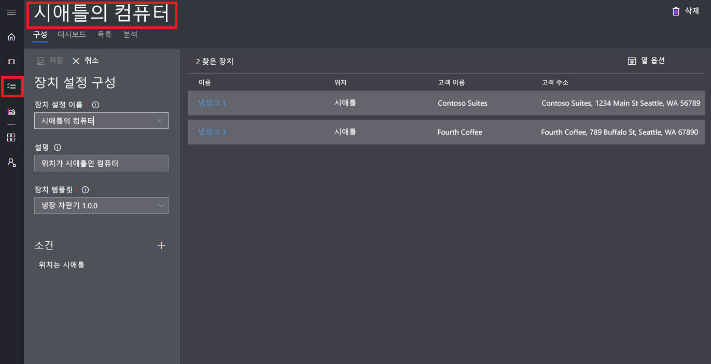
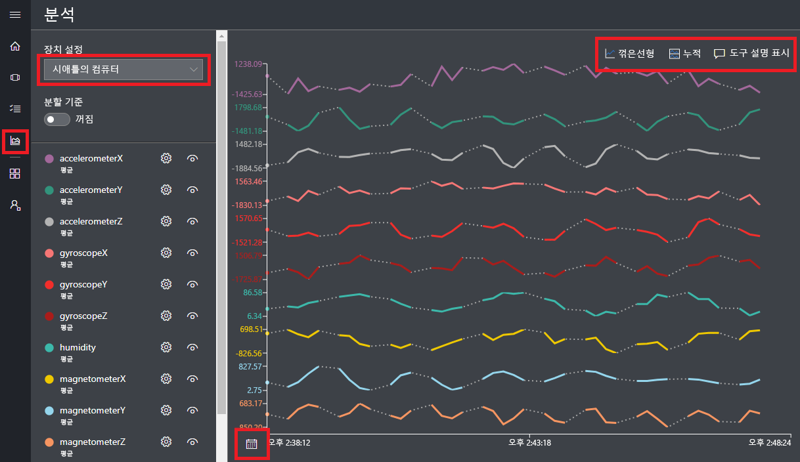

# Azure IoT Central 응용 프로그램 만들기

_작성기_로 Azure IoT Central UI를 사용하여 Microsoft Azure IoT Central 응용 프로그램을 정의합니다. 이 빠른 시작에서는 다음을 수행하는 방법을 보여 줍니다.

- 샘플 _장치 템플릿_ 및 시뮬레이션된 _장치_를 포함하는 Azure IoT Central 응용 프로그램을 만듭니다.
- 응용 프로그램에서 **냉장 자동 판매기** 장치 템플릿의 기능을 봅니다.
- 시뮬레이션된 **냉장** 장치에서 원격 분석 및 분석을 봅니다.

이 빠른 시작에서는 장치 템플릿에서 시뮬레이션된 **냉장** 장치를 보여줍니다. 시뮬레이션된 장치:

* 압력 및 온도 같은 원격 분석을 응용 프로그램에 보냅니다.
* 동작 경고 같은 장치 속성 값을 응용 프로그램에 보고합니다.
* 응용 프로그램에서 설정할 수 있는 팬 속도 같은 장치 설정이 있습니다.

Azure IoT Central 응용 프로그램의 장치 템플릿에서 시뮬레이션된 장치를 만들 경우 시뮬레이션된 장치를 사용하면 실제 장치를 연결하기 전에 응용 프로그램을 테스트할 수 있습니다.

## 응용 프로그램 만들기

이 빠른 시작을 완료하려면 **샘플 Contoso** 응용 프로그램 템플릿에서 Azure IoT Central 응용 프로그램을 만들어야 합니다.

Azure IoT Central [응용 프로그램 관리자](https://aka.ms/iotcentral) 페이지로 이동합니다. 그런 다음, Azure 구독에 액세스 하는 데 사용하는 이메일 주소와 암호를 입력합니다.

새로운 Azure IoT Central 응용 프로그램 만들기를 시작하려면 **새 응용 프로그램**을 선택합니다.

새로운 Azure IoT Central 응용 프로그램을 만들려면:

1. **체험 평가판 응용 프로그램** 결제 계획을 선택합니다.
1. **Contoso IoT** 같은 친숙한 응용 프로그램 이름을 선택합니다. Azure IoT Central은 사용자를 위해 고유한 URL 접두사를 생성합니다. 이 URL 접두사를 더욱 기억하기 쉬운 것으로 변경할 수 있습니다.
1. **샘플 Contoso** 응용 프로그램 템플릿을 선택합니다.
1. 그런 다음 **만들기**를 선택합니다.

## 응용 프로그램으로 이동

응용 프로그램이 준비되면 응용 프로그램의 **홈 페이지**가 표시됩니다. 홈 페이지를 편집하려면 오른쪽 위에 있는 _디자인 모드_를 설정/해제할 수 있습니다. 응용 프로그램 URL은 이전 단계에서 지정한 URL입니다.

_왼쪽 탐색 메뉴_를 사용하여 새 Azure IoT Central 응용 프로그램의 다른 영역에 액세스합니다.

응용 프로그램에서 장치 템플릿 및 장치를 보려면 왼쪽 탐색 메뉴에서 **Device Explorer**를 선택합니다. 샘플 응용 프로그램은 **냉장 자동 판매기** 장치 템플릿을 포함합니다. 이 장치 템플릿에서 만들어진 3개의 시뮬레이션된 장치가 있습니다.

## 장치 템플릿 및 장치 보기

다음 단계를 사용하여 **냉장 자동 판매기** 장치 템플릿에서 만들어진 냉장 장치를 봅니다. 장치 템플릿은 다음 같이 정의됩니다.

* 장치에서 보낸 온도 원격 분석 같은 _측정값_입니다.
* 장치를 컨트롤할 수 있는 팬 속도 같은 _설정_입니다.
* 장치에 대한 정보를 저장하는 일련 번호 같은 _속성_입니다.
* 장치의 동작에 따라 작업을 자동화할 수 있는 [규칙](howto-create-telemetry-rules.md)입니다.
* 장치에 대한 정보를 표시하는 사용자 지정 가능한 _대시보드_입니다.

장치 템플릿에서 시뮬레이션된 장치 및 실제 장치를 만들 수 있습니다.

### 측정값

**냉장고 1**에 대한 **측정값** 페이지가 표시됩니다. 시뮬레이션된 장치에서 전송된 측정값 목록을 볼 수 있습니다. 페이지에는 표시 측정값의 사용자 지정 가능한 차트가 표시됩니다.

개별 요소의 표시 유형을 해제/설정하고 차트를 사용자 지정할 수 있습니다. 현재 차트에는 시뮬레이션된 장치에서 원격 분석이 표시됩니다. 적절한 권한이 있는 경우 장치 템플릿에 새 측정값을 추가할 수 있습니다.

> [!NOTE]
> 시뮬레이션된 데이터가 차트에 표시되기 전에 한동안 기다려야 할 수 있습니다.

### 설정

**설정**을 선택합니다. **설정** 페이지에서 장치를 컨트롤할 수 있습니다. 예를 들어 냉장고에서 팬 속도를 업데이트할 수 있습니다.

장치가 변경 내용을 인식하는 경우 설정은 **동기화**로 표시됩니다.

### properties

**속성**을 선택합니다. **속성** 페이지에서 다음을 할 수 있습니다.

* 고객 이름 같은 장치에 대한 정보를 유지합니다.
* 동작 경고 같이 장치에서 보고하는 속성 값을 봅니다.

### 대시보드

**대시보드**를 선택합니다. 대시보드는 측정값, 속성 및 KPI 같은 장치 정보에 대한 사용자 지정 가능한 보기입니다.

## 분석 보기

이전 섹션에서는 개별 장치에 대한 정보를 보는 방법을 알아보았습니다. [장치 세트](howto-use-device-sets.md) 및 [분석](howto-create-analytics.md)을 사용하여 여러 장치에서 통합된 정보를 볼 수 있습니다.

장치 집합은 쿼리를 사용하여 기준과 일치하는 장치 집합을 동적으로 선택합니다. 예를 들어 **시애틀의 컴퓨터** 장치 집합은 시애틀에 위치한 냉동 장치를 선택합니다. **시애틀의 컴퓨터** 장치 집합을 보려면 왼쪽 탐색 메뉴에서 **장치 집합**을 선택한 다음, **시애틀의 컴퓨터**를 선택합니다.

**분석** 페이지의 장치 집합에서 장치에 대한 분석 데이터를 볼 수 있습니다.

## 다음 단계

이 빠른 시작에서는 **냉장 자동 판매기** 장치 템플릿 및 시뮬레이션된 장치를 포함하는 미리 채워진 Azure IoT Central 응용 프로그램을 만들었습니다. 작성기로 자체 장치 템플릿을 정의하는 방법에 대한 자세한 내용은 [응용 프로그램에서 새 장치 템플릿 정의](tutorial-define-device-type.md)를 참조합니다.
