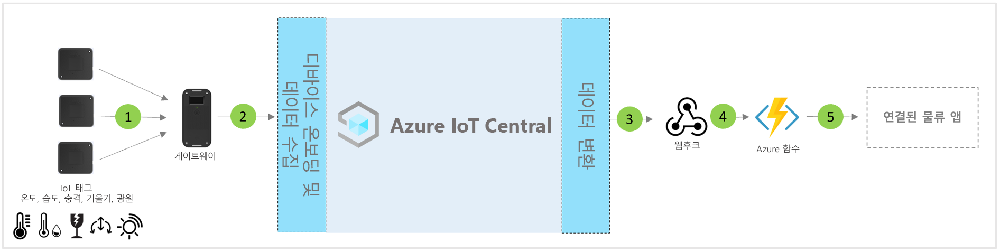

# IoT Central 커넥티드 물류 애플리케이션 템플릿의 아키텍처

파트너 및 고객은 앱 템플릿과 다음 지침을 사용하여 엔드투엔드 **연결된 물류 솔루션**을 개발할 수 있습니다.

> [!div class="mx-imgBorder"]
> 

1. 게이트웨이 디바이스로 원격 분석 데이터를 보내는 IoT 태그 세트
2. 원격 분석 및 집계된 인사이트를 IoT Central로 보내는 게이트웨이 디바이스
3. 데이터는 조작을 위해 원하는 Azure 서비스로 라우팅됩니다.
4. ASA 또는 Azure Functions 같은 Azure 서비스를 사용하여 데이터 스트림 형식을 다시 지정하고 원하는 스토리지 계정으로 보낼 수 있습니다. 
5. 최종 사용자 비즈니스 애플리케이션으로 다양한 비즈니스 워크플로를 지원할 수 있습니다.

## 세부 정보
다음 섹션에서는 IoT 태그 및 게이트웨이로부터 수행되는 개념적 아키텍처 원격 분석 수집의 각 부분에 대해 간략하게 설명합니다.

## IoT 태그
IoT 태그는 온도, 습도, 충격, 기울기 및 조명 등의 실제, 주변 및 환경 센서 기능을 제공합니다. IoT 태그는 일반적으로 Zigbee(802.15.4)를 통해 게이트웨이 디바이스에 연결됩니다. 태그는 저렴한 센서입니다. 따라서 역방향 물류로 인한 문제를 방지하기 위해 일반적인 물류 경로가 끝나면 폐기될 수 있습니다.

## 게이트웨이
게이트웨이는 주변 감지 기능이 있으므로 IoT 태그로 작동할 수도 있습니다. 게이트웨이는 셀룰러, Wi-Fi 채널을 사용하여 업스트림 Azure IoT 클라우드 연결(MQTT)을 사용하도록 설정합니다.  IoT 태그와의 다운스트림 통신에는 Bluetooth, NFC 및 802.15.4 WSN(무선 센서 네트워크) 모드가 사용됩니다. 게이트웨이는 엔드투엔드 보안 클라우드 연결, IoT 태그 페어링, 센서 데이터 집계, 데이터 보존 및 경보 임계값을 구성하는 기능을 제공합니다.

## IoT Central을 사용하는 디바이스 관리 
Azure IoT Central은 IoT 디바이스 연결, 구성 및 관리를 간소화하는 솔루션 개발 플랫폼입니다. 이 플랫폼은 IoT 디바이스 관리, 운영 및 관련 개발의 부담 및 비용을 크게 줄여줍니다. 고객 및 파트너는 엔드투엔드 엔터프라이즈 솔루션을 빌드하여 물류에서 디지털 피드백 루프를 달성할 수 있습니다.

## 데이터 송신을 사용한 비즈니스 인사이트 및 작업 
IoT Central 플랫폼은 CDE(연속 데이터 내보내기) 및 API를 통해 다양한 확장성 옵션을 제공합니다. 원격 분석 데이터 처리 또는 원시 원격 분석을 기준으로 하는 비즈니스 인사이트는 일반적으로 기본 설정된 LOB(기간 업무) 애플리케이션으로 내보내집니다. 이러한 작업은 기계 학습 모델 및 추가적으로 강화된 인사이트를 빌드, 학습 및 배포하기 위해 웹후크, Service Bus, 이벤트 허브 또는 Blob 스토리지를 사용하여 수행할 수 있습니다.

## 다음 단계
* [연결된 물류 솔루션 템플릿](./tutorial-iot-central-connected-logistics.md)을 배포하는 방법을 알아봅니다.
* [IoT Central 소매 템플릿](./overview-iot-central-retail.md)에 대해 자세히 알아보기
* [IoT Central 개요](../core/overview-iot-central.md)에서 IoT Central에 대한 자세한 내용을 참조합니다.
