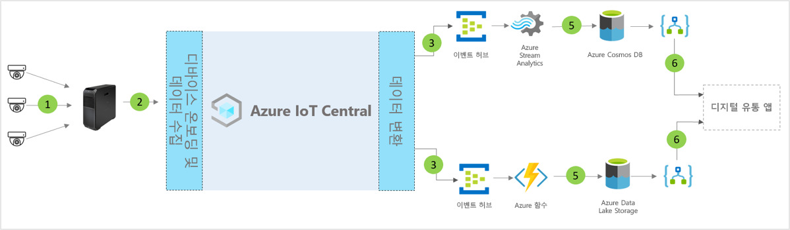

# IoT Central 디지털 배포 센터 애플리케이션 템플릿의 아키텍처

파트너 및 고객은 앱 템플릿 및 다음 지침을 사용하여 엔드투엔드 **디지털 배포 센터** 솔루션을 개발할 수 있습니다.

> [!div class="mx-imgBorder"]
> 

1. 게이트웨이 디바이스로 원격 분석 데이터를 보내는 IoT 센서 세트
2. 원격 분석 및 집계된 인사이트를 IoT Central로 보내는 게이트웨이 디바이스
3. 데이터는 조작을 위해 원하는 Azure 서비스로 라우팅됩니다.
4. ASA 또는 Azure Functions 같은 Azure 서비스를 사용하여 데이터 스트림 형식을 다시 지정하고 원하는 스토리지 계정으로 보낼 수 있습니다. 
5. 처리된 데이터는 거의 실시간 작업을 위해 핫 스토리지에 저장되거나 ML 또는 일괄 처리 분석을 기반으로 하는 추가 인사이트 개선을 위해 콜드 스토리지에 저장됩니다. 
6. Logic Apps를 사용하여 최종 사용자 비즈니스 애플리케이션에서 다양한 비즈니스 워크플로를 지원할 수 있습니다.

## 세부 정보
다음 섹션에서는 개념적 아키텍처의 각 부분을 간략하게 설명합니다.

## 비디오 카메라 
비디오 카메라는 이러한 디지털 연결 엔터프라이즈 규모 에코시스템의 기본 센서입니다. 비디오를 구조화된 데이터로 전환하고, 클라우드로 보내기 전에 에지에서 처리할 수 있도록 기계 학습 및 인공 지능이 개선되었습니다. Microsoft는 IP 카메라를 사용하여 이미지를 캡처하고, 카메라에서 압축하고, 비디오 분석 파이프라인의 에지 컴퓨팅을 통해 압축된 데이터를 전송하거나, GigE 비전 카메라를 사용하여 센서에서 이미지를 캡처한 후 이러한 이미지를 Azure IoT Edge에 직접 보낼 수 있습니다. 여기서 압축된 후 비디오 분석 파이프라인에서 처리됩니다. 

## Azure IoT Edge 게이트웨이
"cameras-as-sensors" 및 에지 워크로드는 Azure IoT Edge에서 로컬로 관리되며 카메라 스트림은 분석 파이프라인에서 처리됩니다. Azure IoT Edge의 비디오 분석 처리 파이프라인은 응답 시간 단축, 낮은 대역폭 사용량을 비롯한 많은 이점을 누림으로써 대기 시간을 단축하여 데이터를 신속하게 처리할 수 있도록 합니다. 추가 작업 또는 조사를 위해 가장 중요한 메타데이터, 인사이트 또는 작업만 클라우드에 전송됩니다. 

## IoT Central을 사용하는 디바이스 관리 
Azure IoT Central은 IoT 디바이스와 Azure IoT Edge 게이트웨이 연결, 구성 및 관리를 간소화하는 솔루션 개발 플랫폼입니다. 이 플랫폼은 IoT 디바이스 관리, 운영 및 관련 개발의 부담 및 비용을 크게 줄여줍니다. 고객 및 파트너는 엔드투엔드 엔터프라이즈 솔루션을 빌드하여 배포 센터에서 디지털 피드백 루프를 달성할 수 있습니다.

## 데이터 송신을 사용한 비즈니스 Insights 및 작업 
IoT Central 플랫폼은 CDE(연속 데이터 내보내기) 및 API를 통해 다양한 확장성 옵션을 제공합니다. 원격 분석 데이터 처리 또는 원시 원격 분석을 기준으로 하는 비즈니스 인사이트는 일반적으로 기본 설정된 기간 업무 애플리케이션으로 내보내집니다. 이러한 작업은 기계 학습 모델 및 추가적으로 강화된 인사이트를 빌드, 학습 및 배포하기 위해 웹후크, Service Bus, 이벤트 허브 또는 Blob 스토리지를 통해 수행할 수 있습니다.

## 다음 단계
* [디지털 물류 센터 템플릿](./tutorial-iot-central-digital-distribution-center-pnp.md)을 배포하는 방법을 알아봅니다.
* [IoT Central 소매 템플릿](./overview-iot-central-retail-pnp.md)에 대해 자세히 알아보기
* [IoT Central 개요](../core/overview-iot-central.md)에서 IoT Central에 대한 자세한 내용을 참조합니다.
