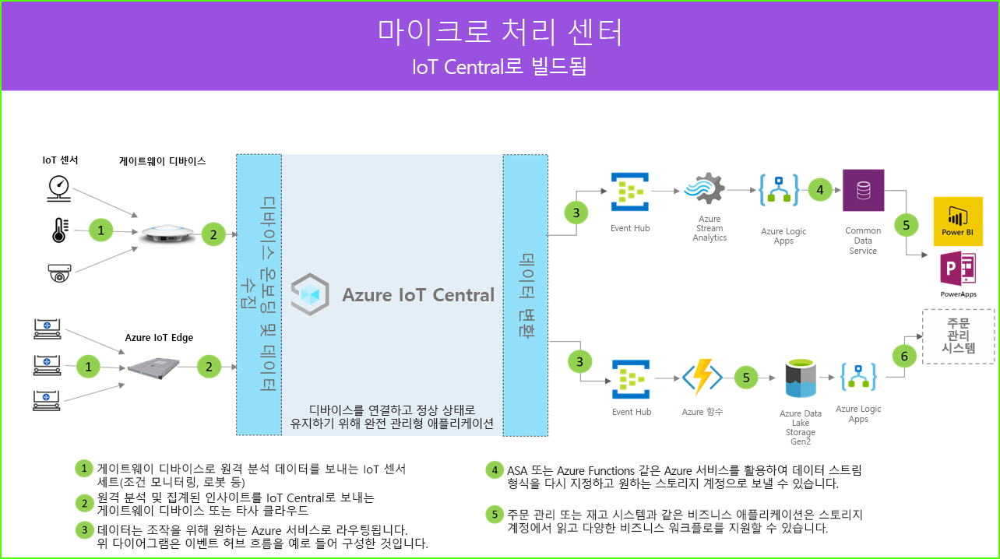

# 마이크로 처리 센터 아키텍처

마이크로 처리 센터 솔루션을 사용하면 완전히 자동화된 처리 센터의 모든 측면을 디지털로 연결, 모니터링 및 관리하여 가동 중지 시간을 없애고 보안 및 전반적인 효율성을 높일 수 있으므로 비용을 절감할 수 있습니다. IoT Central 내의 애플리케이션 템플릿 중 하나와 아래의 아키텍처를 참조하여 이러한 솔루션을 빌드할 수 있습니다.

- 게이트웨이 디바이스로 원격 분석 데이터를 보내는 IoT 센서 세트
- 원격 분석 및 집계된 인사이트를 IoT Central로 보내는 게이트웨이 디바이스
- 조작을 위해 원하는 Azure 서비스로 연속 데이터 내보내기
- 데이터를 원하는 형식으로 구조화하여 스토리지 서비스로 보낼 수 있습니다.
- 비즈니스 애플리케이션은 데이터를 쿼리하고 소매점 업무를 지원하는 인사이트를 생성할 수 있습니다.
 
마이크로 처리 센터 솔루션에 일반적으로 관여하는 주요 구성 요소를 살펴보겠습니다.

## 로보틱 이동 통신 사업자

마이크로 처리 센터 솔루션은 다양한 종류의 원격 분석 신호를 생성하는 많은 로보틱 이동 통신 사업자를 가질 수 있습니다. 이러한 신호는 게이트웨이 디바이스에 의해 수집된 다음, 아키텍처 다이어그램의 왼쪽에 나타난 것 같이 IoT Central로 전송될 수 있습니다.  

## 상태 모니터링 센서

IoT 솔루션은 처리 센터 내에서 의미 있는 신호를 캡처하는 센서 세트로 시작합니다. 위의 아키텍처 다이어그램의 왼쪽 끝에서 다양한 종류의 센서를 확인할 수 있습니다.

## 게이트웨이 디바이스

많은 IoT 센서가 원시 신호를 클라우드 또는 근처에 있는 게이트웨이 디바이스에 직접 제공할 수 있습니다. 게이트웨이 디바이스는 IoT Central 애플리케이션에 요약 인사이트를 보내기 전에 에지에서 데이터 집계를 수행합니다. 또한 게이트웨이 디바이스는 해당되는 경우 센서 디바이스에 명령 및 제어 작업을 릴레이하는 역할을 담당합니다. 

## IoT Central 애플리케이션

Azure IoT Central 애플리케이션은 처리 센터 환경 내에서 다양한 종류의 IoT 센서와 게이트웨이 디바이스에서 데이터를 수집하고 의미 있는 인사이트 세트를 생성합니다.

또한 Azure IoT Central은 매장 운영자에게 맞춤형 환경을 제공하여 인프라 디바이스를 원격으로 모니터링하고 관리할 수 있도록 합니다.

## 데이터 변환
원시 또는 집계된 인사이트를 Azure PaaS(Platform as a Service) 서비스 세트로 내보내도록 솔루션 내의 Azure IoT Central 애플리케이션을 구성하여 데이터 조작을 수행하고 풍부한 인사이트를 확보한 후 비즈니스 애플리케이션에 제공할 수 있습니다. 

## 비즈니스 애플리케이션
IoT 데이터는 소매 환경 내 다양한 종류의 비즈니스 애플리케이션을 지원하는 데 사용될 수 있습니다. 처리 센터 관리자나 직원은 이러한 애플리케이션을 사용하여 비즈니스 인사이트를 시각화하고 의미 있는 작업을 실시간으로 수행할 수 있습니다. 소매 팀을 위한 실시간 Power BI 대시보드를 빌드하는 방법에 대한 자세한 내용은 [자습서](./tutorial-in-store-analytics-create-app-pnp.md)를 참조하세요.

## 다음 단계
* [마이크로 처리 센터](https://aka.ms/checkouttemplate) 애플리케이션 템플릿을 시작합니다. 
* 마이크로 처리 센터 앱 템플릿을 사용하는 솔루션을 빌드하는 방법을 안내하는 [자습서](https://aka.ms/mfc-tutorial)를 살펴보세요.
