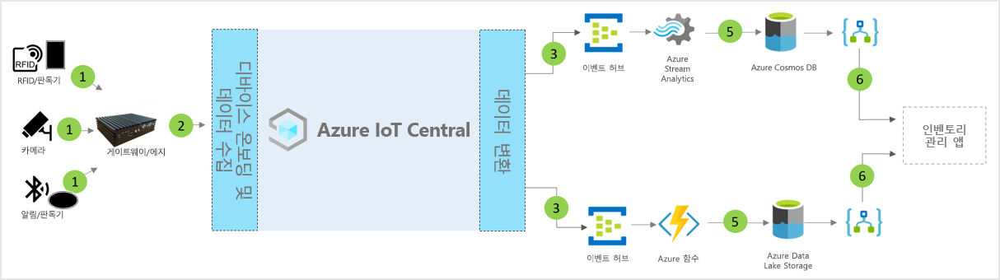

# IoT Central 스마트 재고 관리 애플리케이션 템플릿의 아키텍처

파트너 및 고객은 앱 템플릿과 다음 지침을 활용하여 엔드투엔드 **스마트 재고 관리** 솔루션을 개발할 수 있습니다.

> [!div class="mx-imgBorder"]
> 

1. 게이트웨이 디바이스로 원격 분석 데이터를 보내는 IoT 센서 세트
2. 원격 분석 및 집계된 인사이트를 IoT Central로 보내는 게이트웨이 디바이스
3. 데이터는 조작을 위해 원하는 Azure 서비스로 라우팅됩니다.
4. ASA 또는 Azure Functions 같은 Azure 서비스를 사용하여 데이터 스트림 형식을 다시 지정하고 원하는 스토리지 계정으로 보낼 수 있습니다. 
5. 처리된 데이터는 거의 실시간 작업을 위해 핫 스토리지에 저장되거나 ML 또는 일괄 처리 분석을 기반으로 하는 추가 인사이트 개선을 위해 콜드 스토리지에 저장됩니다. 
6. Logic Apps를 사용하여 최종 사용자 비즈니스 애플리케이션에서 다양한 비즈니스 워크플로를 지원할 수 있습니다.

## 세부 정보
다음 섹션에서는 RFID(전파 식별), BLE(Bluetooth 저에너지) 태그로부터 수행되는 개념적 아키텍처 원격 분석 수집의 각 부분에 대해 간략하게 설명합니다.

## RFID 태그
RFID 태그는 전파를 통해 항목에 대한 데이터를 전송합니다. RFID 태그는 다르게 지정하지 않는 한, 배터리를 포함하지 않습니다. 태그는 판독기가 생성한 전파에서 에너지를 받은 후 RFID 판독기로 신호를 다시 전송합니다.

## BLE 태그
에너지 오류 신호는 일정한 간격으로 데이터의 패킷을 브로드캐스트합니다. 스마트폰에서 BLE 판독기 또는 설치된 서비스를 통해 감지된 오류 신호 데이터는 클라우드로 전송됩니다.

## RFID 및 BLE 판독기
RFID 판독기는 전파를 좀 더 유용한 데이터 형태로 변환합니다. 그런 다음, 태그에서 수집된 정보는 로컬 에지 서버에 저장되거나 MQTT의 JSON-RPC 2.0을 사용하여 클라우드로 전송됩니다.
AP(액세스 지점)라고도 하는 BLE 판독기는 RFID 판독기와 유사합니다. 이러한 판독기는 주변의 Bluetooth 신호를 감지하고, 해당 메시지를 MQTT의 JSON-RPC 2.0을 사용하여 로컬 Azure IoT Edge 또는 클라우드로 릴레이하는 데 사용됩니다.
대부분의 판독기는 온도, 습도, 가속도계 및 자이로스코프와 관련된 추가 센서 기능을 제공할 뿐만 아니라 RFID 및 탐지 신호를 읽을 수 있습니다.

## Azure IoT Edge 게이트웨이
Azure IoT Edge 서버는 해당 데이터를 클라우드로 보내기 전에 로컬에서 전처리하는 장소를 제공합니다. 표준 컨테이너를 통해 클라우드 워크로드 AI, Azure 및 타사 서비스, 비즈니스 논리를 배포할 수도 있습니다.

## IoT Central을 사용하는 디바이스 관리 
Azure IoT Central은 IoT 디바이스 연결, 구성 및 관리를 간소화하는 솔루션 개발 플랫폼입니다. 이 플랫폼은 IoT 디바이스 관리, 운영 및 관련 개발의 부담 및 비용을 크게 줄여줍니다. 고객 및 파트너는 엔드투엔드 엔터프라이즈 솔루션을 빌드하여 재고 관리에서 디지털 피드백 루프를 달성할 수 있습니다.

## 데이터 송신을 사용한 비즈니스 인사이트 및 작업 
IoT Central 플랫폼은 CDE(연속 데이터 내보내기) 및 API를 통해 다양한 확장성 옵션을 제공합니다. 원격 분석 데이터 처리 또는 원시 원격 분석을 기준으로 하는 비즈니스 인사이트는 일반적으로 기본 설정된 LOB(기간 업무) 애플리케이션으로 내보내집니다. 이러한 작업은 기계 학습 모델 및 추가적으로 강화된 인사이트를 빌드, 학습 및 배포하기 위해 웹후크, Service Bus, 이벤트 허브 또는 Blob 스토리지를 사용하여 수행할 수 있습니다.

## 다음 단계
* [스마트 재고 관리 템플릿](./tutorial-iot-central-smart-inventory-management.md)을 배포하는 방법을 알아봅니다.
* [IoT Central 소매 템플릿](./overview-iot-central-retail.md)에 대해 자세히 알아보기
* [IoT Central 개요](../core/overview-iot-central.md)에서 IoT Central에 대한 자세한 내용을 참조합니다.
