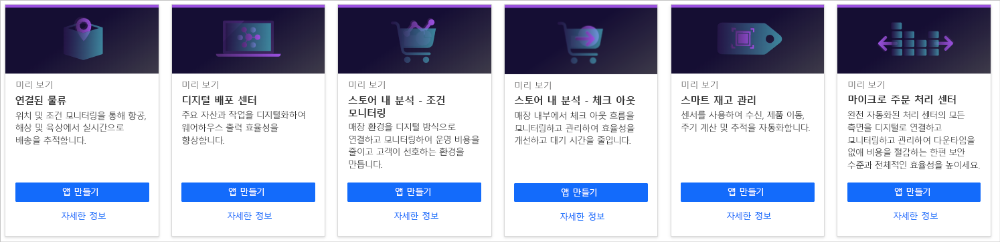
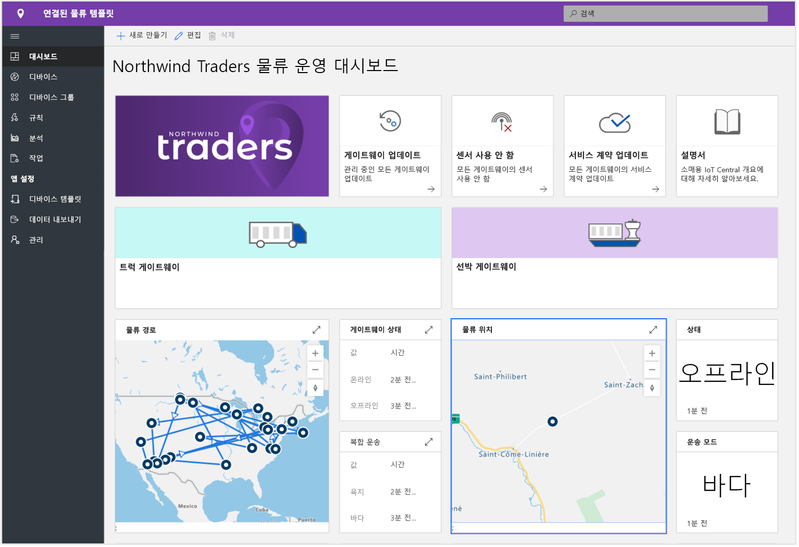
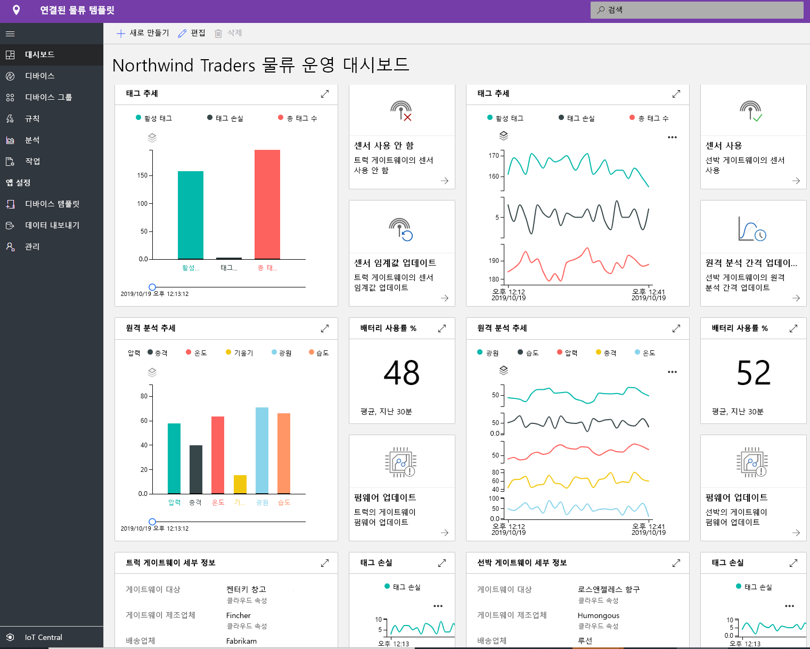
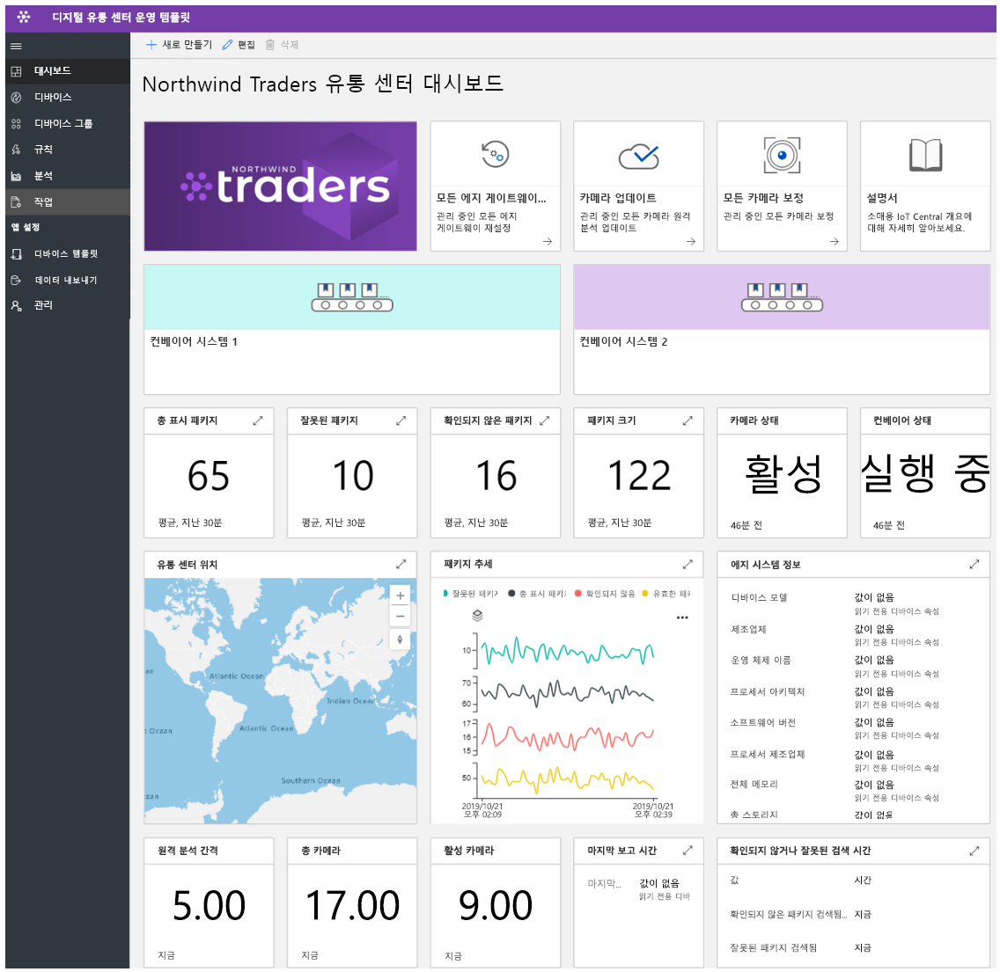
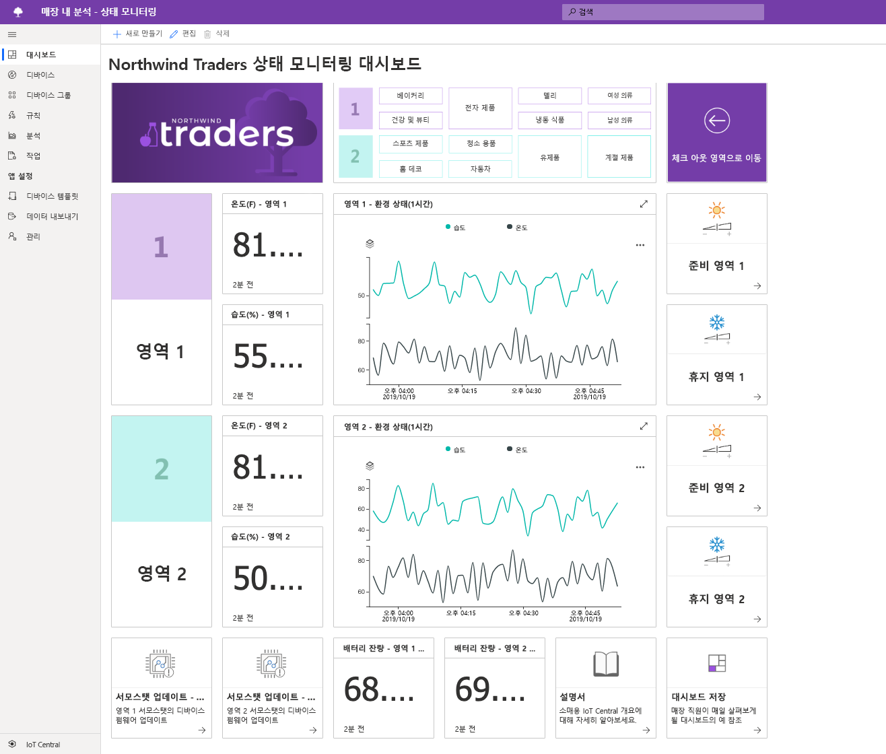
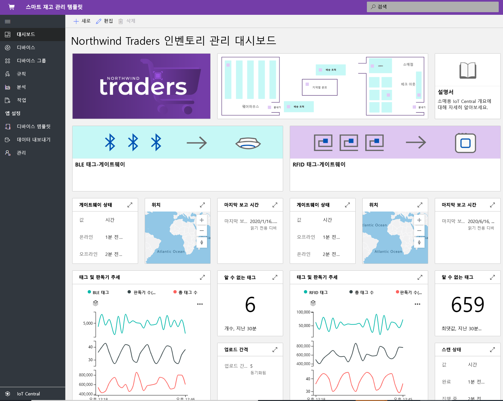

# Azure IoT Central을 사용하여 소매업 솔루션 빌드

[!INCLUDE [iot-central-pnp-original](../../../includes/iot-central-pnp-original-note.md)]

Azure IoT Central은 확장 가능한 애플리케이션을 빌드하고 관리하는 과제를 간소화하는 솔루션 빌더를 위한 IoT(사물 인터넷) 앱 플랫폼입니다. 이 문서에서는 IoT Central 내의 몇 가지 소매업 특정 애플리케이션 템플릿을 강조합니다. 솔루션 빌더는 게시된 템플릿을 활용하여 공급망을 최적화하고, 고객의 스토어 내 환경을 개선하고, 재고를 더 효율적으로 추적하는 IoT 솔루션을 빌드할 수 있습니다.

> [!div class="mx-imgBorder"]
> 

## 연결된 물류 솔루션이란?
글로벌 물류 지출은 2020년에 업계에서 가장 큰 GDP인 10.6조 달러에 이를 것으로 예상됩니다. 상품 운송은 전체 물류 경비의 대부분(70%)을 차지합니다. 운송업체는 극심한 경쟁 압력과 제약을 받고 있습니다. 3PL 업체는 점점 감소하는 시간 프레임과 상승하는 보상 비용을 처리하고 있습니다. 물류는 지정학적이고 극단적인 기후 현상과 범죄로 인해 발생하는 위험에 따라 더욱 압박을 받고 있습니다. 

IoT 센서의 지원을 통해 다중 모달 변형(예: 공기, 물, 지면)에서 GPS를 통해 주변 조건(예: 온도, 습도, 기울기, 충격, 조명 및 배송 위치)을 수집하고 모니터링할 수 있습니다. 센서, 디바이스, 날씨 및 이벤트에서 수집된 데이터를 클라우드 기반 비즈니스 인텔리전스 시스템과 통합할 수 있습니다. 연결된 물류 솔루션의 이점은 다음과 같습니다.
* 실시간 추적 및 추적을 통한 배송 
* 실시간 주변 조건 모니터링 및 저온 유통 시스템(cold chain)을 통한 배송 무결성
* 배송 도난, 분실 또는 손상으로부터의 보안
* 지오펜싱, 경로 최적화, 차량 관리, 차량 분석
* 출발과 도착에 대한 예측 및 예측 가능성 

### 기본 환경
파트너는 템플릿을 활용하여 엔드투엔드 연결된 물류 솔루션 및 개략적인 혜택을 개발할 수 있습니다. 이 게시된 템플릿은 IoT Central에서 디바이스를 연결하고, 구성 하고, 관리하는 데 중점을 두고 있습니다. 

> [!div class="mx-imgBorder"]
> 

> [!div class="mx-imgBorder"]
> 

위의 대시보드는 샘플 환경이므로 이 애플리케이션을 원하는 사용 사례에 맞게 완전히 사용자 지정할 수 있습니다.

연결된 물류 솔루션 템플릿 중 하나를 활용하여 솔루션을 빌드하는 방법을 안내하는 [엔드투엔드 자습서](./tutorial-iot-central-connected-logistics-pnp.md)를 시작하세요.

## 디지털 물류 센터 솔루션이란?
더 많은 제조업체와 소매점이 전 세계에 진출함에 따라 공급망은 그 어느 때보다 더 복잡해졌습니다. 물류 센터는 주요 과제가 되고 있습니다. 물류 센터/창고는 전자 상거래로 인한 압박을 받고 있습니다. 소비자는 이제 사용할 수 있는 다양한 상품을 선택할 수 있고, 해당 상품이 구매 후 1~2일 이내에 도착할 것이라고 기대합니다. 물류 센터는 기존의 비효율성을 극복하면서 이러한 추세에 적응해야 합니다. 

오늘날 육체 노동을 지나치게 사용하는 집품 및 포장(picking and packing)에서 물류 센터 비용의 55-65%를 차지하고 있습니다. 육체 노동으로 인해 물류 센터의 속도가 저하되는 것은 나쁘지만, 급변하는 인력 채용 수요(휴일 인력 채용의 경우 10배 증가)로 인해 배송 물량을 충족하기가 더 어려워지고 있습니다. 이러한 계절적 변동으로 인해 이직률과 오류 발생 가능성이 높고 비용이 많이 드는 재작업의 필요성도 증가합니다.
IoT 사용 카메라를 기반으로 하는 솔루션은 디지털 피드백 루프를 사용하여 혁신적인 이점을 누릴 수 있습니다. 물류 센터 전체에서 데이터가 유입되면 그 결과로 실행 가능한 인사이트를 끌어내어 더 나은 데이터를 생성합니다.

이점은 다음과 같습니다. 
* 상품이 도착하고 컨베이어 시스템을 통과할 때 카메라를 통해 상품 모니터링
* 불량품 식별 및 수리를 위해 보내기
* 효율적으로 주문 추적
* 비용 절감, 생산성 향상 및 사용률 최대화

### 기본 환경
파트너는 이 애플리케이션 템플릿을 활용하여 디지털 물류 센터 솔루션을 빌드하여 실행 가능한 인사이트와 위에서 설명한 이점을 얻을 수 있습니다. 게시된 템플릿은 IoT Central에서 디바이스를 연결하고, 카메라와 에지 디바이스를 구성하고 관리하는 데 중점을 두고 있습니다. 

> [!div class="mx-imgBorder"]
> 

위의 대시보드는 샘플 환경이므로 이 애플리케이션을 원하는 사용 사례에 맞게 완전히 사용자 지정할 수 있습니다.

디지털 물류 센터 템플릿 중 하나를 활용하여 솔루션을 빌드하는 방법을 안내하는 [엔드투엔드 자습서](./tutorial-iot-central-digital-distribution-center-pnp.md)를 시작하세요.

## 스토어 내 분석 조건 모니터링이란?
오늘날의 경쟁 환경에서 소매점은 실제 스토어를 통해 트래픽을 추진하기 위해 고객에게 독특하거나 특별한 기능을 제공할 수 있는 새로운 방법을 찾고 있습니다. 많은 소매점에서 스토어 내 환경 조건에 대한 중요도를 경쟁 업체와 차별화하는 도구로 인정합니다. 소매점은 고객에게 편안한 환경을 제공하기 위해 항상 스토어 내에서 쾌적한 조건을 유지하려고 합니다.  

IoT Central 내의 스토어 내 분석 조건 모니터링 애플리케이션 템플릿은 엔드투엔드 솔루션을 빌드하는 데 활용할 수 있는 캔버스를 솔루션 빌더에게 제공합니다. 애플리케이션 템플릿을 사용하면 다양한 센서 디바이스를 통해 소매점 스토어 환경을 디지털로 연결하고 모니터링할 수 있습니다. 이러한 센서 디바이스는 소매점에서 운영 비용을 줄이고 고객이 좋아하는 환경을 만들 수 있도록 비즈니스 인사이트로 변환할 수 있는 의미 있는 신호를 포착합니다.

애플리케이션 템플릿을 사용하면 다음을 수행할 수 있습니다.

*  다양한 IoT 센서를 IoT Central 애플리케이션 인스턴스에 원활하게 연결합니다.
*  환경에서 센서 네트워크와 게이트웨이 디바이스의 상태를 모니터링하고 관리합니다.
*  적절한 경고를 트리거하도록 스토어 내의 환경 조건에 대한 사용자 지정 규칙을 만듭니다.
*  스토어 내 환경 조건을 소매점 스토어 팀에서 활용할 수 있는 인사이트로 전환합니다.
* 집계된 인사이트를 기존 또는 새 비즈니스 애플리케이션으로 내보내 소매점 직원 멤버의 역량을 강화합니다.

### 기본 환경
애플리케이션 템플릿에는 기본적으로 디바이스 템플릿 세트와 하나의 운영자 환경이 제공됩니다. 시뮬레이션된 디바이스 세트를 활용하여 대시보드 요소를 채웁니다. [스토어 내 분석 조건 모니터링](https://aka.ms/conditiontemplate) 앱 템플릿을 사용하여 IoT Central 애플리케이션을 배포하면 아래와 같이 기본 애플리케이션 대시보드가 표시됩니다. 

> [!div class="mx-imgBorder"]
> 

위의 대시보드는 샘플 환경이므로 이 애플리케이션을 원하는 사용 사례에 맞게 완전히 사용자 지정할 수 있습니다. 

스토어 내 분석 조건 모니터링 템플릿 중 하나를 활용하여 솔루션을 빌드하는 방법을 안내하는 [엔드투엔드 자습서](./tutorial-in-store-analytics-create-app-pnp.md)를 시작하세요.

## 스토어 내 분석 체크 아웃이란?
점점 더 치열한 경쟁 환경에서 오늘날의 소매점은 고객의 기대치를 뛰어넘고 고객이 계속 다시 방문하는 스토어 내 환경을 제공해야 한다는 압박에 끊임없이 직면하고 있습니다. 여러 소매점에서 이러한 요구 사항을 충족시키기 위해 기술을 배포하기 시작했지만, 크게 눈에 띄지 않는 영역이 체크 아웃 환경입니다.

IoT Central 내에서 스토어 내 분석 체크 아웃 애플리케이션 템플릿을 사용하면 솔루션 빌더가 스토어의 체크 아웃 영역에 대한 의미 있는 인사이트를 사용하여 소매점 직원의 역량을 강화하는 환경을 빌드할 수 있습니다. 시뮬레이션된 디바이스 세트를 활용하여 소매점 스토어 내의 각 체크 아웃 레인에 대한 선점 상태를 확인합니다. 센서를 사용하면 인원 수와 각 체크 아웃 레인의 평균 대기 시간을 캡처할 수 있습니다.

템플릿을 통해 솔루션 빌더가 다음을 수행할 수 있는 기준 IoT 솔루션을 제공하여 시장 진출 계획을 가속화할 수 있습니다. 

* 다양한 IoT 센서를 IoT Central 애플리케이션 인스턴스에 원활하게 연결합니다.
* 환경에서 센서 네트워크와 게이트웨이 디바이스의 상태를 모니터링하고 관리합니다.
* 적절한 경고를 트리거하도록 스토어 내의 체크 아웃 조건에 대한 사용자 지정 규칙을 만듭니다.
* 스토어 내 체크 아웃 조건을 소매점 스토어 팀에서 활용할 수 있는 인사이트로 전환합니다.
* 집계된 인사이트를 기존 또는 새 비즈니스 애플리케이션으로 내보내 소매점 직원 멤버의 역량을 강화합니다.

### 기본 환경
애플리케이션 템플릿에는 기본적으로 디바이스 템플릿 세트와 하나의 운영자 환경이 제공됩니다. 시뮬레이션된 디바이스 세트를 활용하여 대시보드 요소를 채웁니다. [스토어 내 분석 체크 아웃](https://aka.ms/checkouttemplate) 앱 템플릿을 사용하여 IoT Central 애플리케이션을 배포하면 아래와 같이 기본 애플리케이션 대시보드가 표시됩니다. 

> [!div class="mx-imgBorder"]
> 

위의 대시보드는 샘플 환경이므로 이 애플리케이션을 원하는 사용 사례에 맞게 완전히 사용자 지정할 수 있습니다. 

스토어 내 분석 체크 아웃 템플릿 중 하나를 활용하여 솔루션을 빌드하는 방법을 안내하는 [엔드투엔드 자습서](./tutorial-in-store-analytics-create-app-pnp.md)를 시작하세요.

## 스마트 재고 관리 솔루션이란?
"재고"는 소매점에서 보유하고 있는 상품의 재고입니다. 모든 소매점에는 공급 및 물류 리드 타임을 처리하기 위해 재고가 필요합니다. 재고는 모든 소매점에서 거래해야 하는 가장 중요한 리소스입니다. 오늘날의 옴니 채널 세계에서 재고 관리는 올바른 제품이 적시에 올바른 위치에 있는지 확인하기 위한 중요한 요구 사항입니다. 재고를 너무 많거나 너무 적게 저장하면 소매점의 비즈니스에 손해를 줄 수 있습니다. 재고 관리 능력이 부족하여 소매점은 매년 수익의 8-10%를 잃고 있습니다.

RFID(전파 식별), 오류 신호(Beacon) 및 카메라에서 사용하도록 설정된 IoT 데이터는 이 엄청난 문제를 일정한 비율로 처리할 수 있는 기회입니다. IoT 신호에 내재한 연결 및 실시간 분석은 소매점의 재고 문제에 있어 판도를 바꿔 놓는 요인(game-changer)이 되었습니다.  센서, 디바이스, 날씨 및 이벤트에서 수집된 데이터를 클라우드 기반 비즈니스 인텔리전스 시스템과 통합할 수 있습니다.  
스마트 재고 관리의 이점은 다음과 같습니다. 
* 재고 부족으로부터 조직 보호 및 원하는 고객 서비스 수준 보장 
* 거의 실시간으로 재고 정확도에 대한 심층 분석 및 인사이트
* 고객의 주문에 충분한 재고량 결정

### 기본 환경
파트너는 템플릿을 활용하여 엔드투엔드 스마트 재고 관리 솔루션 및 개략적인 혜택을 개발할 수 있습니다. 이 게시된 템플릿은 IoT Central에서 디바이스를 연결하고, RFID 및 BLE(Bluetooth 저에너지) 판독기를 구성하고 관리하는 데 중점을 두고 있습니다. 

> [!div class="mx-imgBorder"]
> 

위의 대시보드는 샘플 환경이므로 이 애플리케이션을 원하는 사용 사례에 맞게 완전히 사용자 지정할 수 있습니다. 

스마트 재고 관리 템플릿 중 하나를 활용하여 솔루션을 빌드하는 방법을 안내하는 [엔드투엔드 자습서](./tutorial-iot-central-smart-inventory-management-pnp.md)를 시작하세요.

## 다음 단계
소매업 솔루션 빌드를 시작하려면 다음을 수행합니다.
* 스토어 내 분석 애플리케이션 템플릿 중 하나를 활용하여 솔루션을 빌드하는 방법을 안내하는 [엔드투엔드 자습서](./tutorial-in-store-analytics-create-app-pnp.md)를 시작합니다.
* [연결된 물류 솔루션 템플릿](./tutorial-iot-central-connected-logistics-pnp.md)을 배포하는 방법을 알아봅니다.
* [디지털 물류 센터 템플릿](./tutorial-iot-central-digital-distribution-center-pnp.md)을 배포하는 방법을 알아봅니다.
* [스마트 재고 관리 템플릿](./tutorial-iot-central-smart-inventory-management-pnp.md)을 배포하는 방법을 알아봅니다.
* [IoT Central 개요](../preview/overview-iot-central.md)에서 IoT Central에 대한 자세한 내용을 참조합니다.
