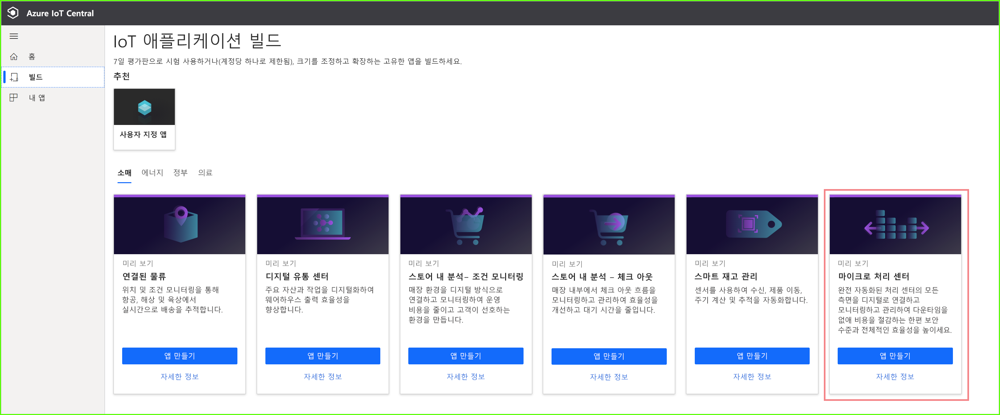
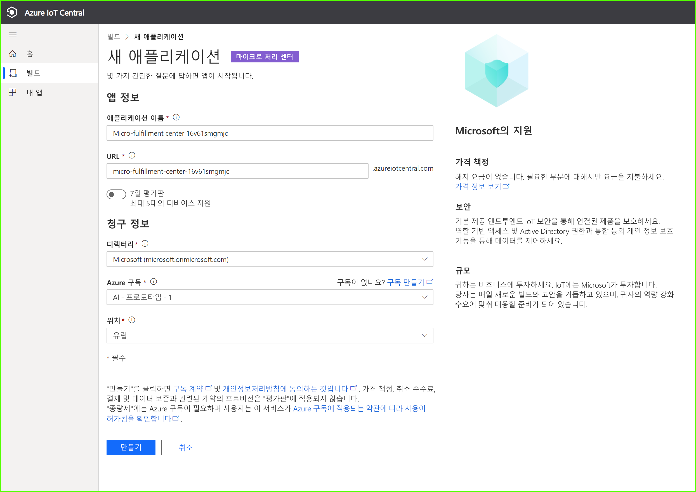
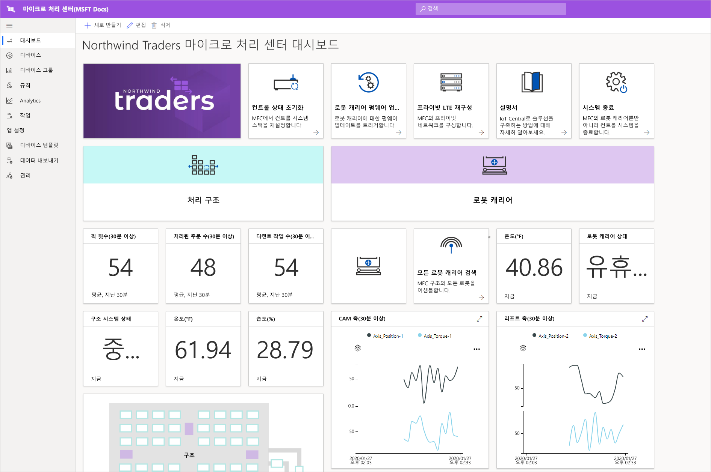
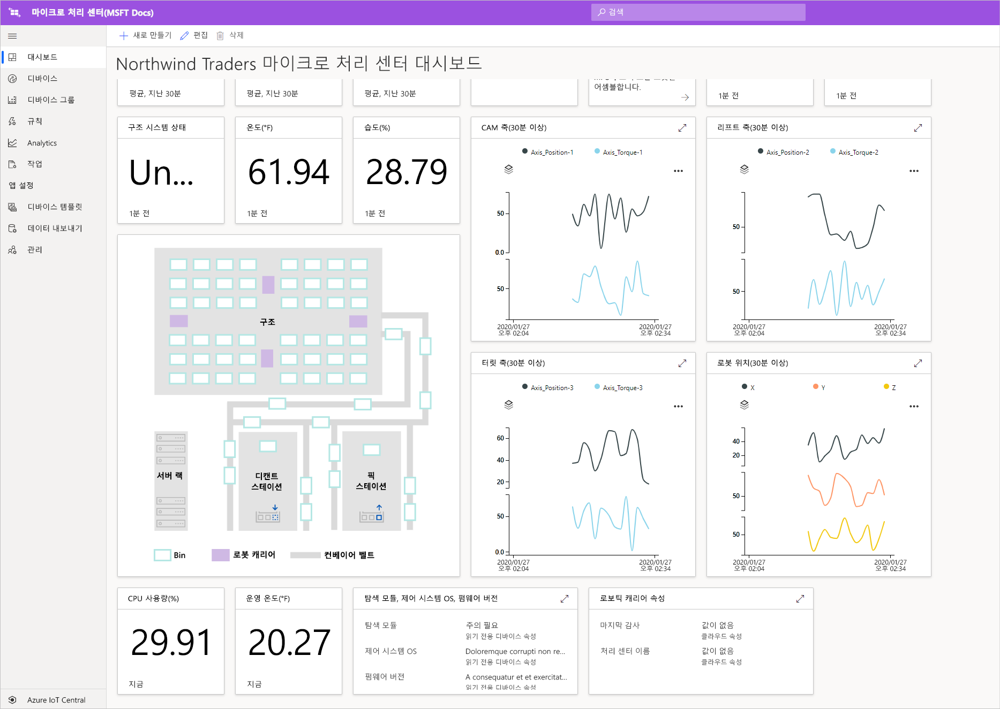
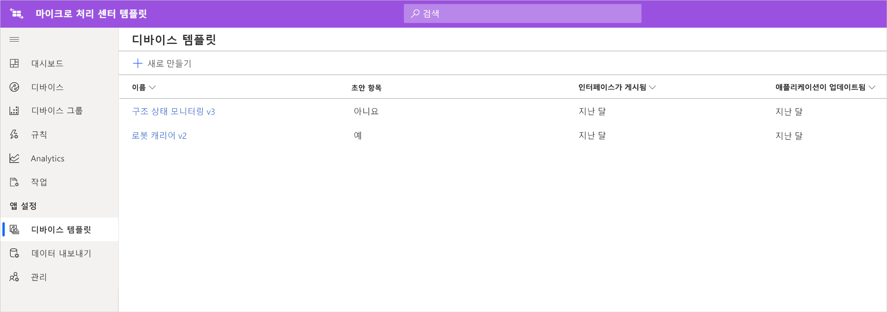
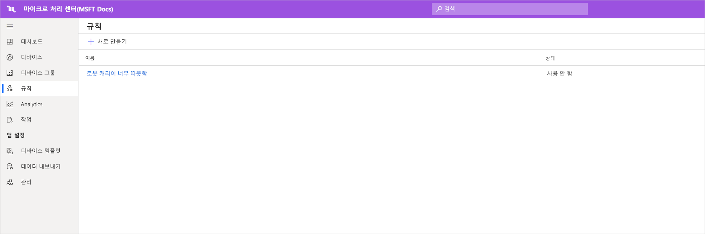

# 자습서: 마이크로 처리 센터 애플리케이션 템플릿 배포 및 살펴보기

이 자습서에서는 Azure IoT Central ***마이크로 처리 센터*** 애플리케이션 템플릿을 활용하여 소매업 솔루션을 빌드하는 방법을 보여줍니다. MFC 템플릿을 배포하는 방법, 기본적으로 제공되는 항목 및 다음에 수행할 수 있는 작업을 알아봅니다.

이 자습서에서는 다음 작업 방법을 알아봅니다. 
> [!div class="checklist"]
> * Azure IoT Central **마이크로 처리 센터** 템플릿을 사용하여 소매업 애플리케이션 만들기
> * 애플리케이션 살펴보기 

## 사전 요구 사항
이 자습서 시리즈를 완료하려면 다음이 필요합니다.
* Azure 구독 필요에 따라 7일 무료 평가판을 사용할 수 있습니다. Azure 구독이 아직 없는 경우 [Azure 가입 페이지](https://aka.ms/createazuresubscription)에서 만들 수 있습니다.

## 애플리케이션 만들기 
이 섹션에서는 템플릿에서 새 Azure IoT Central 애플리케이션을 만듭니다. 자습서 시리즈 전체에서 이 애플리케이션을 사용하여 전체 솔루션을 빌드합니다.

새로운 Azure IoT Central 애플리케이션을 만들려면:

1. [Azure IoT Central 애플리케이션 관리자](https://aka.ms/iotcentral) 웹 사이트로 이동합니다.
1. Azure 구독이 있으면 액세스하는 데 사용하는 자격 증명을 사용하여 로그인하고, 그렇지 않으면 Microsoft 계정을 사용하여 서명합니다.

   

1. 새로운 Azure IoT Central 애플리케이션 만들기를 시작하려면 **새 애플리케이션**을 선택합니다.

1. **소매**를 선택합니다.  소매 페이지는 여러 소매점 애플리케이션 템플릿을 표시합니다.

미리 보기 기능을 사용하는 새로운 마이크로 처리 센터 애플리케이션을 만들려면 다음을 수행합니다.  
1. **마이크로 처리 센터** 애플리케이션 템플릿을 선택합니다. 이 템플릿에는 이 자습서에서 사용되는 모든 디바이스용 디바이스 템플릿이 포함되어 있습니다. 이 템플릿은 처리 센터 내의 상태와 로봇 캐리어의 상태를 모니터링하는 운영자 대시보드도 제공합니다. 

    > [!div class="mx-imgBorder"]
    > 
    
1. 필요에 따라 친숙한 **애플리케이션 이름**을 선택합니다.  이 애플리케이션 템플릿은 Northwind Traders라는 가상의 회사를 기반으로 합니다. 

    > [!NOTE]
    > 친숙한 **애플리케이션 이름**을 사용하는 경우에도 애플리케이션 **URL**에 대해 고유한 값을 사용해야 합니다.

1. Azure 구독이 있는 경우 *디렉터리, Azure 구독 및 지역*을 입력합니다. 구독이 없는 경우 **7일 평가판**을 사용하도록 설정하고 필요한 연락처 정보를 작성할 수 있습니다.  

    디렉터리 및 구독에 대한 자세한 내용은 [애플리케이션 만들기 빠른 시작](../preview/quick-deploy-iot-central.md)을 참조하세요.

1. **만들기**를 선택합니다.

> [!div class="mx-imgBorder"]
> 

## 애플리케이션 살펴보기 

### 대시보드 

앱 템플릿이 성공적으로 배포되면 먼저 **Northwind Traders 마이크로 처리 센터 대시보드**가 표시됩니다. Northwind Trader는 이 IoT Central 애플리케이션에서 마이크로 처리 센터를 관리하는 가상의 소매 업체입니다. 이 운영자 대시보드에는 이 템플릿의 디바이스에 대한 정보 및 원격 분석 데이터와 함께 수행할 수 있는 명령, 작업 및 동작 세트가 표시됩니다. 대시보드는 논리적으로 두 섹션(왼쪽 및 오른쪽)으로 분할됩니다. 왼쪽에는 처리 구조 내에서 환경 조건을 모니터링하는 기능이 있고 오른쪽에서는 시설 내 로봇 캐리어의 상태를 모니터링할 수 있습니다.  

대시보드에서 다음을 수행할 수 있습니다.
   * 선택 수, 처리된 주문 수와 같은 디바이스 원격 분석과 구조 시스템 상태 등과 같은 속성을 봅니다.  
   * **평면도** 및 처리 구조 내에서 로봇 캐리어의 위치를 봅니다.
   * 제어 시스템 재설정, 통신 사업자의 펌웨어 업데이트, 네트워크 재구성 등과 같은 명령을 트리거합니다.

> [!div class="mx-imgBorder"]
> 
   * 운영자가 처리 센터 내에서 조건을 모니터링하는 데 활용할 수 있는 대시보드의 예를 참조합니다. 
   * 처리 센터 내의 게이트웨이 디바이스에서 실행 중인 페이로드 상태를 모니터링합니다.    

> [!div class="mx-imgBorder"]
> 

## 디바이스 템플릿
디바이스 템플릿 탭을 클릭하면 템플릿에 포함된 다음 두 가지 유형의 디바이스를 볼 수 있습니다. 
   * **로봇 캐리어**: 이 디바이스 템플릿은 해당 처리 구조에 배포되어 적절한 저장 및 검색 작업을 수행하며 작동하는 로봇 캐리어에 대한 정의를 나타냅니다. 템플릿을 클릭하면, 로봇이 온도, 축 위치 및 로봇 캐리어 상태와 같은 속성 등의 디바이스 데이터를 보내는 것을 볼 수 있습니다. 
   * **구조 상태 모니터링**: 이 디바이스 템플릿은 환경 상태는 물론 처리 센터를 강화하기 위해 다양한 에지 워크로드를 호스팅하는 게이트웨이 디바이스를 모니터링할 수 있는 디바이스 컬렉션을 나타냅니다. 이 디바이스는 환경에서 실행 중인 컴퓨팅 워크로드의 상태 외에도 온도, 선택 수, 주문 수 등과 같은 원격 분석 데이터를 보냅니다. 

> [!div class="mx-imgBorder"]
> 

디바이스 그룹 탭을 클릭하면 해당 디바이스 템플릿에 디바이스 그룹이 자동으로 생성되는 것을 볼 수 있습니다.

## 규칙
규칙 탭으로 이동하면 로봇 캐리어의 온도 상태를 모니터링하기 위해 애플리케이션 템플릿에 존재하는 샘플 규칙이 표시됩니다. 이 규칙을 사용하면, 설비 내 특정 로봇이 과열되어 서비스를 위해 오프라인으로 전환해야 하는 경우 운영자에게 경고할 수 있습니다. 

샘플 규칙을 활용하여 비즈니스 기능에 보다 적합한 규칙을 정의하세요.

   - **로봇 캐리어 너무 따뜻함**: 이 규칙은 로봇 캐리어가 일정 시간 동안 온도 임계값에 도달하는 경우 트리거됩니다. 

> [!div class="mx-imgBorder"]
> 

## 리소스 정리

이 애플리케이션을 계속 사용하지 않으려면 **관리** > **애플리케이션 설정**을 방문하여 애플리케이션 템플릿을 삭제하고 **삭제**를 클릭합니다.

> [!div class="mx-imgBorder"]
> 

## 다음 단계
* [마이크로 처리 센터 솔루션 아키텍처](./architecture-micro-fulfillment-center-pnp.md)에 대해 자세히 알아보기
* 다른 [IoT Central 소매 템플릿](./overview-iot-central-retail-pnp.md)에 대해 자세히 알아보기
* [IoT Central 개요](../preview/overview-iot-central.md)에서 IoT Central에 대한 자세한 내용을 참조합니다.