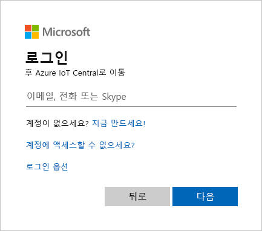
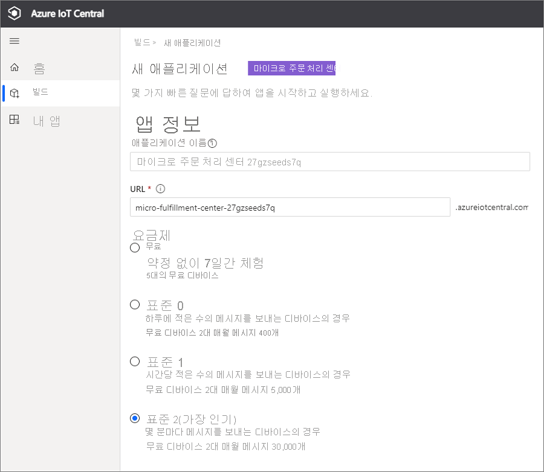
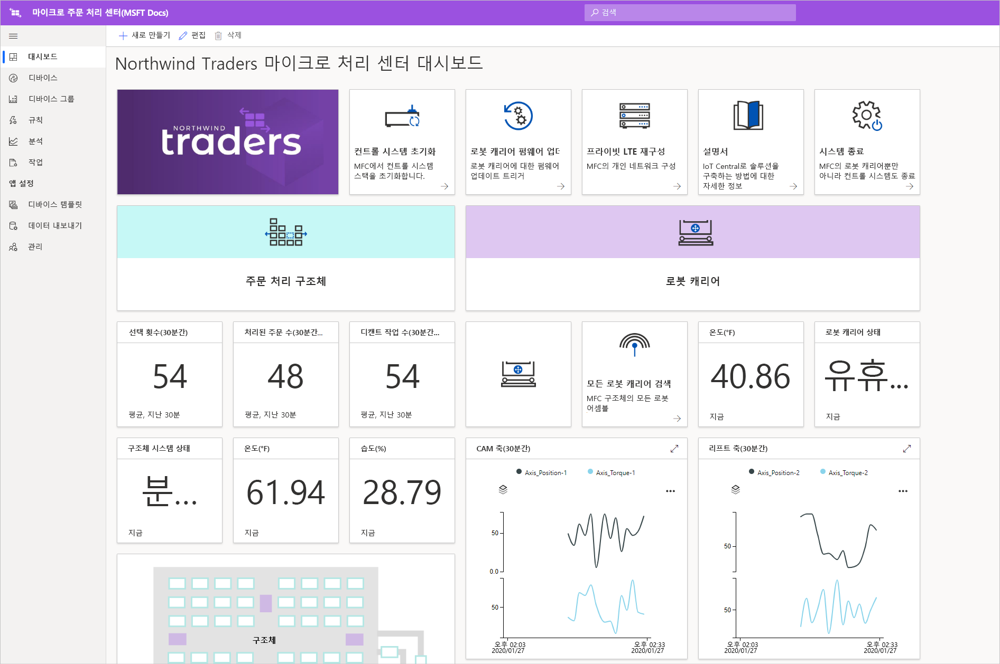
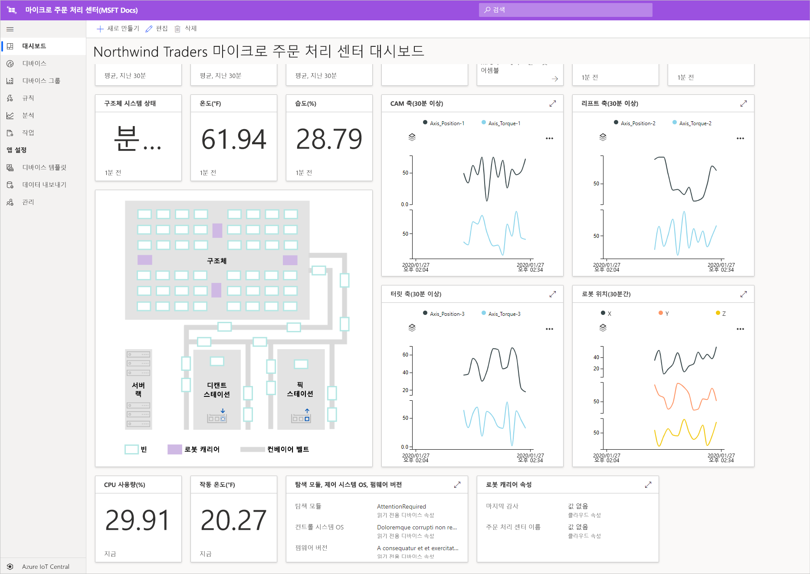
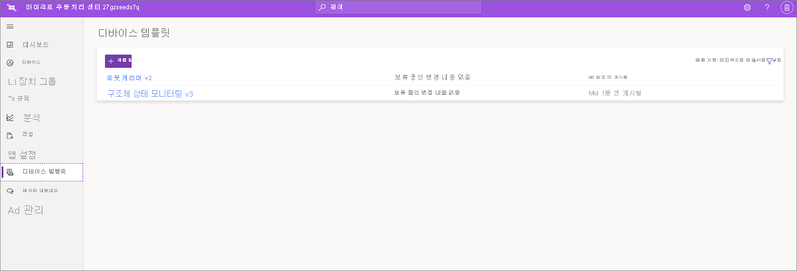
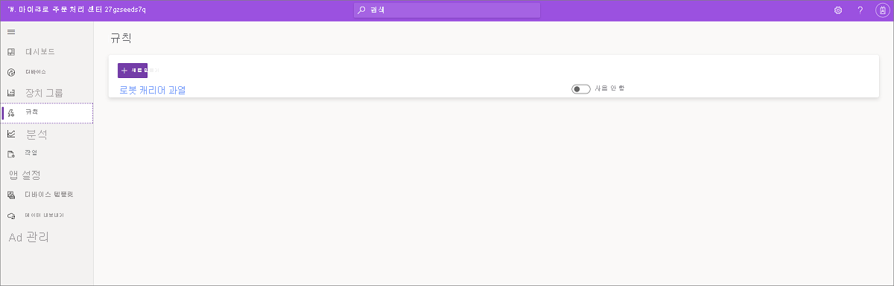
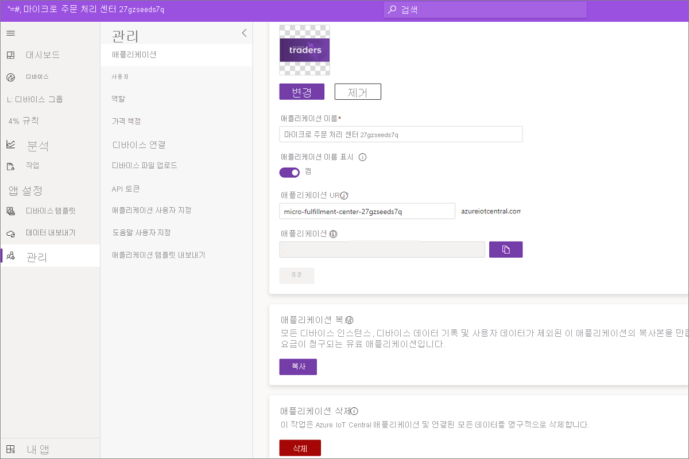

# 자습서: 마이크로 처리 센터 애플리케이션 템플릿 배포 및 살펴보기

이 자습서에서는 Azure IoT Central 마이크로 처리 센터 애플리케이션 템플릿을 사용하여 소매 솔루션을 빌드합니다. 템플릿을 배포하는 방법, 템플릿에 포함된 항목 및 다음에 수행할 수 있는 작업에 대해 알아봅니다.

## 사전 요구 사항
이 자습서 시리즈를 완료하려면 Azure 구독이 필요합니다. 필요에 따라 7일 무료 평가판을 사용할 수 있습니다. Azure 구독이 아직 없는 경우 [Azure 가입 페이지](https://aka.ms/createazuresubscription)에서 만들 수 있습니다.

## 애플리케이션 만들기 
이 섹션에서는 템플릿에서 새 Azure IoT Central 애플리케이션을 만듭니다. 자습서 시리즈 전체에서 이 애플리케이션을 사용하여 전체 솔루션을 빌드합니다.

새로운 Azure IoT Central 애플리케이션을 만들려면:

1. [Azure IoT Central 애플리케이션 관리자](https://aka.ms/iotcentral) 웹 사이트로 이동합니다.
1. Azure 구독이 있으면 액세스하는 데 사용하는 자격 증명을 사용하여 로그인합니다. 그렇지 않으면 Microsoft 계정을 사용하여 로그인합니다.

   

1. 새로운 Azure IoT Central 애플리케이션 만들기를 시작하려면 **새 애플리케이션**을 선택합니다.

1. **소매**를 선택합니다.  소매 페이지는 여러 소매점 애플리케이션 템플릿을 표시합니다.

미리 보기 기능을 사용하는 새로운 마이크로 처리 센터 애플리케이션을 만들려면 다음을 수행합니다.  
1. **마이크로 처리 센터** 애플리케이션 템플릿을 선택합니다. 이 템플릿에는 이 자습서에서 사용되는 모든 디바이스용 디바이스 템플릿이 포함되어 있습니다. 이 템플릿은 처리 센터 내의 상태와 로봇 캐리어의 상태를 모니터링하는 운영자 대시보드도 제공합니다. 

    
    
1. 필요에 따라 친숙한 **애플리케이션 이름**을 선택합니다. 이 애플리케이션 템플릿은 Northwind Traders라는 가상의 회사를 기반으로 합니다. 

    >[!NOTE]
    >친숙한 애플리케이션 이름을 사용하는 경우에도 고유한 값을 애플리케이션 URL에 사용해야 합니다.

1. Azure 구독이 있는 경우 디렉터리, Azure 구독 및 지역을 입력합니다. 구독이 없는 경우 7일 평가판을 사용하도록 설정하고 필요한 연락처 정보를 작성할 수 있습니다.  

    디렉터리 및 구독에 대한 자세한 내용은 [애플리케이션 만들기](../preview/quick-deploy-iot-central.md) 빠른 시작을 참조하세요.

1. **만들기**를 선택합니다.

    

## 애플리케이션 살펴보기 

앱 템플릿이 성공적으로 배포되면 **Northwind Traders 마이크로 처리 센터 대시보드**가 표시됩니다. Northwind Trader는 이 Azure IoT Central 애플리케이션에서 마이크로 처리 센터를 관리하는 가상의 소매업체입니다. 이 운영자 대시보드에는 수행할 수 있는 명령, 작업 및 동작 세트와 함께 이 템플릿의 디바이스에 대한 정보 및 원격 분석 데이터가 표시됩니다. 대시보드는 논리적으로 두 섹션으로 분할됩니다. 왼쪽에서는 처리 구조 내에서 환경 상태를 모니터링할 수 있고, 오른쪽에서는 시설 내 로봇 캐리어의 상태를 모니터링할 수 있습니다.  

대시보드에서 수행할 수 있는 작업은 다음과 같습니다.
   * 선택 횟수, 처리된 주문 수, 속성(예: 구조 시스템 상태)과 같은 디바이스 원격 분석을 확인합니다.  
   * 처리 구조 내에 있는 로봇 캐리어의 평면도와 위치를 봅니다.
   * 제어 시스템 다시 설정, 캐리어 펌웨어 업데이트 및 네트워크 재구성과 같은 명령을 트리거합니다.

     
   * 운영자가 처리 센터 내의 상태를 모니터링하는 데 사용할 수 있는 대시보드의 예를 참조합니다. 
   * 처리 센터 내의 게이트웨이 디바이스에서 실행되는 페이로드의 상태를 모니터링합니다.    

     

## 디바이스 템플릿
디바이스 템플릿 탭이 선택되면 템플릿에 포함된 다음 두 가지 유형의 디바이스가 표시됩니다. 
   * **로봇 캐리어**: 이 디바이스 템플릿은 처리 구조에 배포되어 적절한 저장 및 검색 작업을 수행하는 작동 중인 로봇 캐리어에 대한 정의를 나타냅니다. 이 템플릿을 선택하면 로봇에서 디바이스 데이터(예: 온도 및 축 위치)와 속성(예: 로봇 캐리어 상태)을 표시합니다. 
   * **구조 상태 모니터링**: 이 디바이스 템플릿은 처리 센터를 강화하기 위해 다양한 에지 워크로드를 호스팅하는 게이트웨이 디바이스뿐만 아니라 환경 상태도 모니터링할 수 있는 디바이스 컬렉션을 나타냅니다. 디바이스는 온도, 선택 횟수 및 주문 수와 같은 원격 분석 데이터를 보냅니다. 또한 환경에서 실행되는 컴퓨팅 워크로드의 상태에 대한 정보도 보냅니다. 

     

디바이스 그룹 탭을 선택하면 이러한 디바이스 템플릿에서 자동으로 만든 디바이스 그룹을 표시합니다.

## 규칙
**규칙** 탭에는 로봇 캐리어의 온도 상태를 모니터링하기 위해 애플리케이션 템플릿에 있는 샘플 규칙이 표시됩니다. 설비의 특정 로봇이 과열되어 서비스를 위해 오프라인으로 전환해야 하는 경우 이 규칙을 사용하여 운영자에게 경고할 수 있습니다. 

샘플 규칙을 창의적으로 사용하여 비즈니스 기능에 더 적합한 규칙을 정의합니다.

## 리소스 정리

이 애플리케이션을 계속 사용하지 않으려면 애플리케이션 템플릿을 삭제합니다. **관리** > **애플리케이션 설정**으로 차례로 이동하고, **삭제**를 선택합니다.

## 다음 단계
* [마이크로 처리 센터 솔루션 아키텍처](./architecture-micro-fulfillment-center.md)에 대한 자세한 정보
* 다른 [Azure IoT Central 소매 템플릿](./overview-iot-central-retail.md)에 대한 자세한 정보
* [Azure IoT Central 개요](../preview/overview-iot-central.md) 참조
