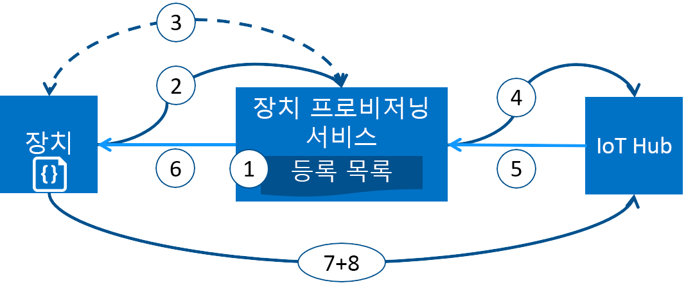

# Azure IoT Hub Device Provisioning Service로 디바이스 프로비전
Microsoft Azure는 IoT 솔루션 요구를 위해 통합된 공용 클라우드 서비스의 다양한 집합을 제공합니다. IoT Hub Device Provisioning Service는 IoT Hub를 위한 도우미 서비스로, 사람이 개입할 필요 없이 적기에 올바른 IoT Hub에 무인 프로비전이 가능하여 고객은 안전하고 확장성이 뛰어난 방식으로 수백만 대의 디바이스를 프로비전할 수 있습니다.

## Device Provisioning Service를 사용하는 경우
다음과 같이 IoT Hub에 연결 및 구성된 디바이스를 가져오는 데 Device Provisioning Service가 적합한 여러 프로비전 시나리오가 있습니다.

* 출하 시(초기 설정) IoT Hub 연결 정보를 하드코딩하지 않고 단일 IoT 솔루션으로 무인 프로비전
* 여러 허브에서 디바이스 부하 분산
* 판매 트랜잭션 데이터에 따라 해당 소유자의 IoT 솔루션에 디바이스 연결(다중 테넌트)
* 사용 사례에 따라 특정 IoT 솔루션에 디바이스 연결(솔루션 격리)
* 대기 시간이 가장 낮은 IoT Hub에 디바이스 연결(지리적 분할)
* 장치의 변경 내용에 따라 다시 프로비전
* 디바이스를 IoT Hub에 연결하는 데 사용되는 키 롤링(X.509 인증서를 사용하여 연결하는 경우)

## 배후 상황
이전 섹션에 나열된 모든 시나리오는 무인 프로비전을 위한 프로비전 서비스를 사용하여 동일한 흐름으로 수행할 수 있습니다. 일반적으로 프로비전에 포함된 수동 단계 대부분은 IoT 디바이스 배포에 드는 시간을 절약하고 수동 오류의 위험을 낮추기 위해 Device Provisioning Service로 자동화되어 있습니다. 다음 섹션에서는 프로비전된 장치를 가져올 때 백그라운드에서 발생하는 일에 대해 설명합니다. 첫 번째 단계는 수동이며, 다음 단계는 모두 자동으로 처리됩니다.

1. 디바이스 제조업체는 Azure Portal에서 등록 목록에 디바이스 등록 정보를 추가합니다.
2. 디바이스가 출하 시 설정된 프로비전 서비스 엔드포인트로 연결됩니다. 장치가 ID를 증명하기 위해 프로비전 서비스에 식별 정보를 전달합니다.
3. 프로비전 서비스는 nonce 챌린지([신뢰할 수 있는 플랫폼 모듈](https://trustedcomputinggroup.org/work-groups/trusted-platform-module/)) 또는 표준 X.509 확인( X.509) 중 하나를 사용하여 등록 목록 항목에 대하여 등록 ID 및 키의 유효성을 검사하여 디바이스의 ID의 유효성을 검사합니다.
4. 프로비전 서비스는 IoT Hub를 사용하는 디바이스를 등록하고 디바이스의 [필요한 이중 상태](../iot-hub/iot-hub-devguide-device-twins.md)를 채웁니다.
5. IoT Hub는 프로비전 서비스에 디바이스 ID 정보를 반환합니다.
6. 프로비전 서비스는 디바이스에 IoT Hub 연결 정보를 반환합니다. 이제 디바이스가 IoT Hub에 직접 데이터를 보내기 시작할 수 있습니다.
7. 디바이스가 IoT Hub에 연결됩니다.
8. 디바이스가 IoT Hub의 해당 디바이스 쌍에서 원하는 상태를 가져옵니다.

## 프로비전 프로세스
디바이스의 배포 프로세스에는 두 가지 고유 단계가 있습니다. Device Provisioning Service는 독립적으로 수행될 수 있는 파트를 수행합니다.

* 디바이스가 생성되고 출하 시 준비되는 **제조 단계** 및
* Device Provisioning Service가 자동 프로비전을 위해 구성되는 **클라우드 설치 단계**

이러한 단계는 모두 기존 제조 및 배포 프로세스에 원활히 어울립니다. Device Provisioning Service도 디바이스에 대한 연결 정보를 가져오기 위한 많은 수동 작업을 포함하는 일부 배포 프로세스를 간소화합니다.

### 제조 단계
이 단계는 제조 라인에서 발생하는 모든 것입니다. 이 단계에 포함되는 역할에는 실리콘 디자이너, 실리콘 제조업체, 통합 업체 및/또는 디바이스의 최종 제조업체를 포함합니다. 이 단계는 자체 하드웨어 만들기와 관련되어 있습니다.

Device Provisioning Service는 제조 프로세스에 새 단계를 도입하지 않습니다. 대신, 초기 소프트웨어 및 (원칙적으로) HSM을 디바이스에 설치하는 기존 단계를 통제합니다. 이 단계에서는 장치 ID를 만드는 대신, 프로비전 서비스가 켜져 있는 경우 연결 정보/IoT 솔루션 할당을 가져오도록 프로비전 서비스를 호출할 수 있도록 프로비전 서비스 정보를 사용하여 장치를 프로그래밍합니다.

또한 이 단계에서 제조 업체는 디바이스 배포자/연산자에게 식별 주요 정보를 제공합니다. 모든 장치에 장치 배포자/연산자가 제공한 서명 인증서에서 생성된 X.509 인증서가 있는지 확인하는 간단한 방법으로 이 정보를 제공할 수도 있고, 각 TPM 장치에서 TPM 인증 키의 공개 부분을 추출하는 복잡한 방법으로 제공할 수도 있습니다. 이러한 서비스는 현재 많은 실리콘 제조 업체에서 제공합니다.

### 클라우드 설정 단계
이 단계는 적절한 자동 프로비전에 대한 클라우드 구성에 관한 것입니다. 일반적으로 이 클라우드 설정 단계에 포함된 사용자는 디바이스를 초기에 어떻게 설정해야 하는지를 아는 사용자(디바이스 연산자) 및 디바이스를 IoT Hub로 어떻게 분할하는지를 아는 사용자(솔루션 연산자), 이렇게 두 유형이 있습니다.

프로비전은 초기에 한 번 설정해야 하며, 일반적으로 솔루션 연산자가 처리합니다. 프로비전 서비스가 구성되고 나면 사용 사례가 변경되지 않는 한 수정할 필요가 없습니다.

자동 프로비전을 위해 서비스를 구성한 후에 디바이스를 등록하도록 준비해야 합니다. 이 단계는 디바이스의 원하는 구성이 무엇인지 알고, 프로비전 서비스가 해당 IoT Hub를 찾을 때 제대로 디바이스의 ID를 증명할 수 있도록 하는 데 책임이 있는 디바이스 연산자에 의해 수행됩니다. 디바이스 연산자는 제조업체로부터 식별 주요 정보를 가져오고 등록 목록에 이를 추가합니다. 새 항목이 추가되거나 기존 항목이 디바이스에 대한 최신 정보로 업데이트되면 등록 목록에 대한 후속 업데이트가 있을 수 있습니다.

## 등록 및 프로비전
*프로비전*이란 용어가 사용되는 업계에 따라 다양한 항목을 의미합니다. 클라우드 솔루션에 대한 IoT 디바이스 프로비전의 컨텍스트에서는, 프로비전이란 다음과 같이 두 파트 프로세스입니다.

1. 첫 번째 부분은 디바이스를 등록함으로써 디바이스와 IoT 솔루션 간 초기 연결을 설정하는 것입니다.
2. 두 번째 부분은 디바이스를 등록한 솔루션의 특정 요구 사항에 따라 디바이스에 적절한 구성을 적용하는 것입니다.

두 단계가 모두 완료되면 장치가 완벽히 프로비전된 것입니다. 일부 클라우드 서비스는 프로비전 프로세스의 첫 번째 단계만 제공하여 디바이스를 IoT 솔루션 엔드포인트에 등록하고 초기 구성은 제공하지 않습니다. Device Provisioning Service는 두 단계를 모두 자동화하여 디바이스에 원활한 프로비전 환경을 제공합니다.

## Device Provisioning Service의 기능
Device Provisioning Service에는 장치 프로비전에 이상적인 여러 기능이 있습니다.

* **보안 증명** X.509 및 TPM 기반 ID를 모두 지원합니다.
* **등록 목록** 특정 시점에 등록된 디바이스/디바이스 그룹의 전체 레코드를 포함합니다. 등록 목록에는 디바이스를 등록한 후 디바이스의 원하는 구성에 대한 정보를 포함하며, 언제든지 업데이트할 수 있습니다.
* **여러 할당 정책** 사용자 시나리오를 지원하기 위해 Device Provisioning Service에서 디바이스를 IoT Hub에 할당하는 방법을 제어할 수 있습니다.
* **모니터링 및 진단 로깅** 모든 과정이 제대로 작동되도록 보장합니다.
* **다중 허브 지원** Device Provisioning Service가 장치를 둘 이상의 IoT Hub에 할당할 수 있습니다. Device Provisioning Service는 여러 Azure 구독에서 허브와 통신할 수 있습니다.
* **지역 간 지원** Device Provisioning Service가 장치를 다른 지역의 IoT Hub에 할당할 수 있게 해줍니다.

[디바이스 개념](concepts-device.md), [서비스 개념](concepts-service.md) 및 [보안 개념](concepts-security.md)에서 디바이스 프로비저닝에 관련된 개념 및 디바이스에 대해 자세히 알아볼 수 있습니다.

## 플랫폼 간 지원
모든 Azure IoT 서비스와 같이 Device Provisioning Service는 다양한 운영 체제를 사용하여 플랫폼 간 작동합니다. Azure는 보다 수월하게 장치를 연결하고 서비스를 관리할 수 있도록 다양한 [언어](https://github.com/Azure/azure-iot-sdks)로 오픈 소스 SDK를 제공합니다. Device Provisioning Service는 디바이스를 연결하기 위한 다음 프로토콜을 지원합니다.

* HTTPS
* AMQP
* websocket을 통한 AMQP
* MQTT
* websocket을 통한 MQTT

Device Provisioning Service는 서비스 작업을 위한 HTTPS 연결만 지원합니다.

## 영역
Device Provisioning Service는 여러 지역에 제공됩니다. 모든 서비스의 기존 지역 및 새로 발표된 지역 업데이트 목록은 [Azure 지역](https://azure.microsoft.com/regions/)에 있습니다. Device Provisioning Service의 가용성은 [Azure 상태](https://azure.microsoft.com/status/) 페이지에서 확인할 수 있습니다.

> [!NOTE]
> Device Provisioning Service는 전역적이며 특정 위치에 바인딩되지 않습니다. 그러나 Device Provisioning Service 프로필과 연결된 메타데이터가 상주할 영역을 지정해야 합니다.

## 가용성
Device Provisioning Service의 서비스 수준 계약은 99.9%이며, [SLA를 확인](https://azure.microsoft.com/support/legal/sla/iot-hub/)할 수 있습니다. 전체 [Azure SLA](https://azure.microsoft.com/support/legal/sla/)는 Azure의 보장된 가용성에 대해 전반적으로 설명합니다.

## 할당량
각 Azure 구독에는 IoT 솔루션의 범위에 영향을 줄 수 있는 기본 할당량 한도가 있습니다. 구독당 현재 한도 기준은 구독당 10개 Device Provisioning Service입니다.

할당량 제한에 대한 자세한 내용은 다음을 참조하세요.

* [Azure 구독 서비스 제한](../azure-subscription-service-limits.md)

## 관련 Azure 구성 요소
Device Provisioning Service는 Azure IoT Hub를 통한 디바이스 프로비전을 자동화합니다. [IoT Hub](https://docs.microsoft.com/azure/iot-hub/)에 대해 자세히 알아보세요.

## 다음 단계
이제 Azure에서의 IoT 디바이스 프로비전에 관해 대략적으로 이해하게 되었을 것입니다. 다음 단계는 엔드투엔드 IoT 시나리오를 사용해 보는 것입니다.
> [!div class="nextstepaction"]
> [Azure Portal을 사용하여 IoT Hub Device Provisioning Service 설정](quick-setup-auto-provision.md)
> [시뮬레이션된 디바이스 만들기 및 프로비전](quick-create-simulated-device.md)
> [프로비전을 위한 디바이스 설정](tutorial-set-up-device.md)
