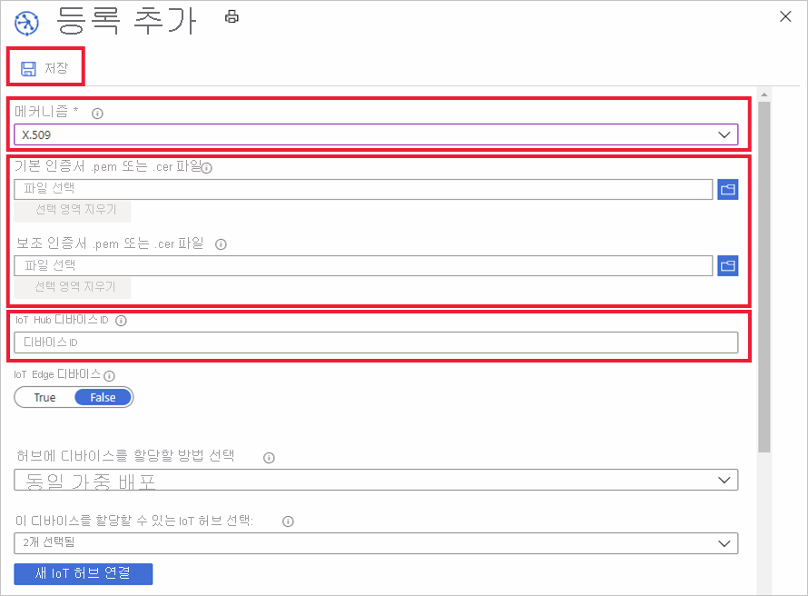

# IoT Hub 장치 프로비전 서비스에서 장치 등록을 관리하는 방법

*장치 등록*은 특정 시점에 Azure IoT Hub 장치 프로비전 서비스에 등록할 수 있는 단일 장치 또는 장치 그룹의 레코드를 만듭니다. 등록 레코드에는 원하는 IoT Hub를 포함하여 해당 등록의 일부로 해당 장치에 대한 초기 원하는 구성을 포함합니다. 이 문서에서는 프로비전 서비스에 대한 장치 등록을 관리하는 방법을 보여줍니다.

## 장치 등록 만들기

프로비전 서비스를 사용하여 두 가지 방법으로 장치를 등록할 수 있습니다.

1. **등록 그룹**은 동일한 루트 CA에서 서명된 X.509 인증서의 일반적인 증명 메커니즘을 공유하는 장치 그룹에 대한 항목입니다. 원하는 초기 구성을 공유하는 다수의 장치 또는 동일한 테넌트로 이동하는 장치에 대한 등록 그룹을 사용하는 것이 좋습니다. X.509 증명 메커니즘을 *등록 그룹*으로 사용하는 장치만을 등록할 수 있습니다. 

    다음 단계를 사용하여 포털에서 장치 그룹에 대한 등록 그룹을 만들 수 있습니다.

    1. Azure Portal에 로그인하고 왼쪽 메뉴에서 **모든 리소스**를 클릭합니다.
    2. 리소스의 목록 간에 장치를 등록하려는 장치 프로비전 서비스를 클릭합니다.
    3. 프로비전 서비스에서 **등록 관리**를 클릭한 후 **등록 그룹** 탭을 선택합니다.
    4. 맨 위에 있는 **추가** 단추를 클릭하고 등록 목록 항목에 필요한 정보를 입력합니다. 장치 그룹에 대한 루트 인증서를 업로드합니다. 
    5. **Save**를 클릭합니다. 등록 그룹을 성공적으로 만들면 그룹 이름이 **등록 그룹** 탭 아래에 표시되어야 합니다. 

        

    
2. **개별 등록**은 등록할 수 있는 단일 장치에 대한 항목입니다. 개별 등록은 증명 메커니즘으로 x509 인증서 또는 SAS 토큰(실제 또는 가상 TPM) 중 하나를 사용할 수 있습니다. 고유한 초기 구성이 필요한 장치 또는 증명 메커니즘으로 TPM 또는 가상 TPM을 통해 SAS 토큰만을 사용할 수 있는 장치의 경우 개별 등록을 사용하는 것이 좋습니다. 개별 등록에는 원하는 IoT Hub 장치 ID가 지정될 수 있습니다.

    다음 단계를 사용하여 포털에서 개별 등록을 만들 수 있습니다. 

    1. Azure Portal에 로그인하고 왼쪽 메뉴에서 **모든 리소스**를 클릭합니다.
    2. 리소스의 목록 간에 장치를 등록하려는 장치 프로비전 서비스를 클릭합니다.
    3. 프로비전 서비스에서 **등록 관리**를 클릭한 후 **개별 등록** 탭을 선택합니다.
    4. 위쪽에 있는 **추가** 단추를 클릭합니다. 
    5. 장치에 대한 보안 메커니즘을 선택하고 등록 목록 항목에 필요한 정보를 입력합니다. 장치가 X.509를 구현하는 경우 서명된 인증서를 업로드합니다. 
    6. **Save**를 클릭합니다. 등록 그룹을 성공적으로 만들면 장치가 **개별 그룹** 탭 아래에 표시되어야 합니다. 

        

## 등록 항목 업데이트
다음 단계를 사용하여 포털에서 기존 등록 항목을 업데이트할 수 있습니다.

1. Azure Portal에서 장치 프로비전 서비스를 열고 **관리 등록**을 클릭합니다. 
2. 수정하려는 등록 항목으로 이동합니다. 장치 등록에 대한 요약 정보를 열 수 있는 항목을 클릭합니다. 
3. 이 페이지에서는장치 ID뿐만 아니라 장치가 연결되어야 하는 IoT Hub와 같은 보안 형식 및 자격 증명 이외의 항목을 수정할 수 있습니다. 또한 초기 장치 쌍 상태를 수정할 수 있습니다. 
4. 완료되면 **저장**을 클릭하여 장치 등록을 업데이트합니다. 

    

## 장치 등록 제거
장치가 IoT Hub에 사용자를 프로비전할 필요가 없는 경우 다음 단계를 사용하여 포털에서 관련된 등록 항목을 제거할 수 있습니다.

1. Azure Portal에서 장치 프로비전 서비스를 열고 **관리 등록**을 클릭합니다. 
2. 제거하려는 등록 항목으로 이동하여 선택합니다. 
3. 맨 위에 있는 **삭제**를 클릭한 후 확인하라는 메시지가 나타나면 **예**를 선택합니다. 
5. 작업이 완료되면 장치 등록의 목록에서 제거된 항목이 표시됩니다. 
 
    

