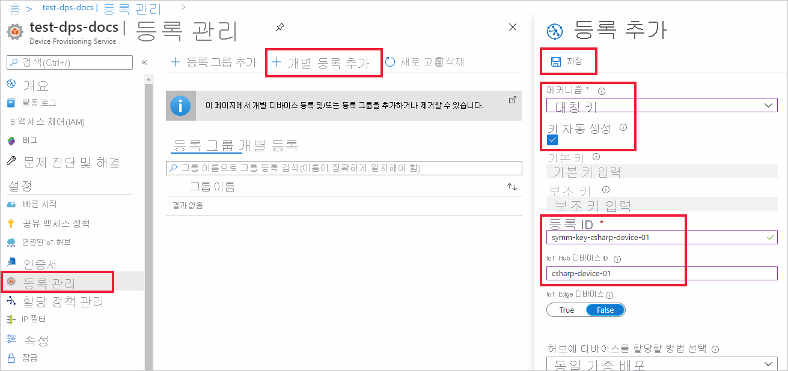

# <a name="quickstart-provision-a-symmetric-key-device-using-c"></a>빠른 시작: C#을 사용하여 대칭 키 디바이스 프로비저닝

이 빠른 시작에서는 C#을 사용하여 IoT 허브에 디바이스로 Windows 개발 머신을 프로비저닝하는 방법을 알아봅니다. 이 디바이스는 대칭 키와 개별 등록을 사용하여 IoT 허브에 할당되도록 DPS(Device Provisioning Service) 인스턴스로 인증합니다. [C#용 Azure IoT 샘플](https://github.com/Azure-Samples/azure-iot-samples-csharp)의 샘플 코드는 디바이스를 프로비저닝하는 데 사용됩니다. 

이 문서에서는 개별 등록을 통한 프로비저닝을 보여 주지만 등록 그룹을 사용할 수도 있습니다. 등록 그룹을 사용할 때는 몇 가지 차이점이 있습니다. 예를 들어 디바이스에 대한 고유한 등록 ID가 있는 파생된 디바이스 키를 사용해야 합니다. [대칭 키를 사용하여 디바이스 프로비저닝](how-to-legacy-device-symm-key.md)에서는 등록 그룹 예제를 제공합니다. 등록 그룹에 대한 자세한 내용은 [대칭 키 증명에 대한 그룹 등록](concepts-symmetric-key-attestation.md#group-enrollments)을 참조하세요.

자동 프로비저닝 프로세스에 익숙하지 않은 경우 [프로비저닝](about-iot-dps.md#provisioning-process) 개요를 검토하세요. 

이 빠른 시작을 계속하기 전에 [Azure Portal에서 IoT Hub Device Provisioning Service 설정](./quick-setup-auto-provision.md)의 단계를 완료해야 합니다. 이 빠른 시작에서는 Device Provisioning Service 인스턴스를 이미 만들었어야 합니다.

이 문서는 Windows 기반 워크스테이션에 적용됩니다. 그러나 Linux에서 절차를 수행할 수 있습니다. Linux 예제는 [다중 테넌트에 대한 프로비저닝](how-to-provision-multitenant.md)을 참조하세요.


[!INCLUDE [quickstarts-free-trial-note](../../includes/quickstarts-free-trial-note.md)]


## <a name="prerequisites"></a>사전 요구 사항

* Windows 기반 머신에 [.NET Core 2.1 SDK](https://dotnet.microsoft.com/download) 이상이 설치되어 있는지 확인합니다.

* 최신 버전의 [Git](https://git-scm.com/download/) 설치

<a id="setupdevbox"></a>


## <a name="create-a-device-enrollment"></a>디바이스 등록 만들기

1. [Azure Portal](https://portal.azure.com)에 로그인하여 왼쪽 메뉴에서 **모든 리소스** 단추를 선택하고, DPS(Device Provisioning Service) 인스턴스를 엽니다.

2. **등록 관리** 탭을 선택한 다음, 위쪽에서 **개별 등록 추가** 단추를 선택합니다. 

3. **등록 추가** 패널에서 다음 정보를 입력하고 **저장** 단추를 누릅니다.

   - **메커니즘:** ID 증명 *메커니즘* 으로 **대칭 키** 를 선택합니다.

   - **키 자동 생성**: 이 상자를 선택합니다.

   - **등록 ID**: 등록을 식별하는 등록 ID를 입력합니다. 소문자 영숫자 및 대시('-') 문자만을 사용합니다. 예를 들어 **symm-key-csharp-device-01** 입니다.

   - **IoT Hub 디바이스 ID:** 디바이스 식별자를 입력합니다. 예를 들어 **csharp-device-01** 입니다.

     

4. 등록을 저장하면 **기본 키** 및 **보조 키** 가 생성되고 등록 항목에 추가됩니다. 대칭 키 디바이스 등록이 *개별 등록* 탭의 *등록 ID* 열 아래에 **symm-key-csharp-device-01** 로 표시됩니다. 

5. 등록을 열고 생성된 **기본 키** 의 값을 복사합니다. 나중에 디바이스 프로비저닝 샘플 코드를 실행할 때 이 키 값과 **등록 ID** 를 사용합니다.


## <a name="prepare-the-c-environment"></a>C# 환경 준비 

1. Git CMD 또는 Git Bash 명령줄 환경을 엽니다. 다음 명령을 사용하여 [C#용 Azure IoT 샘플](https://github.com/Azure-Samples/azure-iot-samples-csharp) GitHub 리포지토리를 복제합니다.

    ```cmd
    git clone https://github.com/Azure-Samples/azure-iot-samples-csharp.git
    ```


<a id="firstbootsequence"></a>

## <a name="run-the-device-provisioning-code"></a>디바이스 프로비저닝 코드 실행

이 섹션에서는 DPS 리소스에 등록하기 위한 대칭 키 디바이스로 디바이스 프로비저닝 샘플 코드를 인증하는 세 개의 매개 변수를 사용하여 디바이스 프로비저닝 샘플을 실행합니다. 이러한 세 개 매개 변수는 다음과 같습니다.

* ID 범위
* 개별 등록에 대한 등록 ID.
* 개별 등록에 대한 기본 대칭 키.

프로비저닝 코드는 디바이스를 인증하기 위해 이러한 매개 변수에 따라 DPS 리소스에 연결합니다. 그러면 디바이스는 개별 등록 구성에 따라 DPS 인스턴스에 이미 연결된 IoT 허브에 할당됩니다. 프로비전되면 샘플 코드는 테스트 원격 분석 메시지를 IoT 허브로 보냅니다.

1. [Azure Portal](https://portal.azure.com)의 디바이스 프로비저닝 서비스 메뉴에서 **개요** 를 선택하고 **ID 범위** 값을 복사합니다. 이 값은 샘플 코드를 실행할 때 `IdScope` 매개 변수에 사용합니다.

2. 명령 프롬프트를 열고 복제된 샘플 리포지토리에서 *SymmetricKeySample* 로 이동합니다.

    ```cmd
    cd azure-iot-samples-csharp\provisioning\Samples\device\SymmetricKeySample
    ```

3. *SymmetricKeySample* 폴더의 *Parameters.cs* 를 텍스트 편집기에서 엽니다. 이 파일은 샘플에서 지원하는 매개 변수를 보여줍니다. 이 문서에서는 샘플을 실행할 때 처음 세 개의 필수 매개 변수만 사용합니다. 이 파일의 코드를 살펴보세요. 변경할 필요는 없습니다.
 
    | 매개 변수                         | 필수 | 설명     |
    | :-------------------------------- | :------- | :-------------- |
    | `--s` 또는 `--IdScope`              | True     | DPS 인스턴스의 ID 범위 |
    | `--i` 또는 `--Id`                   | True     | 개별 등록을 사용할 때의 등록 ID 또는 그룹 등록을 사용할 때 원하는 디바이스 ID. |
    | `--p` 또는 `--PrimaryKey`           | True     | 개인 등록 또는 그룹 등록의 기본 키. |
    | `--e` 또는 `--EnrollmentType`       | 거짓    | 등록 유형: `Individual` 또는 `Group`. 기본값은 `Individual`입니다. |
    | `--g` 또는 `--GlobalDeviceEndpoint` | 거짓    | 디바이스에서 연결할 전역 엔드포인트. 기본값은 `global.azure-devices-provisioning.net`입니다. |
    | `--t` 또는 `--TransportType`        | 거짓    | 디바이스 프로비저닝 인스턴스와 통신하는 데 사용할 전송. 기본값은 `Mqtt`입니다. 가능한 값은 `Mqtt`, `Mqtt_WebSocket_Only`, `Mqtt_Tcp_Only`, `Amqp`, `Amqp_WebSocket_Only`, `Amqp_Tcp_only` 및 `Http1`입니다.|
     
4. *SymmetricKeySample* 폴더의 *ProvisioningDeviceClientSample.cs* 를 텍스트 편집기에서 엽니다. 이 파일은 대칭 키 디바이스를 프로비전하기 위해 [SecurityProviderSymmetricKey](/dotnet/api/microsoft.azure.devices.shared.securityprovidersymmetrickey?view=azure-dotnet&preserve-view=true) 클래스와 [ProvisioningDeviceClient](/dotnet/api/microsoft.azure.devices.provisioning.client.provisioningdeviceclient?view=azure-dotnet&preserve-view=true) 클래스가 어떻게 함께 사용되는지 보여줍니다. 이 파일의 코드를 살펴보세요.  변경할 필요는 없습니다.
 
5. 세 가지 예제 매개 변수를 바꾼 후 다음 명령을 사용해서 샘플 코드를 빌드하고 실행합니다. ID 범위, 등록 ID(Enrollment Registration ID) 및 등록 기본 키에 올바른 값을 사용합니다.
    
    ```console
    dotnet run --s 0ne00000A0A --i symm-key-csharp-device-01 --p sbDDeEzRuEuGKag+kQKV+T1QGakRtHpsERLP0yPjwR93TrpEgEh/Y07CXstfha6dhIPWvdD1nRxK5T0KGKA+nQ==
    ```    


6. 예상 출력은 다음과 비슷하며, 개별 등록 설정에 따라 디바이스가 할당된 연결된 IoT 허브를 보여줍니다. "TestMessage" 문자열 예제는 테스트로 허브에 전송됩니다.

    ```output
    D:\azure-iot-samples-csharp\provisioning\Samples\device\SymmetricKeySample>dotnet run --s 0ne00000A0A --i symm-key-csharp-device-01 --p sbDDeEzRuEuGKag+kQKV+T1QGakRtHpsERLP0yPjwR93TrpEgEh/Y07CXstfha6dhIPWvdD1nRxK5T0KGKA+nQ==

    Initializing the device provisioning client...
    Initialized for registration Id symm-key-csharp-device-01.
    Registering with the device provisioning service...
    Registration status: Assigned.
    Device csharp-device-01 registered to ExampleIoTHub.azure-devices.net.
    Creating symmetric key authentication for IoT Hub...
    Testing the provisioned device with IoT Hub...
    Sending a telemetry message...
    Finished.
    Enter any key to exit.
    ```
    
7. Azure Portal에서 프로비저닝 서비스와 연결된 IoT 허브로 이동하여 **IoT 디바이스** 블레이드를 엽니다. 허브에 대칭 키 디바이스를 성공적으로 프로비저닝한 후 디바이스 ID는 **사용** 으로 *상태* 와 함께 표시됩니다. 디바이스 샘플 코드를 실행하기 전에 블레이드가 이미 열려 있으면 위쪽의 **새로 고침** 단추를 눌러야 할 수도 있습니다. 

     

> [!NOTE]
> 디바이스에 대한 등록 항목의 기본값으로부터 *초기 디바이스 쌍 상태* 를 변경한 경우, 허브에서 원하는 쌍 상태를 가져와서 그에 맞게 작동할 수 있습니다. 자세한 내용은 [IoT Hub의 디바이스 쌍 이해 및 사용](../iot-hub/iot-hub-devguide-device-twins.md)을 참조하세요.
>


## <a name="clean-up-resources"></a>리소스 정리

디바이스 클라이언트 샘플을 계속해서 작업하고 탐색할 계획인 경우 이 빠른 시작에서 만든 리소스를 정리하지 마세요. 계속하지 않으려는 경우 다음 단계를 사용하여 이 빠른 시작에서 만든 모든 리소스를 삭제합니다.

1. Azure Portal의 왼쪽 메뉴에서 **모든 리소스** 를 선택한 다음, Device Provisioning Service를 선택합니다. 서비스에 대한 **등록 관리** 를 연 다음, **개별 등록** 탭을 선택합니다. 이 빠른 시작에 등록한 디바이스의 *등록 ID* 옆에 있는 확인란을 선택하고, 창 위쪽에 있는 **삭제** 단추를 누릅니다. 
1. Azure Portal의 왼쪽 메뉴에서 **모든 리소스** 를 선택한 다음, 사용자의 IoT 허브를 선택합니다. 허브에 대한 **IoT 디바이스** 를 열고 이 빠른 시작에 등록한 디바이스의 *디바이스 ID* 옆에 있는 확인란을 선택한 다음, 창 위쪽에 있는 **삭제** 단추를 누릅니다.

## <a name="next-steps"></a>다음 단계

이 빠른 시작에서는 IoT Hub Device Provisioning Service를 사용하여 Windows 기반 대칭 키 디바이스를 IoT 허브에 프로비저닝했습니다. C#을 사용하여 X.509 인증서 디바이스를 프로비저닝하는 방법을 알아보려면 아래의 X.509 디바이스에 대한 빠른 시작을 계속 진행하세요. 

> [!div class="nextstepaction"]
> [Azure 빠른 시작 - DPS 및 C#을 사용하여 X.509 디바이스 프로비저닝](quick-create-simulated-device-x509-csharp.md)
