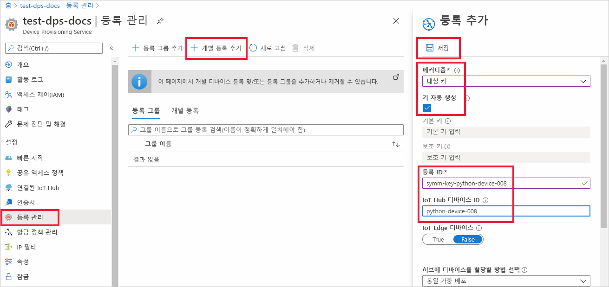
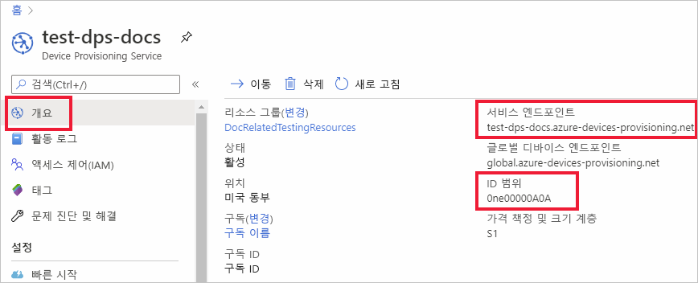
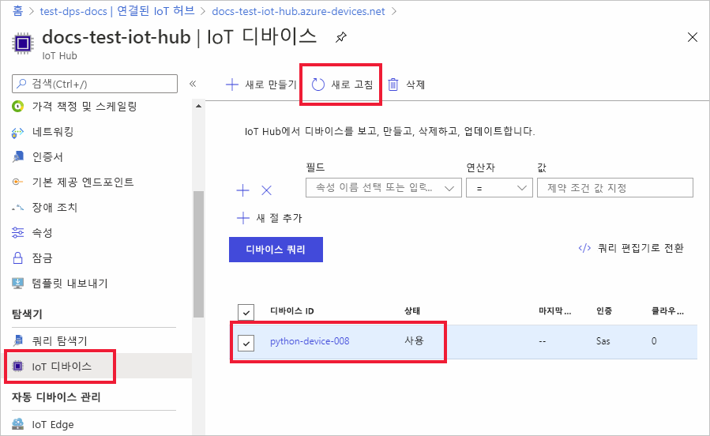

# <a name="quickstart-provision-a-python-device-with-symmetric-keys"></a>대칭 키를 사용하여 Python 디바이스 프로비저닝

이 빠른 시작에서는 Python을 사용하여 IoT 허브에 디바이스로 Windows 개발 머신을 프로비저닝하는 방법을 알아봅니다. 이 디바이스는 대칭 키와 개별 등록을 사용하여 IoT 허브에 할당되도록 DPS(Device Provisioning Service) 인스턴스로 인증합니다. [Azure IoT Python SDK](https://github.com/Azure/azure-iot-sdk-python)의 샘플 코드는 디바이스를 프로비저닝하는 데 사용됩니다. 

이 문서에서는 개별 등록을 통한 프로비저닝을 보여 주지만 등록 그룹을 사용할 수도 있습니다. 등록 그룹을 사용할 때는 몇 가지 차이점이 있습니다. 예를 들어 디바이스에 대한 고유한 등록 ID가 있는 파생된 디바이스 키를 사용해야 합니다. 대칭 키 등록 그룹은 레거시 디바이스로 제한되지 않지만 [대칭 키 증명을 사용하여 레거시 디바이스를 프로비전하는 방법](how-to-legacy-device-symm-key.md)은 등록 그룹 예제를 제공합니다. 자세한 내용은 [대칭 키 증명에 대한 그룹 등록](concepts-symmetric-key-attestation.md#group-enrollments)을 참조하세요.

자동 프로비저닝 프로세스에 익숙하지 않은 경우 [프로비저닝](about-iot-dps.md#provisioning-process) 개요를 검토하세요. 

이 빠른 시작을 계속하기 전에 [Azure Portal에서 IoT Hub Device Provisioning Service 설정](./quick-setup-auto-provision.md)의 단계를 완료해야 합니다. 이 빠른 시작에서는 Device Provisioning Service 인스턴스를 이미 만들었어야 합니다.

이 문서는 Windows 기반 워크스테이션에 적용됩니다. 그러나 Linux에서 절차를 수행할 수 있습니다. Linux 예제는 [다중 테넌트를 지원하기 위해 장치를 프로비전하는 방법](how-to-provision-multitenant.md)을 참조하세요.


[!INCLUDE [quickstarts-free-trial-note](../../includes/quickstarts-free-trial-note.md)]


## <a name="prerequisites"></a>필수 구성 요소

* Windows 기반 머신에 [Python 3.7](https://www.python.org/downloads/) 이상이 설치되어 있는지 확인합니다. `python --version`을 실행하여 Python 버전을 확인할 수 있습니다.

* 최신 버전의 [Git](https://git-scm.com/download/) 설치

<a id="setupdevbox"></a>

## <a name="prepare-the-python-sdk-environment"></a>Python SDK 환경 준비 

1. Git이 컴퓨터에 설치되어 있고 명령 창에서 액세스할 수 있는 환경 변수에 추가되었는지 확인합니다. 설치할 `git` 도구의 최신 버전은 [Software Freedom Conservancy의 Git 클라이언트 도구](https://git-scm.com/download/)를 참조하세요. 여기에는 로컬 Git 리포지토리와 상호 작용하는 데 사용할 수 있는 명령줄 앱인 **Git Bash** 가 포함됩니다. 

2. 명령 프롬프트를 엽니다. Azure IoT Python SDK에 대한 GitHub 리포지토리를 복제합니다.
    
    ```console
    git clone https://github.com/Azure/azure-iot-sdk-python.git --recursive
    ```
3. 샘플 파일, _provision_symmetric_key.py_ 가 있는 `azure-iot-sdk-python\azure-iot-device\samples\async-hub-scenarios` 디렉터리로 이동합니다.
   
   ```console
   cd azure-iot-sdk-python\azure-iot-device\samples\async-hub-scenarios
   ```
4. 다음 명령을 실행하여 _azure-iot-device_ 라이브러리를 설치합니다.

    ```console
    pip install azure-iot-device
    ```


## <a name="create-a-device-enrollment"></a>디바이스 등록 만들기

1. [Azure Portal](https://portal.azure.com)에 로그인하여 왼쪽 메뉴에서 **모든 리소스** 단추를 선택하고, DPS(Device Provisioning Service) 인스턴스를 엽니다.

2. **등록 관리** 탭을 선택한 다음, 위쪽에서 **개별 등록 추가** 단추를 선택합니다. 

3. **등록 추가** 패널에서 다음 정보를 입력하고 **저장** 단추를 누릅니다.

   - **메커니즘:** ID 증명 *메커니즘* 으로 **대칭 키** 를 선택합니다.

   - **키 자동 생성** : 이 상자를 선택합니다.

   - **등록 ID** : 등록을 식별하는 등록 ID를 입력합니다. 소문자 영숫자 및 대시('-') 문자만을 사용합니다. 예를 들어 **symm-key-python-device-008** 입니다.

   - **IoT Hub 디바이스 ID:** 디바이스 식별자를 입력합니다. 예를 들어 **python-device-008** 입니다.

     

4. 등록을 저장하면 **기본 키** 및 **보조 키** 가 생성되고 등록 항목에 추가됩니다. 대칭 키 디바이스 등록이 *개별 등록* 탭의 *등록 ID* 열에 **symm-key-python-device-008** 로 표시됩니다. 

5. 등록을 열고 생성된 **기본 키** 의 값을 복사합니다. 디바이스 프로비저닝 샘플 코드와 함께 사용하기 위해 환경 변수를 추가할 때 이 키 값과 **등록 ID** 를 사용합니다.


<a id="firstbootsequence"></a>

## <a name="prepare-the-device-provisioning-code"></a>디바이스 프로비저닝 코드 준비

이 섹션에서는 대칭 키 디바이스에 대한 디바이스 프로비저닝 샘플 코드에 대한 매개 변수로 사용되는 다음 네 가지 환경 변수를 추가합니다. 

* `PROVISIONING_HOST`
* `PROVISIONING_IDSCOPE`
* `PROVISIONING_REGISTRATION_ID`
* `PROVISIONING_SYMMETRIC_KEY`

프로비저닝 코드는 디바이스를 인증하기 위해 이러한 변수에 따라 DPS 인스턴스에 연결됩니다. 그러면 디바이스는 개별 등록 구성에 따라 DPS 인스턴스에 이미 연결된 IoT 허브에 할당됩니다. 프로비저닝되면 샘플 코드는 일부 테스트 원격 분석을 IoT 허브로 보냅니다.

1. [Azure Portal](https://portal.azure.com)의 디바이스 프로비저닝 서비스 메뉴에서 **개요** 를 선택하고 _서비스 엔드포인트_ 및 _ID 범위_ 를 복사합니다. `PROVISIONING_HOST` 및 `PROVISIONING_IDSCOPE` 환경 변수에 대해 이러한 값을 사용합니다.

    

2. Python 명령 프롬프트에서 복사한 값을 사용하여 환경 변수를 추가합니다. 

    다음 명령은 명령 구문을 표시하는 예제입니다. 올바른 값을 사용해야 합니다.

    ```console
    set PROVISIONING_HOST=test-dps-docs.azure-devices-provisioning.net
    ```

    ```console
    set PROVISIONING_IDSCOPE=0ne00000A0A
    ```

3. Python 명령 프롬프트에서 이전 섹션의 개별 등록에서 복사한 등록 ID 및 대칭 키에 대한 환경 변수를 추가합니다. 

    다음 명령은 명령 구문을 표시하는 예제입니다. 올바른 값을 사용해야 합니다.

    ```console
    set PROVISIONING_REGISTRATION_ID=symm-key-python-device-008
    ```

    ```console
    set PROVISIONING_SYMMETRIC_KEY=sbDDeEzRuEuGKag+kQKV+T1QGakRtHpsERLP0yPjwR93TrpEgEh/Y07CXstfha6dhIPWvdD1nRxK5T0KGKA+nQ==
    ```

4. _provision_symmetric_key.py_ 에서 python 샘플 코드를 실행합니다.

    ```console
    D:\azure-iot-sdk-python\azure-iot-device\samples\async-hub-scenarios>python provision_symmetric_key.py
    ```

5. 예상 출력은 개별 등록 설정에 따라 디바이스가 할당된 연결된 IoT 허브를 표시하는 다음과 유사하게 표시됩니다. 몇 가지 예제 풍속 원격 분석 메시지는 테스트로 허브에도 전송됩니다.

    ```output
    D:\azure-iot-sdk-python\azure-iot-device\samples\async-hub-scenarios>python provision_symmetric_key.py
    RegistrationStage(RequestAndResponseOperation): Op will transition into polling after interval 2.  Setting timer.
    The complete registration result is
    python-device-008
    docs-test-iot-hub.azure-devices.net
    initialAssignment
    null
    Will send telemetry from the provisioned device
    sending message #8
    sending message #9
    sending message #3
    sending message #10
    sending message #4
    sending message #2
    sending message #6
    sending message #7
    sending message #1
    sending message #5
    done sending message #8
    done sending message #9
    done sending message #3
    done sending message #10
    done sending message #4
    done sending message #2
    done sending message #6
    done sending message #7
    done sending message #1
    done sending message #5
    ```
    
6. Azure Portal에서 프로비저닝 서비스와 연결된 IoT 허브로 이동하여 **IoT 디바이스** 블레이드를 엽니다. 허브에 대칭 키 디바이스를 성공적으로 프로비저닝한 후 디바이스 ID는 **사용** 으로 *상태* 와 함께 표시됩니다. 디바이스 샘플 코드를 실행하기 전에 블레이드가 이미 열려 있으면 위쪽의 **새로 고침** 단추를 눌러야 할 수도 있습니다. 

     

> [!NOTE]
> 디바이스에 대한 등록 항목의 기본값으로부터 *초기 디바이스 쌍 상태* 를 변경한 경우, 허브에서 원하는 쌍 상태를 가져와서 그에 맞게 작동할 수 있습니다. 자세한 내용은 [IoT Hub의 디바이스 쌍 이해 및 사용](../iot-hub/iot-hub-devguide-device-twins.md)을 참조하세요.
>


## <a name="clean-up-resources"></a>리소스 정리

디바이스 클라이언트 샘플을 계속해서 작업하고 탐색할 계획인 경우 이 빠른 시작에서 만든 리소스를 정리하지 마세요. 계속하지 않으려는 경우 다음 단계를 사용하여 이 빠른 시작에서 만든 모든 리소스를 삭제합니다.

1. Azure Portal의 왼쪽 메뉴에서 **모든 리소스** 를 선택한 다음, Device Provisioning Service를 선택합니다. 서비스에 대한 **등록 관리** 를 연 다음, **개별 등록** 탭을 선택합니다. 이 빠른 시작에 등록한 디바이스의 *등록 ID* 옆에 있는 확인란을 선택하고, 창 위쪽에 있는 **삭제** 단추를 누릅니다. 
1. Azure Portal의 왼쪽 메뉴에서 **모든 리소스** 를 선택한 다음, 사용자의 IoT 허브를 선택합니다. 허브에 대한 **IoT 디바이스** 를 열고 이 빠른 시작에 등록한 디바이스의 *디바이스 ID* 옆에 있는 확인란을 선택한 다음, 창 위쪽에 있는 **삭제** 단추를 누릅니다.

## <a name="next-steps"></a>다음 단계

이 빠른 시작에서는 IoT Hub Device Provisioning Service를 사용하여 Windows 기반 대칭 키 디바이스를 IoT 허브에 프로비저닝했습니다. Python을 사용하여 X.509 인증서 디바이스를 프로비저닝하는 방법을 알아보려면 아래의 X.509 디바이스에 대한 빠른 시작을 계속 진행하세요. 

> [!div class="nextstepaction"]
> [Azure 빠른 시작 - DPS 및 Python을 사용하여 X.509 디바이스 프로비저닝](quick-create-simulated-device-x509-python.md)
