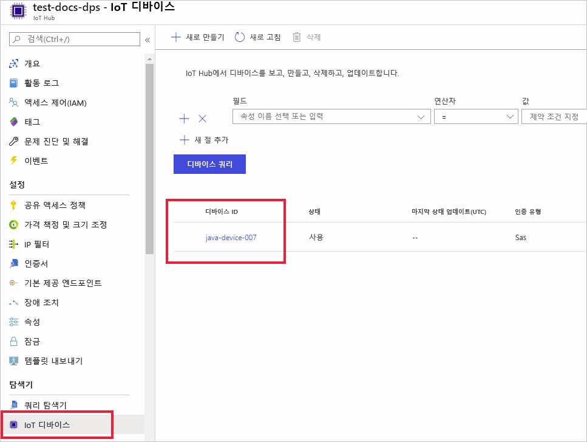

# <a name="quickstart-provision-a-simulated-device-with-symmetric-keys"></a>빠른 시작: 대칭 키를 사용하여 시뮬레이션된 디바이스 프로비전

이 빠른 시작에서는 Windows 개발 머신에서 디바이스 시뮬레이터를 만들고 실행하는 방법을 알아봅니다. 대칭 키를 사용하여 DPS(Device Provisioning Service) 인스턴스로 인증하고 IoT 허브에 할당되도록 이 시뮬레이션된 디바이스를 구성합니다. [Microsoft Azure IoT SDK for Java](https://github.com/Azure/azure-iot-sdk-java)의 샘플 코드는 프로비저닝을 시작하는 디바이스에 대한 부팅 시퀀스를 시뮬레이션하는 데 사용됩니다. 디바이스는 DPS 서비스 인스턴스의 개별 등록을 기반으로 인식되고 IoT 허브에 할당됩니다.

이 문서에서는 개별 등록을 통한 프로비저닝을 보여주지만 등록 그룹을 사용할 수 있습니다. 등록 그룹을 사용할 때는 몇 가지 차이점이 있습니다. 예를 들어 디바이스에 대한 고유한 등록 ID가 있는 파생된 디바이스 키를 사용해야 합니다. 대칭 키 등록 그룹은 레거시 디바이스로 제한되지 않지만 [대칭 키 증명을 사용하여 레거시 디바이스를 프로비전하는 방법](how-to-legacy-device-symm-key.md)은 등록 그룹 예제를 제공합니다. 자세한 내용은 [대칭 키 증명에 대한 그룹 등록](concepts-symmetric-key-attestation.md#group-enrollments)을 참조하세요.

자동 프로비전 프로세스에 익숙하지 않은 경우 [자동 프로비전 개념](concepts-auto-provisioning.md)을 검토하세요. 

이 빠른 시작을 계속하기 전에 [Azure Portal에서 IoT Hub Device Provisioning Service 설정](./quick-setup-auto-provision.md)의 단계를 완료해야 합니다. 이 빠른 시작에서는 Device Provisioning Service 인스턴스를 이미 만들었어야 합니다.

이 문서는 Windows 기반 워크스테이션에 적용됩니다. 그러나 Linux에서 절차를 수행할 수 있습니다. Linux 예제는 [다중 테넌트를 지원하기 위해 장치를 프로비전하는 방법](how-to-provision-multitenant.md)을 참조하세요.


[!INCLUDE [quickstarts-free-trial-note](../../includes/quickstarts-free-trial-note.md)]


## <a name="prerequisites"></a>사전 요구 사항

* 머신에 [Java SE Development Kit 8](https://aka.ms/azure-jdks) 이상이 설치되어 있는지 확인합니다.

* [Maven](https://maven.apache.org/install.html)을 다운로드하고 설치합니다.

* 최신 버전의 [Git](https://git-scm.com/download/) 설치

<a id="setupdevbox"></a>

## <a name="prepare-the-java-sdk-environment"></a>Java SDK 환경 준비 

1. Git이 컴퓨터에 설치되어 있고 명령 창에서 액세스할 수 있는 환경 변수에 추가되었는지 확인합니다. 설치할 `git` 도구의 최신 버전은 [Software Freedom Conservancy의 Git 클라이언트 도구](https://git-scm.com/download/)를 참조하세요. 여기에는 로컬 Git 리포지토리와 상호 작용하는 데 사용할 수 있는 명령줄 앱인 **Git Bash**가 포함됩니다. 

2. 명령 프롬프트를 엽니다. 디바이스 시뮬레이션 샘플 코드에 대한 GitHub 리포지토리를 복제합니다.
    
    ```cmd/sh
    git clone https://github.com/Azure/azure-iot-sdk-java.git --recursive
    ```
3. 필요한 모든 패키지를 다운로드하려면 루트 `azure-iot-sdk-java` 디렉터리로 이동하고 프로젝트를 빌드합니다.
   
   ```cmd/sh
   cd azure-iot-sdk-java
   mvn install -DskipTests=true
   ```

## <a name="create-a-device-enrollment"></a>디바이스 등록 만들기

1. [Azure Portal](https://portal.azure.com)에 로그인하여 왼쪽 메뉴에서 **모든 리소스** 단추를 선택하고, DPS(Device Provisioning Service) 인스턴스를 엽니다.

2. **등록 관리** 탭을 선택한 다음, 위쪽에서 **개별 등록 추가** 단추를 선택합니다. 

3. **등록 추가** 패널에서 다음 정보를 입력하고 **저장** 단추를 누릅니다.

   - **메커니즘**: **대칭 키**를 ID 증명 *메커니즘*으로 선택합니다.

   - **키 자동 생성**: 이 확인란을 선택합니다.

   - **등록 ID**: 등록을 식별하는 등록 ID를 입력합니다. 소문자 영숫자 및 대시('-') 문자만을 사용합니다. 예를 들어 **symm-key-java-device-007**입니다.

   - **IoT Hub 디바이스 ID:** 디바이스 식별자를 입력합니다. 예를 들어 **java-device-007**입니다.

     

4. 등록을 저장하면 **기본 키** 및 **보조 키**가 생성되고 등록 항목에 추가됩니다. 대칭 키 디바이스 등록이 *개별 등록* 탭의 *등록 ID* 열에 **symm-key-java-device-007**로 표시됩니다. 

    등록을 열고 생성된 **기본 키**의 값을 복사합니다. 나중에 디바이스에 대한 Java 코드를 업데이트할 때 이 키 값과 **등록 ID**를 사용합니다.


<a id="firstbootsequence"></a>

## <a name="simulate-device-boot-sequence"></a>디바이스 부팅 시퀀스 시뮬레이트

이 섹션에서는 디바이스의 부팅 시퀀스를 DPS 인스턴스에 보내도록 디바이스 샘플 코드를 업데이트합니다. 이 부팅 시퀀스를 사용하면 디바이스를 인식 및 인증하고, DPS 인스턴스에 연결된 IoT 허브에 할당합니다.

1. Device Provisioning Service 메뉴에서 **개요**를 선택하고, _ID 범위_ 및 _프로비저닝 서비스 글로벌 엔드포인트_를 기록해 둡니다.

    

2. 편집을 위해 Java 디바이스 샘플 코드를 엽니다. 디바이스 샘플 코드에 대한 전체 경로는 다음과 같습니다.

    `azure-iot-sdk-java/provisioning/provisioning-samples/provisioning-symmetrickey-sample/src/main/java/samples/com/microsoft/azure/sdk/iot/ProvisioningSymmetricKeySampleSample.java`

   - DPS 인스턴스의 _ID 범위_ 및 _프로비저닝 서비스 글로벌 엔드포인트_를 추가합니다. 또한 개별 등록을 위해 선택한 기본 대칭 키와 등록 ID를 포함합니다. 변경 내용을 저장합니다. 

      ```java
        private static final String SCOPE_ID = "[Your scope ID here]";
        private static final String GLOBAL_ENDPOINT = "[Your Provisioning Service Global Endpoint here]";
        private static final String SYMMETRIC_KEY = "[Enter your Symmetric Key here]";
        private static final String REGISTRATION_ID = "[Enter your Registration ID here]";
      ```

3. 빌드를 위한 명령 프롬프트를 엽니다. Java SDK 리포지토리의 프로비저닝 샘플 프로젝트 폴더로 이동합니다.

    ```cmd/sh
    cd azure-iot-sdk-java/provisioning/provisioning-samples/provisioning-symmetrickey-sample
    ```

4. 샘플을 빌드한 다음, `target` 폴더로 이동하여 만든 .jar 파일을 실행합니다.

    ```cmd/sh
    mvn clean install
    cd target
    java -jar ./provisioning-symmetrickey-sample-{version}-with-deps.jar
    ```

5. 출력은 다음과 비슷하게 표시됩니다.

    ```cmd/sh
      Starting...
      Beginning setup.
      Waiting for Provisioning Service to register
      IotHUb Uri : <Your DPS Service Name>.azure-devices.net
      Device ID : java-device-007
      Sending message from device to IoT Hub...
      Press any key to exit...
      Message received! Response status: OK_EMPTY
    ```

6. Azure Portal에서 프로비전 서비스에 연결된 IoT 허브로 이동하고 **Device Explorer** 블레이드를 엽니다. 시뮬레이션된 대칭 키 디바이스가 허브에 성공적으로 프로비저닝되면 디바이스 ID가 **Device Explorer** 블레이드에 표시되고 *상태*가 **사용**으로 표시됩니다.  샘플 디바이스 애플리케이션을 실행하기 전에 블레이드가 이미 열려 있으면 위쪽의 **새로 고침** 단추를 눌러야 할 수도 있습니다. 

     

> [!NOTE]
> 디바이스에 대한 등록 항목의 기본값으로부터 *초기 디바이스 쌍 상태*를 변경한 경우, 허브에서 원하는 쌍 상태를 가져와서 그에 맞게 작동할 수 있습니다. 자세한 내용은 [IoT Hub의 디바이스 쌍 이해 및 사용](../iot-hub/iot-hub-devguide-device-twins.md)을 참조하세요.
>


## <a name="clean-up-resources"></a>리소스 정리

디바이스 클라이언트 샘플을 계속해서 작업하고 탐색할 계획인 경우 이 빠른 시작에서 만든 리소스를 정리하지 마세요. 계속하지 않으려는 경우 다음 단계를 사용하여 이 빠른 시작에서 만든 모든 리소스를 삭제합니다.

1. 컴퓨터에서 디바이스 클라이언트 샘플 출력 창을 닫습니다.
1. Azure Portal의 왼쪽 메뉴에서 **모든 리소스**를 선택한 다음, Device Provisioning Service를 선택합니다. 서비스에 대한 **등록 관리**를 연 다음, **개별 등록** 탭을 선택합니다. 이 빠른 시작에 등록한 디바이스의 *등록 ID* 옆에 있는 확인란을 선택하고, 창 위쪽에 있는 **삭제** 단추를 누릅니다. 
1. Azure Portal의 왼쪽 메뉴에서 **모든 리소스**를 선택한 다음, 사용자의 IoT 허브를 선택합니다. 허브에 대한 **IoT 디바이스**를 열고 이 빠른 시작에 등록한 디바이스의 *디바이스 ID* 옆에 있는 확인란을 선택한 다음, 창 위쪽에 있는 **삭제** 단추를 누릅니다.

## <a name="next-steps"></a>다음 단계

이 빠른 시작에서는 시뮬레이션된 디바이스를 Windows 머신에 만들고, 포털에서 Azure IoT Hub Device Provisioning Service로 대칭 키를 사용하여 IoT 허브에 이 디바이스를 프로비저닝했습니다. 프로그래밍 방식으로 디바이스를 등록하는 방법을 알아보려면 프로그래밍 방식으로 X.509 디바이스를 등록하는 빠른 시작을 계속 진행하세요. 

> [!div class="nextstepaction"]
> [Azure 빠른 시작 - Azure IoT Hub Device Provisioning Service에 X.509 디바이스 등록](quick-enroll-device-x509-java.md)
