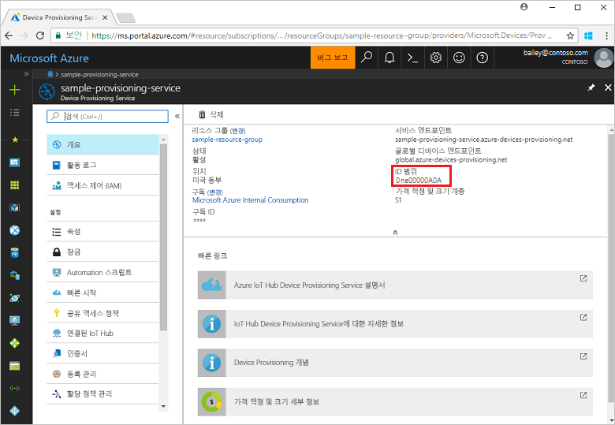
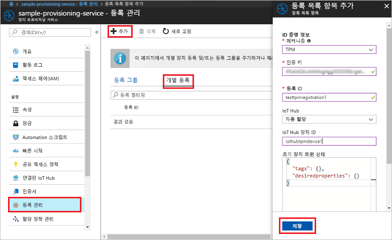
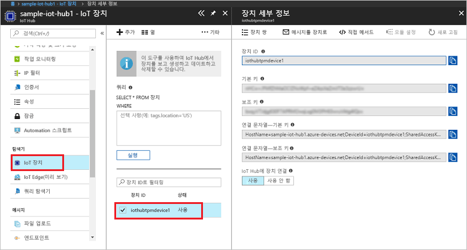

# <a name="create-and-provision-a-simulated-tpm-device-using-c-device-sdk-for-iot-hub-device-provisioning-service"></a>IoT Hub Device Provisioning Service용 C# 장치 SDK를 사용하여 시뮬레이션된 TPM 장치 만들기 및 프로비전

[!INCLUDE [iot-dps-selector-quick-create-simulated-device-tpm](../../includes/iot-dps-selector-quick-create-simulated-device-tpm.md)]

다음 단계에서는 Windows OS를 실행하는 개발 컴퓨터에서 Azure IoT Hub C# SDK 시뮬레이션된 TPM 장치 샘플을 빌드하고, 이 시뮬레이션된 장치를 Device Provisioning Service 및 IoT Hub와 연결하는 방법을 보여 줍니다. 샘플 코드에서는 Windows TPM 시뮬레이터를 장치의 [HSM(하드웨어 보안 모듈)](https://azure.microsoft.com/blog/azure-iot-supports-new-security-hardware-to-strengthen-iot-security/)으로 사용합니다. 

자동 프로비전 프로세스에 익숙하지 않은 경우 [자동 프로비전 개념](concepts-auto-provisioning.md)도 검토하세요. 계속하기 전에 [Azure Portal에서 IoT Hub Device Provisioning Service 설정](./quick-setup-auto-provision.md)의 단계를 완료해야 합니다. 

[!INCLUDE [IoT DPS basic](../../includes/iot-dps-basic.md)]

<a id="setupdevbox"></a>
## <a name="prepare-the-development-environment"></a>개발 환경 준비 

1. 컴퓨터에 [.Net Core SDK](https://www.microsoft.com/net/download/windows)가 설치되어 있는지 확인합니다. 

1. 컴퓨터에 `git`이 설치되어 있고 명령 창에서 액세스할 수 있는 환경 변수에 추가되었는지 확인합니다. 설치할 `git` 도구의 최신 버전은 [Software Freedom Conservancy의 Git 클라이언트 도구](https://git-scm.com/download/)를 참조하세요. 여기에는 로컬 Git 리포지토리와 상호 작용하는 데 사용할 수 있는 명령줄 앱인 **Git Bash**가 포함됩니다. 

4. 명령 프롬프트 또는 Git Bash를 엽니다. C#용 Azure IoT SDK GitHub 리포지토리를 복제합니다.
    
    ```cmd
    git clone --recursive https://github.com/Azure/azure-iot-sdk-csharp.git
    ```

## <a name="provision-the-simulated-device"></a>시뮬레이션된 장치 프로비전


1. Azure 포털에 로그인합니다. 왼쪽 메뉴에서 **모든 리소스** 단추를 클릭하고, Device Provisioning Service를 엽니다. **개요** 블레이드의 **_ID 범위_** 값을 적어 둡니다.

     


2. 명령 프롬프트에서 디렉터리를 TPM 장치 프로비전 샘플에 대한 프로젝트 디렉터리로 변경합니다.

    ```cmd
    cd .\azure-iot-sdk-csharp\provisioning\device\samples\ProvisioningDeviceClientTpm
    ```

2. 다음 명령을 입력하여 TPM 장치 프로비전 샘플을 빌드하고 실행합니다. `<IDScope>` 값을 프로비전 서비스에 대한 ID 범위로 바꿉니다. 

    ```cmd
    dotnet run <IDScope>
    ```

1. 장치 등록에 필요한 **_인증 키_**, **_등록 ID_** 및 제안된 **_장치 ID_** 가 명령 창에 표시됩니다. 이러한 값을 기록해 둡니다. 
   > [!NOTE]
   > 명령 출력이 포함된 창과 TPM 시뮬레이터의 출력이 포함된 창을 혼동하지 마세요. 명령 창을 클릭하여 포그라운드로 전환해야 합니다.

     


4. Azure Portal의 Device Provisioning Service 요약 블레이드에서 **등록 관리**를 선택합니다. **개별 등록** 탭을 선택하고, 위쪽의 **추가** 단추를 클릭합니다. 

5. **등록 목록 항목 추가** 아래에서 다음 정보를 입력합니다.
    - ID 증명 *메커니즘*으로 **TPM**을 선택합니다.
    - TPM 장치에 대한 *등록 ID* 및 *인증 키*를 입력합니다. 
    - 필요에 따라 프로비전 서비스와 연결된 IoT Hub를 선택합니다.
    - 고유한 장치 ID를 입력합니다. 샘플 출력에서 제안된 장치 ID를 입력하거나 직접 입력할 수 있습니다. 사용자 고유의 장치를 사용하는 경우 장치 이름을 지정할 때 중요한 데이터가 포함되지 않도록 합니다. 
    - 장치에 대해 원하는 초기 구성으로 **초기 장치 쌍 상태**를 업데이트합니다.
    - 완료되면 **저장** 단추를 클릭합니다. 

      

   등록에 성공하면 장치의 *등록 ID*가 *개별 등록* 탭 아래 목록에 나타납니다. 

6. 시뮬레이션된 장치를 등록하려면 (**_인증 키_**, **_등록 ID_** 및 제안된 **_장치 ID_** 를 표시한) 명령 창에서 Enter를 누릅니다. 장치를 부팅하고 IoT Hub 정보를 얻기 위해 Device Provisioning Service에 연결하는 과정을 시뮬레이션하는 메시지를 확인합니다. 

1. 장치가 프로비전되었는지 확인합니다. 프로비전 서비스와 연결된 IoT Hub에 시뮬레이션된 장치를 성공적으로 프로비전하면 장치 ID가 허브의 **IoT 장치** 블레이드에 표시됩니다. 

     

    장치에 대한 등록 항목의 기본값으로부터 *초기 장치 쌍 상태*를 변경한 경우, 허브에서 원하는 쌍 상태를 가져와서 그에 맞게 작동할 수 있습니다. 자세한 내용은 [IoT Hub의 장치 쌍 이해 및 사용](../iot-hub/iot-hub-devguide-device-twins.md)을 참조하세요.


## <a name="clean-up-resources"></a>리소스 정리

장치 클라이언트 샘플을 계속해서 작업하고 탐색할 계획인 경우 이 빠른 시작에서 만든 리소스를 정리하지 마세요. 계속하지 않으려는 경우 다음 단계를 사용하여 이 빠른 시작에서 만든 모든 리소스를 삭제합니다.

1. 컴퓨터에서 장치 클라이언트 샘플 출력 창을 닫습니다.
1. 컴퓨터에서 TPM 시뮬레이터 창을 닫습니다.
1. Azure Portal의 왼쪽 메뉴에서 **모든 리소스**를 클릭한 다음 사용자의 Device Provisioning Service를 선택합니다. **모든 리소스** 블레이드 위쪽에서 **삭제**를 클릭합니다.  
1. Azure Portal의 왼쪽 메뉴에서 **모든 리소스**를 클릭한 다음 사용자의 IoT Hub를 선택합니다. **모든 리소스** 블레이드 위쪽에서 **삭제**를 클릭합니다.  

## <a name="next-steps"></a>다음 단계

이 빠른 시작에서는 시뮬레이션된 TPM 장치를 컴퓨터에 만들고, IoT Hub Device Provisioning Service를 사용하여 IoT Hub에 이 장치를 프로비전했습니다. 프로그래밍 방식으로 TPM 장치를 등록하는 방법을 알아보려면 프로그래밍 방식으로 TPM 장치를 등록하는 빠른 시작으로 계속 진행하세요. 

> [!div class="nextstepaction"]
> [Azure 빠른 시작 - Azure IoT Hub Device Provisioning Service에 TPM 장치 등록](quick-enroll-device-tpm-csharp.md)
