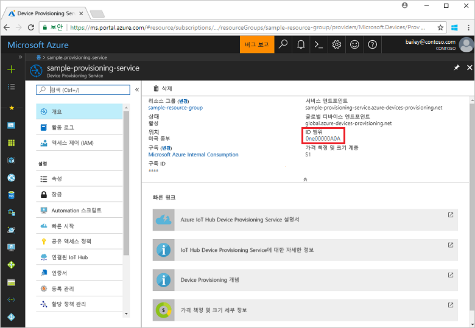
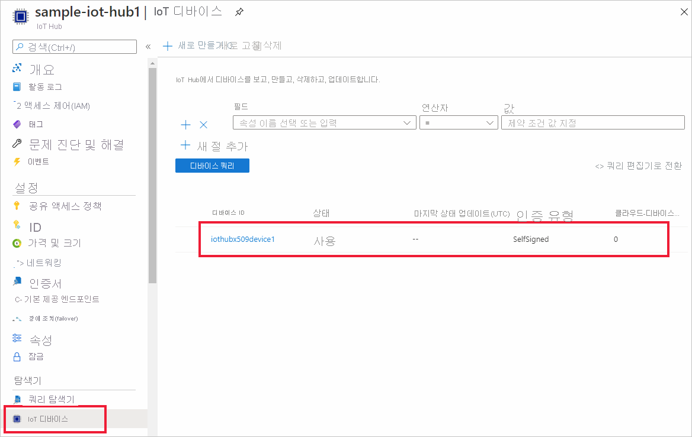

# <a name="create-and-provision-a-simulated-x509-device-using-c-device-sdk-for-iot-hub-device-provisioning-service"></a>IoT Hub Device Provisioning Service용 C# 디바이스 SDK를 사용하여 시뮬레이션된 X.509 디바이스 만들기 및 프로비전
[!INCLUDE [iot-dps-selector-quick-create-simulated-device-x509](../../includes/iot-dps-selector-quick-create-simulated-device-x509.md)]

이러한 단계는 [C#용 Azure IoT 샘플](https://github.com/Azure-Samples/azure-iot-samples-csharp)을 사용하여 Windows OS를 실행하는 개발 머신에서 X.509 디바이스를 시뮬레이션하는 방법을 보여 줍니다. 또한 샘플에서는 Device Provisioning Service를 사용하여 시뮬레이션된 디바이스를 IoT Hub에 연결합니다.

자동 프로비전 프로세스에 익숙하지 않은 경우 [자동 프로비전 개념](concepts-auto-provisioning.md)도 검토하세요. 계속하기 전에 [Azure Portal에서 IoT Hub Device Provisioning Service 설정](./quick-setup-auto-provision.md)의 단계를 완료해야 합니다. 

Azure IoT Device Provisioning 서비스는 다음과 같은 두 가지 등록을 지원합니다.
- [등록 그룹](concepts-service.md#enrollment-group): 여러 관련 디바이스를 등록하는 데 사용됩니다.
- [개별 등록](concepts-service.md#individual-enrollment): 단일 디바이스를 등록하는 데 사용됩니다.

이 문서에서는 개별 등록을 설명합니다.

[!INCLUDE [IoT Device Provisioning Service basic](../../includes/iot-dps-basic.md)]

<a id="setupdevbox"></a>
## <a name="prepare-the-development-environment"></a>개발 환경 준비 

1. 머신에 [.NET Core 2.1 SDK 이상](https://www.microsoft.com/net/download/windows)이 설치되어 있는지 확인합니다. 

1. 컴퓨터에 `git`이 설치되어 있고 명령 창에서 액세스할 수 있는 환경 변수에 추가되었는지 확인합니다. 설치할 `git` 도구의 최신 버전은 [Software Freedom Conservancy의 Git 클라이언트 도구](https://git-scm.com/download/)를 참조하세요. 여기에는 로컬 Git 리포지토리와 상호 작용하는 데 사용할 수 있는 명령줄 앱인 **Git Bash**가 포함됩니다. 

1. 명령 프롬프트 또는 Git Bash를 엽니다. C#용 Azure IoT 샘플 GitHub 리포지토리를 복제합니다.
    
    ```cmd
    git clone https://github.com/Azure-Samples/azure-iot-samples-csharp.git
    ```

## <a name="create-a-self-signed-x509-device-certificate-and-individual-enrollment-entry"></a>자체 서명된 X.509 디바이스 인증서 및 개별 등록 항목 만들기

이 섹션에서는 자체 서명된 X.509 인증서를 사용하고 다음에 유의해야 합니다.

* 자체 서명된 인증서는 테스트 목적으로만 사용되며 프로덕션 환경에서 사용하지 마십시오.
* 자체 서명된 인증서에 대한 기본 만료일은 1년입니다.

[프로비저닝 디바이스 클라이언트 샘플 - X.509 증명](https://github.com/Azure-Samples/azure-iot-samples-csharp/tree/master/provisioning/Samples/device/X509Sample)의 샘플 코드를 사용하여 시뮬레이션된 디바이스에 대한 개별 등록 항목에서 사용될 인증서를 만듭니다.


1. 명령 프롬프트에서 디렉터리를 X.509 디바이스 프로비전 샘플에 대한 프로젝트 디렉터리로 변경합니다.

    ```cmd
    cd .\azure-iot-samples-csharp\provisioning\Samples\device\X509Sample
    ```

2. 샘플 코드는 암호로 보호된 PKCS12 형식의 파일(certificate.pfx) 내에 저장된 X.509 인증서를 사용하도록 설정됩니다. 또한 이 빠른 시작의 뒷부분에서 개별 등록을 만들려면 공개 키 인증서 파일(certificate.cer)이 필요합니다. 자체 서명 인증서 및 관련 .cer 및 .pfx 파일을 생성하려면 다음 명령을 실행합니다.

    ```cmd
    powershell .\GenerateTestCertificate.ps1
    ```

3. 스크립트에서 PFX 암호를 묻는 메시지가 표시됩니다. 이 암호를 기억하여 샘플을 실행할 때 사용해야 합니다.

      


4. Azure Portal에 로그인하고, 왼쪽 메뉴에서 **모든 리소스** 단추를 클릭하고, 프로비전 서비스를 엽니다.

5. Device Provisioning Service 요약 블레이드에서 **등록 관리**를 선택합니다. **개별 등록** 탭을 선택하고 맨 위에서 **개별 등록 추가** 단추를 클릭합니다. 

6. **등록 추가** 패널 아래에 다음 정보를 입력합니다.
   - ID 증명 *메커니즘*으로 **X.509**를 선택합니다.
   - *기본 인증서 .pem 또는 .cer 파일* 아래에서 *파일 선택*을 클릭하여 이전 단계에서 만든 **certificate.cer** 인증서 파일을 선택합니다.
   - **디바이스 ID**를 비워 둡니다. 디바이스 ID가 **iothubx509device1**(X.509 인증서의 CN(일반 이름))로 설정된 디바이스가 프로비전됩니다. 또한 이 이름은 개별 등록 항목에 대한 등록 ID에도 사용됩니다. 
   - 필요에 따라 다음 정보를 입력합니다.
       - 프로비전 서비스와 연결된 IoT Hub를 선택합니다.
       - 디바이스에 대해 원하는 초기 구성으로 **초기 디바이스 쌍 상태**를 업데이트합니다.
   - 완료되면 **저장** 단추를 클릭합니다. 

     [](./media/quick-create-simulated-device-x509-csharp/device-enrollment.png#lightbox)
    
   성공적으로 등록되면 *개별 등록* 탭의 *등록 ID* 열 아래에 X.509 등록 항목이 **iothubx509device1**로 표시됩니다. 

## <a name="provision-the-simulated-device"></a>시뮬레이션된 디바이스 프로비전

1. 프로비전 서비스에 대한 **개요** 블레이드의 **_ID 범위_** 값을 적어 둡니다.

     


2. 다음 명령을 입력하여 X.509 디바이스 프로비전 샘플을 빌드하고 실행합니다. `<IDScope>` 값을 프로비전 서비스에 대한 ID 범위로 바꿉니다. 

    ```cmd
    dotnet run <IDScope>
    ```

3. 메시지가 표시되면 이전에 만든 PFX 파일에 대한 암호를 입력합니다. 디바이스를 부팅하고 IoT Hub 정보를 얻기 위해 Device Provisioning Service에 연결하는 과정을 시뮬레이션하는 메시지를 확인합니다. 

     

4. 디바이스가 프로비전되었는지 확인합니다. 프로비전 서비스와 연결된 IoT Hub에 시뮬레이션된 디바이스를 성공적으로 프로비전하면 디바이스 ID가 허브의 **IoT 디바이스** 블레이드에 표시됩니다. 

     

    디바이스에 대한 등록 항목의 기본값으로부터 *초기 디바이스 쌍 상태*를 변경한 경우, 허브에서 원하는 쌍 상태를 가져와서 그에 맞게 작동할 수 있습니다. 자세한 내용은 [IoT Hub의 디바이스 쌍 이해 및 사용](../iot-hub/iot-hub-devguide-device-twins.md)을 참조하세요.


## <a name="clean-up-resources"></a>리소스 정리

디바이스 클라이언트 샘플을 계속해서 작업하고 탐색할 계획인 경우 이 빠른 시작에서 만든 리소스를 정리하지 마세요. 계속하지 않으려는 경우 다음 단계를 사용하여 이 빠른 시작에서 만든 모든 리소스를 삭제합니다.

1. 컴퓨터에서 디바이스 클라이언트 샘플 출력 창을 닫습니다.
1. 컴퓨터에서 TPM 시뮬레이터 창을 닫습니다.
1. Azure Portal의 왼쪽 메뉴에서 **모든 리소스**를 클릭한 다음, 사용자의 Device Provisioning Service를 선택합니다. **모든 리소스** 블레이드 위쪽에서 **삭제**를 클릭합니다.  
1. Azure Portal의 왼쪽 메뉴에서 **모든 리소스**를 클릭한 다음 사용자의 IoT Hub를 선택합니다. **모든 리소스** 블레이드 위쪽에서 **삭제**를 클릭합니다.  

## <a name="next-steps"></a>다음 단계

이 빠른 시작에서는 시뮬레이션된 X.509 디바이스를 Windows 컴퓨터에 만들고, 포털에서 Azure IoT Hub Device Provisioning Service를 사용하여 IoT Hub에 이 디바이스를 프로비전했습니다. 프로그래밍 방식으로 X.509 디바이스를 등록하는 방법을 알아보려면 프로그래밍 방식으로 X.509 디바이스를 등록하는 빠른 시작으로 계속 진행하세요. 

> [!div class="nextstepaction"]
> [Azure 빠른 시작 - Azure IoT Hub Device Provisioning Service에 X.509 디바이스 등록](quick-enroll-device-x509-csharp.md)
