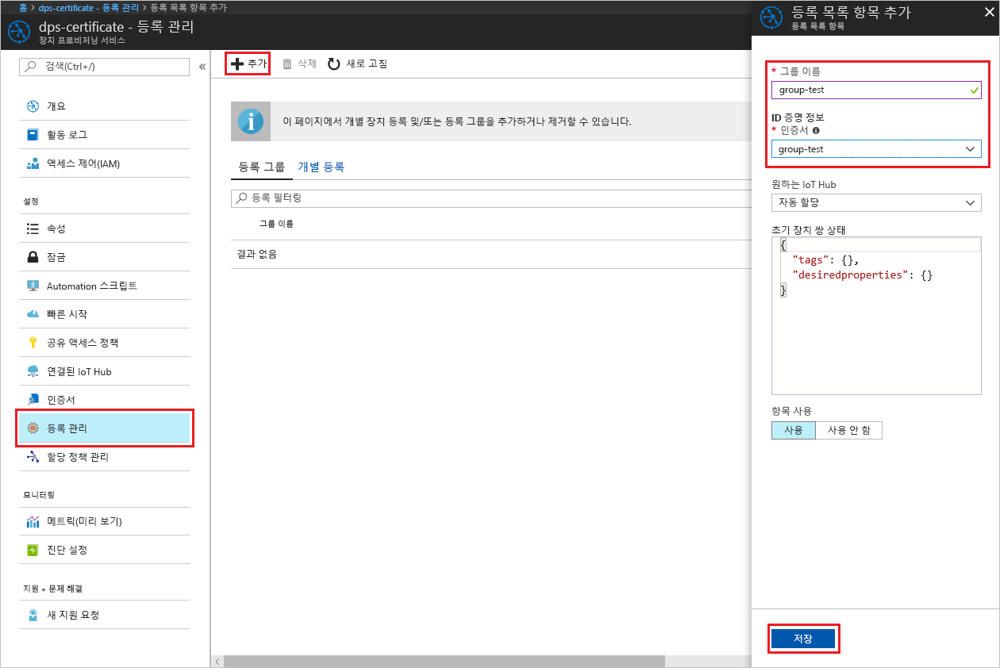

# <a name="create-and-provision-an-x509-simulated-device-using-nodejs-device-sdk-for-iot-hub-device-provisioning-service"></a>IoT Hub Device Provisioning Service용 Node.js 장치 SDK를 사용하여 시뮬레이션된 X.509 장치 만들기 및 프로비전
[!INCLUDE [iot-dps-selector-quick-create-simulated-device-x509](../../includes/iot-dps-selector-quick-create-simulated-device-x509.md)]

IoT Hub Device Provisioning Service는 IoT Hub에 무인(zero-touch) 장치 프로비전을 제공하는 IoT Hub에 대한 도우미 서비스입니다. Device Provisioning 서비스를 사용하여 안전하고 확장 가능한 방식으로 수백만 개의 장치를 프로비전할 수 있습니다.

장치 프로비전은 두 단계로 구성됩니다. 첫 번째 단계는 솔루션의 특정 요구 사항에 따라 Device Provisioning Service에 적절한 등록 항목을 만드는 것입니다.  두 번째 단계는 장치와 Device Provisioning Service 간의 연결을 설정하고 장치를 IoT 허브에 등록하는 것입니다. 두 단계가 모두 완료되면 장치가 완전히 프로비전된 것으로 간주됩니다. Device Provisioning 서비스는 두 단계를 모두 자동화하여 장치에 원활한 프로비전 환경을 제공합니다. 자세한 내용은 [Device Provisioning Service 개념](https://docs.microsoft.com/en-us/azure/iot-dps/concepts-service)을 참조하세요.

다음 단계에서는 Device Provisioning Service에서 등록 항목을 만들고, 개발 컴퓨터에서 X.509 장치를 시뮬레이션하며, 시뮬레이션된 장치를 Device Provisioning Service와 연결하고, [Azure IoT Hub Node.js 장치 SDK](https://github.com/Azure/azure-iot-sdk-node)를 사용하여 장치를 IoT 허브에 등록하는 방법을 보여 줍니다.

[!INCLUDE [IoT DPS basic](../../includes/iot-dps-basic.md)]

## <a name="prepare-the-environment"></a>환경 준비 

1. 계속 진행하기 전에 [Azure Portal에서 IoT Hub Device Provisioning Service 설정](./quick-setup-auto-provision.md)의 단계를 완료합니다.

1. 컴퓨터에 [Node.js v4.0 이상](https://nodejs.org)이 설치되어 있는지 확인합니다.

1. [Git](https://git-scm.com/download/)이 컴퓨터에 설치되어 있고 명령 창에서 액세스할 수 있는 환경 변수에 추가되었는지 확인합니다. 

1. [OpenSSL](https://www.openssl.org/)이 컴퓨터에 설치되어 있고 명령 창에서 액세스할 수 있는 환경 변수에 추가되었는지 확인합니다. 이 라이브러리는 원본에서 빌드하고 설치하거나 [여기](https://sourceforge.net/projects/openssl/)와 같은 [타사](https://wiki.openssl.org/index.php/Binaries)에서 다운로드하고 설치할 수 있습니다. 

    > [!NOTE]
    > _루트_, _중간_ 및/또는 _리프_ X.509 인증서를 이미 만들었으면, 이 단계 및 다음에 이어지는 생성과 관련된 모든 단계를 건너뛸 수 있습니다.
    >


## <a name="create-an-enrollment-entry"></a>등록 항목 만들기

등록은 Device Provisioning Service에 저장되어 있는 장치 또는 장치 그룹의 레코드입니다. 등록 레코드에는 X.509 인증서 세부 정보 및 추가 등록 정보를 포함하여 장치 또는 장치 그룹에 대한 정보가 포함됩니다. Device Provisioning Service에서 지원하는 등록에는 _개별 등록_ 및 _등록 그룹_의 두 가지 유형이 있습니다. 자세한 내용은 [등록 개념](https://docs.microsoft.com/en-us/azure/iot-dps/concepts-service#enrollment)을 참조하세요.

사용자 고유의 X.509 테스트 인증서를 만드는 경우 솔루션에 필요한 인증서에 대한 [보안 개념](https://docs.microsoft.com/en-us/azure/iot-dps/concepts-security#x509-certificates) 및 구현 세부 정보에 대한 [Node.js용 Azure IoT Device Provisioning Device SDK 도구](https://github.com/azure/azure-iot-sdk-node/tree/master/provisioning/tools)를 참조하세요.

1. 명령 프롬프트를 엽니다. 코드 샘플용 GitHub 리포지토리를 복제합니다.
    
    ```cmd/sh
    git clone https://github.com/Azure/azure-iot-sdk-node.git --recursive
    ```

1. 인증서 생성기 스크립트로 이동하여 프로젝트를 빌드합니다. 

    ```cmd/sh
    cd azure-iot-sdk-node/provisioning/tools
    npm install
    ```

1. 설정에 따라 다음 방법 중 하나를 사용하여 등록 정보를 만듭니다.

    - **개별 등록**:

        1. 사용자 고유의 _인증서 이름_을 사용하는 스크립트를 실행하여 _리프_ 인증서를 만듭니다. 리프 인증서의 일반 이름은 [등록 ID](https://docs.microsoft.com/en-us/azure/iot-dps/concepts-device#registration-id)가 되므로 소문자 영숫자와 하이픈만 사용해야 합니다.

        ```cmd/sh
        node create_test_cert.js device {certificate-name}
        ```
         
        1. **Azure Portal**에서 **Device Provisioning Service** 요약 블레이드를 엽니다. **등록 관리**, **개별 등록** 탭을 차례로 선택하고, 위쪽의 **추가** 단추를 클릭합니다. 

        1. **등록 목록 항목 추가** 아래에 다음 정보를 입력합니다.
            - ID 증명 *메커니즘*으로 **X.509**를 선택합니다.
            - *.pem 또는 .cer 파일 인증* 아래에서 *파일 탐색기* 위젯을 사용하여 이전 단계에서 만든 **_{certificate-name}\_cert.pem_** 인증서 파일을 선택합니다.
            - 필요에 따라 다음 정보를 입력합니다.
                - 프로비전 서비스와 연결된 IoT Hub를 선택합니다.
                - 고유한 장치 ID를 입력합니다. 장치 이름을 지정할 때 중요한 데이터가 포함되지 않도록 합니다. 
                - 장치에 대해 원하는 초기 구성으로 **초기 장치 쌍 상태**를 업데이트합니다.
            - 완료되면 **저장** 단추를 클릭합니다. 

          

    성공적으로 등록되면 X.509 장치가 *개별 등록* 탭의 *등록 ID* 열 아래에 **{certificatename}**으로 표시됩니다. 나중에 사용하기 위해 이 값을 적어 둡니다.

    - **등록 그룹**: 

        1. 사용자 고유의 _루트 이름_을 사용하는 스크립트를 실행하여 _루트_ 인증서를 만듭니다.

        ```cmd/sh
        node create_test_cert.js root {root-name}
        ```

        1. **Azure Portal**에서 **Device Provisioning Service** 요약 블레이드를 엽니다. **인증서**를 선택하고 위쪽의 **추가** 단추를 클릭합니다.

        1. **인증서 추가** 아래에서 다음 정보를 입력합니다.
            - 고유한 인증서 이름을 입력합니다.
            - 이전에 만든 **_{root-name}\_cert.pem_** 파일을 선택합니다.
            - 완료되면 **저장** 단추를 클릭합니다.

        

        1. 새로 만든 인증서를 선택합니다.
            - **확인 코드 생성**을 클릭합니다. 생성된 코드를 복사합니다.
            - _확인_ 인증서를 만듭니다. _확인 코드_를 입력하거나 마우스 오른쪽 단추를 클릭하여 실행 중인 노드 스크립트 창에 다음 명령을 붙여넣습니다.

                ```cmd/sh
                node create_test_cert.js verification {rootname_cert} {verification code}
                ```

            - *확인 인증서 .pem 또는 .cer 파일입니다.* 아래에서 *파일 탐색기* 위젯을 사용하여 이전 단계에서 만든 **_verification_cert.pem_** 인증서 파일을 선택합니다. **확인**을 클릭합니다.

            

        1. **등록 관리**를 선택합니다. **등록 그룹** 탭을 선택하고 위쪽의 **추가** 단추를 클릭합니다.
            - 고유한 그룹 이름을 입력합니다.
            - 이전에 만든 고유한 인증서 이름을 선택합니다.
            - 필요에 따라 다음 정보를 입력합니다.
                - 프로비전 서비스와 연결된 IoT Hub를 선택합니다.
                - 장치에 대해 원하는 초기 구성으로 **초기 장치 쌍 상태**를 업데이트합니다.

        

        성공적으로 등록되면 *등록 그룹* 탭의 *그룹 이름* 열 아래에 X.509 장치 그룹이 표시됩니다. 나중에 사용하기 위해 이 값을 적어 둡니다.

        1. 이전에 사용한 _루트 이름_ 뒤에 있는 사용자 고유의 _인증서 이름_을 사용하는 스크립트를 실행하여 _리프_ 인증서를 만듭니다. 리프 인증서의 일반 이름은 [등록 ID](https://docs.microsoft.com/en-us/azure/iot-dps/concepts-device#registration-id)가 되므로 소문자 영숫자와 하이픈만 사용해야 합니다.

            ```cmd/sh
            node create_test_cert.js device {certificate-name} {root-name}
            ```

        > [!NOTE]
        > `node create_test_cert.js intermediate {certificate-name} {parent-name}`을 사용하여 _중간_ 인증서를 만들 수도 있습니다. 마지막 _intermediate_를 루트/부모로 사용하여 마지막 단계로 _리프_ 인증서를 만들어야 합니다. 자세한 내용은 [장치 액세스 제어](https://docs.microsoft.com/en-us/azure/iot-dps/concepts-security#controlling-device-access-to-the-provisioning-service-with-x509-certificates)를 참조하세요.
        >


## <a name="simulate-the-device"></a>장치 시뮬레이션

[Azure IoT Hub Node.js 장치 SDK](https://github.com/Azure/azure-iot-sdk-node)는 장치를 시뮬레이션하는 쉬운 방법을 제공합니다. 자세한 내용은 [장치 개념](https://docs.microsoft.com/en-us/azure/iot-dps/concepts-device)을 참조하세요.

1. Azure Portal에서 Device Provisioning Service에 대한 **개요** 블레이드를 선택하고, **_전역 장치 엔드포인트_** 및 **_ID 범위_** 값을 적어 둡니다.

     

1. _인증서_ 및 _키_를 샘플 폴더에 복사합니다.

    ```cmd/sh
    copy .\{certificate-name}_cert.pem ..\device\samples\{certificate-name}_cert.pem
    copy .\{certificate-name}_key.pem ..\device\samples\{certificate-name}_key.pem
    ```

1. 장치 테스트 스크립트로 이동하고 프로젝트를 빌드합니다. 

    ```cmd/sh
    cd ..\device\samples
    npm install
    ```

1. **register\_x509.js** 파일을 편집합니다. 내용을 다음과 같이 변경한 후 파일을 저장합니다.
    - `provisioning host`를 위의 **1단계**에서 적어 둔 **_전역 장치 엔드포인트_**로 바꿉니다.
    - `id scope`를 위의 **1단계**에 적어 둔 **_ID 범위_**로 바꿉니다. 
    - `reigstration id`를 이전 섹션에서 적어 둔 **_등록 ID_** 또는 **_그룹 이름_**으로 바꿉니다.
    - `cert filename` 및 `key filename`을 위의 **2단계**에서 복사한 파일로 바꿉니다. 

1. 스크립트를 실행하고 장치가 성공적으로 프로비전되었는지 확인합니다.

    ```cmd/sh
    node register_x509.js
    ```   

1. 포털에서 프로비전 서비스와 연결된 IoT Hub로 이동하여 **IoT 장치** 블레이드를 엽니다. 시뮬레이션된 X.509 장치가 허브에 성공적으로 프로비전되면 *상태*가 **사용**인 장치 ID가 **IoT 장치** 블레이드에 표시됩니다. 샘플 장치 응용 프로그램을 실행하기 전에 블레이드가 이미 열려 있으면 위쪽의 **새로 고침** 단추를 클릭해야 할 수도 있습니다. 

     

    장치에 대한 등록 항목의 기본값으로부터 *초기 장치 쌍 상태*를 변경한 경우, 허브에서 원하는 쌍 상태를 가져와서 그에 맞게 작동할 수 있습니다. 자세한 내용은 [IoT Hub의 장치 쌍 이해 및 사용](../iot-hub/iot-hub-devguide-device-twins.md)을 참조하세요.


## <a name="clean-up-resources"></a>리소스 정리

장치 클라이언트 샘플을 계속해서 작업하고 탐색할 계획인 경우 이 빠른 시작에서 만든 리소스를 정리하지 마세요. 계속하지 않으려는 경우 다음 단계를 사용하여 이 빠른 시작에서 만든 모든 리소스를 삭제합니다.

1. 컴퓨터에서 장치 클라이언트 샘플 출력 창을 닫습니다.
1. Azure Portal의 왼쪽 메뉴에서 **모든 리소스**를 클릭한 다음 사용자의 Device Provisioning Service를 선택합니다. 서비스에 대한 **등록 관리** 블레이드를 연 다음, **개별 등록** 또는 **등록 그룹**탭을 클릭합니다. 이 빠른 시작에서 등록한 장치의 *등록 ID* 또는 *그룹 이름*을 선택하고, 위쪽의 **삭제** 단추를 클릭합니다. 
1. Azure Portal의 왼쪽 메뉴에서 **모든 리소스**를 클릭한 다음 사용자의 IoT Hub를 선택합니다. 허브에 대한 **IoT 장치** 블레이드를 열고, 이 빠른 시작에서 등록한 장치의 *장치 ID*를 선택한 다음, 위쪽의 **삭제** 단추를 클릭합니다.


## <a name="next-steps"></a>다음 단계

이 빠른 시작에서는 포털에서 Azure IoT Hub Device Provisioning Service를 사용하여 시뮬레이션된 X.509 장치를 만들고 IoT Hub에 프로비전했습니다. 프로그래밍 방식으로 X.509 장치를 등록하는 방법을 알아보려면 프로그래밍 방식으로 X.509 장치를 등록하는 빠른 시작으로 계속 진행하세요. 

> [!div class="nextstepaction"]
> [Azure 빠른 시작 - Azure IoT Hub Device Provisioning Service에 X.509 장치 등록](quick-enroll-device-x509-node.md)
