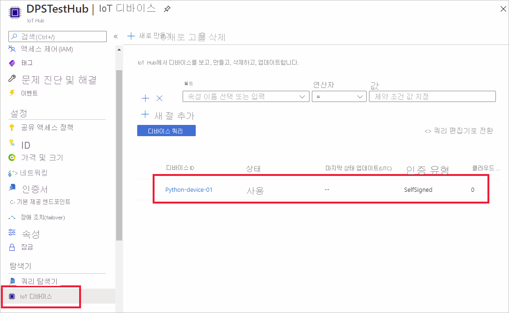

# <a name="quickstart-create-and-provision-a-simulated-x509-device-using-python-device-sdk-for-iot-hub-device-provisioning-service"></a>빠른 시작: IoT Hub Device Provisioning Service용 Python 디바이스 SDK를 사용하여 시뮬레이션된 X.509 디바이스 만들기 및 프로비전

[!INCLUDE [iot-dps-selector-quick-create-simulated-device-x509](../../includes/iot-dps-selector-quick-create-simulated-device-x509.md)]

이 빠른 시작에서는 개발 머신을 Python X.509 디바이스로 프로비저닝합니다. [Azure IoT Python SDK](https://github.com/Azure/azure-iot-sdk-python)의 샘플 디바이스 코드를 사용하여 디바이스를 IoT 허브에 연결합니다. 이 예에서는 DPS(디바이스 프로비저닝 서비스)와 함께 개별 등록이 사용됩니다.

## <a name="prerequisites"></a>필수 구성 요소

- [프로비저닝](about-iot-dps.md#provisioning-process) 개념에 대해 잘 알아야 합니다.
- [Azure Portal에서 IoT Hub Device Provisioning Service 설정](./quick-setup-auto-provision.md) 완료
- 활성 구독이 있는 Azure 계정. [체험 계정 만들기](https://azure.microsoft.com/free/?ref=microsoft.com&utm_source=microsoft.com&utm_medium=docs&utm_campaign=visualstudio)
- [Python 3.6 이상](https://www.python.org/downloads/)
- [Git](https://git-scm.com/download/)


[!INCLUDE [IoT Device Provisioning Service basic](../../includes/iot-dps-basic.md)]

## <a name="prepare-the-environment"></a>환경 준비 

1. 컴퓨터에 `git`이 설치되어 있고 명령 창에서 액세스할 수 있는 환경 변수에 추가되었는지 확인합니다. 설치할 `git` 도구의 최신 버전은 [Software Freedom Conservancy의 Git 클라이언트 도구](https://git-scm.com/download/)를 참조하세요. 여기에는 로컬 Git 리포지토리와 상호 작용하는 데 사용할 수 있는 명령줄 앱인 **Git Bash** 가 포함됩니다. 

2. Git Bash 프롬프트를 엽니다. [Azure IoT Python SDK](https://github.com/Azure/azure-iot-sdk-python)에 대한 GitHub 리포지토리를 복제합니다.
    
    ```cmd/sh
    git clone https://github.com/Azure/azure-iot-sdk-python.git --recursive
    ```


## <a name="create-a-self-signed-x509-device-certificate"></a>자체 서명된 X.509 디바이스 인증서 만들기 

이 섹션에서는 자체 서명된 X.509 인증서를 만듭니다. 다음 사항에 주의하세요.

* 자체 서명된 인증서는 테스트 목적으로만 사용되며 프로덕션 환경에서 사용하지 마십시오.
* 자체 서명된 인증서에 대한 기본 만료일은 1년입니다.

디바이스 인증을 위한 디바이스 인증서가 아직 없는 경우 이 문서에서 테스트하는 데 OpenSSL을 사용하여 자체 서명된 인증서를 만들 수 있습니다.  OpenSSL는 Git 설치에 포함되어 있습니다. 

1. Git Bash 프롬프트에서 다음 명령을 실행합니다.

    # <a name="windows"></a>[Windows](#tab/windows)
    
    ```bash
    winpty openssl req -outform PEM -x509 -sha256 -newkey rsa:4096 -keyout ./python-device.key.pem -out ./python-device.pem -days 365 -extensions usr_cert -subj "//CN=Python-device-01"
    ```

    > [!IMPORTANT]
    > 주체 이름(`//CN=Python-device-01`)에 제공된 추가 슬래시는 Windows 플랫폼에서 Git을 사용하여 문자열을 이스케이프하는 데만 필요합니다. 

    # <a name="linux"></a>[Linux](#tab/linux)
    
    ```bash
    openssl req -outform PEM -x509 -sha256 -newkey rsa:4096 -keyout ./python-device.key.pem -out ./python-device.pem -days 365 -extensions usr_cert -subj "/CN=Python-device-01"
    ```
    
    ---
    
2. **PEM 암호 입력:** 이라는 메시지가 표시되면 이 문서에서 테스트하는 데 암호 `1234`를 사용합니다.    

3. **확인 - PEM 암호 입력:** 이라는 메시지가 다시 표시되면 암호 `1234`를 다시 사용합니다.    

테스트 인증서 파일(*python-device.pem*) 및 프라이빗 키 파일(*python-device.key.pem*)이 `openssl` 명령을 실행한 디렉터리에 생성됩니다.


## <a name="create-an-individual-enrollment-entry-in-dps"></a>DPS에서 개별 등록 입력 만들기


Azure IoT Device Provisioning 서비스는 다음과 같은 두 가지 등록을 지원합니다.

- [등록 그룹](concepts-service.md#enrollment-group): 여러 관련 디바이스를 등록하는 데 사용됩니다.
- [개별 등록](concepts-service.md#individual-enrollment): 단일 디바이스를 등록하는 데 사용됩니다.

이 문서에서는 IoT 허브로 프로비저닝할 단일 디바이스에 대한 개별 등록을 보여줍니다.

1. Azure Portal에 로그인하여 왼쪽 메뉴에서 **모든 리소스** 단추를 선택하고 프로비저닝 서비스를 엽니다.

2. Device Provisioning Service 메뉴에서 **등록 관리** 를 선택합니다. **개별 등록** 탭을 선택하고 맨 위에서 **개별 등록 추가** 단추를 선택합니다. 

3. **등록 추가** 패널에서 다음 정보를 입력합니다.
   - ID 증명 *메커니즘* 으로 **X.509** 를 선택합니다.
   - *기본 인증서 .pem 또는 .cer 파일* 아래에서 *파일 선택* 을 선택하여 이전에 만든 테스트 인증서를 사용하는 경우 인증서 파일 **python-device.pem** 을 선택합니다.
   - 필요에 따라 다음 정보를 입력합니다.
     - 프로비전 서비스와 연결된 IoT Hub를 선택합니다.
     - 디바이스에 대해 원하는 초기 구성으로 **초기 디바이스 쌍 상태** 를 업데이트합니다.
   - 완료되면 **저장** 단추를 누릅니다. 

     [](./media/python-quick-create-simulated-device-x509/device-enrollment.png#lightbox)

   등록에 성공하면 X.509 디바이스가 *개별 등록* 탭의 *등록 ID* 열에 **Python-device-01** 로 표시됩니다. 이 등록 값은 디바이스 인증서의 주체 이름에서 제공됩니다. 

## <a name="simulate-the-device"></a>디바이스 시뮬레이션

Python 프로비저닝 샘플 [provision_x509 py](https://github.com/Azure/azure-iot-sdk-python/blob/master/azure-iot-device/samples/async-hub-scenarios/provision_x509.py)는 `azure-iot-sdk-python/azure-iot-device/samples/async-hub-scenarios` 디렉터리에 있습니다. 이 샘플에서는 6개의 환경 변수를 사용하여 DPS를 사용하여 IoT 디바이스를 인증하고 프로비저닝합니다. 이러한 환경 변수는 다음과 같습니다.

| 변수 이름              | 설명                                     |
| :------------------------- | :---------------------------------------------- |
| `PROVISIONING_HOST`        |  이 값은 DPS 리소스에 연결하는 데 사용되는 글로벌 엔드포인트입니다. |    
| `PROVISIONING_IDSCOPE`     |  이 값은 DPS 리소스의 ID 범위입니다. |    
| `DPS_X509_REGISTRATION_ID` |  이 값은 디바이스의 ID입니다. 또한 디바이스 인증서의 주체 이름과 일치해야 합니다. |    
| `X509_CERT_FILE`           |  디바이스 인증서 파일 이름 |    
| `X509_KEY_FILE`            |  디바이스 인증서의 프라이빗 키 파일 이름입니다. |
| `PASS_PHRASE`              |  인증서 및 프라이빗 키 파일(`1234`)을 암호화하는 데 사용된 암호입니다. |    

1. 디바이스 프로비저닝 서비스 메뉴에서 **개요** 를 선택합니다. _ID 범위_ 와 _글로벌 디바이스 엔드포인트_ 를 참고합니다.

    

2. Git Bash 프롬프트에서 다음 명령을 사용하여 글로벌 디바이스 엔드포인트와 ID 범위에 대한 환경 변수를 추가합니다.

    ```bash
    $export PROVISIONING_HOST=global.azure-devices-provisioning.net
    $export PROVISIONING_IDSCOPE=<ID scope for your DPS resource>
    ```

3. IoT 디바이스의 등록 ID는 디바이스 인증서의 주체 이름과 일치해야 합니다. 자체 서명된 테스트 인증서를 생성한 경우 `Python-device-01`은 디바이스의 주체 이름 및 등록 ID입니다. 

    디바이스 인증서가 이미 있는 경우 `certutil`을 사용하여 자체 서명된 테스트 인증서에 대해 아래와 같이 디바이스에 사용되는 주체 일반 이름을 확인할 수 있습니다.

    ```bash
    $ certutil python-device.pem
    X509 Certificate:
    Version: 3
    Serial Number: fa33152fe1140dc8
    Signature Algorithm:
        Algorithm ObjectId: 1.2.840.113549.1.1.11 sha256RSA
        Algorithm Parameters:
        05 00
    Issuer:
        CN=Python-device-01
      Name Hash(sha1): 1dd88de40e9501fb64892b698afe12d027011000
      Name Hash(md5): a62c784820daa931b9d3977739b30d12
    
     NotBefore: 1/29/2021 7:05 PM
     NotAfter: 1/29/2022 7:05 PM
    
    Subject:
        ===> CN=Python-device-01 <===
      Name Hash(sha1): 1dd88de40e9501fb64892b698afe12d027011000
      Name Hash(md5): a62c784820daa931b9d3977739b30d12
    ```

    Git Bash 프롬프트에서 등록 ID에 대한 환경 변수를 다음과 같이 설정합니다.

    ```bash
    $export DPS_X509_REGISTRATION_ID=Python-device-01
    ```

4. Git Bash 프롬프트에서 인증서 파일, 프라이빗 키 파일 및 암호에 대한 환경 변수를 설정합니다.

    ```bash
    $export X509_CERT_FILE=./python-device.pem
    $export X509_KEY_FILE=./python-device.key.pem
    $export PASS_PHRASE=1234
    ```

5. [provision_x509.py](https://github.com/Azure/azure-iot-sdk-python/blob/master/azure-iot-device/samples/async-hub-scenarios/provision_x509.py)의 코드를 검토합니다. **Python 버전 3.7** 이상을 사용하지 않는 경우 [여기에 언급된 코드를 변경하여](https://github.com/Azure/azure-iot-sdk-python/tree/master/azure-iot-device/samples/async-hub-scenarios#advanced-iot-hub-scenario-samples-for-the-azure-iot-hub-device-sdk) `asyncio.run(main())`을 교체하고 변경 내용을 저장합니다. 

6. 예제를 실행합니다. 이 샘플은 디바이스를 허브에 연결하고 프로비저닝한 후 일부 테스트 메시지를 허브에 보냅니다.

    ```bash
    $ winpty python azure-iot-sdk-python/azure-iot-device/samples/async-hub-scenarios/provision_x509.py
    RegistrationStage(RequestAndResponseOperation): Op will transition into polling after interval 2.  Setting timer.
    The complete registration result is
    Python-device-01
    TestHub12345.azure-devices.net
    initialAssignment
    null
    Will send telemetry from the provisioned device
    sending message #4
    sending message #7
    sending message #2
    sending message #8
    sending message #5
    sending message #9
    sending message #1
    sending message #6
    sending message #10
    sending message #3
    done sending message #4
    done sending message #7
    done sending message #2
    done sending message #8
    done sending message #5
    done sending message #9
    done sending message #1
    done sending message #6
    done sending message #10
    done sending message #3
    ```

7. 포털에서 프로비저닝 서비스와 연결된 IoT 허브로 이동하여 왼쪽 메뉴의 **탐색기** 섹션 아래에 있는 **IoT 디바이스** 블레이드를 엽니다. 시뮬레이션된 X.509 디바이스가 허브에 성공적으로 프로비전되면 디바이스 ID가 **Device Explorer** 블레이드에 표시되고 *상태* 가 **사용** 으로 표시됩니다. 샘플 디바이스 애플리케이션을 실행하기 전에 블레이드가 이미 열려 있으면 위쪽의 **새로 고침** 단추를 눌러야 할 수도 있습니다. 

     

> [!NOTE]
> 디바이스에 대한 등록 항목의 기본값으로부터 *초기 디바이스 쌍 상태* 를 변경한 경우, 허브에서 원하는 쌍 상태를 가져와서 그에 맞게 작동할 수 있습니다. 자세한 내용은 [IoT Hub의 디바이스 쌍 이해 및 사용](../iot-hub/iot-hub-devguide-device-twins.md)을 참조하세요.
>

## <a name="clean-up-resources"></a>리소스 정리

디바이스 클라이언트 샘플을 계속해서 작업하고 탐색할 계획인 경우 이 빠른 시작에서 만든 리소스를 정리하지 마세요. 계속하지 않으려는 경우 다음 단계를 사용하여 이 빠른 시작에서 만든 모든 리소스를 삭제합니다.

1. 컴퓨터에서 디바이스 클라이언트 샘플 출력 창을 닫습니다.
2. Azure Portal의 왼쪽 메뉴에서 **모든 리소스** 를 선택한 다음, Device Provisioning Service를 선택합니다. 서비스에 대한 **등록 관리** 블레이드를 연 다음, **개별 등록** 탭을 선택합니다. 이 빠른 시작에 등록한 디바이스의 *등록 ID* 옆에 있는 확인란을 선택하고, 창 위쪽에 있는 **삭제** 단추를 누릅니다. 
3. Azure Portal의 왼쪽 메뉴에서 **모든 리소스** 를 선택한 다음, 사용자의 IoT 허브를 선택합니다. 허브에 대한 **IoT 디바이스** 블레이드를 열고, 이 빠른 시작에 등록한 디바이스의 *DEVICE ID* 옆에 있는 확인란을 선택한 다음, 창 위쪽에 있는 **삭제** 단추를 누릅니다.

## <a name="next-steps"></a>다음 단계

이 빠른 시작에서는 시뮬레이션된 X.509 디바이스를 개발 머신에 만들고, 포털에서 Azure IoT Hub Device Provisioning Service를 사용하여 IoT 허브에 이 디바이스를 프로비저닝했습니다. 프로그래밍 방식으로 X.509 디바이스를 등록하는 방법을 알아보려면 프로그래밍 방식으로 X.509 디바이스를 등록하는 빠른 시작을 계속 진행하세요. 

> [!div class="nextstepaction"]
> [Azure 빠른 시작 - Azure IoT Hub Device Provisioning Service에 X.509 디바이스 등록](quick-enroll-device-x509-python.md)
