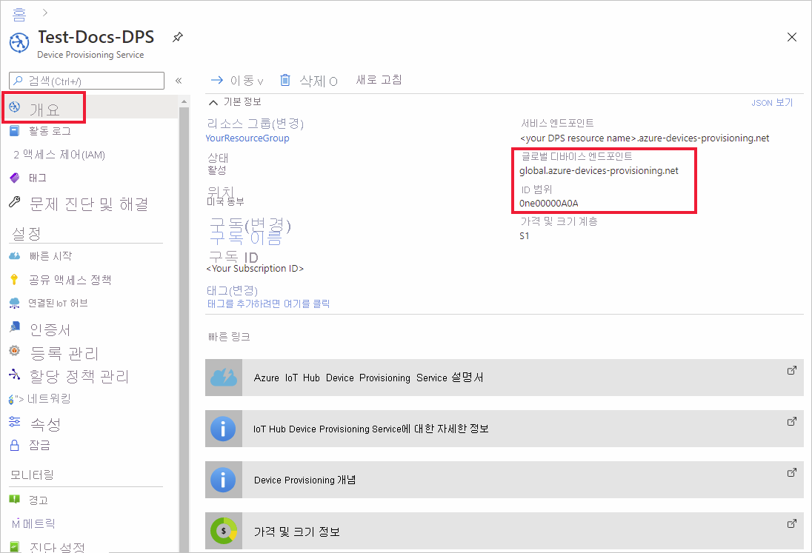
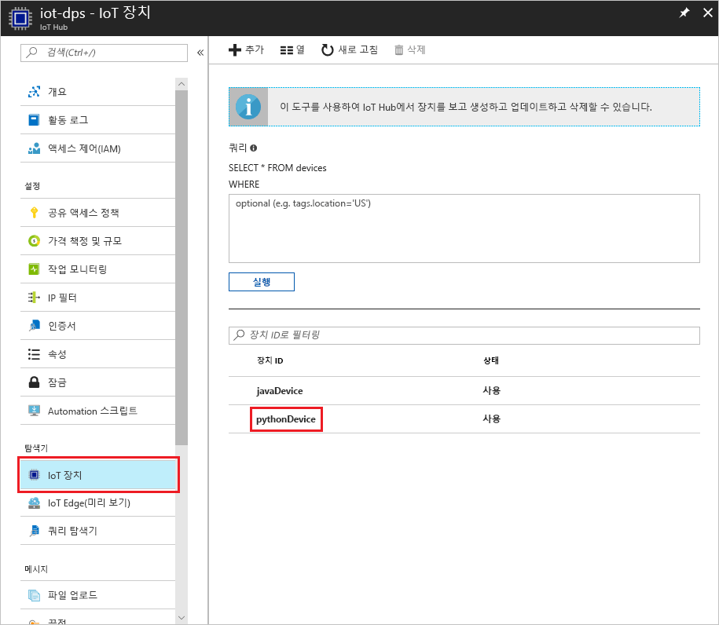

# <a name="create-and-provision-a-simulated-x509-device-using-python-device-sdk-for-iot-hub-device-provisioning-service"></a>IoT Hub Device Provisioning Service용 Python 장치 SDK를 사용하여 시뮬레이션된 X.509 장치 만들기 및 프로비전
[!INCLUDE [iot-dps-selector-quick-create-simulated-device-x509](../../includes/iot-dps-selector-quick-create-simulated-device-x509.md)]

다음 단계에서는 Windows OS를 실행하는 개발 컴퓨터에서 X.509 장치를 시뮬레이션하고, Python 샘플 코드를 사용하여 이 시뮬레이션된 장치를 Device Provisioning Service 및 IoT Hub와 연결하는 방법을 보여 줍니다. 

진행하기 전에 [Azure Portal에서 IoT Hub Device Provisioning Service 설정](./quick-setup-auto-provision.md)에 나와 있는 단계를 완료해야 합니다.

[!INCLUDE [IoT DPS basic](../../includes/iot-dps-basic.md)]

## <a name="prepare-the-environment"></a>환경 준비 

1. 컴퓨터에 [Visual Studio 2015](https://www.visualstudio.com/vs/older-downloads/) 또는 [Visual Studio 2017](https://www.visualstudio.com/vs/)이 설치되어 있는지 확인합니다. ‘C++를 사용한 데스크톱 개발’ 워크로드를 Visual Studio 설치에 사용할 수 있도록 해야 합니다.

1. [CMake 빌드 시스템](https://cmake.org/download/)을 다운로드하여 설치합니다.

1. 컴퓨터에 `git`이 설치되어 있고 명령 창에서 액세스할 수 있는 환경 변수에 추가되었는지 확인합니다. 설치할 `git` 도구의 최신 버전은 [Software Freedom Conservancy의 Git 클라이언트 도구](https://git-scm.com/download/)를 참조하세요. 여기에는 로컬 Git 리포지토리와 상호 작용하는 데 사용할 수 있는 명령줄 앱인 **Git Bash**가 포함됩니다. 

1. 명령 프롬프트 또는 Git Bash를 엽니다. 장치 시뮬레이션 샘플 코드에 대한 GitHub 리포지토리를 복제합니다.
    
    ```cmd/sh
    git clone https://github.com/Azure/azure-iot-sdk-python.git --recursive
    ```

1. CMake 빌드 프로세스에 대한 이 GitHub 리포지토리의 로컬 복사본에 폴더를 만듭니다. 

    ```cmd/sh
    cd azure-iot-sdk-python/c
    mkdir cmake
    cd cmake
    ```

1. 다음 명령을 실행하여 프로비전 클라이언트에 대한 Visual Studio 솔루션을 만듭니다.

    ```cmd/sh
    cmake -Duse_prov_client:BOOL=ON ..
    ```


## <a name="create-a-device-enrollment-entry"></a>장치 등록 항목 만들기

1. *cmake* 폴더에 생성된 `azure_iot_sdks.sln`이라는 솔루션을 열고 Visual Studio에서 빌드합니다.

1. **Provision\_Samples** 폴더 아래에서 **dice\_device\_enrollment** 프로젝트를 마우스 오른쪽 단추로 클릭하고 **시작 프로젝트로 설정**을 선택합니다. 솔루션을 실행합니다. 출력 창에서 메시지가 표시되면 개별 등록에 대한 `i`를 입력합니다. 출력 창에는 시뮬레이션된 장치에 대해 로컬로 생성된 X.509 인증서가 표시됩니다. *-----BEGIN CERTIFICATE-----*에서 시작하여 *-----END CERTIFICATE-----*에서 끝나는 출력(이 두 줄 모두 포함)을 클립보드에 복사합니다. 

    
 
1. Windows 컴퓨터에 **_X509testcertificate.pem_**이라는 파일을 만들고, 원하는 편집기에서 이 파일을 열고, 클립보드의 내용을 이 파일에 복사합니다. 파일을 저장합니다. 

1. Azure Portal에 로그인하고, 왼쪽 메뉴에서 **모든 리소스** 단추를 클릭하고, 프로비전 서비스를 엽니다.

1. Device Provisioning Service 요약 블레이드에서 **등록 관리**를 선택합니다. **개별 등록** 탭을 선택하고 맨 위에서 **추가** 단추를 클릭합니다. 

1. **등록 목록 항목 추가** 아래에 다음 정보를 입력합니다.
    - ID 증명 *메커니즘*으로 **X.509**를 선택합니다.
    - *인증서 .pem 또는 .cer 파일* 아래에서, *파일 탐색기* 위젯을 사용하여 이전 단계에서 만든 **_X509testcertificate.pem_** 인증서 파일을 선택합니다.
    - 필요에 따라 다음 정보를 입력합니다.
        - 프로비전 서비스와 연결된 IoT Hub를 선택합니다.
        - 고유한 장치 ID를 입력합니다. 장치 이름을 지정할 때 중요한 데이터가 포함되지 않도록 합니다. 
        - 장치에 대해 원하는 초기 구성으로 **초기 장치 쌍 상태**를 업데이트합니다.
    - 완료되면 **저장** 단추를 클릭합니다. 

      

   등록에 성공하면 X.509 장치가 *개별 등록* 탭의 *등록 ID* 열에 **riot-device-cert**로 표시됩니다. 


## <a name="simulate-the-device"></a>장치 시뮬레이션

1. Device Provisioning Service 요약 블레이드에서 **개요**를 선택합니다. _ID 범위_와 _Global Service Endpoint_(전역 서비스 엔드포인트)를 참고합니다.

    

1. [Python 2.x 또는 3.x](https://www.python.org/downloads/)를 다운로드하고 설치합니다. 설치 프로그램의 요구 사항에 따라 32비트 또는 64비트 설치를 사용해야 합니다. 설치하는 동안 메시지가 표시되면 플랫폼 특정 환경 변수에 Python을 추가해야 합니다. Python 2.x를 사용하는 경우 [*pip* Python 패키지 관리 시스템을 설치 또는 업그레이드](https://pip.pypa.io/en/stable/installing/)해야 할 수 있습니다.
    - Windows OS를 사용하는 경우 Python에서 네이티브 DLL을 사용하기 위해 [Visual C++ 재배포 가능 패키지](http://www.microsoft.com/download/confirmation.aspx?id=48145)가 필요합니다.

1. [이러한 지침](https://github.com/Azure/azure-iot-sdk-python/blob/master/doc/python-devbox-setup.md)에 따라 Python 패키지를 빌드합니다.

    > [!NOTE]
        > `pip`를 사용하는 경우 `azure-iot-provisioning-device-client` 패키지도 설치해야 합니다.

1. samples 폴더로 이동합니다.

    ```cmd/sh
    cd azure-iot-sdk-python/provisioning_device_client/samples
    ```

1. Python IDE를 사용하여 **provisioning\_device\_client\_sample.py**라는 python 스크립트를 편집합니다. _GLOBAL\_PROV\_URI_ 및 _ID\_SCOPE_ 변수를 앞에서 설명한 값으로 수정합니다.

    ```python
    GLOBAL_PROV_URI = "{globalServiceEndpoint}"
    ID_SCOPE = "{idScope}"
    SECURITY_DEVICE_TYPE = ProvisioningSecurityDeviceType.X509
    PROTOCOL = ProvisioningTransportProvider.HTTP
    ```

1. 샘플을 실행합니다. 

    ```cmd/sh
    python provisioning_device_client_sample.py
    ```

1. 응용 프로그램이 연결되어 장치를 등록하고 성공적인 등록 메시지를 표시합니다.

    

1. 포털에서 프로비전 서비스에 연결된 IoT 허브로 이동하여 **Device Explorer** 블레이드를 엽니다. 시뮬레이션된 X.509 장치가 허브에 성공적으로 프로비전되면 장치 ID가 **Device Explorer** 블레이드에 표시되고 *상태*가 **사용**으로 표시됩니다. 샘플 장치 응용 프로그램을 실행하기 전에 블레이드가 이미 열려 있으면 위쪽의 **새로 고침** 단추를 클릭해야 할 수도 있습니다. 

     

> [!NOTE]
> 장치에 대한 등록 항목의 기본값으로부터 *초기 장치 쌍 상태*를 변경한 경우, 허브에서 원하는 쌍 상태를 가져와서 그에 맞게 작동할 수 있습니다. 자세한 내용은 [IoT Hub의 장치 쌍 이해 및 사용](../iot-hub/iot-hub-devguide-device-twins.md)을 참조하세요.
>


## <a name="clean-up-resources"></a>리소스 정리

장치 클라이언트 샘플을 계속해서 작업하고 탐색할 계획인 경우 이 빠른 시작에서 만든 리소스를 정리하지 마세요. 계속하지 않으려는 경우 다음 단계를 사용하여 이 빠른 시작에서 만든 모든 리소스를 삭제합니다.

1. 컴퓨터에서 장치 클라이언트 샘플 출력 창을 닫습니다.
1. Azure Portal의 왼쪽 메뉴에서 **모든 리소스**를 클릭한 다음 사용자의 Device Provisioning Service를 선택합니다. 서비스에 대한 **등록 관리** 블레이드를 연 다음, **개별 등록** 탭을 클릭합니다. 이 빠른 시작에서 등록한 장치의 *등록 ID*를 선택하고, 위쪽의 **삭제** 단추를 클릭합니다. 
1. Azure Portal의 왼쪽 메뉴에서 **모든 리소스**를 클릭한 다음 사용자의 IoT Hub를 선택합니다. 허브에 대한 **IoT 장치** 블레이드를 열고, 이 빠른 시작에서 등록한 장치의 *장치 ID*를 선택한 다음, 위쪽의 **삭제** 단추를 클릭합니다.

## <a name="next-steps"></a>다음 단계

이 빠른 시작에서는 시뮬레이션된 X.509 장치를 Windows 컴퓨터에 만들고, 포털에서 Azure IoT Hub Device Provisioning Service를 사용하여 IoT Hub에 이 장치를 프로비전했습니다. 프로그래밍 방식으로 X.509 장치를 등록하는 방법을 알아보려면 프로그래밍 방식으로 X.509 장치를 등록하는 빠른 시작으로 계속 진행하세요. 

> [!div class="nextstepaction"]
> [Azure 빠른 시작 - Azure IoT Hub Device Provisioning Service에 X.509 장치 등록](quick-enroll-device-x509-java.md)
