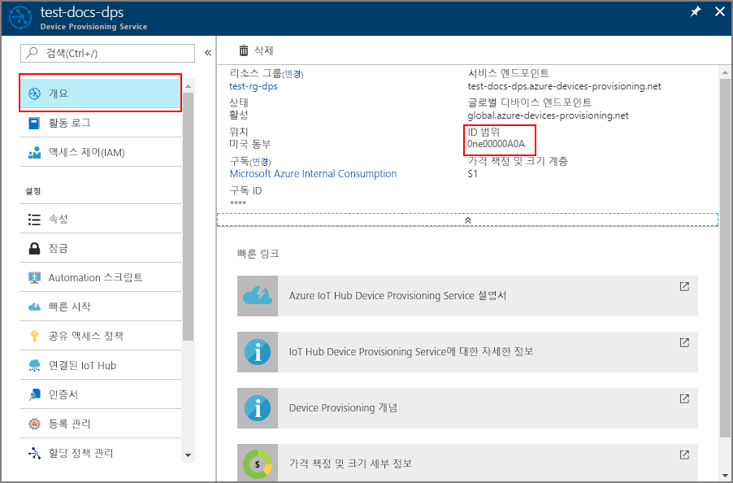
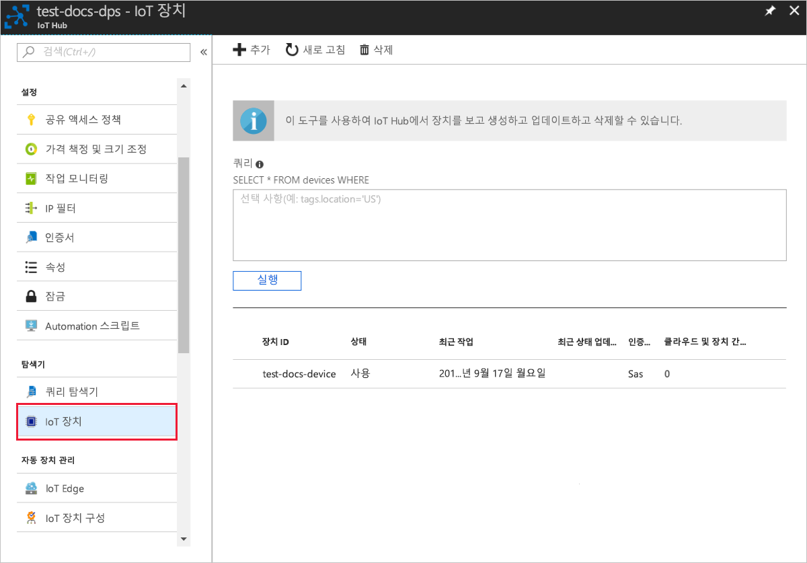

# <a name="quickstart-provision-an-x509-simulated-device-using-the-azure-iot-c-sdk"></a>빠른 시작: Azure IoT C SDK를 사용하여 X.509 시뮬레이션된 디바이스 프로비전

[!INCLUDE [iot-dps-selector-quick-create-simulated-device-x509](../../includes/iot-dps-selector-quick-create-simulated-device-x509.md)]

이 빠른 시작에서는 Windows 개발 머신에서 X.509 디바이스 시뮬레이터를 만들고 실행하는 방법을 알아봅니다. Device Provisioning Service 인스턴스를 등록하여 이 시뮬레이션된 디바이스를 IoT Hub에 할당하도록 구성합니다. [Azure IoT C SDK](https://github.com/Azure/azure-iot-sdk-c)의 샘플 코드는 디바이스에 대한 부팅 시퀀스를 시뮬레이션하는 데 사용됩니다. 디바이스는 프로비전 서비스의 등록을 기반으로 인식되고 IoT Hub에 할당됩니다.

자동 프로비전 프로세스에 익숙하지 않은 경우 [자동 프로비전 개념](concepts-auto-provisioning.md)을 검토하세요. 이 빠른 시작을 계속하기 전에 [Azure Portal에서 IoT Hub Device Provisioning Service 설정](./quick-setup-auto-provision.md)의 단계를 완료해야 합니다. 

Azure IoT Device Provisioning 서비스는 다음과 같은 두 가지 등록을 지원합니다.
- [등록 그룹](concepts-service.md#enrollment-group): 여러 관련 디바이스를 등록하는 데 사용됩니다.
- [개별 등록](concepts-service.md#individual-enrollment): 단일 디바이스를 등록하는 데 사용됩니다.

이 문서에서는 개별 등록을 설명합니다.

[!INCLUDE [quickstarts-free-trial-note](../../includes/quickstarts-free-trial-note.md)]


## <a name="prerequisites"></a>필수 조건

* ['C++를 사용한 데스크톱 개발'](https://www.visualstudio.com/vs/support/selecting-workloads-visual-studio-2017/) 워크로드를 사용하도록 설정한 [Visual Studio](https://visualstudio.microsoft.com/vs/) 2015 이상.
* 최신 버전의 [Git](https://git-scm.com/download/) 설치


<a id="setupdevbox"></a>

## <a name="prepare-a-development-environment-for-the-azure-iot-c-sdk"></a>Azure IoT C SDK에 대한 개발 환경 준비

이 섹션에서는 [Azure IoT C SDK](https://github.com/Azure/azure-iot-sdk-c)를 빌드하는 데 사용되는 개발 환경을 준비합니다. 여기에는 X.509 부팅 시퀀스에 대한 샘플 코드가 포함됩니다.

1. [CMake 빌드 시스템](https://cmake.org/download/)을 다운로드합니다.

    `CMake` 설치를 시작하기 **전에** Visual Studio 필수 구성 요소(Visual Studio 및 'C++를 사용한 데스크톱 개발' 워크로드)를 머신에 설치해야 합니다. 필수 구성 요소가 설치되고 다운로드를 확인하면 CMake 빌드 시스템을 설치합니다.

2. 명령 프롬프트 또는 Git Bash 셸을 엽니다. 다음 명령을 실행하여 [Azure IoT C SDK](https://github.com/Azure/azure-iot-sdk-c) GitHub 리포지토리를 복제합니다.
    
    ```cmd/sh
    git clone https://github.com/Azure/azure-iot-sdk-c.git --recursive
    ```
    이 작업을 완료하는 데 몇 분 정도가 걸립니다.


3. Git 리포지토리의 루트 디렉터리에서 `cmake` 하위 디렉터리를 만들고 해당 폴더로 이동합니다. 

    ```cmd/sh
    cd azure-iot-sdk-c
    mkdir cmake
    cd cmake
    ```

4. 코드 샘플에서는 X.509 인증서를 사용하여 X.509 인증을 통해 증명을 제공합니다. 개발 클라이언트 플랫폼에 관련된 SDK 버전을 빌드하는 다음 명령을 실행합니다. 또한 시뮬레이션된 디바이스에 대한 Visual Studio 솔루션이 `cmake` 디렉터리에서 생성됩니다. 

    ```cmd
    cmake -Duse_prov_client:BOOL=ON ..
    ```
    
    `cmake`에서 C++ 컴파일러를 찾지 못하면 위의 명령을 실행하는 동안 빌드 오류가 발생할 수 있습니다. 이 경우에는 [Visual Studio 명령 프롬프트](https://docs.microsoft.com/dotnet/framework/tools/developer-command-prompt-for-vs)에서 이 명령을 실행합니다. 

    빌드가 성공되면 마지막 몇몇 출력 줄은 다음 출력과 유사하게 표시됩니다.

    ```cmd/sh
    $ cmake -Duse_prov_client:BOOL=ON ..
    -- Building for: Visual Studio 15 2017
    -- Selecting Windows SDK version 10.0.16299.0 to target Windows 10.0.17134.
    -- The C compiler identification is MSVC 19.12.25835.0
    -- The CXX compiler identification is MSVC 19.12.25835.0

    ...

    -- Configuring done
    -- Generating done
    -- Build files have been written to: E:/IoT Testing/azure-iot-sdk-c/cmake
    ```


<a id="portalenroll"></a>

## <a name="create-a-self-signed-x509-device-certificate"></a>자체 서명된 X.509 디바이스 인증서 만들기

이 섹션에서는 자체 서명된 X.509 인증서를 사용할 것이며, 다음 사항에 유의해야 합니다.

* 자체 서명된 인증서는 테스트 목적으로만 사용되며 프로덕션 환경에서 사용하지 마십시오.
* 자체 서명된 인증서에 대한 기본 만료일은 1년입니다.

Azure IoT C SDK의 샘플 코드를 사용하여 시뮬레이션된 디바이스에 대한 개별 등록 항목에서 사용될 인증서를 만듭니다.

1. Visual Studio를 시작하고 `azure_iot_sdks.sln`이라는 새 솔루션 파일을 엽니다. 이 솔루션 파일은 azure-iot-sdk-c git 리포지토리의 루트에서 이전에 만든 `cmake` 폴더에 위치합니다.

2. Visual Studio 메뉴에서 **빌드** > **빌드 솔루션**을 선택하여 솔루션의 모든 프로젝트를 빌드합니다.

3. Visual Studio의 *솔루션 탐색기* 창에서 **Provision\_Tools** 폴더로 이동합니다. **dice\_device\_enrollment** 프로젝트를 마우스 오른쪽 단추로 클릭하고 **시작 프로젝트로 설정**을 선택합니다. 

4. Visual Studio 메뉴에서 **디버그** > **디버깅하지 않고 시작**을 선택하여 솔루션을 실행합니다. 메시지가 표시되면 출력 창에서 개별 등록에 대해 **i**를 입력합니다. 

    출력 창에는 시뮬레이션된 디바이스에 대해 로컬로 생성된 자체 서명된 X.509 인증서가 표시됩니다. **-----BEGIN CERTIFICATE-----** 에서 시작하여 첫 번째 **-----END CERTIFICATE-----** 로 끝나는 출력을 클립보드에 복사하고 해당 줄도 모두 포함하도록 합니다. 출력 창의 첫 번째 인증서만 필요합니다.
 
5. 텍스트 편집기를 사용하여 **_X509testcert.pem_** 이라는 새 파일에 인증서를 저장합니다. 


## <a name="create-a-device-enrollment-entry-in-the-portal"></a>포털에서 디바이스 등록 항목 만들기

1. Azure Portal에 로그인하고, 왼쪽 메뉴에서 **모든 리소스** 단추를 클릭하고, Device Provisioning Service를 엽니다.

2. **등록 관리** 탭을 선택한 다음, 위쪽에서 **개별 등록 추가** 단추를 클릭합니다. 

3. **등록 추가**에서 다음 정보를 입력하고 **저장** 단추를 클릭합니다.

    - **메커니즘:** ID 증명 *메커니즘*으로 **X.509**를 선택합니다.
    - **기본 인증서 .pem 또는 .cer 파일:** **파일 선택**을 클릭하여 앞에서 만든 X509testcert.pem 인증서 파일을 선택합니다.
    - **IoT Hub 디바이스 ID:** **test-docs-cert-device**를 입력하여 디바이스에 ID를 제공합니다.

      [](./media/quick-create-simulated-device-x509/device-enrollment.png#lightbox)

      등록에 성공하면 X.509 디바이스가 *개별 등록* 탭의 *등록 ID* 열에 **riot-device-cert**로 표시됩니다. 


<a id="firstbootsequence"></a>

## <a name="simulate-first-boot-sequence-for-the-device"></a>디바이스에 대한 첫 번째 부팅 시퀀스 시뮬레이션

이 섹션에서는 디바이스의 부팅 시퀀스를 Device Provisioning Service 인스턴스에 보내도록 샘플 코드를 업데이트합니다. 이 부팅 시퀀스를 사용하면 디바이스를 인식하고 Device Provisioning Service 인스턴스에 연결된 IoT Hub에 할당합니다.


1. Azure Portal에서 Device Provisioning 서비스에 대한 **개요** 탭을 선택하고 **_ID 범위_** 값을 기록해 둡니다.

     

2. Visual Studio의 *솔루션 탐색기* 창에서 **Provision\_Samples** 폴더로 이동합니다. **prov\_dev\_client\_sample**이라는 샘플 프로젝트를 확장합니다. **원본 파일**을 확장하고, **prov\_dev\_client\_sample.c**를 엽니다.

3. `id_scope` 상수를 찾고, 값을 앞에서 복사한 **ID 범위** 값으로 바꿉니다. 

    ```c
    static const char* id_scope = "0ne00002193";
    ```

4. 동일한 파일에서 `main()` 함수에 대한 정의를 찾습니다. 아래와 같이 `hsm_type` 변수가 `SECURE_DEVICE_TYPE_TPM` 대신 `SECURE_DEVICE_TYPE_X509`으로 설정되었는지 확인합니다.

    ```c
    SECURE_DEVICE_TYPE hsm_type;
    //hsm_type = SECURE_DEVICE_TYPE_TPM;
    hsm_type = SECURE_DEVICE_TYPE_X509;
    ```

5. **prov\_dev\_client\_sample** 프로젝트를 마우스 오른쪽 단추로 클릭하고 **시작 프로젝트로 설정**을 선택합니다. 

6. Visual Studio 메뉴에서 **디버그** > **디버깅하지 않고 시작**을 선택하여 솔루션을 실행합니다. 프로젝트를 다시 빌드하라는 프롬프트에서 **예**를 클릭하여 실행하기 전에 프로젝트를 다시 빌드합니다.

    다음 출력은 프로비전 디바이스 클라이언트 샘플을 성공적으로 부팅하고, IoT Hub 정보를 가져오기 위해 프로비전 서비스 인스턴스에 연결하고, 등록하는 예제입니다.

    ```cmd
    Provisioning API Version: 1.2.7

    Registering... Press enter key to interrupt.

    Provisioning Status: PROV_DEVICE_REG_STATUS_CONNECTED
    Provisioning Status: PROV_DEVICE_REG_STATUS_ASSIGNING
    Provisioning Status: PROV_DEVICE_REG_STATUS_ASSIGNING

    Registration Information received from service: 
    test-docs-hub.azure-devices.net, deviceId: test-docs-cert-device    
    ```

7. 포털에서 프로비전 서비스와 연결된 IoT Hub로 이동하여 **IoT 디바이스** 탭을 클릭합니다. 시뮬레이션된 X.509 디바이스가 허브에 성공적으로 프로비전되면 *상태*가 **사용**인 디바이스 ID가 **IoT 디바이스** 블레이드에 표시됩니다. 위쪽에서 **새로 고침** 단추를 클릭해야 할 수 있습니다. 

     


## <a name="clean-up-resources"></a>리소스 정리

디바이스 클라이언트 샘플을 계속해서 작업하고 탐색할 계획인 경우 이 빠른 시작에서 만든 리소스를 정리하지 마세요. 계속하지 않으려는 경우 다음 단계를 사용하여 이 빠른 시작에서 만든 모든 리소스를 삭제합니다.

1. 컴퓨터에서 디바이스 클라이언트 샘플 출력 창을 닫습니다.
1. Azure Portal의 왼쪽 메뉴에서 **모든 리소스**를 클릭한 다음, 사용자의 Device Provisioning Service를 선택합니다. 서비스에 대한 **등록 관리**를 연 다음, **개별 등록** 탭을 클릭합니다. 이 빠른 시작에서 등록한 디바이스의 *등록 ID*를 선택하고, 위쪽의 **삭제** 단추를 클릭합니다. 
1. Azure Portal의 왼쪽 메뉴에서 **모든 리소스**를 클릭한 다음 사용자의 IoT Hub를 선택합니다. 허브에 대한 **IoT 디바이스**를 열고, 이 빠른 시작에서 등록한 디바이스의 *디바이스 ID*를 선택한 다음, 위쪽의 **삭제** 단추를 클릭합니다.

## <a name="next-steps"></a>다음 단계

이 빠른 시작에서는 시뮬레이션된 X.509 디바이스를 Windows 컴퓨터에 만들고, 포털에서 Azure IoT Hub Device Provisioning Service를 사용하여 IoT Hub에 이 디바이스를 프로비전했습니다. 프로그래밍 방식으로 X.509 디바이스를 등록하는 방법을 알아보려면 프로그래밍 방식으로 X.509 디바이스를 등록하는 빠른 시작으로 계속 진행하세요. 

> [!div class="nextstepaction"]
> [Azure 빠른 시작 - Azure IoT Hub Device Provisioning Service에 X.509 디바이스 등록](quick-enroll-device-x509-java.md)
