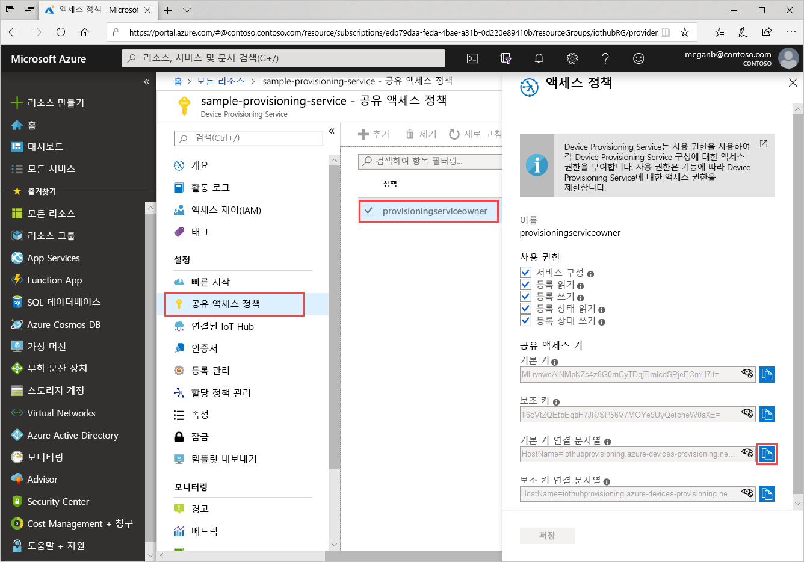
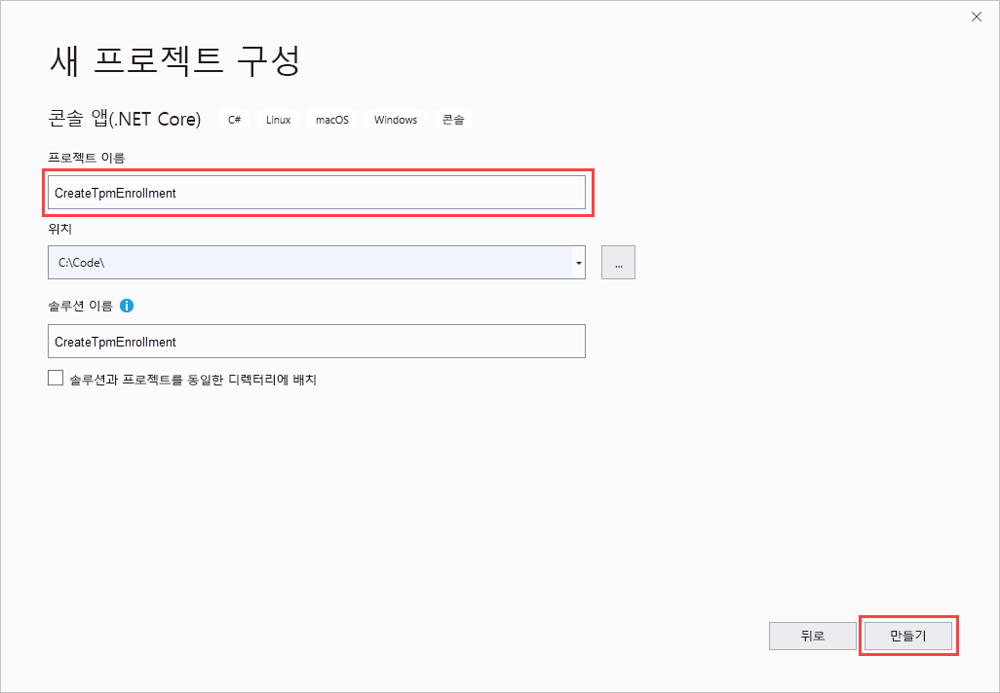
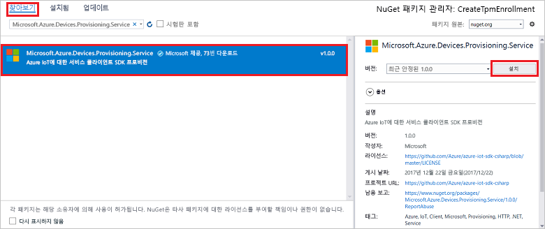
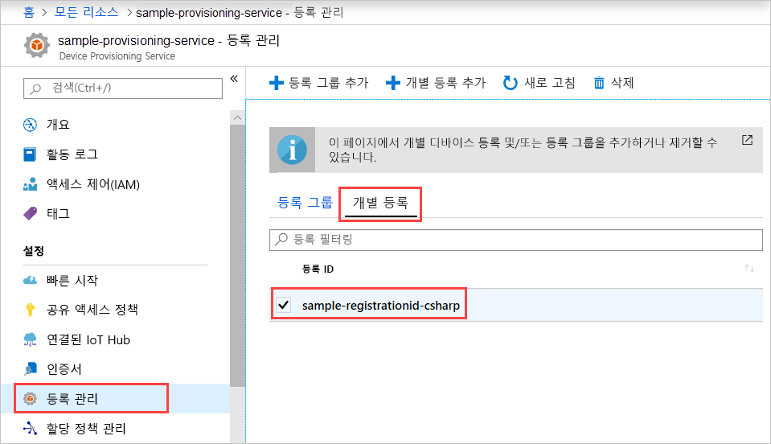

# <a name="quickstart-enroll-tpm-device-to-iot-hub-device-provisioning-service-using-c-service-sdk"></a>빠른 시작: C# 서비스 SDK를 사용하여 IoT Hub Device Provisioning Service에 TPM 디바이스 등록

[!INCLUDE [iot-dps-selector-quick-enroll-device-tpm](../../includes/iot-dps-selector-quick-enroll-device-tpm.md)]

이 문서에서는 [C# 서비스 SDK](https://github.com/Azure/azure-iot-sdk-csharp) 및 샘플 C# .NET Core 애플리케이션을 사용하여 Azure IoT Hub Device Provisioning Service에서 TPM 디바이스에 대한 개별 등록을 프로그래밍 방식으로 만드는 방법을 보여줍니다. 필요에 따라 이 개별 등록 항목을 사용하여 시뮬레이션된 TPM 디바이스를 프로비저닝 서비스에 등록할 수 있습니다. 이러한 단계는 Windows 및 Linux 컴퓨터 모두에서 작동하지만, 이 문서에서는 Windows 개발 컴퓨터를 사용합니다.

## <a name="prepare-the-development-environment"></a>개발 환경 준비

1. 컴퓨터에 [Visual Studio 2019](https://www.visualstudio.com/vs/)가 설치되어 있는지 확인합니다.

1. 컴퓨터에 [.NET Core SDK](https://www.microsoft.com/net/download/windows)가 설치되어 있는지 확인합니다.

1. 계속 진행하기 전에 [Azure Portal에서 IoT Hub Device Provisioning Service 설정](./quick-setup-auto-provision.md)의 단계를 완료해야 합니다.

1. (선택 사항) 이 빠른 시작을 완료한 후 시뮬레이션된 디바이스를 등록하려면, 디바이스에 대한 인증 키를 가져오는 단계까지 [C# 디바이스 SDK를 사용하여 시뮬레이션된 TPM 디바이스 만들기 및 프로비전](quick-create-simulated-device-tpm-csharp.md)의 단계를 수행합니다. 인증 키, 등록 ID 및 필요에 따라 디바이스 ID를 저장해 둡니다. 이 빠른 시작의 뒷부분에서 필요합니다.

   > [!NOTE]
   > Azure Portal을 사용하여 개별 등록을 만드는 단계는 수행하지 마세요.

## <a name="get-the-connection-string-for-your-provisioning-service"></a>프로비전 서비스에 대한 연결 문자열 가져오기

이 빠른 시작의 샘플에서는 프로비전 서비스에 대한 연결 문자열이 필요합니다.

1. Azure Portal에 로그인하고 **모든 리소스**, Device Provisioning Service를 차례로 선택합니다.

1. **공유 액세스 정책**을 선택한 다음, 사용하려는 액세스 정책을 선택하여 해당 속성을 엽니다. **액세스 정책**에서 기본 키 연결 문자열을 복사하여 저장합니다.

    

## <a name="create-the-individual-enrollment-sample"></a>개별 등록 샘플 만들기

이 섹션에서는 TPM 디바이스의 개별 등록을 프로비저닝 서비스에 추가하는 .NET Core 콘솔 앱을 만드는 방법을 보여줍니다. 일부를 수정하여 개별 등록을 추가할 [Windows IoT Core](https://developer.microsoft.com/en-us/windows/iot) 콘솔 앱을 만들기 위해 다음과 같은 단계를 수행할 수 있습니다. IoT Core를 사용하여 개발하는 방법에 대한 자세한 내용은 [Windows IoT Core 개발자 설명서](https://docs.microsoft.com/windows/iot-core/)를 참조하세요.

1. Visual Studio를 열고 **새 프로젝트 만들기**를 선택합니다. **새 프로젝트 만들기**에서 C#의 **콘솔 앱(.NET Core)** 프로젝트 템플릿을 선택하고 **다음**을 선택합니다.

1. 프로젝트 이름을 *CreateTpmEnrollment*로 지정하고 **만들기**를 누릅니다.

    

1. 솔루션이 Visual Studio에서 열리면 **솔루션 탐색기** 창에서 **CreateTpmEnrollment** 프로젝트를 마우스 오른쪽 단추로 클릭합니다. **NuGet 패키지 관리**를 선택합니다.

1. **NuGet 패키지 관리자** 창에서 **찾아보기**를 선택하고, **Microsoft.Azure.Devices.Provisioning.Service**를 검색하여 선택한 다음, **설치**를 누릅니다.

   

   이 단계에서는 [Azure IoT 프로비저닝 서비스 클라이언트 SDK](https://www.nuget.org/packages/Microsoft.Azure.Devices.Provisioning.Service/) NuGet 패키지 및 해당 종속성에 대한 참조를 다운로드하고, 설치하고, 추가합니다.

1. `Program.cs` 맨 위에서 다른 `using` 문 뒤에 다음 `using` 문을 추가합니다.
  
   ```csharp
   using System.Threading.Tasks;
   using Microsoft.Azure.Devices.Provisioning.Service;
   ```

1. `Program` 클래스에 다음 필드를 추가하여 아래에 나열된 대로 변경합니다.

   ```csharp
   private static string ProvisioningConnectionString = "{ProvisioningServiceConnectionString}";
   private const string RegistrationId = "sample-registrationid-csharp";
   private const string TpmEndorsementKey =
       "AToAAQALAAMAsgAgg3GXZ0SEs/gakMyNRqXXJP1S124GUgtk8qHaGzMUaaoABgCAAEMAEAgAAAAAAAEAxsj2gUS" +
       "cTk1UjuioeTlfGYZrrimExB+bScH75adUMRIi2UOMxG1kw4y+9RW/IVoMl4e620VxZad0ARX2gUqVjYO7KPVt3d" +
       "yKhZS3dkcvfBisBhP1XH9B33VqHG9SHnbnQXdBUaCgKAfxome8UmBKfe+naTsE5fkvjb/do3/dD6l4sGBwFCnKR" +
       "dln4XpM03zLpoHFao8zOwt8l/uP3qUIxmCYv9A7m69Ms+5/pCkTu/rK4mRDsfhZ0QLfbzVI6zQFOKF/rwsfBtFe" +
       "WlWtcuJMKlXdD8TXWElTzgh7JS4qhFzreL0c1mI0GCj+Aws0usZh7dLIVPnlgZcBhgy1SSDQMQ==";
       
   // Optional parameters
   private const string OptionalDeviceId = "myCSharpDevice";
   private const ProvisioningStatus OptionalProvisioningStatus = ProvisioningStatus.Enabled;
   ```

   * `ProvisioningServiceConnectionString` 자리 표시자 값을 등록을 만들려는 프로비저닝 서비스의 연결 문자열로 바꿉니다.

   * 필요에 따라 등록 ID, 인증 키, 디바이스 ID 및 프로비전 상태를 변경할 수 있습니다.

   * 시뮬레이션된 디바이스를 프로비저닝하기 위해 [C# 디바이스 SDK를 사용하여 시뮬레이션된 TPM 디바이스 만들기 및 프로비전](quick-create-simulated-device-tpm-csharp.md)에서 이 빠른 시작을 사용하는 경우 빠른 시작 인증 키 및 등록 ID를 해당 빠른 시작에서 기록한 값으로 바꿉니다. 디바이스 ID를 해당 빠른 시작에서 제안한 값으로 바꾸거나, 고유한 값을 사용하거나, 이 샘플의 기본값을 사용할 수 있습니다.

1. `Program` 클래스에 다음 메서드를 추가합니다.  이 코드는 개별 등록 항목을 만든 다음, `ProvisioningServiceClient`에서 `CreateOrUpdateIndividualEnrollmentAsync` 메서드를 호출하여 프로비저닝 서비스에 개별 등록을 추가합니다.

   ```csharp
   public static async Task RunSample()
   {
       Console.WriteLine("Starting sample...");

       using (ProvisioningServiceClient provisioningServiceClient =
               ProvisioningServiceClient.CreateFromConnectionString(ProvisioningConnectionString))
       {
           #region Create a new individualEnrollment config
           Console.WriteLine("\nCreating a new individualEnrollment...");
           Attestation attestation = new TpmAttestation(TpmEndorsementKey);
           IndividualEnrollment individualEnrollment =
                   new IndividualEnrollment(
                           RegistrationId,
                           attestation);

           // The following parameters are optional. Remove them if you don't need them.
           individualEnrollment.DeviceId = OptionalDeviceId;
           individualEnrollment.ProvisioningStatus = OptionalProvisioningStatus;
           #endregion

           #region Create the individualEnrollment
           Console.WriteLine("\nAdding new individualEnrollment...");
           IndividualEnrollment individualEnrollmentResult =
               await provisioningServiceClient.CreateOrUpdateIndividualEnrollmentAsync(individualEnrollment).ConfigureAwait(false);
           Console.WriteLine("\nIndividualEnrollment created with success.");
           Console.WriteLine(individualEnrollmentResult);
           #endregion
        
       }
   }
   ```

1. 마지막으로 `Main` 메서드의 본문을 다음 줄로 바꿉니다.

   ```csharp
   RunSample().GetAwaiter().GetResult();
   Console.WriteLine("\nHit <Enter> to exit ...");
   Console.ReadLine();
   ```

1. 솔루션을 빌드하십시오.

## <a name="run-the-individual-enrollment-sample"></a>개별 등록 샘플 실행
  
Visual Studio에서 샘플을 실행하여 TPM 디바이스에 대한 개별 등록 키를 만듭니다.

명령 프롬프트 창이 나타나고 확인 메시지를 표시하기 시작합니다. 성공적으로 만들어지면 명령 프롬프트 창에 새 개별 등록에 대한 속성이 표시됩니다.

개별 등록이 만들어졌는지 확인할 수 있습니다. Device Provisioning Service 요약으로 이동하여 **등록 관리**를 선택한 다음, **개별 등록**을 선택합니다. 샘플에 사용된 등록 ID에 해당하는 새 등록 항목이 표시됩니다.



항목을 선택하여 항목에 대한 인증 키 및 다른 속성을 확인합니다.

[C# 디바이스 SDK를 사용하여 시뮬레이션된 TPM 디바이스 만들기 및 프로비전](quick-create-simulated-device-tpm-csharp.md) 빠른 시작의 단계를 수행한 경우 해당 빠른 시작의 나머지 단계를 계속하여 시뮬레이션된 디바이스를 등록할 수 있습니다. Azure Portal을 사용하여 개별 등록을 만드는 단계를 건너뛰어야 합니다.

## <a name="clean-up-resources"></a>리소스 정리

C# 서비스 샘플을 살펴볼 계획이면 이 빠른 시작에서 만든 리소스를 정리하지 마세요. 그렇지 않으면 다음 단계를 사용하여 이 빠른 시작에서 만든 모든 리소스를 삭제합니다.

1. 컴퓨터에서 C# 샘플 출력 창을 닫습니다.

1. Azure Portal에서 Device Provisioning Service로 이동하고, **등록 관리**를 선택한 다음, **개별 등록** 탭을 선택합니다. 이 빠른 시작을 사용하여 만든 등록 항목에 대한 *등록 ID* 옆의 확인란을 선택하고 창 위쪽에 있는 **삭제** 단추를 누릅니다.

1. [C# 디바이스 SDK를 사용하여 시뮬레이션된 TPM 디바이스 만들기 및 프로비전](quick-create-simulated-device-tpm-csharp.md)의 단계를 수행하여 시뮬레이션된 TPM 디바이스를 만든 경우 다음 단계를 수행합니다.

    1. TPM 시뮬레이터 창 및 시뮬레이션된 디바이스에 대한 샘플 출력 창을 닫습니다.

    1. Azure Portal에서 디바이스가 프로비전된 IoT Hub로 이동합니다. **탐색기** 아래의 메뉴에서 **IoT 디바이스**를 선택하고 이 빠른 시작에 등록한 디바이스의 *디바이스 ID* 옆의 확인란을 선택한 다음, 창 위쪽에 있는 **삭제** 단추를 누릅니다.

## <a name="next-steps"></a>다음 단계

이 빠른 시작에서는 TPM 디바이스에 대한 개별 등록 항목을 프로그래밍 방식으로 만들었습니다. 선택 사항으로, 컴퓨터에 TPM 시뮬레이션된 디바이스를 만들고 Azure IoT Hub Device Provisioning Service를 사용하여 IoT 허브에 프로비저닝했습니다. 디바이스 프로비전에 대해 자세히 알아보려면 Azure Portal에서 Device Provisioning Service 설치에 대한 자습서를 살펴보세요.

> [!div class="nextstepaction"]
> [Azure IoT Hub Device Provisioning Service 자습서](./tutorial-set-up-cloud.md)
