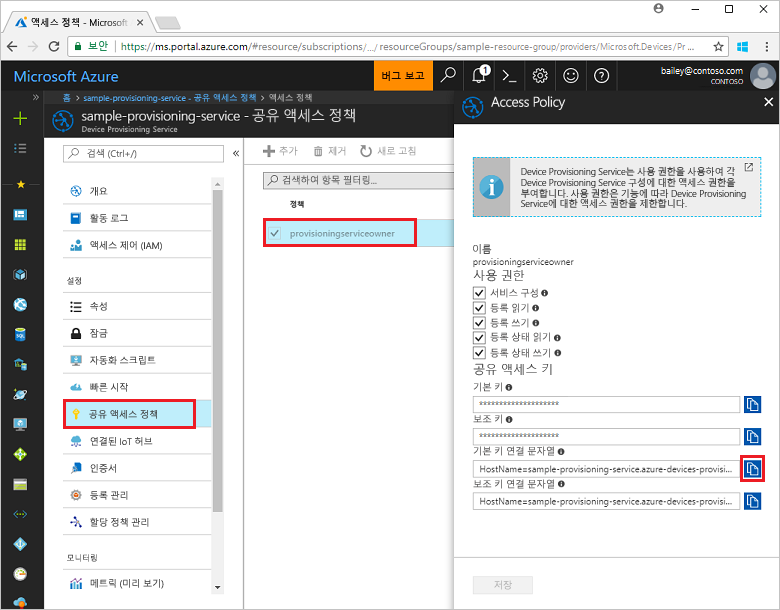
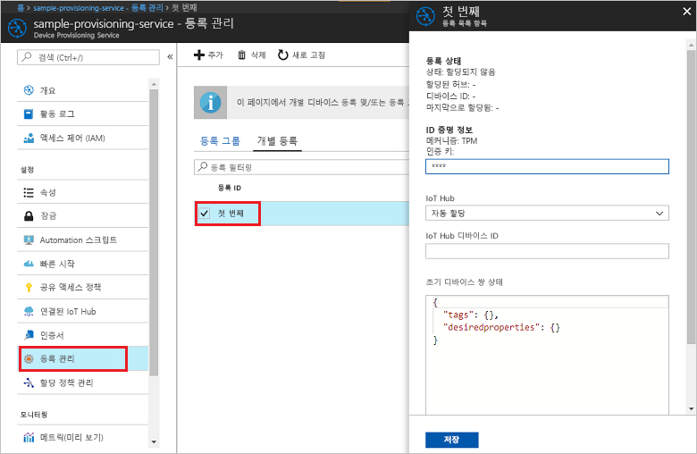

# <a name="quickstart-enroll-tpm-device-to-iot-hub-device-provisioning-service-using-nodejs-service-sdk"></a>빠른 시작: Node.js 서비스 SDK를 사용하여 IoT Hub Device Provisioning Service에 TPM 디바이스 등록

[!INCLUDE [iot-dps-selector-quick-enroll-device-tpm](../../includes/iot-dps-selector-quick-enroll-device-tpm.md)]

이 빠른 시작에서는 Node.js 서비스 SDK 및 Node.js 애플리케이션 샘플을 사용하여 Azure IoT Hub Device Provisioning Service에서 TPM 디바이스에 대한 개별 등록을 프로그래밍 방식으로 만듭니다. 필요에 따라 이 개별 등록 항목을 사용하여 시뮬레이션된 TPM 디바이스를 프로비전 서비스에 등록할 수 있습니다.

## <a name="prerequisites"></a>사전 요구 사항

- [Azure Portal에서 IoT Hub Device Provisioning Service 설정](./quick-setup-auto-provision.md) 완료
- 활성 구독이 있는 Azure 계정. [체험 계정 만들기](https://azure.microsoft.com/free/?ref=microsoft.com&utm_source=microsoft.com&utm_medium=docs&utm_campaign=visualstudio)
- [Node.js v4.0 이상](https://nodejs.org). 이 빠른 시작에서는 아래 [Node.js 서비스 SDK](https://github.com/Azure/azure-iot-sdk-node)를 설치합니다.
- 인증 키(선택 사항). [시뮬레이션된 디바이스 만들기 및 프로비저닝](quick-create-simulated-device.md)의 단계를 수행하여 키를 가져옵니다. Azure Portal을 사용하여 개별 등록을 만들지 마세요.

## <a name="create-the-individual-enrollment-sample"></a>개별 등록 샘플 만들기 

 
1. 작업 폴더의 명령 창에서 다음을 실행합니다.
  
    ```cmd\sh
    npm install azure-iot-provisioning-service
    ```  

2. 텍스트 편집기를 사용하여 작업 폴더에 **create_individual_enrollment.js** 파일을 만듭니다. 다음 코드를 파일에 추가하고 저장합니다.

    ```
    'use strict';

    var provisioningServiceClient = require('azure-iot-provisioning-service').ProvisioningServiceClient;

    var serviceClient = provisioningServiceClient.fromConnectionString(process.argv[2]);
    var endorsementKey = process.argv[3];

    var enrollment = {
      registrationId: 'first',
      attestation: {
        type: 'tpm',
        tpm: {
          endorsementKey: endorsementKey
        }
      }
    };

    serviceClient.createOrUpdateIndividualEnrollment(enrollment, function(err, enrollmentResponse) {
      if (err) {
        console.log('error creating the individual enrollment: ' + err);
      } else {
        console.log("enrollment record returned: " + JSON.stringify(enrollmentResponse, null, 2));
      }
    });
    ```

## <a name="run-the-individual-enrollment-sample"></a>개별 등록 샘플 실행
  
1. 샘플을 실행하려면 프로비전 서비스에 대한 연결 문자열이 필요합니다. 
    1. Azure Portal에 로그인하여 왼쪽 메뉴에서 **모든 리소스** 단추를 선택하고 Device Provisioning 서비스를 엽니다. 
    2. **공유 액세스 정책**을 선택한 다음, 사용하려는 액세스 정책을 선택하여 해당 속성을 엽니다. **액세스 정책** 창에서 기본 키 연결 문자열을 복사하고 적어 둡니다. 

        


2. 디바이스에 대한 인증 키도 필요합니다. [시뮬레이션된 디바이스 만들기 및 프로비전](quick-create-simulated-device.md) 빠른 시작을 수행하여 시뮬레이션된 TPM 디바이스를 만든 경우 해당 디바이스에 대해 만든 키를 사용합니다. 그렇지 않고 개별 등록 샘플을 만들려면 [Node.js 서비스 SDK](https://github.com/Azure/azure-iot-sdk-node)에서 제공되는 다음 인증 키를 사용할 수 있습니다.

    ```
    AToAAQALAAMAsgAgg3GXZ0SEs/gakMyNRqXXJP1S124GUgtk8qHaGzMUaaoABgCAAEMAEAgAAAAAAAEAxsj2gUScTk1UjuioeTlfGYZrrimExB+bScH75adUMRIi2UOMxG1kw4y+9RW/IVoMl4e620VxZad0ARX2gUqVjYO7KPVt3dyKhZS3dkcvfBisBhP1XH9B33VqHG9SHnbnQXdBUaCgKAfxome8UmBKfe+naTsE5fkvjb/do3/dD6l4sGBwFCnKRdln4XpM03zLpoHFao8zOwt8l/uP3qUIxmCYv9A7m69Ms+5/pCkTu/rK4mRDsfhZ0QLfbzVI6zQFOKF/rwsfBtFeWlWtcuJMKlXdD8TXWElTzgh7JS4qhFzreL0c1mI0GCj+Aws0usZh7dLIVPnlgZcBhgy1SSDQMQ==
    ```

3. TPM 디바이스에 대한 개별 등록을 만들려면 다음 명령을 실행합니다(명령 인수를 따옴표로 묶음).
 
     ```cmd\sh
     node create_individual_enrollment.js "<the connection string for your provisioning service>" "<endorsement key>"
     ```
 
3. 성공적으로 만들어지면 명령 창에 새 개별 등록에 대한 속성이 표시됩니다.

     

4. 개별 등록이 만들어졌는지 확인합니다. Azure Portal의 Device Provisioning Service 요약 블레이드에서 **등록 관리**를 선택합니다. **개별 등록** 탭을 선택하고, 새 등록 항목(*첫 번째*)을 선택하여 해당 항목에 대한 인증 키와 다른 속성을 확인합니다.

     
 
이제 TPM 디바이스에 대한 개별 등록을 만들었으므로 시뮬레이션된 디바이스를 등록하려면 [시뮬레이션된 디바이스 만들기 및 프로비전](quick-create-simulated-device.md)의 나머지 단계를 계속 수행할 수 있습니다. 해당 빠른 시작에서 Azure Portal을 사용하여 개별 등록을 만드는 단계를 건너뜁니다.

## <a name="clean-up-resources"></a>리소스 정리
Node.js 서비스 샘플을 탐색하려면 이 빠른 시작에서 만든 리소스를 정리하지 마세요. 계속하지 않으려는 경우 다음 단계를 사용하여 이 빠른 시작에서 만든 모든 리소스를 삭제합니다.

1. 컴퓨터에서 Node.js 샘플 출력 창을 닫습니다.
1. 시뮬레이션된 TPM 디바이스를 만든 경우 TPM 시뮬레이터 창을 닫습니다.
2. Azure Portal에서 Device Provisioning Service로 이동하고, **등록 관리**를 선택한 다음, **개별 등록** 탭을 선택합니다. 이 빠른 시작을 사용하여 만든 등록 항목에 대한 *등록 ID* 옆의 확인란을 선택하고 창 위쪽에 있는 **삭제** 단추를 누릅니다. 
 
## <a name="next-steps"></a>다음 단계
이 빠른 시작에서는 TPM 디바이스에 대한 개별 등록 항목을 프로그래밍 방식으로 만들고, 필요에 따라 머신에 시뮬레이션된 TPM 디바이스를 만들고, Azure IoT Hub Device Provisioning Service를 사용하여 IoT 허브에 이 디바이스를 프로비저닝했습니다. 디바이스 프로비전에 대해 자세히 알아보려면 Azure Portal에서 Device Provisioning Service 설치에 대한 자습서를 살펴보세요. 
 
> [!div class="nextstepaction"]
> [Azure IoT Hub Device Provisioning Service 자습서](./tutorial-set-up-cloud.md)