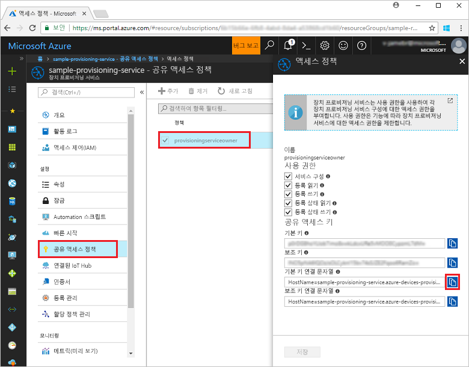
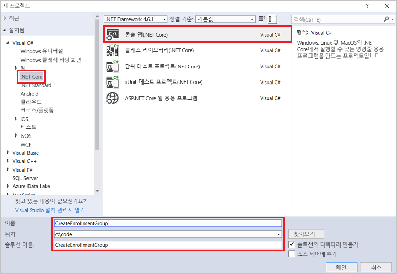
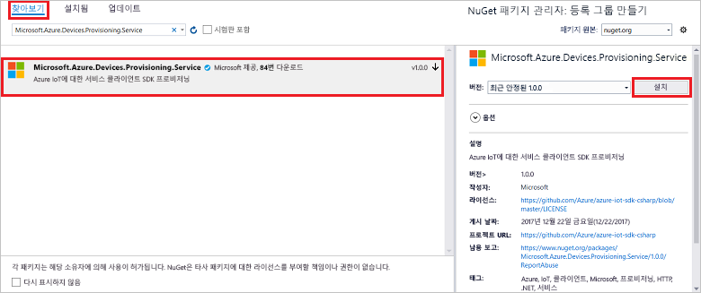
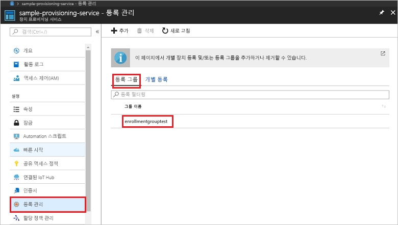

# <a name="enroll-x509-devices-to-iot-hub-device-provisioning-service-using-c-service-sdk"></a>C# 서비스 SDK를 사용하여 IoT Hub Device Provisioning Service에 X.509 장치 등록

[!INCLUDE [iot-dps-selector-quick-enroll-device-x509](../../includes/iot-dps-selector-quick-enroll-device-x509.md)]


다음 단계에서는 [C# 서비스 SDK](https://github.com/Azure/azure-iot-sdk-csharp) 및 샘플 C# .NET Core 응용 프로그램을 사용하여 중간 또는 루트 CA X.509 인증서에 대한 등록 그룹을 프로그래밍 방식으로 만드는 방법을 보여줍니다. 등록 그룹은 해당 인증서 체인에 일반적인 서명 인증서를 공유하는 장치의 프로비전 서비스에 대한 액세스를 제어합니다. 자세히 알아보려면 [X.509 인증서를 사용하여 프로비전 서비스에 대한 장치 액세스 제어](./concepts-security.md#controlling-device-access-to-the-provisioning-service-with-x509-certificates)를 참조하세요. Azure IoT Hub 및 Device Provisioning Service에서 X.509 인증서 기반 PKI(공개 키 인프라)를 사용하는 방법에 대한 자세한 내용은 [X.509 CA 인증서 보안 개요](https://docs.microsoft.com/azure/iot-hub/iot-hub-x509ca-overview)를 참조하세요. 이 문서의 단계는 Windows 및 Linux 컴퓨터 모두에서 작동하지만 이 문서에서는 Windows 개발 컴퓨터를 사용합니다.

## <a name="prepare-the-development-environment"></a>개발 환경 준비

1. 컴퓨터에 [Visual Studio 2017](https://www.visualstudio.com/vs/)을 설치했는지 확인합니다. 
2. 컴퓨터에 [.Net Core SDK](https://www.microsoft.com/net/download/windows)가 설치되어 있는지 확인합니다. 
3. 계속 진행하기 전에 [Azure Portal에서 IoT Hub Device Provisioning Service 설정](./quick-setup-auto-provision.md)의 단계를 완료해야 합니다.
4. 프로비전 서비스를 사용하여 업로드되고 확인된 중간 또는 루트 CA X.509 인증서의 공용 부분이 포함된 .pem 또는 .cer 파일이 필요합니다. [Azure IoT C SDK](https://github.com/Azure/azure-iot-sdk-c)에는 X.509 인증서 체인을 만들고, 해당 체인에서 루트 또는 중간 인증서를 업로드하고, 인증서를 확인하기 위해 서비스를 통해 소유 증명을 수행하는 데 도움이 되는 도구가 포함되어 있습니다. 이 도구를 사용하려면 [azure-iot-sdk-c/tools/CACertificates](https://github.com/Azure/azure-iot-sdk-c/tree/master/tools/CACertificates) 폴더의 콘텐츠를 컴퓨터의 작업 폴더로 다운로드하고 [azure-iot-sdk-c\tools\CACertificates\CACertificateOverview.md](https://github.com/Azure/azure-iot-sdk-c/blob/master/tools/CACertificates/CACertificateOverview.md)의 단계를 수행합니다. C SDK의 도구 이외에도 **C# 서비스 SDK**의 [그룹 인증서 확인 샘플](https://github.com/Azure/azure-iot-sdk-csharp/tree/master/provisioning/service/samples/GroupCertificateVerificationSample)에서는 기존 X.509 중간 또는 루트 CA 인증서를 사용하여 소유 증명을 수행하는 방법을 보여줍니다. 

  > [!IMPORTANT]
  > SDK 도구를 사용하여 만든 인증서는 개발 용도로만 사용하도록 설계되었습니다. 프로덕션 코드에 적합한 인증서를 가져오는 방법에 대한 자세한 내용은 Azure IoT Hub 설명서에서 [X.509 CA 인증서를 가져오는 방법](https://docs.microsoft.com/azure/iot-hub/iot-hub-x509ca-overview#how-to-get-an-x509-ca-certificate)을 참조하세요.

## <a name="get-the-connection-string-for-your-provisioning-service"></a>프로비전 서비스에 대한 연결 문자열 가져오기

이 빠른 시작의 샘플에서는 프로비전 서비스에 대한 연결 문자열이 필요합니다.
1. Azure Portal에 로그인하고, 왼쪽 메뉴에서 **모든 리소스** 단추를 클릭하고, Device Provisioning Service를 엽니다. 
2. **공유 액세스 정책**을 클릭한 다음, 해당 속성을 열기 위해 사용하려는 액세스 정책을 클릭합니다. **액세스 정책** 창에서 기본 키 연결 문자열을 복사하고 적어 둡니다. 

    

## <a name="create-the-enrollment-group-sample"></a>등록 그룹 샘플 만들기 

이 섹션의 단계에서는 등록 그룹을 프로비전 서비스에 추가하는 .NET Core 콘솔 앱을 만드는 방법을 보여줍니다. 일부를 수정하여 등록 그룹을 추가할 [Windows IoT Core](https://developer.microsoft.com/en-us/windows/iot) 콘솔 앱을 만들기 위해 다음과 같은 단계를 수행할 수 있습니다. IoT Core를 사용하여 개발하는 방법에 대해 자세히 알아보려면 [Windows IoT Core 개발자 설명서](https://docs.microsoft.com/windows/iot-core/)를 참조하세요.
1. Visual Studio에서 **콘솔 앱(.NET Core)** 프로젝트 템플릿을 사용하여 Visual C# .NET Core 콘솔 앱 프로젝트를 새 솔루션에 추가합니다. .NET Framework 버전이 4.5.1 이상인지 확인합니다. 프로젝트 이름을 **CreateEnrollmentGroup**으로 지정합니다.

    

2. 솔루션 탐색기에서 **CreateEnrollmentGroup** 프로젝트를 마우스 오른쪽 단추로 클릭한 다음 **NuGet 패키지 관리**를 클릭합니다.
3. **NuGet 패키지 관리자** 창에서 **찾아보기**를 선택하고, **Microsoft.Azure.Devices.Provisioning.Service**를 검색하고, **설치**를 선택하여 **Microsoft.Azure.Devices.Provisioning.Service** 패키지를 설치하고 사용 약관에 동의합니다. 이 프로시저에서는 [Azure IoT 프로비전 서비스 클라이언트 SDK](https://www.nuget.org/packages/Microsoft.Azure.Devices.Provisioning.Service/) NuGet 패키지 및 해당 종속성에 대한 참조를 다운로드하고, 설치하고, 추가합니다.

    

4. **Program.cs** 파일 맨 위에서 다른 `using` 문 뒤에 다음 `using` 문을 추가합니다.
   
   ```csharp
   using System.Security.Cryptography.X509Certificates;
   using System.Threading.Tasks;
   using Microsoft.Azure.Devices.Provisioning.Service;
   ```
    
5. **Program** 클래스에 다음 필드를 추가합니다.  
   - **ProvisioningConnectionString** 자리 표시자 값을 등록을 만들려는 프로비전 서비스의 연결 문자열로 바꿉니다.
   - **X509RootCertPath** 자리 표시자 값을 프로비전 서비스에서 이전에 업로드하고 확인된 중간 또는 루트 CA X.509 인증서의 공용 부분을 나타내는 .pem 또는 .cer 파일에 대한 경로로 바꿉니다.
   - 필요에 따라 **EnrollmentGroupId** 값을 변경할 수 있습니다. 문자열에는 소문자 및 하이픈만 포함될 수 있습니다. 

   > [!IMPORTANT]
   > 프로덕션 코드에서는 다음 보안 고려 사항을 고려해야 합니다.
   >
   > - 프로비전 서비스 관리자에 대한 연결 문자열을 하드 코딩하면 보안 모범 사례에 반합니다. 대신 연결 문자열은 보안 구성 파일 또는 레지스트리에서와 같이 안전하게 유지되어야 합니다.
   > - 서명 인증서의 공용 부분만 업로드해야 합니다. 개인 키를 포함하는 .pfx(PKCS12) 또는 .pem 파일을 프로비전 서비스에 업로드하지 않습니다.
        
   ```csharp
   private static string ProvisioningConnectionString = "{Your provisioning service connection string}";
   private static string EnrollmentGroupId = "enrollmentgrouptest";
   private static string X509RootCertPath = @"{Path to a .cer or .pem file for a verified root CA or intermediate CA X.509 certificate}";
   ```
    
6. **Program** 클래스에 다음 메서드를 추가합니다. 이 코드는 등록 그룹 항목을 만든 다음, **ProvisioningServiceClient**에서 **CreateOrUpdateEnrollmentGroupAsync** 메서드를 호출하여 프로비전 서비스에 등록 그룹을 추가합니다.
   
   ```csharp
   public static async Task RunSample()
   {
       Console.WriteLine("Starting sample...");
 
       using (ProvisioningServiceClient provisioningServiceClient =
               ProvisioningServiceClient.CreateFromConnectionString(ProvisioningConnectionString))
       {
           #region Create a new enrollmentGroup config
           Console.WriteLine("\nCreating a new enrollmentGroup...");
           var certificate = new X509Certificate2(X509RootCertPath);
           Attestation attestation = X509Attestation.CreateFromRootCertificates(certificate);
           EnrollmentGroup enrollmentGroup =
                   new EnrollmentGroup(
                           EnrollmentGroupId,
                           attestation)
                   {
                       ProvisioningStatus = ProvisioningStatus.Enabled
                   };
           Console.WriteLine(enrollmentGroup);
           #endregion
 
           #region Create the enrollmentGroup
           Console.WriteLine("\nAdding new enrollmentGroup...");
           EnrollmentGroup enrollmentGroupResult =
               await provisioningServiceClient.CreateOrUpdateEnrollmentGroupAsync(enrollmentGroup).ConfigureAwait(false);
           Console.WriteLine("\nEnrollmentGroup created with success.");
           Console.WriteLine(enrollmentGroupResult);
           #endregion
 
       }
   }
   ```

7. 마지막으로 **Main** 메서드의 본문을 다음 줄로 바꿉니다.
   
   ```csharp
   RunSample().GetAwaiter().GetResult();
   Console.WriteLine("\nHit <Enter> to exit ...");
   Console.ReadLine();
   ```
        
8. 솔루션을 빌드하십시오.

## <a name="run-the-enrollment-group-sample"></a>등록 그룹 샘플 실행
  
1. Visual Studio에서 샘플을 실행하여 등록 그룹을 만듭니다.
 
2. 성공적으로 만들어지면 명령 창에 새 등록 그룹에 대한 속성이 표시됩니다.

    

3. 등록 그룹을 만들었는지 확인하려면 Azure Portal의 Device Provisioning Service 요약 블레이드에서 **등록 관리**를 선택한 다음, **등록 그룹** 탭을 선택합니다. 샘플에 사용된 등록 ID에 해당하는 새 등록 항목이 표시됩니다. 항목을 클릭하여 항목에 대한 인증서 지문 및 다른 속성을 확인합니다.

    
 
## <a name="clean-up-resources"></a>리소스 정리
C# 서비스 샘플을 탐색하려면 이 빠른 시작에서 만든 리소스를 정리하지 마세요. 계속하지 않으려는 경우 다음 단계를 사용하여 이 빠른 시작에서 만든 모든 리소스를 삭제합니다.

1. 컴퓨터에서 C# 샘플 출력 창을 닫습니다.
2. Azure Portal에서 Device Provisioning Service로 이동하고, **등록 관리**를 클릭한 다음, **등록 그룹** 탭을 선택합니다. 이 빠른 시작을 사용하여 만든 등록 항목에 대한 *등록 ID*를 선택하고, 블레이드 위쪽의 **삭제** 단추를 클릭합니다.  
3. Azure Portal의 Device Provisioning Service에서 **인증서**를 클릭하고, 이 빠른 시작을 위해 업로드한 인증서를 클릭한 다음, **인증서 세부 정보** 창 위쪽의 **삭제** 단추를 클릭합니다.  
 
## <a name="next-steps"></a>다음 단계
이 빠른 시작에서는 Azure IoT Hub Device Provisioning Service를 사용하여 X.509 중간 또는 루트 CA 인증서에 대한 등록 그룹을 만들었습니다. 장치 프로비전에 대해 자세히 알아보려면 Azure Portal에서 Device Provisioning Service 설치에 대한 자습서를 살펴보세요. 
 
> [!div class="nextstepaction"]
> [Azure IoT Hub Device Provisioning 서비스 자습서](./tutorial-set-up-cloud.md)
